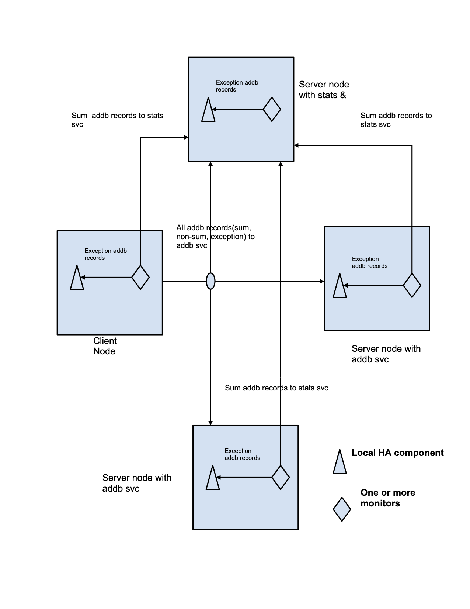

================
ADDB Monitoring
================

ADDB records are posted by Motr software to record the occurrence of specific situations. These situations together represent the state of the cluster at any point in time. There is a need to maintain the state information of the cluster that would contain for example, summary statistics per node & globally, total storage space, total free space, total number of files, etc. To achieve this there is a  need to monitor all ADDB records that are being generated. This monitoring of ADDB records is discussed in this document. 

ADDB monitors serve two purposes:

- To support online statistics reporting, like similar to df, vmstat, top. This is needed both globally (summarized over all nodes) and locally. 

- Inform external world (HA & cluster management tools) about exceptional conditions like failures, overload, etc.

***************
 Definitions
***************

- **ADDB**
  Analysis and Diagnotic Data Base. See [0] for aditional details.

- **ADDB base record type** 
  The architecture defines “event”, “data point” and “counter” type ADDB record categories. See [0] for aditional details. In this HLD we will use the word “exception” instead of “event”.  We’ll use the term “event” to describe any derivation of the base record types. 

- **Summary ADDB records** 
  These are summary records that are generated by ADDB monitor for a particular system metric. 

- **ADDB monitors**
  These are objects present on every node in the cluster (client or server), they generate the summary records. 

***************
 Requirements
*************** 

- [r.addb.monitor.add.runtime] Addition of ADDB monitors. 

- [r.addb.monitor.remove.runtime] Deletion of ADDB monitors. 

- [r.addb.monitor.summary.generate-addb-records] ADDB monitors are able to generate summary addb records. 

- [r.addb.monitor.summary.deliver-addb-record-to-stats-service] ADDB monitors send summary addb records to stats service. 

- [r.addb.monitor.summary.deliver-addb-exception-records-to-local-HA] ADDB monitors send exception addb records to local HA (High Availability) component as a fop. 

- [r.addb.monitor.summary.deliver-addb-record-to-addb-service] ADDB monitors send summary addb records to addb service similar to normal addb records. 

- [r.addb.monitor.nesting] There can be ADDB monitors for ADDB records that are generated by some other monitors. 

- [r.addb.monitor.stats-service] Stats service to maintain statistics information received from all the nodes. 

- [r.addb.monitor.stats-service.state] ADDB stats service maintains a state, this state is built from all the addb summary records that this service receives through all the nodes present in the system (cluster). This state basically comprises of all the statistics summary information sent from nodes. 

- [r.addb.monitor.stats-service.query] Client (for eg. m0stats, m0t1fs, etc.) can query to this stats service for getting state information. 

- [r.addb.monitor.stats-service.single-instance] There would be only one instance of the stats service in the cluster/system.

**************************
 Functional Specification
**************************

There are two APIs that are globally visible, they are to add/delete monitors.

.. code-block:: C

 void m0_addb_monitor_add(struct m0_addb_monitor *mon); 
 void m0_addb_monitor_del(struct m0_addb_monitor *mon); 

ADDB monitors do two main work / things:

- Report statistics online

- Report exceptional conditions like failure, etc

Statistics Reporting
=====================

Reporting of statistics is required, which is similar to df, vmstat, top, etc. These statistics are generated by monitors that generate summaries of various system metric periodically.

Statistics belong to two categories:

#. Stats which are readily available, eg. balloc will generate addb records  about free space in a container periodically. 

#. Stats which are not readily available.

These stats summary ADDB records can be produced on any node, this could be client or server. If produced on client they are sent to endpoint where addb service is running (using the current mechanism) and also to the endpoint where stats service is running, while if produced on server they are written to addb stob and also sent to this endpoint where stats service is running.

A node produces summary record one for each type,(type here means a system metric) that makes sense for it. For eg. as client does not have storage, so it will not produce “free storage space” summary records (as a monitor to produce this type of record would not be present).

For not readily available stats, we have all the data necessary to compute the stats, but these data are scattered across multiple addb records. So, we need to build the summary by scanning such multiple addb records. Examples are average processor load in last N seconds, fop processing rate in last N seconds. These are more like top, vmstat. Lets consider, fop processing rate example. Information about fop processing rate is indirectly stored in fop state machine addb records. Computation of fop processing rate can be done by “fop complete” addb records along with their timestamps.

Exceptional Conditions Reporting
=================================

Monitors will be used to detect exceptional conditions. Periodic posting is not applicable for such conditions as failures are to be reported as soon as possible. Monitor updates its data structures to indicate a failure and will initiate a failure report by posting AST. During ASTs execution fop is sent to local HA component to notify about the failure. Monitors can also produce exception records from normal addb records for example is fop transition is taking too long, then this would be an exception.

***********************
Logical specification  
***********************

ADDB monitors are represented as follows:

.. code-block:: C

 struct m0_addb_monitor {
         void       (*am_watch) (const struct m0_addb_monitor *mon, 
                                 const struct m0_addb_rec *rec,
                                 const struct m0_addb_mc *mc_to_post_on);
     void            *am_datum;
     struct m0_tlink  am_linkage;
 }; 

Structure field descriptions:

- am_watch(), a monitor specific function.Actual monitoring logic is to be written in this function. It does the processing of all the addb records of its interests and can post the summary statistics obtained directly or computed as addb records that gets delivered to endpoint where addb service is running and to the endpoint where stats service is running as addb records. Also, it can post the exceptional conditions to a special service & a local HA component.

- am_datum, provides for some private information that be kept per monitor.

- am_linkage, links monitor to the global monitor list.

There is a global list of all the monitors, add() would just add the monitor to this global list while del () would just remove this particular monitor from this global list. Monitors are added during  addb sub-system initialization and deleted during the addb sub-system finalization.

Addition / Deletion of ADDB monitors
======================================

Monitors can be added and removed dynamically through configuration. But, currently they would be hard-coded in the addb sub-system. 

During addb sub-system initialization all the monitors needs to be added using m0_addb_monitor_add() API & during addb sub-system finalization all the added monitors needs to be deleted/removed using m0_addb_monitor_del() API.

Invocation of ADDB monitors
============================= 

When any addb record is posted on a node(whether a client or a server), we invoke all the monitor’s am_watch() API, present in the global monitor list. These monitors do relevant work only for the addb record types that they want to monitor & for the rest they do nothing. During execution of am_watch(), a monitor can create an addb record and also post it. This posting of addb records from inside monitor is to be done using the AST (Asynchronous system trap) mechanism provided by the Motr.  

Execution of monitor
======================

Partial execution i.e. top half is executed for all the addb records during monitor invocation. This just updates the monitor specific summary data or posts an ast if an exception had been encountered.

There is a periodic posting of these addb summary records and this is done by the locality thread on the m0d. This thread also runs the ASTs that are posted for the exception summary records. 

The bottom half i.e. AST part would be run by a dedicated thread & would be synchronized among the various others threads that would run monitors with a sm (state machine) group lock.

*************
Conformance
*************

- [i.addb.monitor.add] An API is made available for this. 

- [i.addb.monitor.remove] An API is made available for this. 

- [i.addb.monitor.generate-summary-addb-records] Monitor’s am_watch() function will do this. 

- [r.addb.monitor.deliver-addb-record-to-stats-service] Addition to current ADDB mechanism is to be done to differentiate between summary stats records generated by monitors and other addb records & send these summary records to stats service. 

- [r.addb.monitor.deliver-addb-exception-records-to-local-HA] Monitor’s am_watch() function will do this. 

- [r.addb.monitor.deliver-addb-record-to-addb-service] This makes use of current implementation. 

- [r.addb.monitor.nesting] Monitors generate addb records which themselves can be monitored. 

- [r.addb.stats-service.state] Implementation of stats service handles this. 

- [r.addb.stats-service.query] Implementation of stats service handles this. 

- [r.addb.stats-service.single-instance] Implementation of stats service handles this.

**************
 Dependencies
**************

- [r.addb.retention] ADDB monitor generates addb records. 

- [r.addb.retention.storage] ADDB monitor generates addb records. 

- [r.addb.timings] ADDB monitor may need to calculate processing rate statistics. 

- [r.addb.filtering] ADDB monitor needs information from addb records. 

- [r.addb.record.type.datapoint] ADDB monitor can generate datapoint addb records. 

- [r.addb.record.type.counter] ADDB monitor can generate counter addb records. 

- [r.addb.record.type.event] ADDB monitor can generate event addb record 

- [r.addb.record.type.counter.statistics] ADDB monitor needs to do statistics reporting. 

- [r.addb.record.definition] ADDB monitor can define new addb record. 

- [r.addb.record.definition.extensible] 

- [r.addb.post] ADDB monitor can post addb records. 

- [r.addb.post.non-blocking] Decrease performance impact of ADDB monitoring.

***********
 Use Cases
***********

**Statistical monitoring of addb records that already have statistical information in them**

Following steps show how an addb monitor collects statistical information on a particular node (client/server) from addb records and send it to stats service as addb records:

#. Create ADDB monitor, add it to the global list of monitors. 

#. Define the type of addb record that it will generate. 

#. Get the statistics information from these addb records periodically. 

#. Send this statistical information to the endpoint where stats service is running as addb records & to the endpoint where addb service is running if the node is a client or to the addb stob if the node is server periodically.

**Statistical monitoring of addb records that do not contain statistical information in them** 

Following steps show how an addb monitor collects statistical information on a particular node(client/server) from addb records and send it to stats service as addb records:

#. Create ADDB monitor, add it to the global list of monitors. 

#. Define the type of addb record that it will generate. 

#. Continuously compute statistics from the monitored addb records. 

#. Send this statistical information to the endpoint where stats service is running as addb records & to the endpoint where addb service is running if the node is a client or to the addb stob if the node is server periodically.     

**Exceptional conditions monitoring**

Exceptional conditions such as failures, overflows, etc. could be generated inside monitoring(exceptions occurred as a result of interpreting the statistical information generated after monitoring addb records) or outside monitoring (other sub-system failures). Following steps are to be taken:

#. Generate the exception description fop. 

#. Post this fop to a local HA component.  

**Building a cluster wide global & local state in memory on a node where stats service is running**  

#. Create in-memory state structure of the cluster on this node. 

#. Receive statistical summary addb records from all the node. 

#. Update the state with the information in these latest addb records.

**Query for some state information to the stats service**

#. Construct & send a request fop for specific or complete state information to the stats service & wait for reply. 

#. Stats service checks for requesting information, gathers it in reply fop & sends it back to the node from where request was initiated.

**********
 Failures
**********

Following failure cases are listed along with their handling mechanism: 

- A failure to construct new state on the node where the stats service runs would return the previous state to the node that requested this state information during this duration.

- Exceptional conditions are reported to local HA component using a fop, a failure of receiving a fop by local HA component can happen, this would mean that some exceptional conditions can go unnoticed by local HA component. This type of failure is ignored.

Rationale
============

The existing ADDB implementation and the newly developed tracing subsystem contributed greatly to the requirement to use C macro interfaces with compile time validation. 

Compatibility
================

The proposed ADDB monitoring mechanism will not break compatibility with the existing mechanism. It acts like and add-on to the current ADDB mechanism.

Network   
=========

The ADDB monitoring mechanism works within the Motr network framework.

Persistent storage
=====================  

ADDB repositories are stored in Motr storage objects. ADDB summary records are stored as usual addb records. Stats service do not require any disk storage space.

Installation
==============

The ADDB monitoring component can be added/deleted by modified the configuration related to it.     

   
References
==========
[0] HLD of ADDB collection mechanism
 
