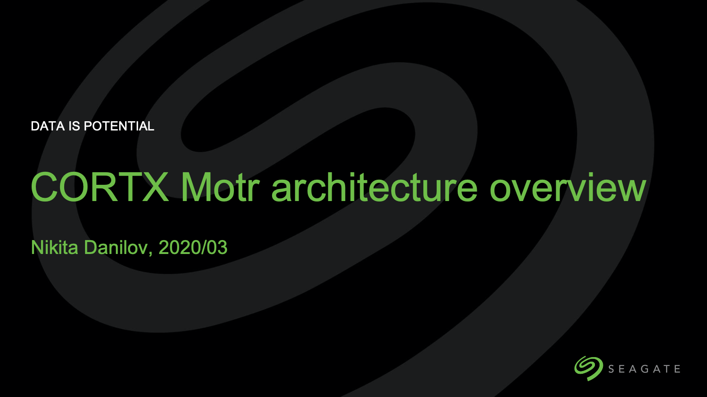

# Outline  
+ This presentation is a beginner's guide to the CORTX core architecture
+ Tries to cover all important aspects of CORTX core with a reasonable level of detail
+ Focus on software (hardware details elsewhere)
+ Overview
+ Typical use cases and data flow
+ How objects and indices are stored
+ IO path
+ DTM
+ FDMI
+ ADDB  

# What is CORTX?  
+ CORTX core is a component of the new cloud software stack developed by Seagate
+ CORTX provides basic functionality through its Motr client interface:
  + object store
  + key-value store
+ The complete software stack also includes other components:
  + S3 server
  + pNFS server
  + Provisioner
  + RAS
  + HA
  + Administration and monitoring toolset  

  

+ Similar products:
  + Ceph
  + ActiveScale
  + IBM/COS
  + Scality  

# How is CORTX Different?  
+ Scalable
  + horizontal scalability: grow system by adding more nodes. CORTX designed for horizontal scalability: no meta-data hotspots, shared-nothing IO path. Extensions running on additional nodes.
  + vertical scalability: more memory and cpu on the nodes.   
+ Fault-tolerant:
  + flexible erasure coding taking hardware and network topology into account
  + fast network raid repairs   
+ Observable: built-in monitoring collecting detailed information about system behavior
+ Extensible
  + extension interface
  + flexible transactions
  + open source    
+ Portable: runs in user space on any version of Linux  

# Data flow S3  
+ cortx rpc: uses RDMA when available (requires kernel module)
+ s3 server linked with libmotr
+ flexible deployment: services can run anywhere on the network, share storage
+ meta-data (dix) can be stored on disc, SSD or NVM
+ multiple io and dix services, no hotspots  

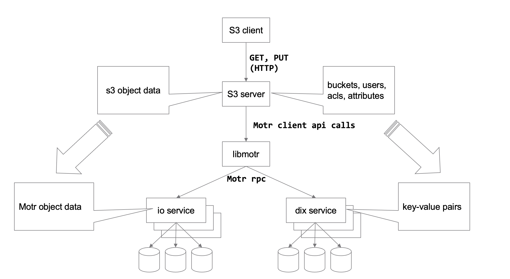  

# Data Flow NFS  
+ very similar to S3
+ underlying CORTX object and index semantics is rich enough to support S3, NFS and others
+ interoperability between S3 and NFS: common meta-data format, lingua franca [work in progress]  

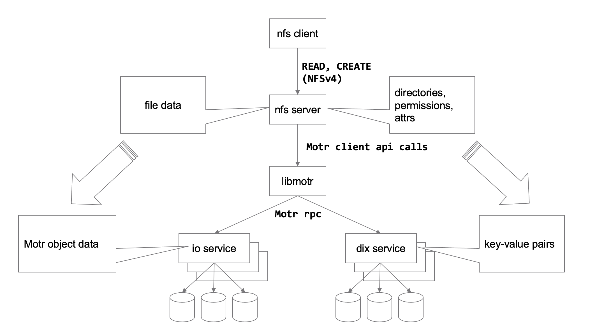    

# Anatomy of an CORTX core instance  
   

+ Multiple services within the same process: io, dix, confd, rm, ha, sss, repair, addb, cas, fdmi, isc
+ State machine (fom) for each request: non-blocking state transitions, few threads, reduced locking, NUMA
+ Asynchronous network and storage interface
+ Same on "client" (libmotr) and server (not quite yet).  

# Object Layout
+ Object is an array of blocks. Arbitrary scatter-gather IO with overwrite. Object has layout.
+ Default layout is parity de-clustered network raid: N+K+S striping.
+ Layout takes hardware topology into account: distribute units to support fault-tolerance.  

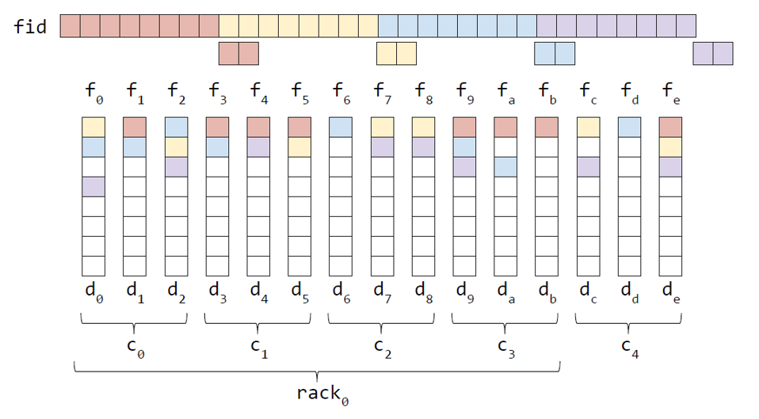     

+ Object raid: component object (cob) for each device.
+ N data units, K parity units and S spare units (distributed spare).
+ Mapping from file offsets to cob offsets is deterministic.
+ Mapping from cob offsets to device blocks is done via meta-data index ("ad"), managed by io service.
+ Fast scalable repairs of device failure.
+ There are other layouts: composite.  

# Index Layout  
+ An index is a container of key-value pairs:
  + GET(key) -> val, PUT(key, val), DEL(key), NEXT(key) -> (key, val)
  + used to store meta-data: (key: "/etc/passwd:length", value: 8192)   
+ Uses network raid with parity de-clustering (same as objects), but only N = 1, in N + K + S   
+ X-way replication (N = 1, K = X - 1), each key is replicated independently   
+ takes hardware topology into account (for free!)
+ fast scalable repair (for free!)  

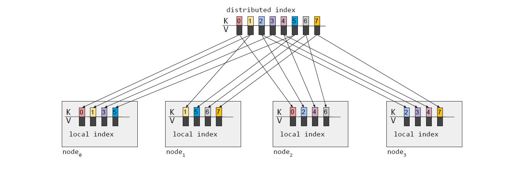  

# Data Flow S3 Redux
+ libmotr calculates cob identities and offsets within cobs
+ ioservice maps cob offset to device offset though ad (allocation data) index
+ mapping is done independently for each object and each parity group (aka stripe)
+ parity blocks are calculated by libmotr  

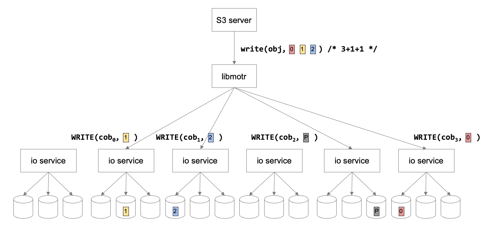   

# Data Flow with meta - data
+ 2, 2': rpc from a client to services (async)
+ 3, 7: various meta-data lookups on the service
+ {4,8}.n: meta-data storage requests (btree operations)   
+ 11: rdma    
+ 12: async direct-io to the data drives
+ fol: log of meta-data transactions
+ This diagram includes only s3 data operation, no s3 meta-data operations (buckets, permissions, etc.)
+ some requests are eliminated because of caching  
  

# DTM

+ DTM: Distributed Transaction Manager
+ CORTX operations affect multiple nodes. Nodes can fail independently. Error recovery is difficult.
+ Multiple CORTX operations form logical groups:
  + S3 object creation: update bucket, store object attributes, create object, write data
  + NFS file creation: allocate inode number, write directory entry, initialise inode
  + Error recovery in the middle of a group is difficult (errors during recovery)    
+ A transaction is a group of CORTX core operations that are atomic in the face of failures
+ DTM guarantees that either all or none operations survive a failure
+ DTM: work in progress
+ One of the most complex CORTX components
+ Scalable efficient transactions are hard
+ fortunately not everything is needed at once
+ staged implementation: DTM0 first  

  

# DTM Implementation Overview   

+ Track distributed transactions for each operation (send transaction identifier)
+ Each service, before executing the operation, writes its description into FOL: file operations log
+ In case of a service or a client failure, surviving nodes look through their logs and determine incomplete transactions.
+ First try to re-do incomplete transactions by re-sending their descriptions to the restarted service
+ Some transactions cannot be re-done, because too much state was lost in a failure  
+ Such transactions have to be undone (rolled back)
+ But if a transaction is rolled back, all transactions that depends on it also have to be undone:
  + **mkdir a** (executed on servers S0 and S1)
  + **mkdir a/b** (executed on servers S1 and S2)
  + **touch a/b/f** (executed on servers S2 and S3)
  + if **mkdir a** failed, **mkdir a/b** and **touch a/b/f** have to be rolled back too    
+ Transaction dependencies must be tracked. This is difficult to do scalably and efficiently!
+ Fortunately, in DTM0 re-do is always possible  

# FDMI

+ FDMI: file data manipulation interface, CORTX core extension interface  
+ CORTX core: objects, key-value indices, transactions. Fast path
+ Extensions: migration, backup, archive, replication, compression, encryption, indexing, tiering, defragmentation, scrubbing, format conversion, re-striping, etc.
+ We want to keep CORTX core small and clean  
+ Extensions must be:
  + developed independently (without modifications to the core code), possibly by 3rd parties;
  + deployed independently (on additional nodes, without compromising fast path)
  + Scalable
  + Reliable (transactionally coupled with the core)    

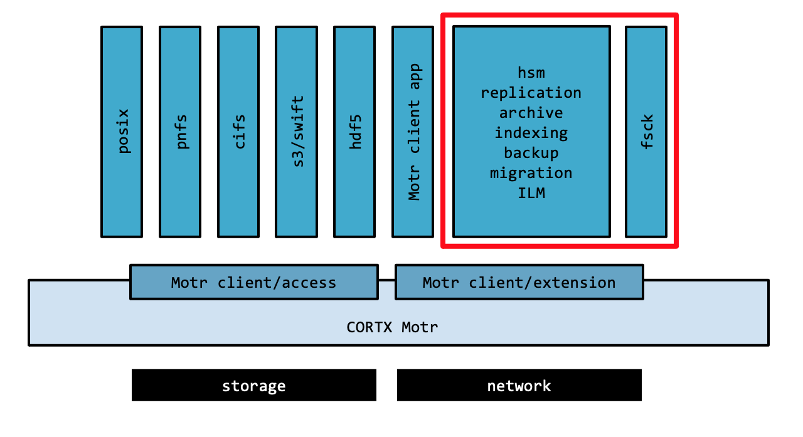   

# FDMI Implementation Overview

+ FDMI is a scalable publish-subscribe interface
+ Each CORTX core instance produces cross-referenced records describing operations stored in FOL
+ FDMI plugin registers a filter, that selects some records
+ Each instance sends matching records to the plugin (in batches) together with their transactional contexts
+ A plugin acts on records and sends acknowledgements back the source instances.  
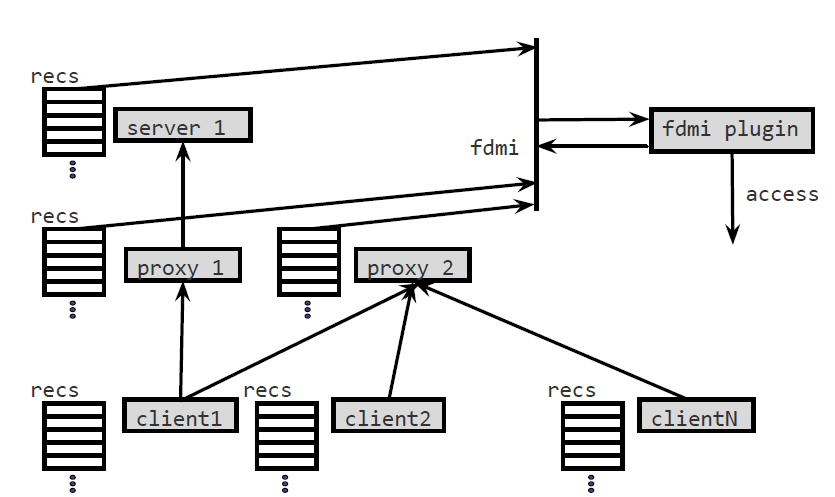     

# FDMI example plugin: integrity checking

+ How to recover from catastrophic failures?
+ Redundancy, fancy metadata: not an answer (has been tried)
  + bugs (more important over time)  
+ Traditional fsck
  + not distributed
  + specific to particular meta-data format   
  + does not scale
    + time
    + space   
+ Need scalable integrity checking
  + run it all the time, on dedicated separate nodes (horizontal scalability)
  + maintain redundant "inverse" meta-data,
  + update meta-data to match system evolution (through FDMI publish subscribe)
  + detect inconsistencies, report, recover from redundancy  

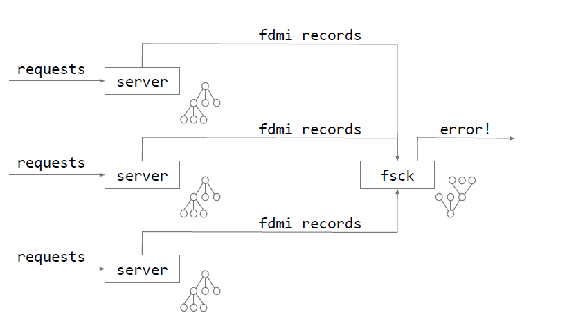  

# Inverse meta-data

+ block allocation  
+ pdclust structure
+ key distribution
+ b-tree structure   
+ application specific invariants  
  + POSIX tree
  + hdf5  

# ADDB

+ ADDB (analytics and diagnostics data-base): built-in fine grained telemetry sub-system   
+ Why?
  + systems grow larger and more complex
  + how well the system is utilized?
  + is it failure or expected behavior?
  + is it system or application behavior?   
  + sources of data:
    + system logs
    + operating system
    + application traces    
  + very large amount of collected data
  + or insufficiently detailed, or both
  + difficult to analyse and correlate    
+ instrumentation on client and server  
+ data about operation execution and system state  
+ passed through network
+ cross-referenced
+ measurement and context
+ timestamped  
+ labels: identify context
+ payload: up to 16 64-bit values   
+ interpreted by consumer
+ always on (post-mortem analysis, first incident fix)
+ simulation (change configuration, larger system, load mix)

```
2020-02-20-14:36:13.687531192 alloc size: 40, addr: @0x7fd27c53eb20

| node <f3b62b87d9e642b2:96a4e0520cc5477b>

| locality 1

| thread 7fd28f5fe700

| fom @0x7fd1f804f710, 'IO fom' transitions: 13 phase: Zero-copy finish

| stob-io-launch 2020-02-20-14:36:13.629431319, <200000000000003:10000>, count: 8, bvec-nr: 8, ivec-nr: 1, offset: 0

| stob-io-launch 2020-02-20-14:36:13.666152841, <100000000adf11e:3>, count: 8, bvec-nr: 8, ivec-nr: 8, offset: 65536  
```  

# ADDB: Monitoring and Profiling
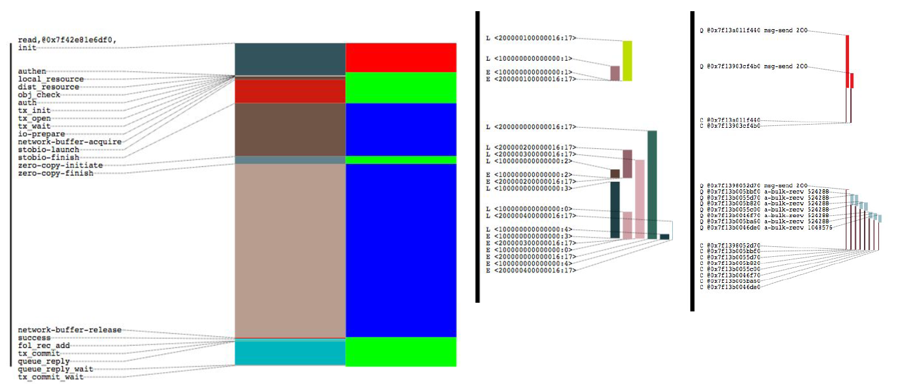   


# ADDB: advanced use cases  

+ collect system execution traces
+ use them to calibrate a simulator   
+ use the simulator to:  
  + model systems before hardware is available (very large, very fast)
  + answer "what if?" questions
  + combine workloads  
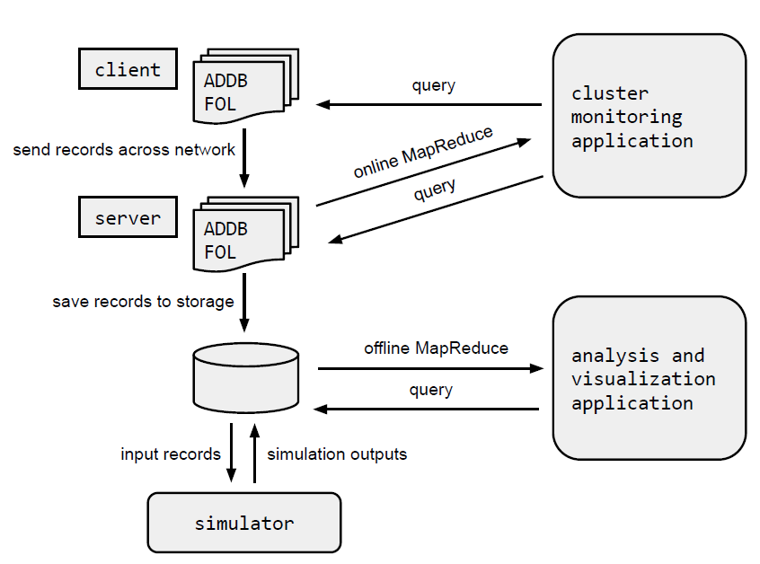

# Questions
