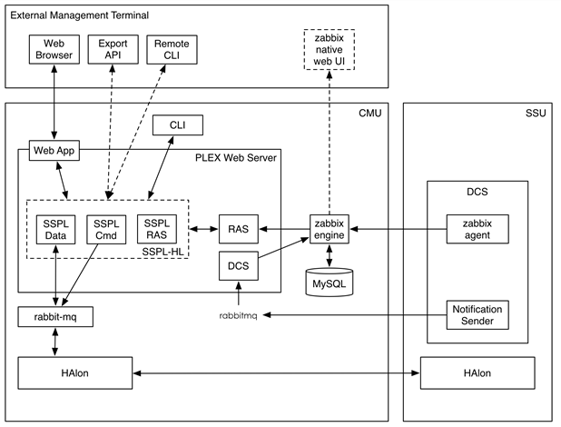

=================
CaStor Management
=================

The CaStor project has a mandate for providing both a CLI and a GUI interface to function as both a command and control path as well as a performance metrics and health status reporting. 

Currently, the intention is that only command and control functionalities will be comparable. The CLI interface will return certain system information but it is expected that the GUI will provide more extensive access to such data. Basic status and health information will be available via the CLI however.

The purpose of this document is to provide an overview of the expectations of both these interfaces and to cover some of the additional requirements put upon these interfaces under the matter of such things as maintaining a highly available framework which enforces security through both encryption of sensitive data and access controls on a user basis.

***************
PLEX Framework
***************

The basic design concept for management and monitoring is that it will be implemented through a high level control API (SSPL-HL) that will be implemented as a collection of “PLEX applications” running in the PLEX framework.

***********************
Command Line Interface
***********************

The command line interface will initially be implemented as a collection of Python scripts.  These scripts will not implement any functionality themselves, but rather call functionality provided by the SSPL-HL API.
