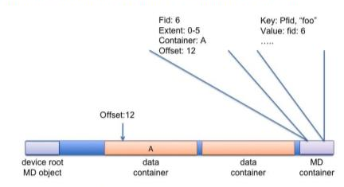
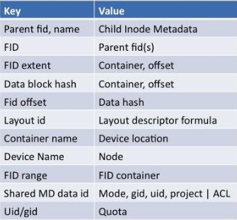

# Data Organization
## Storage Devices
The Motr term Storage Device means one device that is attached to a server. For example, a disk, a PCI flash device, a RAID controller, main memory pool and a partition are all Storage Devices. Ideally, an individual storage device would contain either data or metadata, rather than being mixed use for both. As the size of clusters continues to scale upwards, we expect there to be perhaps 100,000's of storage devices in a large cluster. Storage devices are named and a location database is maintained to track them. A storage device knows its own name (self-identification) and can be physically moved across the system. The most likely way that storage devices are implemented is as block devices in the operating system, accessed using asynchronous, IOV-based, direct I/O (currently available in both Windows and Linux).

## Objects
An Object (or a Storage Object) is a fundamental Motr building block. An object contains a description of linear address space together with some other meta-data. Object address space describes allocated blocks which contain the object data.

In the context of a particular server, an object can be either local or not, depending on whether all object data are located on the server.

There are 5 kinds of local objects, described in more detail below:

+  3 types of container objects:
 + device container objects;
 + meta-data container objects;
 + data container objects  
+  objects that contain meta-data data-base tables
+  objects that are sets of records of data locations  

In addition to object data, an object requires some amount of meta-data:

+  allocation meta-data, specifying where object data and other object meta-data can be found
+  integrity meta-data in the form of block or record level check-sums
+  other object attributes, like size  

Meta-data are stored in data-bases in meta-data containers.

The API associated with Motr objects is likely to be similar to the T10 OSDv2 API. We say similar rather than identical because the OSD API may need enhancements. For example, the OSD API lacks sufficient transactional support (the SCALUS project in Europe may define this).

Similarly to devices, storage objects have names and a location data-base is maintained to track them. An object is self-identifiable.

## Container Objects
A Container Object stores other objects inside. A storage device can hold many containers, but containers typically have large sizes (gigabyte-terabyte sized) and use large allocation units (e.g. 64MB). Container objects can hold containers, meta-data objects or data.

Containers can migrate to other devices and they can be merged, combining multiple containers in to one.

### Types of Objects
Here we provide more detail on the various types of objects that Motr uses.

### Device Container Object
This is a special object type for an entire device. Each storage device is a device container object which has associated with it a device root object and a small amount of metadata: allocation information for the container objects on the device and redundant copies of the root object. A device container object contains data container objects and metadata container objects.

A device container root object contains the following.

+  a name of the device,
+  a list of containers on the device and
+  a pointer to a special meta-data container on the same device, storing container allocation data (mostly read-only).  

The following diagram represents a typical device container.

Additional redundant copies of device container object meta-data are stored on other devices.

The following illustrates how a file and the associated data is stored.   

   

### Meta-data container object
This object contains metadata databases such as directory data, allocation data, layout data, or quota information. The metadata container for a device has a fixed location.

Metadata containers contain their own metadata (except for integrity metadata) and a root table. The following lists the candidates for tables contained in a metadata container object.

The current leading candidate for organizing tables is the Berkeley DB5 database.

**Data Container Object**
This object contains data only. Record for file system data objects point to extents or blocks in this type of object.

**Meta Data Object**
A metadata object contains one key-value database table. This object is contained in a metadata container object.

**Data Object**
This object is a set of related allocation records in a metadata database. It points to extents in data container objects and is contained in a table in a metadata object.

## Metadata
In Motr, metadata is organized as tables with relations. Strong compression techniques allow inodes to take up an average of 100 bytes each. In a typical file system, meta-data show high degree of duplication: millions of files have the same combinations of ownership and permission attributes, and the same formula for their layout. Thus far, we have tested tables with sizes up to 300 million entries (on flash). Scalability results are very promising and performance is good. The DB5 transaction log fits well into the Motr architecture, providing a potential change or undo log.

Metadata will be replicated 3 times with distributed transactions. Record-level checksums provide integrity. Replicated metadata objects may not be block-wise identical but are logically identical. This is because the loads of servers will influence the allocation algorithms used within them. One of meta-data replicas possibly stays in flash.

## Allocation
Allocation of space is based on a disk model, with the ext4 allocator as a basic starting point (grouping small files, aligning extends in large files). We profiled and modeled disks and determined that no partial cylinders are read at any time and that I/O in 4MB chunks provides optimal bandwidth.

There are several potential variations to the basic allocation model described above. For example, deduplication at either the storage device or cluster level is being considered, as well as compressed and encrypted layouts.

## Data Redundancy
Motr uses a parity de-clustered layout based on pseudo-random permutations (not traditional block mappings). This scheme adapts easily to different disk counts. Within a T1 object store, transactional before/after semantics are achieved. File layouts can take all disks into account to provide the appropriate striping and redundancy.
