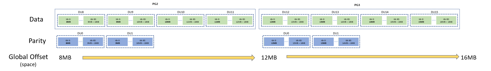
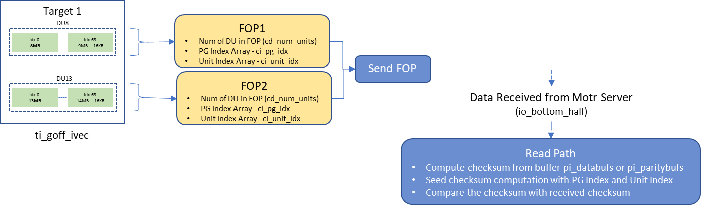
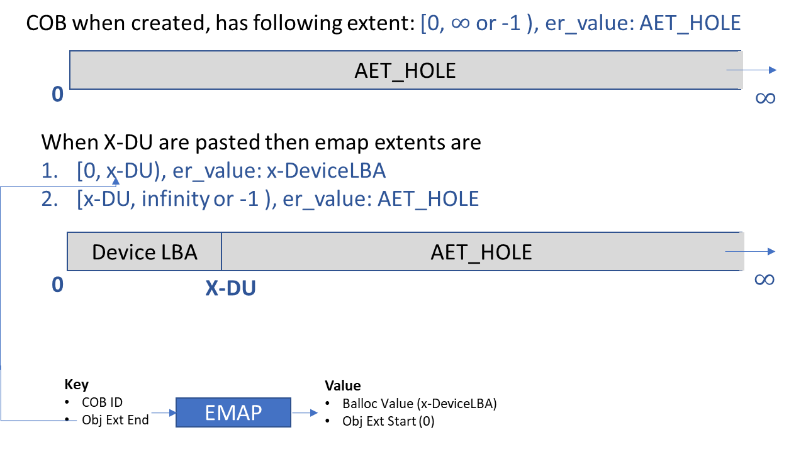

# HLD of Data Integrity

- I. Motr Client
  - I.1 Application and motr data structure
  - I.2 Parity Group Computation 
  - I.3 Tracking Data Unit Allocated to Object
  - I.4 FOP Sending and Checksum Processing
    - Write Path
    - Read Path
- II. Motr Server Write Path
  - II.1 GOB => COB
  - II.2 Balloc Processing
    - Balloc extent and buffer extent processing
  - II.3 EMAP Extent Processing
  - II.4 COB-EMAP Details
  - II.5 Checksum storage with EMAP Extent

This document will give details of DI implementation in Motr

## I. Motr Client 
### I.1 Application and motr data structure
Application sends buffer as scatter gather list (SGL) of buffers (ioo_data), it also sends a index-list for object offset corresponding to the buffer (ioo_ext). There can be multiple request for send for read/writing to the same object

The example below describes scenario where application sends second request to motr for the same object.   

- Parity Stripe having N (Data Units) = 4  K (Parity Units) = 2 S (Spare Units) = 0

- Application buffer size 16KB

- Unit Size (US) = 1MB

- Motr Default Page Size (PS) = 4KB

- Previous request has processed Data Unit 0-7 (DU) or Parity Group 0 (PG) & PG 1  

  - Current IO is for DU7-15 or PG 2 & PG 3 


<p align="center">Received from application</p>
### I.2 Parity Group Computation 
- Motr client computes number of parity group in the request (ioo_iomap_nr)

- Allocates data structure for all including parity units (K)

- Populates parity group data structure for further processing (ioo_iomaps)

- Data allocated are page or segment (4K) basis.


<p align="center">Parity Group Data Structure</p>
### I.3 Tracking Data Unit Allocated to Object
For DI computation an array (ti_goff_ivec) for each target is allocated to track global offset of each segment.


<p align="center">Mapping Data and Parity to Global Offset Space</p>
 


### I.4 FOP Sending and Checksum Processing
During FOP processing based on the DU goff which is added to the target structure (ti_goff_ivec), Parity Group Index and Data Unit Index is computed and stored in structure/array of FOP (irf_cksum_data)

### Write Path
 During write path the checksum for data also gets computed for each DU which is added to the FOP. Checksum computation is seeded with DU Index.


### Read Path
During read path when the data is received from Motr Server, the checksum is computed and compared against received checksum


 

## II. Motr Server Write Path
### II.1 GOB => COB
Every Motr object is identified by FID also known as GOB (Global Object) FID and its stripe on devices are identified as COB (Component Object) FID.

COB FID is derived from GOB FID by adding Device ID to the GOB FID. 

```c
// Logical representation 
cob_fid = (gob_fid | device_id << M0_FID_DEVICE_ID_OFFSET)
```
Every device on which stripe/shard of object is present will have COB entry. 

### II.2 Balloc Processing
Motr client send data buffer, checksum buffer using RPC to server.

- Motr server allocated balloc space for the total size of data buffer sent by client

- Balloc will attempt to allocate total size as one extent

  - If one chunk is not available then multiple balloc extent can be allocated

  - Currently more than one chunk will cause failure

- In the diagram below it is shown that three balloc extents are getting allocated for two data DUs.

### Balloc extent and buffer extent processing
As part of balloc processing, server codes find the number of contiguous fragment using overlap of balloc-extent and buffer extent. Also data structure is populated to track this.

- m0_bufvec   si_user : Tracking buffer fragment

- m0_indexvec si_stob : Tracking balloc fragment


<p align="center">Balloc Processing and Fragment Computation</p>

These balloc-extent along with its buffer from unit for Storage IO.  


### II.3 EMAP Extent Processing
As part of EMPA extent processing contiguous fragment is computed using overlap of Object offset extent (COB Offset) and balloc extent. These EMAP fragment data are processed later and gets written to the device EMAP btree.

EMAP Fragment Data consist of following important fields

- COB Offset Extent 

  - e_start

  - e_end

- Balloc Extent Start

  - ee_val


### II.4 COB-EMAP Details
- When COB is created a default entry for the object extent is created

  - Dummy hole (value 0) extent with a span of 0 to ∞

- If an entry at start gets added then it cuts into this Dummy hole and creates two segment 

  - New Entry 

  - Dummy hole gets right shifted.


Using above concepts the three EMAP extent gets added to EMAP metadata btree.

### II.5 Checksum storage with EMAP Extent
Checksum for all the DUs which are starting in a Balloc extent, gets added to that corresponding EMAP entry. During EMAP processing checksum gets correctly transferred to the extent and gets written in btree node.


