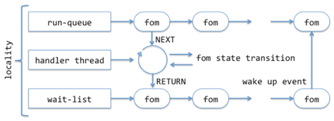

# High level design of fop state machine

 This document presents a high level design (HLD) of the file operation packet (fop) state machine component of Motr M0 core.

The main purposes of this document are:   

1. To be inspected by M0 architects and peer designers to ascertain that high level design is aligned with M0 architecture and other designs, and contains no defects.
2.  To be a source of material for Active Reviews of Intermediate Design **(ARID)** and detailed level design **(DLD)** of the same component.
3.  To serve as a design reference document.

The intended audience of this document consists of M0 customers, architects, designers, and developers.

## Introduction
Motr uses a non-blocking (also known as the event- or state-machine-based) processing model on a server (and to a lesser degree on a client) side. The essence of this model is that instead of serving each incoming request on a thread taken from a thread pool and dedicated exclusively to this request for the whole duration of its processing, a larger number of concurrently processed requests is multiplexed over a small number of threads (typically a few threads per processor).

Whereas in a traditional thread-per-request model a thread blocks when request processing must wait for a certain event (e.g., storage IO completion, availability of a remote resource [3]), the non-blocking server, instead, saves the current request processing context and switches to the next ready request. Effectively, the functionality of saving and restoring the request state and of switching to the next ready request is conceptually very similar to the functionality of a typical thread scheduler, with the exception that instead of native hardware stacks certain explicit data structures are used to store computation state.

This design document describes how these data structures are organized and maintained.

See [0], [1] and [2] for overview of thread- versus event- based servers.

## Definitions
See [4] and [5] for the description of fop architecture.
* fop state machine (fom) is a state machine [6] that represents the current state of the fop's [r.fop]ST execution on a node. fom is associated with the particular fop and implicitly includes this fop as part of its state.
* a fom state transition is executed by a handler thread[r.lib.threads]. The association between the fom and the handler thread is short-living: a different handler thread can be selected to execute the next state transition.  

## Requirements  
* `[r.non-blocking.few-threads]` : Motr service should use a relatively small number of threads: a few per processor [r.lib.processors].  
* `[r.non-blocking.easy]`: non-blocking infrastructure should be easy to use and non-intrusive.
* `[r.non-blocking.extensibility]`: addition of new "cross-cut" functionality (e.g., logging, reporting) potentially including blocking points and affecting multiple fop types should not require extensive changes to the data structures for each fop type involved.  
* `[r.non-blocking.network]`: network communication must not block handler threads.  
* `[r.non-blocking.storage]`: storage transfers must not block handler threads.  
* `[r.non-blocking.resources]`: resource acquisition and release [3] must not block handler threads.  
* `[r.non-blocking.other-block]`: other potentially blocking conditions (page faults, memory allocations, writing trace records, etc.) must never block all service threads.  

## Design Highlights
A set of data structures similar to one maintained by a typical thread or process scheduler in an operating system kernel (or a user-level library thread package) is used for non-blocking fop processing: prioritized run-queues of fom-s ready for the next state transition and wait-queues of fom-s parked waiting for events to happen.  

## Functional Specification   
A fop belongs to a fop type. Similarly, a fom belongs to a fom type. The latter is part of the corresponding fop type. fom type specifies machine states as well as its transition function. A mandatory part of fom state is a phase, indicating how far the fop processing progressed. Each fom goes through standard phases, described in [7], as well as some fop-type specific phases.  

The fop-type implementation provides an enumeration of non-standard phases and state-transition function for the fom.   

 Care is taken to guarantee that at least one handler thread is runnable, i.e., not blocked in the kernel at any time. Typically, a state transition is triggered by some event, e.g., the arrival of an incoming fop, availability of a resource, completion of a network, or storage communication. When a fom is about to wait for an event to happen, the source of a future event is registered with the fom infrastructure. When an event happens, the appropriate state transition function is invoked.

## Logical Specification  
###  Locality  

 For the present design, server computational resources are partitioned into localities. A typical locality includes a sub-set of available processors [r.lib.cores] and a collection of allocated memory areas[r.lib.memory-partitioning]. fom scheduling algorithm tries to confine processing of a particular fom to a specific locality (called a home locality of the fom) establishing affinity of resources and optimizing cache hierarchy utilization. For example, the inclusion of all cores sharing processor caches in the same locality allows fom to be processed on any of said cores without incurring a penalty of cache misses.
  

**Run-queue**  
A run-queue is a per-locality list of fom-s ready for the next state transition.  
 A fom is placed into a run-queue in the following situations:  
 * when the fom is initially created for incoming fop. Selection of a locality to which the fom is assigned is a subtle question:   
    * locality of reference: it is advantageous to bind objects which fom-s manipulate to localities. E.g., by processing all requests for operations in a particular directory to the same locality, processor cache utilization can be improved.  
    * load balancing: it is also advantageous to avoid overloading some localities while others are underloaded.  

* when an event occurs that triggers the next state transition for the fom. At the event occurrence, the fom is moved from a wait-queue to the run-queue of its home locality.  
A run-queue is maintained in the *FIFO* order.  

**Wait-list**  
A wait-list is a per-locality list of fom-s waiting for some event to happen. When a fom is about to wait for an event, which means waiting on a channel `[r.lib.chan]`, a call-back (technically, a clink, see description of the channel interface in M0 library) is registered with the channel and the fom is parked to the wait-list. When the event happens, the call-back is invoked. This call-back moves the fom from the wait-list to the run-queue of its home locality.  

**Handler Thread**  
One or few handler threads are attached to every locality. These threads run a loop of:
* (NEXT) take a fom at the head of the locality run-queue and remove it from the queue.  
* (CALL) execute the next state transition until fom is just about to block.  
* (RETURN) register the wait-queue call-back and place the fom to the wait-queue.    

(NEXT) and (RETURN) steps in this loop are atomic w.r.t. other handler threads of the same locality. Ideally, (CALL) step is non-blocking (a user-level thread can always be preempted by the kernel, but this is not relevant).  
 Unfortunately, this is not always possible because:
* In some cases, only blocking interfaces are available (e.g., a page fault in a user-level process, or a POSIX mutex acquisition);
* In some cases, splitting state transition into non-blocking segments would be excessively cumbersome. For example, making every call to the memory allocator a blocking point would render code very difficult to follow.  

In these situations, fom code has to bracket a potential blocking point by an enter-block/leave-block pair of markers. In an enter-block call, it is checked that the locality has enough idle handler threads to continue processing in case of a block. If the check determines that many idle threads are below some (configurable) threshold, a new handler thread is created and attached to the locality. This guarantees that in a case where the call protected by enter-block does block, the locality has enough idle threads to handle state transitions without waiting for handler threads to become available.   

The relationship between the entities described above can be illustrated by the following diagram:  

   

**Time-outs**  
Periodically (say, once a second) a given number of fom-s on a wait-list (or a given fraction of a wait-list length) is scanned. If a fom is found to be blocked for more than a configurable time-out, it is forced to the FAILED phase. The time-out is determined dynamically as a function of a server load and network latencies.  

**Load-balancing**  
Recent experience shows that the performance of a file system server is usually predominantly determined by the processor cache utilization and binding file system request processing to cores can be enormously advantageous. To this end, Motr request handler introduces localities and assigns a home locality to each incoming fop. Yet, it is generally possible that such partitioning of a workload would leave some localities underutilized and some others overloaded.

Two possible strategies to deal with this are:  
* Move tasks (i.e., fom-s) from overloaded partitions to underutilized ones.  
* Move resources (cores, associated handler threads, and memory) from underutilized partitions to overloaded ones.  

 

    <strong>Note</strong> that it is the second strategy where the similarity between a fom infrastructure and a kernel scheduler breaks: there is nothing similar in the operating systems.

  

**Long Term Scheduling**  
The network request scheduler (NRS) has its queue of fop-s waiting for the execution. Together with request handler queues, this comprises a two-level scheduling mechanism for long-term scheduling decisions.

## Conformance  
* `[r.non-blocking.few-threads]`: thread-per-request model is abandoned. A locality has only a few threads, typically some small number (1–3) of threads per core.  
* `[r.non-blocking.easy]`: fom processing is split into a relatively small number of relatively large non-blocking phases.  
* `[r.non-blocking.extensibility]`: a "cross-cut" functionality adds new state to the common part of fom. This state is automatically present in all fom-s.    
* `[r.non-blocking.network]`: network communication interface supports asynchronous completion notification `[r.rpc.async] ST`.  
* `[r.non-blocking.storage]`: storage transfers support asynchronous completion notification (see stob interface description)`[r.stob.async]`.  
* `[r.non-blocking.resources]`: resource enqueuing interface (right_get()) supports asynchronous completion notification (see [3])`[r.resource.enqueue.async]`.  
* `[r.non-blocking.other-block]`: this requirement is discharged by enter-block/leave-block pairs described in the handler thread subsection above.   

## Dependencies  
* fop: fops are used by **Mero**  
* library:  
    * `[r.lib.threads]`: library supports threading
    * `[r.lib.processor]`: library can enumerate existing (available, online) processors.
    * `[r.lib.core]`: library can enumerate existing (available, online) cores and learn their cache sharing relations.
    * `[r.lib.memory-partitioning]`: it is possible to force a thread to allocate memory from a particular pool (with a specified location in **NUMA** hierarchy).
    * `[r.lib.chan]`: library supports asynchronous channel notification.   
* rpc:
    * `[r.rpc.async] ST`: asynchronous RPCs are supported;  
* storage:   
    * `[r.stob.async]`: asynchronous storage transfers are supported;
* resources:
    * `[r.resource.enqueue.async]`: asynchronous resource enqueuing is supported.    

## Security Model  
Security checks (authorization and authentication) are done in one of the standards fom phases (see [7]).  

## Refinement     
The data structures, their relationships, concurrency control, and liveness issues follow quite straightforwardly from the logical specification above.

# State  
See [7] for the description of fom state machine.  

## Use Cases   

**Scenarios**   

Scenario 1

|   Scenario        |Description |  
|-------------------|-----------------------|
|scenario           |`[usecase.fom.incoming]`|
|Relevant quality attributes| usability|  
|Stimulus	|a fop is submitted to a request handler|  
|Stimulus source |	a file system operation requested by a client application|  
|Environment |	normal server operation
|Artifact	| a fom is created
|Response	|a home locality is assigned to the fom. The fom is inserted in the home locality's run-queue
|Response Measure	|	  <ul> <li> latency before the fom is taken by a handler thread   <li>  Contention of locality locks</ui>|   

Scenario 2

|Scenario	|Description|
|---------|-------------------|
|Scenario	|`[usecase.fom.block]`|
|Relevant quality attributes|	scalability|
|Stimulus	| a fom progress must wait for a certain future event|
|Stimulus source|	fom state transition |
| Environment|	normal locality operation |  
|Artifact	|fom state transition cannot proceed further without blocking|
|Response	|the fom is inserted in the locality's wait-list. A wake-up call-back is armed for the event, the fom is about to wait for.|
|Response Measure	|  

Scenario 3  

|Scenario	| Description|
|---------|---------------------|
|Scenario	|`[usecase.fom.wake-up]`|
|Relevant quality attributes |	scalability|
|Stimulus	|an event a fom is waiting for|
|Stimulus source	|resource availability, IO completion|
| Environment|	normal locality operation|
|Artifact|	wake-up call-back is invoked|
|Response|	a home locality is determined. The fom is moved to the locality's run-queue. If the locality is idle, it is signaled (see [usecase.fom.idle] below).|
|Response Measure	|  <ul> <li> locality lock contention   <li> scheduler overhead</ui>|

Scenario 4  

|Scenario	|Description |
|---------|-------------------|  
|Scenario	|`[usecase.fom.idle]` |
|Relevant quality attributes |	scalability |  
|Stimulus	|locality run-queue becomes empty|
|Stimulus source|	no fom-s in the locality or all fom-s are blocked.|
|Environment	|normal locality operation |
|Artifact| 	locality switches in idle mode |
|Response|	handler threads wait on a per-locality condition variable until the locality run-queue is non-empty again. |
|Response Measure|  

## Failures	  
- Failure of a fom state transition: this lands fom in the standard FAILED phase;
- Dead-lock: dealing with the dead-lock (including ones involving activity in multiple address spaces) is outside of the scope of the present design. It is assumed that general mechanisms of dead-lock avoidance (resource ordering, &c.) are used.  
- Time-out: if a fom is staying on the wait-list for too long, it is forced into the FAILED state.

### Analysis
An important question is how db5 accesses are handled in a non-blocking model.  
 Potential solutions:
* Do not consider a call to db5 a fom state change (i.e., use enter-block and leave-block around every call to db5).  
    - Advantages: simplest solution. Few or no code changes;
    - Disadvantages: database calls do block often and for a long time (up to and including forever). The non-blocking model might easily degenerate into a thread-per-request under these conditions: imaging all handler threads blocked in db5 when a new fop arrives. A new thread is created &c.

- Use a global thread or a global pool of threads to handle all db5 activity. Handler threads queue database requests to the global thread:  
    - Advantages: purity and efficiency of the non-blocking model are maintained. All db5 foot-print is confined to a cache of one or a few cores.
    - Disadvantages: programming model is more complex: queuing and de-queuing of db calls are necessary. db5 foot-print might well be nearly the total foot-print of a meta-data server because almost all data are stored in db5.  

* Use a per-locality thread (or a few per-locality threads) to handle db5 activity in the locale:  
    - Advantages: purity and efficiency of the non-blocking model are maintained. db5 foot-print is confined and distributed across localities.
    - Disadvantages: db5 threads of different localities will compete for shared db5 data, including cache-hot b-tree index nodes leading to worse cache utilization and cache-line ping-ponging (on the positive side, higher level b-tree nodes are rarely modified and so can be shared by multiple cores).  

### Scalability  
The point of the non-blocking model is to improve server scalability by: 

- Reducing cache foot-print, by replacing thread stacks with smaller fom-s.
-	Reducing scheduler overhead by using state machines instead of blocking and waking threads.
- Improving cache utilization by binding fom-s to home localities.  

## References 	
- [0] The C10K problem
- [1] LKML Archive Query: debate on 700 threads vs. asynchronous code
- [2] Why Events Are A Bad Idea (for High-concurrency Servers)
-	[3] HLD of resource management interfaces
- [4] QAS File Operation Packet
- [5] M0 Core - Module Generalization View
- [6] Finite-state machine
- [7] HLD of a request handler
