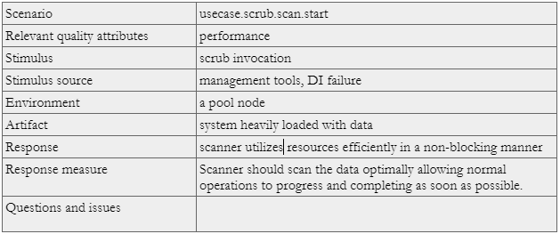
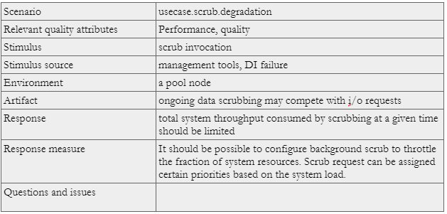
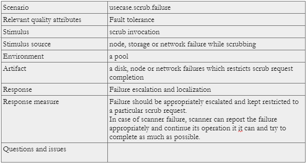
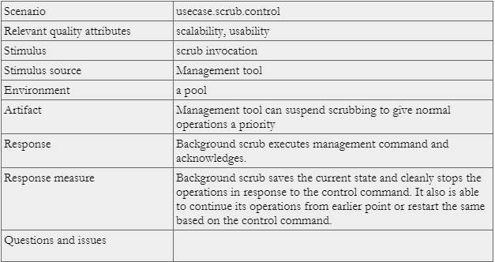

========================
HLD of Background Scrub
========================

Motr, with the help of DI (data integrity) feature using block checksums, shall be able to work with less reliable drives. Although DI provides required data integrity through checksums for unreliable hardware, it alone is not enough to ensure data availability.

Background scrub will reconstruct a failed block reported by DI subsystem on detecting a checksum mismatch without major impact on the product systems. This document will present the high-level design of background scrub. 

***************
Definitions
***************

Although background scrub follow similar principles to SNS repair [2], it is relatively a much lighter operation and works on a very small subset of data.

Following terms are used to discuss and describe background scrub:

- background scrub: subsystem to identify and repair corrupted motr data blocks. 

- DI: motr data integrity component. 

- scrubbing: process of identifying and repairing a small subset of corrupted data. 

- scanner: continuously scans motr data for any corruption and notifies background subsystem. 

- scrub machine: receives and executes scrub requests from DI and background scrub scanner. 

- scrub request: request submitted by DI or scanner in-order to repair the corrupt motr data block. 

- scrubber: worker created by scrub machine to serve a scrub request. 

- scrub group: a group of relevant data blocks typically distributed across storage devices in a cluster, e.g. a parity group. 

- transformation: reconstruction performed by background scrub worker in-order to recover the corrupted data.

***************
Requirements
***************

- [r.background.scrub.triggers] Background scrub can be triggered by an i/o failure due to DI checksum mismatch of a data block or by scanner. 

- [r.background.scrub.scan] Scanner can be running continuously in the background. 

- [r.background.scrub.scan.efficient] Scanner should efficiently scan disks for corruptions in a  non-blocking fashion. 

- [r.background.scrub.scan.progress] Scanner should provide an interface that allows to query its progress. 

- [r.background.scrub.io] Scrubber reads and writes relevant data from and to the disk. Reconstructed data is written in a newly allocated data block on the same disk having the failed block. 

- [r.background.scrub.net] Scrubber sends and receives data from remote nodes over the network. 

- [r.background.scrub.xform] Scrubber transforms the data read in-order to reconstruct the lost data. 

- [r.background.scrub.failures] Background scrub should handle failures during its progress, accordingly suspend (for SNS repair to take over) or restart. 

- [r.background.scrub.DI.interface] Background scrub should provide an interface to interact with DI. 

- [r.background.scrub.sns.repair] It should be possible to suspend an ongoing background scrub operation if SNS repair is triggered, possibly due to a device failure. 

- [r.background.scrub.repair.code.reuse] Background scrub should try to reuse code parts from SNS repair. 

- [r.background.scrub.halon] Background scrub should be able to notify halon in case the number of failures are more than K.

*******************
Design Highlights
*******************

Background scrub is implemented as a Motr service with its corresponding foms. Unlike SNS repair, scrubbing involves reconstruction of a small subset of data, e.g. a parity group and does not have to be a distributed operation. Although being a pull model (compared to push model of SNS repair), it reuses selected parts of i/o, transformation and network communication as in SNS repair. Data scrubbing is performed as a continuous operation and also on-demand basis. It is started as a background process, thus it is necessary to give a higher priority to normal i/o operations in order to make the data available to user all the time. Failures during data scrubbing must be accounted appropriately and reported to the relevant entity. System resources, e.g. memory, cpu and network bandwidth, must be used judiciously. Background scrub subsystem may have to interact with other Motr subsystems, e.g. i/o, SNS repair, Halon, etc. for concurrency control and failure handling. Scrubbing must be halted in case SNS repair takes over due to a device failure (e.g. disk, controller, Enclosure, rack, etc.).

************************
Functional Specification
************************

Background scrub service is started as a part of Motr server startup. On receiving a scrub request, background scrub finds the relevant layout corresponding to the corrupted data block and concurrently issues read requests for available data (these could be local or network reads depending on the layout). Received data is then aggregated to reconstruct the corrupted data block, which is then written to a newly allocated data block on the same device. Background scrub is able to execute multiple independent scrub requests in parallel.

Background Scrub Triggers
=========================

A background scrub operation can be triggered

- by the scanner, which continuously scans the Motr storage objects and reports any corruption found, consequently triggering a scrub operation.

- by DI subsystem, in context of an I/O when the stored checksum is mismatched with the calculated checksum by DI.

Scrubbing and Layouts
=====================

Background scrub maps the reported corrupt data block to its corresponding layout in order to fetch the relevant data for its re-construction. Scrubbing depends on the redundancy provided by the corresponding layout. If there are multiple failures with respect to the layout of the corrupted block and its relevant surviving data blocks, e.g. failures in a parity group corresponding to the corrupted block, then the scrubbing operation will probably fail. Fetching a file layout can be a blocking operation, fetched layouts will be appropriately cached for their reuse. In case of missing layouts, reconstruction of the corresponding data block may probably fail.

Scrub Control
=============

Various background scrub functions can be invoked by management tools, e.g. Halon, in order to control the overall operation as follows: 

- started or stopped scanner; 

- query scanner progress; 

- quiesce, resume or restart as required scrubbing.

Concurrency and Priority
========================

- The background scrubber will need to address concurrency issues with SNS repair and write I/O.  The concurrency comes into picture in two cases: 

  #. while iterating the blocks from disks; 

  #. while repairing a block with inconsistent checksum.     

- Multiple scrub request executions will need to handle the concurrent writes to the same storage objects.

Handling of Corrupted Blocks
=============================
The scrubber will maintain a list of inconsistent blocks per stob domain, in BE. This will help in maintaining the statistics of possible bit error rates per stob domain, and excluding those targets in subsequent pool version creation.  There should be a way to somehow cleanup the corrupted blocks so that the corresponding space can be reused by the system.

Failure Handling
=================

The scrubber needs to handle failures during the operation. Typical failures would be:

- Missing layout, scrubber handles this by terminating such operation. Scrubbing operations of other data blocks can continue. Such data blocks can be marked appropriately or escalated further, which could be then removed from the system if required. 

- Unavailable relevant data blocks needed for reconstruction, this could be due to multiple failures across the cluster. The operation can be terminated and the error can be escalated to relevant entity as required, e.g. Halon. 

- Scrubber must handle network failures by reporting the same to relevant entity, halon for instance, and appropriately terminating the operation. 

- In case the total failures in a scrub group are more than the tolerance factor then make the available redundancy, parity in a parity group for instance, consistent with respect to the available data.

Failure handling must be restricted to the relevant scrubbing operation without affecting other scrubbing operations in-progress. A failed scrub can be retried in further iterations.

*********************
Logical Specification
*********************

Two important components of the background scrub subsystem are a scanner and a scrub machine. Scanner is a continuous Motr process which runs in the background, scanning for Motr data block corruptions while scrub machine is more of a passive entity receiving scrub requests from the background scrub scanner or Motr data integrity component (DI). For every scrub request a scrubber is created which repairs the missing data without changing the file layout. Every scrubber, as shown in the diagram below, gathers enough information and intelligence through file layout to perform required I/O, data transformation and network communication respectively. There could be multiple background scrubbers working on different scrub requests in parallel at any given moment.

External interfaces:

- m0_bs_target_scrub()

- m0_bs_block_scrub() 

Continuous Scrubbing
====================

Early detection and repair of a data block would avoid failure of further i/o requests on it. 

Continuous scrubbing is implemented through a background scrub scanner component that efficiently iterates over the Motr storage objects, scanning data blocks for corruption. Scanner is more of an active part of background scrub subsystem. As scanning all the storage objects may impact overall system performance, it is important to give more priority to normal i/o operations over scrubbing so that all the data is still accessible while the operation is in-progress. 

On detection of the corrupted block, scanner creates a scrub request which posted to scrub machine. Scrub machine creates a scrubber corresponding to the request. Once the scrubber has completed the operation with respect to the request, scrub machine notifies the scanner about completion through a call back.

Background scrub subsystem exports the interfaces for management tools to quiesce, resume or restart the scanner as required. Scanner maintains the progress of the scanning operation which can be returned as a result of a query, typically posted by management tools.

On-demand Scrubbing
====================

Due to mismatch in DI checksum typically during an i/o operation, DI subsystem notifies background scrub regarding the corruption. Background scrub subsystem creates a scrub request with enough information and submits it to the scrub machine. Scrub machine creates a scrubber to serve the scrub request.

Scrub Machine
===============

Scrub machine is the core of the background scrub subsystem which employs scrubbers that reconstruct the reported corrupt data block. On receiving a scrub request, scrub machine initializes a scrubber, it accounts the number of scrubbers currently in progress. Scrub machine maintains a hash table of the size of the number of storage containers (i.e. disks) on a node and maps the incoming scrub request to one of the buckets in order to handle concurrent writes appropriately. Once all the scrubbers are complete, scrub machine can then transition to idle state, until then it is busy. Scrub machine maintains a bitmap for already scrubbed data blocks and thus is able to identify a duplicate scrub request during a scrubbing iteration.

A scrub machine is stopped and finalized when the corresponding Motr service, background scrub service is stopped. Scrub machine invokes completion call back on the scrub request to notify the concerned party.

Scrub Request
===============

Scrub request is created in-order to report a data block corruption, presently by the scanner or DI subsystem. It typically comprises of information about data block, mainly the block id, offset, storage container id, etc. User can implement a request completion callback provided by the scrub request interface, which is invoked by the scrub machine on request completion.

Scrubber
==========

A Scrubber is initialized by scrub machine for each scrub request. Scrubber goes through the phases of i/o, network communication and transformation in-order to reconstruct the corrupted data block. 

Corrupted block is mapped to its corresponding file layout. Using the file layout scrubber, fetches the relevant data and passes it to a transformation function that reconstructs the missing data. Recovered data is then written to the new location on same storage device as the corrupted block. Failures during the operation, transitions scrubber to a fail state, appropriate action is taken to escalate the failures depending on their type.

Typical failures could be missing file layout, unavailability of relevant data blocks, network failures and i/o errors that can be reported.

Concurrency Control
===================

- The background scrubber addresses concurrency issues with SNS repair and write IO.  The concurrency comes into picture in following cases:

  - while iterating the blocks from disks;

  - while repairing a block with inconsistent checksum.

  The first of the two can be addressed by either holding a group level lock of balloc or by holding a lock at the level of ad stob. The second one requires holding a file lock. The lock will be held at the group level across all instances of scrubber running in the cluster. This lock will be relinquished when none of the members of the group require to hold the lock anymore. 

 As an alternative, scrubber operation can be halted until SNS repair is completed. 

- Concurrent writes to the same storage objects by multiple scrubbers is handled by scheduling the scrubber writes based on the storage container ids. 

Dependencies
============

- DI 

  - [r.di.checksum.calc] Interface to calculate the checksum for given data 

  - [r.di.checksum.match] Interface to read and match the checksum for given data block

- Layout

  - [r.layout.map]: It must be possible to map a corrupted data block to its corresponding file and layout.

***************
Scenarios
***************

Scenario 1
============

Scenario 2
============

Scenario 3
============

Scenario 4
============

***************
Failures
***************

- In case of failures greater than the total number of tolerated, (K in pdclust layout), there could possible be files that are repairable while some may not. It is important that non-recoverable data is made consistent with respect to the available data including the redundancy. This also needs support from SNS repair subsystem, which does not mark a disk as repaired until all the files on it are completely recovered. A partial repair could be due to additional failures, thus making the total failures greater than tolerated failures. In such a case it will help to have the disk marked repaired after recovering, nevertheless, subset of data, in-order to save fully recovered files from more failures in future.

- If SNS repair fails to read an unit from a sane disk due to DI failure, SNS repair invokes scrubber to scrub the corrupted unit. SNS repair can continue repairing other relevant parity groups and keep the processing of a group pending while its corrupted unit is being scrubbed.

Also continuing with respect to SNS repair and parity declustered layout, it would help to have idea of infinite spares in real in such situations. 

***************
Scalability
***************

Major factor affecting data scrubbing operations are:

- Number of storage devices in the given node 

- Amount of data stored in the devices 

- Concurrent normal operations 

- Frequency of corruptions reported 

- Mean time taken by scanner to scan all the data blocks on all the storage devices in a node. 

- Time taken by scrubber to process a scrub request
