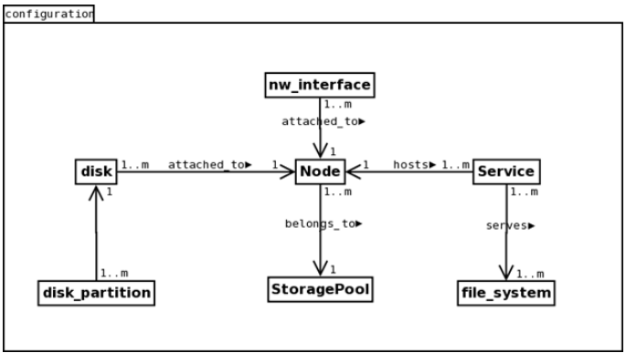

=========================================================
High level design of Motr configuration database schema 
=========================================================

This document presents a high level design (HLD) of Motr’s configuration database schema The main purposes of this document are: (i) to be inspected by M0 architects and peer designers to ascertain that high level design is aligned with M0 architecture and other designs, and contains no defects, (ii) to be a source of material for Active Reviews of Intermediate Design (ARID) and detailed level design (DLD) of the same component, (iii) to serve as a design reference document. 

The intended audience of this document consists of M0 customers, architects, designers and developers.

*************
Introduction
*************

Motr maintains all the configuration information in some central repository from where it is served to all other nodes interested in the information. This HLD is about database schema used to maintain all the configuration.

*************
Definitions
*************

- Motr configuration is part of meta-data that is updated by management components, as opposed to meta-data updated as part of executing file system operations. 

- Configuration database is a central repository of cluster configuration. 

- Configuration cache is configuration data being stored in node’s memory. 

- Configuration client (confc) is a software module that manages node’s configuration cache. 

- Configuration server (confd) is a software module that mediates access to the configuration database. Also, the server node on which this module runs. 

- Trinity is a set of utilities and GUI used by system administrators to monitor and influence operation of a cluster.

*************
Requirements
*************

- [R.M0.CONFIGURATION.SCHEMA.CENTRALISED]

  - Must store global configuration in a centralized location.
  
  
*************************
Functional Specification
*************************

Configuration database is created and maintained by confd. Configuration database contains information about following entities: 

- Node 

- storage devices 

- disk-partitions 

- nics 

- file-systems 

- services 

- profiles 

- storage pools

Other possible objects whose information can be kept in configuration database are: 

- Motr tuning parameters 

- Routers 

- Containers 

- snapshots 

- software versions 

- enterprise user data-base 

- security, keys

**********************
Logical Specification
**********************

Configuration database is kept at some well-known location in persistent store on confd node. Configuration database is presented as set of tables where each table is a set of <key, value> pairs. Configuration database is implemented using m0_db_* interfaces. confd accesses configuration database using m0_db APIs.

When confd service starts, it opens the configuration database or creates it if it does not already exists.

Configuration database maintains separate table for each of following entities:

- nodes 

- storage devices 

- storage-device-partitions 

- nics 

- file-systems 

- services 

- profiles 

- storage pools

Relationships between these entities in configuration database: 

+--------------------------+---------------------------------------------------------------------+
|Table Name                |nodes                                                                |
+--------------------------+---------------------------------------------------------------------+
|Key                       |node_name                                                            |
+--------------------------+---------------------------------------------------------------------+
|Record                    |- node-uuid/serial_num                                               |
|                          |                                                                     |
|                          |- memory_size                                                        |
|                          |                                                                     |
|                          |- nr_processors                                                      |                                                 
|                          |                                                                     |
|                          |- last-known-state (ONLINE/OFFLINE/FAILED/...)                       |
|                          |                                                                     |
|                          |- is_virtual                                                         |
|                          |                                                                     |
|                          |- native_endianness                                                  |
|                          |                                                                     |
|                          |- pool_id                                                            |
+--------------------------+---------------------------------------------------------------------+
|Comments                  |node_name is a human readable name independent of network.           |
|                          |node_name of a node is unique within the cluster.                    |
|                          |is_virtual is true for virtual nodes and false for physical nodes.   |
|                          |                                                                     |
|                          |Trinity can provide unique name for each node.                       |
|                          |On linux box,                                                        |
|                          |uuid of a node can be taken from output of `dmidecode -s system-uuid.|
|                          |serial number of a node can be reteived from `dmidecode -s           |
|                          |baseboard-serial-number`.                                            |
|                          |                                                                     |
|                          |nodes table maintains information about only server nodes.           |
|                          |pool_id is a reference in storage_pools table, identifying record    |
|                          |of a storage pool to which this node belongs.                        |
+--------------------------+---------------------------------------------------------------------+

+--------------------------+---------------------------------------------------------------------+
|Table Name                |storage_devices                                                      |
+--------------------------+---------------------------------------------------------------------+
|Key                       |dev_uuid                                                             |
+--------------------------+---------------------------------------------------------------------+
|Record                    |- dev_interface_type (SCSI, ATA, ...)                                |
|                          |                                                                     |
|                          |- dev_type (disk, flash or tape)                                     |
|                          |                                                                     |
|                          |- size                                                               |                                                 
|                          |                                                                     |
|                          |- is_removable                                                       |
|                          |                                                                     |
|                          |- is_read_only                                                       |
|                          |                                                                     |
|                          |- status (OK, unresponsive, degraded)                                |
|                          |                                                                     |
|                          |- node_name                                                          |
|                          |                                                                     |
|                          |- file_name                                                          |
|                          |                                                                     |
|                          |- format (ext3/ext4/...)                                             |
|                          |                                                                     |
|                          |- partition_table_type (raw (no-partition), DOS partition)           |
+--------------------------+---------------------------------------------------------------------+
|Comments                  |dev_uuid can be taken as serial-num from `hdparm -I <dev_file>`      |
|                          |node_name is foreign key referring record, in nodes table,           |
|                          |of the node to which the storage device belongs.                     |
|                          |                                                                     |
|                          |                                                                     |
|                          |file_name is name of device file that represents this storage device |
+--------------------------+---------------------------------------------------------------------+

+--------------------------+---------------------------------------------------------------------+
|Table Name                |storage_device_partitions                                            |
+--------------------------+---------------------------------------------------------------------+
|Key                       |partition_uuid                                                       |
+--------------------------+---------------------------------------------------------------------+
|Record                    |- start                                                              |
|                          |                                                                     |
|                          |- size                                                               |
|                          |                                                                     |
|                          |- dev_udid                                                           |                                                 
|                          |                                                                     |
|                          |- partition index                                                    |
|                          |                                                                     |
|                          |- file_name                                                          |
|                          |                                                                     |
|                          |- format (ext3/ext4/.../?)                                           |
+--------------------------+---------------------------------------------------------------------+
|Comments                  |file_name is name of block device file that represents this          |
|                          |storage device partition.                                            |
|                          |start is  offset of partition from start of storage                  |
|                          |size is size of partition in number of sectors                       |
|                          |                                                                     |
|                          |dev_uuid is foreign key referring record, in storage_devices         |
|                          |table, of storage device to which this partition belongs.            |
|                          |One possible way to define partition_uuid is <dev_uuid,              |
|                          |partition_index>                                                     |
+--------------------------+---------------------------------------------------------------------+

+--------------------------+---------------------------------------------------------------------+
|Table Name                |nics                                                                 |
+--------------------------+---------------------------------------------------------------------+
|Key                       |hw_addr                                                              |
+--------------------------+---------------------------------------------------------------------+
|Value                     |- type   (eth/ib/...)                                                |
|                          |                                                                     |
|                          |- node_name                                                          |
|                          |                                                                     |
|                          |- mtu                                                                |                                                 
|                          |                                                                     |
|                          |- state                                                              |
|                          |                                                                     |
|                          |- speed                                                              |
+--------------------------+---------------------------------------------------------------------+
|Comments                  |node_name is foreign key referring to record of the node to which    |
|                          |this nic is connected, in nodes table.                               |
+--------------------------+---------------------------------------------------------------------+

+--------------------------+---------------------------------------------------------------------+
|Table Name                |file_systems                                                         |
+--------------------------+---------------------------------------------------------------------+
|Key                       |file_system_name                                                     |
+--------------------------+---------------------------------------------------------------------+
|Value                     |root_fid                                                             |
+--------------------------+---------------------------------------------------------------------+
|Comments                  |Other attributes of file-system e.g. disk-partitions that contain    |
|                          |file-system data/metadata, list of services can be inferred from     |
|                          |other tables.                                                        |
+--------------------------+---------------------------------------------------------------------+

+--------------------------+---------------------------------------------------------------------+
|Table Name                |services                                                             |
+--------------------------+---------------------------------------------------------------------+
|Key                       |service_uuid                                                         |
+--------------------------+---------------------------------------------------------------------+
|Record                    |- type (md, io, lock, mgs...)                                        |
|                          |                                                                     |
|                          |- end_points[]                                                       |
|                          |                                                                     |
|                          |- node_name                                                          |                                                 
|                          |                                                                     |
|                          |- file_system_name                                                   |
+--------------------------+---------------------------------------------------------------------+
|Comments                  |node_name is name of node on which the service is deployed           |
|                          |file_system_name is name of file-system served by this service.      |
+--------------------------+---------------------------------------------------------------------+

+--------------------------+---------------------------------------------------------------------+
|Table Name                |storage_pools                                                        |
+--------------------------+---------------------------------------------------------------------+
|Key                       |pool_id                                                              |
+--------------------------+---------------------------------------------------------------------+
|Value                     |                                                                     |
+--------------------------+---------------------------------------------------------------------+
|Comments                  |At this point, a pool is a list of nodes which can be                |
|                          |derived by scanning nodes table with matching pool_id attribute.     |
+--------------------------+---------------------------------------------------------------------+

+--------------------------+---------------------------------------------------------------------+
|Table Name                |profiles                                                             |
+--------------------------+---------------------------------------------------------------------+
|Key                       |profile_name                                                         |
+--------------------------+---------------------------------------------------------------------+
|Value                     |file_system_name                                                     |
+--------------------------+---------------------------------------------------------------------+
|Comments                  |A profile is a topmost configuration object that is used to group all|
|                          |other configuration data. Profile is used to export multiple         |
|                          |"personalities" from the same hardware. For example, profile would   | 
|                          |include a file system and user data base, so that by selecting a     |
|                          |profile, users will see different sets of files and directories and  |
|                          |have different identities.                                           |
+--------------------------+---------------------------------------------------------------------+

Conformance
============

- [R.M0.CONFIGURATION.SCHEMA.CENTRALISED] 

  - Configuration database is kept on motr confd.
  
Dependencies
============

- [R.M0.CONFIGURATION.NODE.NAME]

  - Each node must have a human readable name that is unique within the names of all nodes in the cluster.
  
- [R.M0.CONFIGURATION.FS.NAME] 

  - Each file-system should have a human readable name that is unique within names of all file-systems in the cluster.
  
- [R.M0.CONFIGURATION.SERVICE.ENDPOINT]

  - Value provided to end-point attribute of record in Services table must have enough information for clients to be able to connect to the service.
  
  
***************
Use Cases
***************

Scenario
===========

+--------------------------------+--------------------------------------------------------------------+
|Scenario                        |[usecase.component.name]                                            |
+--------------------------------+--------------------------------------------------------------------+
|Relevant quality attributes     |[e.g., fault tolerance, scalability, usability, re-usability]       |
+--------------------------------+--------------------------------------------------------------------+
|Stimulus                        |[an incoming event that triggers the use case]                      |
+--------------------------------+--------------------------------------------------------------------+
|Stimulus source                 |[system or external world entity that caused the stimulus]          |
+--------------------------------+--------------------------------------------------------------------+
|Environment                     |[part of the system involved in the scenario]                       |
+--------------------------------+--------------------------------------------------------------------+
|Artifact                        |[change to the system produced by the stimulus]                     |
+--------------------------------+--------------------------------------------------------------------+
|Response                        |[how the component responds to the system change]                   |
+--------------------------------+--------------------------------------------------------------------+
|Response measure                |[qualitative and (preferably) quantitative measures of response     |
|                                |that must be maintained]                                            |
+--------------------------------+--------------------------------------------------------------------+

