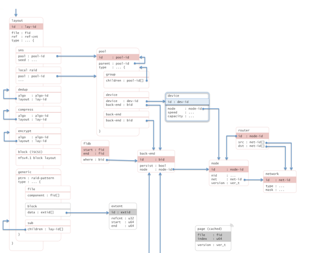

=====================================
High level design of a layout schema
=====================================

This document presents a high level design (HLD) of a layout schema of Motr M0 core. The main purposes of this document are: (i) to be inspected by M0 architects and peer designers to ascertain that high level design is aligned with M0 architecture and other designs, and contains no defects, (ii) to be a source of material for Active Reviews of Intermediate Design (ARID) and detailed level design (DLD) of the same component, (iii) to serve as a design reference document.

The intended audience of this document consists of M0 customers, architects, designers and developers.

*************
Introduction
*************

Very broadly, a layout is something that determines where a particular piece of data or meta-data is located in a storage system, including location of data and meta-data that are about to be added to the system.

The layout is by itself a piece of meta-data and has to be stored somewhere. This HLD of layout schema is to design the organization of the layout meta-data stored in database.

*************
Definitions
*************

- A layout is a map determining where file data and meta-data are located. The layout is by itself a piece of meta-data and has to be stored somewhere.

- A layout is identified by layout identifier uniquely.

- This map is composed of sub-maps, and a sub-map may still be composed of sub-maps, till direct mapping to some known underlying location, i.e. block number on physical device.

- A layout schema is a way to store the layout information in data base. The schema describes the organization for the layout meta-data.

*************
Requirements
*************

- [r.layout.schema.layid] layout identifiers. Layout identifiers are unique globally in the system, and persistent in the life cycle.

- [r.layout.schema.types] multiple layout types. There are multiple layout types for different purposes: SNS, block map, local raid, de-dup, encryption, compression, etc.

- [r.layout.schema.formulae] layout formulae (future)

  - parameters. Layout may contain sub-map information. Layout may contain some formula, and its parameters and real mapping information should be calculated from the formula and its parameters.

  - garbage collection. If some objects are deleted from the system, their associated layout may still be left in the system, with zero reference count. This layout can be re-used, or be garbage collected in some time.
  
- [r.layout.schema.sub-layouts] sub-layouts (future).

******************
Design Highlights
******************

Lustre stores layout (LOVEA) as an extended attribute of file. Every file has its own layout stored in EA, even though they have similar striping pattern. This does not only waste precious meta-data storage, but also impact performance, because to access a file, a separate EA has to be loaded from disk and network.

In Motr, layout is a meta-data that is stored separately. It can be transferred from meta-data server to clients or other servers. It is used to locate file data or meta-data according to the offset of desired data.

Layouts in Motr are generalized to locate data and meta-data for all objects: file, dir, encrypted file, compressed file, de-dup files, etc.

A layout describes a mapping in term of sub-maps. A sub-map can be specified in a one of the following ways:

- a layout id (layid) of a layout that implements a sub-map;

- a directly embedded layout that implements a sub-map;

- a fid of a file (a component file) whose file layout implements a sub-map;

- a storage address (a block number usually).

The layout schema is to organize these layout data structures in memory and in database and store them in database.

*************************
Functional Specification
*************************

Layout Types
=============

Layout is used to locate data and meta-data for various types of files/objects in Motr. The following layouts will be defined:

- SNS. File data or metadata will be striped over multiple devices within a pool.

- local raid. Device data will span over multiple local disks.

- Generic. File data or meta-data is striped with some pre-defined RAID pattern. File is striped within component file; block device is striped over extents; And also the sub-map can be another layout.

- Other types of layout are also supported( in the future), such as de-dup, encryption, compression.

Layout Hierarchy
==================

Layout is organized as sub-maps in a hierarchy. The sub-map should be resolved until some preliminary address (e.g. block number of physical device) is reached.

Layout Schema
================

Layout schema is the organization of layout data structures used for database storing. The following figure depicts the schema.

Layout Owner and References
============================

Layout is assigned to some Motr object, that is its owner. Layout is stored separated from its owner’s meta-data. Sometimes multiple objects share the same layout, .e.g. in de-dup, or snapshots. Layout has persistent reference count to address this requirement.

Layout Operations
==================

Layout will support the following operations:

- Layout creation. This will create a layout and store it in database.

- Layout update. This will update an existing layout of its content, e.g. its sub maps.

- Layout query. This will retrieve layout content by its layout id.

- Layout references get/put. This will increase/decrease reference count for layout.

- Layout deletion. This will delete a layout specified by its layout id.

Layout Policy
==============

Layout is created for new file when new file is created. Layout is updated for file when a file is in NBA mode, or is compressed, or de-dup, etc. Layout policy makes the decision on how to choose a suitable layout. Layout policy is affected by:

- SNS [2] arguments: stripe size, stride size, stripe count, etc. This may derived from system default, or from parent directory, or specified explicitly upon creation.

- system running state. This include system load, disk/container usage, quota, etc.

- PDRAID requirements. This insures the data availablity in face of failure, I/O performance.

On principle, this topic is not covered by this task. It will be discussed by layout policy task in the future.

**********************
Logical Specification
**********************

A layout is a map determining where file data and meta-data are located. This map is composed of sub-maps. The layout is by itself a piece of meta-data and has to be stored somewhere. The naïve solution (used by Lustre) is to store a layout for a file as a file attribute. This leaves much to be desired, because a large number of files usually have very similar layouts, wasting precious attribute space. Instead of storing every file layout individually, a layout can be parametrized to describe whole group of file layouts, so that an individual file layout can be obtained by substituting a parameter. As an example, instead of file layouts "a file RAID0 striped across component files with fids A0, ..., AN" and "a file RAID0 striped across component files with fids B0, ..., BN" a parametrized layout "a file RAID0 striped across component files with fids F + i * STEP, i = 0, ..., N" can be used. A particular file layout can be obtained by substituting proper values of F and STEP---a representation much more compact than original file layouts.

A layout describes a mapping in term of sub-maps. A sub-map can be specified in a one of the following ways:

- a layout id (layid) of a layout that implements a sub-map;

- a directly embedded layout that implements a sub-map;

- a fid of a file (a component file) whose file layout implements a sub-map;

- a storage address (a block number usually)

SNS and local raid layouts include a number of sub-maps, indeed a rather large number in case of wide-striping. Moreover, an overwhelming majority of files in a typical system would have such layouts. This makes an ability to represent a collection of sub-maps compactly an important optimization. To achieve it, two types of sub-map collections are introduced:

- a regular collection is one where all sub-maps belong to the same type (i.e., all are given as fids, or all are given as layids, etc.), and the identifier of i-th member of collection is (I0 + STEP*i). Such a collection can be represented by a triple (I0, STEP, N), where N is a number of elements in the collection;

- a collection is irregular otherwise

To support NBA, mixed layout is needed. In a mixed layout, the original layout is kept unchanged, but some part of it is superseded by the new layout. The simplest layout schema is to implement a regular collection. In this task, we will first implement the following sub-maps:

- a fid of a file

Dependencies
=============

Motr db interfaces is a dependency. This is already implemented.

**********
Use Cases
**********

Scenatio
==========

+----------------------------+-------------------------------------------------------------------------+
|Scenario                    |[usecase.component.name]                                                 |
+----------------------------+-------------------------------------------------------------------------+
|Relevant quality attributes |[e.g., fault tolerance, scalability, usability, re-usability]            |
+----------------------------+-------------------------------------------------------------------------+
|Stimulus                    |[an incoming event that triggers the use case]                           |
+----------------------------+-------------------------------------------------------------------------+
|Stimulus source             |[system or external world entity that caused the stimulus]               |
+----------------------------+-------------------------------------------------------------------------+
|Environment                 |[part of the system involved in the scenario]                            |
+----------------------------+-------------------------------------------------------------------------+
|Artifact                    |[change to the system produced by the stimulus]                          |
+----------------------------+-------------------------------------------------------------------------+
|Response                    |[how the component responds to the system change]                        |
+----------------------------+-------------------------------------------------------------------------+
|Response measure            |[qualitative and (preferably) quantitative measures of                   |
|                            |response that must be maintained]                                        |
+----------------------------+-------------------------------------------------------------------------+

******************
References
******************

- [0] On layouts 

- [1] Meta-data schema 

- [2] HLD of SNS Repair
