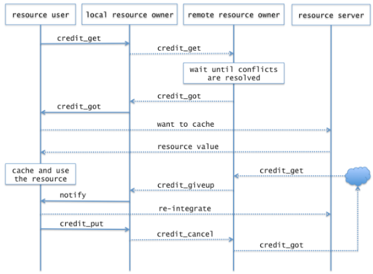

==================================
HLD Resource Management Interface
==================================

This document presents a high level design (HLD) of scalable resource management interfaces for Motr. The main purposes of this document are: (i) to be inspected by M0 architects and peer designers to ascertain that high level design is aligned with M0 architecture and other designs, and contains no defects, (ii) to be a source of material for Active Reviews of Intermediate Design (ARID) and detailed level design (DLD) of the same component, (iii) to serve as a design reference document.

The intended audience of this document consists of M0 customers, architects, designers and developers.

***************
Introduction
***************

Motr functionality, both internal and external, is often specified in terms of resources. A resource is part of system or its environment for which a notion of ownership is well-defined.

***************
Definitions
***************

- A resource is part of system or its environment for which a notion of ownership is well-defined. Resource ownership is used for two purposes:

  - concurrency control. Only resource owner can manipulate the resource and ownership transfer protocol assures that owners do not step on each other. That is, resources provide traditional distributed locking mechanism;

  - replication control. Resource owner can create a (local) copy of a resource. The ownership transfer protocol with the help of version numbers guarantees that multiple replicas are re-integrated correctly. That is, resources provide a cache coherency mechanism. Global cluster-wide cache management policy can be implemented on top of resources.

- A resource owner uses the resource via a usage credit (also called resource credit or simply credit as context permits). E.g., a client might have a credit of a read-only or write-only or read-write access to a certain extent in a file. An owner is granted a credit to use a resource.

- A usage credit granted to an owner is held (or pinned) when its existence is necessary for the correctness of ongoing resource usage. For example, a lock on a data extent must be held while IO operation is going on and a meta-data lock on a directory must be held while a new file is created in the directory. Otherwise, the granted credit is cached.

- A resource belongs to a specific resource type, which determines resource semantics.

- A conflict occurs at an attempt to use a resource with a credit incompatible with already granted credit. Conflicts are resolved by a conflict resolution policy specific to the resource type in question.

- To acquire a resource usage credit, a prospective owner enqueues a resource acquisition request to a resource owner.

- An owner can relinquish its usage credits by sending a resource cancel request to another resource owner, which assumes relinquished credits.

- A usage credit can be associated with a lease, which is a time interval for which the credit is granted. The usage credit automatically cancels at the end of the lease. A lease can be renewed.

- One possible conflict resolution policy would revoke all already granted conflicting credits before granting the new credit. Revocation is effected by sending conflict call-backs to the credits owners. The owners are expected to react by cancelling their cached credits.

***************
Requirements
***************

- [R.M0.LAYOUT.LAYID.RESOURCE]: layids are handled as a distributed resource (similarly to fids)

- [R.M0.RESOURCE]: scalable hierarchical resource allocation is supported

- [R.M0.RESOURCE.CACHEABLE]: resources can be cached by clients

- [R.M0.RESOURCE.HIERARCICAL]: resources are distributed hierarchically

- [R.M0.RESOURCE.CALLBACK-REVOKE]: scalable call-back and revocation model: revocation can spawn multiple nodes, each owning a part of a resource

- [R.M0.RESOURCE.RECLAIM]: unused resources are reclaimed from users

Additional Requirements

- [r.resource.enqueue.async]: a resource can be enqueued asynchronously

- [r.resource.ordering]: a total ordering of all resources is defined. Resources are enqueued according to the ordering, thus avoiding dead-locks.

- [r.resource.persistent]: a record of resource usage credit acquisition can be persistent (e.g., for disconnected operation).

- [r.resource.conversion]: a resource usage credit can be converted into another usage credit.

- [r.resource.adaptive]: dynamic switch into a lockless mode.

- [r.resource.revocation-partial]: part of a granted resource usage credit can be revoked.

- [r.resource.sublet]: an owner can grant usage credits to further owners, thus organizing a hierarchy of owners.

- [r.resource.separate]: resource management is separate from actual resource placement. For example, locks on file data extents are distributed by a locking service that is separate from data servers.

- [r.resource.open-file]: an open file is a resource (with a special property that this resource can be revoked until owner closes the file).

- [r.resource.lock]: a distributed lock is a resource.

- [r.resource.resource-count]: a count of resource usage credit granted to a particular owner is a resource.

- [r.resource.grant]: free storage space is a resource.

- [r.resource.quota]: storage quota is a resource.

- [r.resource.memory]: server memory is a resource.

- [r.resource.cpu-cycles]: server cpu-cycles are a resource.

- [r.resource.fid]: file identifier is a resource.

- [r.resource.inode-number]: file inode number is a resource.

- [r.resource.network-bandwidth]: network bandwidth is a resource.

- [r.resource.storage-bandwidth]: storage bandwidth is a resource.

- [r.resource.cluster-configuration]: cluster configuration is a resource.

- [r.resource.power]: (electrical) power consumed by a device is a resource.

******************
Design Highlights
******************

- hierarchical resource names. Resource name assignment can be simplified by introducing variable length resource identifiers.

- conflict-free schedules: no observable conflicts. Before a resource usage credit is cancelled, the owner must re-integrate all changes which it made to the local copy of the resource. Conflicting usage credits can be granted only after all changes are re-integrated. Yet, the ordering between actual re-integration network requests and cancellation request can be arbitrary, subject to server-side NRS policy.

- resource management code is split into two parts: (i) generic code that implements functionality independent of particular resource type (request queuing, resource ordering, etc.) and (ii) per-resource type code that implement type specific functionality (conflict resolution, etc.).

- an important distinction with a more traditional design (as exemplified by the Vax Cluster or Lustre distributed lock managers) is that there is no strict separation of rôles between "resource manager" and "resource user": the same resource owner can request usage credits from and grant usage credits to other resource owners. This reflects more dynamic nature of Motr resource control flow, with its hierarchical and peer-to-peer caches.

*************************
Functional Specification
*************************

External resource management interface is centered around following data-types:

- a resource type;

- a resource owner;

- a usage credit;

- a request for resource usage credit.

The following sequence diagram illustrates the interaction between resource users, resource owners and resource servers.

Here a solid arrow represents a (local) function call and a dashed arrow—a potentially remote call.

External resource management interface consists of the following calls:

- credit_get(resource_owner, resource_credit_description, notify_callback): obtains the specified resource usage credit. If no matching credit is granted to the owner, the credit acquisition request is enqueued to the master resource owner, if any. This call is asynchronous and signals completion through some synchronization mechanism (e.g., a condition variable). The call outcome can be one of:

  - success: a credit, matching the description is granted;

  - denied: usage credit cannot be granted. The user is not allowed to cache the resource and must use no-cache operation mode;

  - error: some other error, e.g., a communication failure, occurred

A number of additional flags, modifying call behavior can be specified:

- non-block-local: deny immediately if no matching credit is granted (i.e., don't enqueue);

- non-block-remote: deny if no matching credit is granted to the master owner (i.e., don't resolve conflicts).

On successful completion the granted credit is held. notify_callback is invoked by the resource manager when the cached resource credit has to be revoked to satisfy a conflict resolution or some other policy.

- credit_put(resource_credit): release held credit

*********************
Logical Specification
*********************

A resource owner maintains:

- an owned resource usage credit description. The exact representation of this is up to the resource type. This is the description of the resource credits that are actually held by this owner at the moment. Examples:

  - for (meta-data) inode resource type: credit description is a lock mode;

  - for quota resource type: credit description is a quota amount assigned to the owner (a node, typically);

  - for a component data object: credit description is a collection of locked extents together with their lock modes. This collection could be maintained either as a list or a more sophisticated data-structure (e.g., an interval tree);

- a queue of granted resource usage credits. This is a queue of triples (credit, owner, lease) that this owner granted to other owners. Granted credits no longer belong to this owner;

- a queue of incoming pending credits. This is a queue of incoming requests for usage credits, which were sent to this resource owner and are not yet granted, due to whatever circumstances (unresolved conflict, long-term resource scheduling decision, etc.);

- a queue of outgoing pending credits. This is a queue of usage credits that users asked this resource owner to obtain, but that are not yet obtained.

Conformance
===============

- [R.M0.LAYOUT.LAYID.RESOURCE], [r.resource.fid], [r.resource.inode-number]: layout, file and other identifiers are implemented as a special resource type. These identifiers must be globally unique. Typical identifier allocator operates as following:

  - originally, a dedicated "management" node runs a resource owner that owns all identifiers (i.e., owns the [0, 0xffffffffffffffff] extent in identifiers name-space);

  - when a server runs short on identifiers (including the time when the server starts up for the first time) it enqueues a credit request to the management node. credit description is simply the number of identifiers to grant. The management node's resource owner finds a not-yet granted extent of suitable size and returns it to the server's resource owner;

  - depending on identifier usage, clients can similarly request identifier extents from the servers;

  - there is no conflict resolution policy;

  - identifiers can be cancelled voluntary: e.g., an inode number is cancelled when the file is deleted and fid range is cancelled when client disconnects or is evicted.

- [R.M0.RESOURCE], [R.M0.RESOURCE.HIERARCICAL]: resource owner can enqueue credit requests to other ("master") owners and at the same time bestow credits to "slave" owners. This forms a hierarchy of owners allowing scalable resource management across the cluster.

- [R.M0.RESOURCE.CACHEABLE]: it is up to resource type to provide conflict resolution policy such that an owner can safely use cached resource while it possesses corresponding usage credits.

- [R.M0.RESOURCE.CALLBACK-REVOKE]: scalable call-back and revocation model: revocation can spawn multiple nodes, each owning a part of a resource.

- [R.M0.RESOURCE.RECLAIM]: a resource owner can voluntary cancel a cached usage credit.

Additional requirements are:

- [r.resource.enqueue.async]: credit_get entry point is asynchronous by definition.

- [r.resource.ordering]: a total ordering of all resources is defined. Resources are enqueued according to the ordering, thus avoiding dead-locks.

- [r.resource.persistent]: a record of resource usage credit acquisition can be persistent (e.g., for disconnected operation).

- [r.resource.conversion]: a resource usage credit can be converted into another usage credit.

- [r.resource.adaptive]: dynamic switch into a lock less mode.

- [r.resource.revocation-partial]: part of a granted resource usage credit can be revoked.

- [r.resource.sublet]: an owner can grant usage credits to further owners, thus organizing a hierarchy of owners.

- [r.resource.separate]: resource management is separate from actual resource placement. For example, locks on file data extents are distributed by a locking service that is separate from data servers.

- [r.resource.open-file]: an open file is a resource (with a special property that this resource can be revoked until owner closes the file).

- [r.resource.lock]: a distributed lock is a resource.

- [r.resource.resource-count]: a count of resource usage credit granted to a particular owner is a resource.

- [r.resource.grant]: free storage space is a resource.

- [r.resource.quota]: storage quota is a resource.

- [r.resource.memory]: server memory is a resource.

- [r.resource.cpu-cycles]: server cpu-cycles are a resource.

- [r.resource.network-bandwidth]: network bandwidth is a resource.

- [r.resource.storage-bandwidth]: storage bandwidth is a resource.

- [r.resource.cluster-configuration]: cluster configuration is a resource.

- [r.resource.power]: (electrical) power consumed by a device is a resource.

Resource Type Methods
=====================

Implementations of these methods are provided by each resource type. See examples below.

- matches(credit_description0, credit_description1) method: this method returns true iff a credit with description credit_description0 is implied by a credit with description credit_description1. For example, extent lock L0 matches extent lock L1 iff L0's extent is part of L1's extent and L0's lock mode is compatible with L1's lock mode. More generally, for lock-type resources, matching is the same as lock compatibility.

credit_get(owner, credit_description)

- if matches(credit_description, owner.credit_description)

