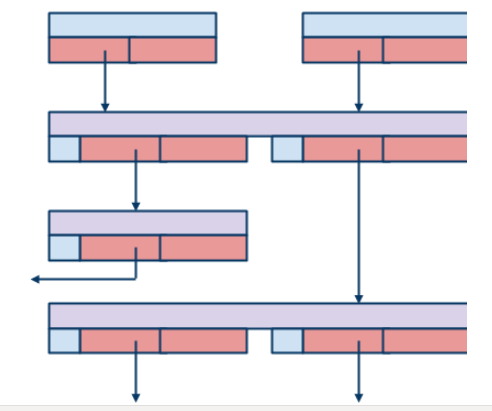
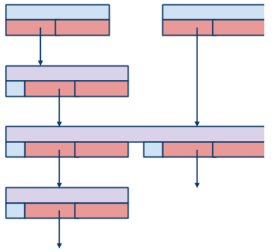

======================================
High Level Design of Version Numbers
======================================

This document presents a high level design (HLD) of version numbers in Motr M0 core. The main purposes of this document are: (i) to be inspected by M0 architects and peer designers to ascertain that high level design is aligned with M0 architecture and other designs, and contains no defects, (ii) to be a source of material for Active Reviews of Intermediate Design (ARID) and detailed level design (DLD) of the same component, (iii) to serve as a design reference document.

***************
Introduction
*************** 

Version numbers identify particular file system states and order updates thereof. They are used for distributed transaction management, concurrency control (both lock based and optimistic) and object history navigation.

A version number is stored together with the file system state whose version it identifies. Specifically, multiple cached replicas of the same state are all tagged with version numbers matching each other in the sense defined below. Version numbers are treated as a distributed resource. A piece of file system state to which a version number is assigned is called a unit. Unit granularity can be a file system object or a part of a file system object. 

***************
Definitions
*************** 

See the Glossary for general M0 definitions and HLD of FOL for the definitions of file system operation, update and lsn. The following additional definitions are required:

- for the purposes of the present design it is assumed that a file system update acts on units (r.dtx.units). For example, a typical meta-data update acts on one or more "inodes" and a typical data update acts on inodes and data blocks. Inodes, data blocks, directory entries, etc. are all examples of units. It is further assumed that units involved in an update are unambiguously identified (r.dtx.units.identify) and that complete file system state is a disjoint union of states of comprising units. (Of course, there are consistency relationships between units, e.g., inode nlink counter must be consistent with contents of directories in the name-space).

- It is guaranteed that operations (updates and queries) against a given unit are serializable in the face of concurrent requests issued by the file system users. This means that observable (through query requests) unit state looks as if updates of the unit were executed serially in some order. Note that the ordering of updates is further constrained by the distributed transaction management considerations which are outside the scope of this document.

- A unit version number is an additional piece of information attached to the unit. A version number is drawn from some linearly ordered domain. A version number changes on every update of the unit state in such a way that ordering of unit states in the serial history can be deduced by comparing version numbers associated with the corresponding states.    

***************
Requirements
***************

- [r.verno.serial]: version numbers order unit states in the unit serial history; 

- [r.verno.resource]: version numbers are managed as a scalable distributed resource (r.resource): entities caching a given unit could also cache (r.resource.cacheable) some range of version numbers and to generate version numbers for updates of local cached state locally; 

- [r.verno.dtm]: version numbers are usable for distributed transaction (r.dtx) recovery: when cached update is replayed to restore lost unit state, unit version number is used to determine whether update is already present in the survived unit state; 
 
- [r.verno.optimistic-concurrency]: version numbers are usable for optimistic concurrency control in the spirit of NAMOS [1]; 

- [r.verno.update-streams]: version numbers are usable for implementation of update streams (R.NET.RPC.STREAMS.MULTIPLE) (see On file versions [0]); 

- [r.verno.fol]: a unit version number identifies the fol record that brought the unit into the state corresponding to the version number.

******************
Design Highlights
******************

In the presence of caching, requirements [r.verno.resource] and [r.verno.fol] are seemingly contradictory: if two caching client nodes assigned (as allowed by [r.verno.resource]) version numbers to two independent units, then after re-integration of units to their common master server, the version numbers must refer to the master's fol, but clients cannot produce such references without extremely inefficient serialization of all accesses to the units on the server. 

To deal with that, a version number is made compound: it consists of two components: 

- LSN (r.fol.lsn): a reference to a fol record, corresponding to the unit state;

- VC: a version counter, which is an ordinal number of update in the unit's serial history.

When a unit state is updated, a new version number is produced, with lsn referring to the fol local to the node where update is made. When unit state is re-integrated to another node, lsn part of version number is replaced with a reference to target node fol, resulting in a compound version number who's lsn matches the target node's fol. The vc remains unchanged; a monotonically increasing unit history independent of any node-specific relationship.  The unit state can be traced through the vc, the fol references can be traced through the lsn. See [0] for additional recovery related advantages of compound version numbers. 

Note that introduction of compound version numbers does not, by itself, require additional indices for fol records, because whenever one wants to refer to a particular unit version from some persistent of volatile data-structure (e.g., a snapshot of file-set descriptor), one uses a compound version number. This version number contains lsn, that can be used to locate required fol entry efficiently. This means that no additional indexing of fol records (e.g., indexing by vc) is needed. The before-version-numbers, stored in the fol record, provide for navigation of unit history in the direction of the things past.

************************
Functional Specification
************************

Other sub-systems use version numbers in a number of ways:

- [a version number in a fol record] a fol record stores version numbers (r.fol.verno) that units modified by the update had before the update was applied. These are called before-version-numbers (similarly to a before-image stored by data-bases in a transactional log). The version number a unit would have after the update is applied (called after-version-number) can be constructed: its lsn is the lsn of the fol record in question and its version counter is one more than the version counter of before-version. The lsn parts of before-version-numbers constitute prev-lsn references as defined by the FOL HLD;

- [a version number update protocol] a unit has version number of its latest state as an attribute (r.back-end.store-verno). This attribute is modified with every update to the unit state. lsn part of this version number points to the fol record with the last update for the unit. When new update is performed, new fol record is transactionally (R.BACK-END.TRANSACTIONAL) appended to the log, pointing to the previous record through last-lsn, and in-unit version number is changed to point to the new record. Effectively, this maintains a single-linked list of records updating a given unit, except that a single record can belong to multiple lists. For example, initial configuration:  

becomes after open("foo") call: 

- [a version number applicability check] distributed transaction manager uses version numbers for recovery: when an update is replayed on a node, a modification to an unit should be replayed if and only if before-version shipped with an update is the same as before-version stored in the unit;

- [a version number in an update stream] cache re-integration uses version numbers to implement update streams. For each update stream between a client node C and a server node S, a special stream unit U is created. This unit is persistently stored on S and cached on C. Each update cached on C and targeted for re-integration on S modifies U. Therefore, each update sent from C to S contains U's version counter which is incremented by each update. This counter acts like a xid of the traditional Lustre protocol, and (U, U.VC) pair acts as a (session, slot) pair of the NFSv4 session protocol. The collection of these special units for all update streams is similar to last_rcvd file of Lustre and to EOS cache of NFSv4.

*********************
Logical Specification
*********************

Ordering
=========

Internally, version number is defined as a two-component data-structure (struct m0_verno), with little internal state or logic. 

The following invariant, referred to as a version number comparison invariant is maintained:

where v0 and v1 are two version numbers for the same unit (taken on the same node), and lsn comparison function is defined by the FOL HLD (r.fol.lsn.compare). This invariant means that per-object and per-fol (i.e., per-node) orderings of updates are compatible.

Hybrid Operations
=================

Using Lustre and Lustre terminology as an example, two modes of client-server interaction could be distinguished:

- intent mode. In this mode, a client holds no update locks and does not cache updates. An operation is sent from a client to a server without any version information. The server assigns version numbers (transaction identifier in Lustre corresponds to lsn) locally and returns them to the client in a reply message. Before executing an operation, the server grabs all necessary locks and holds them until it receives an acknowledgement from the client that the latter received the reply (this is known as a rep-ack locking);

- write-back cache (WBC) mode. In this mode, a client holds update locks and executes updates locally, assigning version numbers to them. Updates are sent to the servers later. The locks are released only after a reply to an update re-integration message has been received.

Note, that Lustre does not follow these idealized descriptions precisely.

WBC mode provides important advantages: 

- a client might cache updates locally and use cached units to satisfy queries without contacting servers; 

- a client might send updates to the servers in batches significantly reducing networking overhead.

There is an additional subtler advantage: WBC provides for a very simple recovery mechanism. When a recovering server receives replayed requests from clients it has to answer the following questions: 

- should the request be replayed at all (the request should only be replayed if its updates were executed by the server before failure, but then lost together with volatile state during the failure)?

- in what order the requests should be replayed? 

With client-assigned version numbers the answers are as following: 

- the update should re-played if and only if its before-version-number for a unit is not less than the version number stored in the unit; 

- the updates for a given unit should be applied in the order of their version counters (this is well-defined for operations updating multiple units, thanks to the version number comparison invariant). 

The advantages of intent mode of operation is that it does not require additional lock-related rpcs and scales well in the face of inter-client contention and large client work-sets that would require prohibitively many locks in the WBC mode. Clearly, WBC recovery mechanism is not directly applicable to the intent mode, because a client cannot assign version numbers to the updates (the client learns version numbers assigned by a server from reply messages, but this doesn't work in the situation when a server fails and a reply message is lost).

Instead, intent mode requires an additional mechanism (variously known as "last_rcvd", "session slots", etc.). As was mentioned earlier, from the point of view of version numbers, this mechanism amounts to WBC caching of a special "update stream unit" by the client. The version number of this unit is used to order all updates issued by the client. It is important to observe that in the intent mode, the update stream unit is maintained according to the WBC protocol: client (trivially) owns an exclusive lock on it and assigns version numbers to the updates to this unit, whereas, locking and versioning of all other units is done by the server as in intent mode. A little contemplation shows that there is nothing really special in update stream unit: any unit can play its rôle. This leads to a more general hybrid mode of operation of which WBC and intent modes are extreme cases: 

- a client holds locks on some units and caches their state (including updates) under these locks;

- a client can perform an operation on a set of units only when it holds a lock on at least one unit from the set. These locked units play the rôle similar to the update stream unit of intent mode. For all locked units, the client assigns new version numbers and tags the updates with them. For the rest of the units, the server grabs the locks (possibly revoking them from other nodes), assigns version numbers and follows the rep-ack locking protocol;

- updates are sent out in such a way that for any operation in flight, there is at least one client locked unit in it, for which it is the only operation in flight. Dependent ordering can be recovered on the client by laddering through the vc-s of the locked units during replay. For example, if child A and parent D are both locked but child B is not, then write A, chmod B are ordered by A then D.  Similarly locked A, B and intent'ed D doesn't retain any ordering between those ops. In the case of intent mode of operation this reduces to the infamous "mdc_semaphore rule".

Note that for WBC-managed units, the lock can be released any time after the version number has been generated and assigned to an update. Specifically, the lock can be revoked from a client and granted to another client even before the updates generated under the lock leave the client memory. In this situation the client loses cached unit state (i.e., it can no longer satisfy reads locally), but it continues to cache updates (obviously, this generalizes NRS scenarios, where data remain on a client after their protecting lock has been revoked). 

Also note, that a client can add any unit with a nop update to any operation without changing its semantics. This way, a client can use any update DLM lock as an ad-hoc update stream (indeed, the WBC mode can be seen as an intent mode with an update stream per each update lock).

Conformance
===============

- [r.verno.serial]: version number ordering is compatible with ordering of events in the unit serial history. Indeed, version numbers are ordered by lsn-s or, equivalently (thanks to the version number ordering invariant), by version counters and the latter are (by the version number update protocol) in the same order as updates in the serial history; 

- [r.verno.resource]: a client (or a proxy server) obtains the current value of a unit's version counter together with the update lock on the unit. The client can then increment this counter multiple times to produce a stream of local version numbers. When corresponding state updates are re-integrated to the server, matching version numbers are produced by using server fol lsn-s. This way, the clients can independently generate version numbers usable on a server; 

- [r.verno.dtm]: this is a consequence of [r.verno.serial] fulfillment: if updates are replayed in the order of their version numbers, original serial history is exactly reproduced; 

- [r.verno.optimistic-concurrency]: version numbers can be used for scalable generation of pseudo-times are discussed in [1]; 

- [r.verno.update-streams]: as described in the cache re-integration section of the Functional specification, update stream mechanism can be implementing by introducing a special unit tracking re-integration state. This unit servers as a transactional stream caret, tracking re-integration progress in the presence of failures; 

- [r.verno.fol]: by design, version number contains lsn field.

Dependencies
===============

- [r.dtx]: distributed transactions are supported 

  - [r.dtx.units]: file system updates acts on units 

  - [r.dtx.units.identity]: units affected by a given update are identifiable 

  - [R.DTX.SERIALIZABLE]: updates are serializable 

- [r.resource]: scalable distributed resource management is implemented 

  - [r.resource.cacheable]: resources are cacheable by consumers 

- rpc: 

  - [R.NET.RPC.STREAMS.MULTIPLE]: multiple update concurrent streams between a given pair of nodes are supported 

- fol 

  - [r.fol.lsn]: fol records are identifiable by lsn 

  - [r.fol.verno]: fol record stores before- and after- version numbers 

  - [r.fol.lsn.compare]: lsn numbers can be compared 

- back-end 

  - [r.back-end.store-verno]: back end stores current version number as object attribute 

  - [R.BACK-END.TRANSACTIONAL]: back-end supports local transactions
  
Security Model
===============

A node can wreak chaos in the system by spoofing version numbers, so they must be protected by the same means as the rest of meta-data.

Refinement
===============

Version number component has little internal logic. 

***************
State
***************

See version number comparison invariant above. 

Use Cases (Scenarios)
=====================

Scenario 1

+-----------------------------+------------------------------------------------------------+
|Scenario                     |[usecase.verno.new-unit]                                    |
+-----------------------------+------------------------------------------------------------+
|Relevant quality attributes  |usability, observability                                    |
+-----------------------------+------------------------------------------------------------+
|Stimulus                     |a request to create a new file is processed by an MD server |
+-----------------------------+------------------------------------------------------------+
|Stimulus source              |user application                                            |
+-----------------------------+------------------------------------------------------------+
|Environment                  |normal operation of a cluster                               |
+-----------------------------+------------------------------------------------------------+
|Artifact                     |a fol record, describing the update                         |
+-----------------------------+------------------------------------------------------------+
|Response                     |the new inode is tagged with the version number of the      |
|                             |form (lsn, 0), where lsn is log sequence number of the fol  |
|                             |record. The fol record contains (M0_LSN_NONE, ~0) as version| 
|                             |number, where M0_LSN_NONE is a special reserved lsn,        |
|                             |indicating that no previous version exists and VC value (~0)| 
|                             |is immaterial.                                              |
+-----------------------------+------------------------------------------------------------+
|Response Measure             |a single linked list of fol records updating the newly      |
|                             |created unit is thusly created.                             |
+-----------------------------+------------------------------------------------------------+
|Questions and Issues         |                                                            |
+-----------------------------+------------------------------------------------------------+

Scenario 2

+-----------------------------+------------------------------------------------------------+
|Scenario                     |[usecase.verno.update]                                      |
+-----------------------------+------------------------------------------------------------+
|Relevant quality attributes  |usability, observability                                    |
+-----------------------------+------------------------------------------------------------+
|Stimulus                     |a request to update a unit is received by an MD server      |
+-----------------------------+------------------------------------------------------------+
|Stimulus source              |user application                                            |
+-----------------------------+------------------------------------------------------------+
|Environment                  |normal operation of a cluster                               |
+-----------------------------+------------------------------------------------------------+
|Artifact                     |a fol record F, describing the update                       |
+-----------------------------+------------------------------------------------------------+
|Response                     |the unit version number (lsn, vc) is replaced with          |
|                             |(F.lsn, vc + 1), F gets (lsn, vc) as before-version-number  |
|                             |for the unit                                                |
+-----------------------------+------------------------------------------------------------+
|Response Measure             |single linked list of unit updates is maintained            |
+-----------------------------+------------------------------------------------------------+
|Questions and Issues         |                                                            |
+-----------------------------+------------------------------------------------------------+

Scenario 3

+-----------------------------+------------------------------------------------------------+
|Scenario                     |[usecase.verno.resend]                                      |
+-----------------------------+------------------------------------------------------------+
|Relevant quality attributes  |fault tolerance                                             |
+-----------------------------+------------------------------------------------------------+
|Stimulus                     |a client resends an rpc                                     |
+-----------------------------+------------------------------------------------------------+
|Stimulus source              |network failure                                             |
+-----------------------------+------------------------------------------------------------+
|Environment                  |normal cluster operation after a transient network failure  |
+-----------------------------+------------------------------------------------------------+
|Artifact                     |a server receives the rpc                                   |
+-----------------------------+------------------------------------------------------------+
|Response                     |the server compares version counter in the rpc with the     |
|                             |version counter stored in the unit. Version counters are the| 
|                             |same. Resend is detected. The server fetches fol record from| 
|                             |the fol and returns reply to the client without re-executing| 
|                             |the operation.                                              |
+-----------------------------+------------------------------------------------------------+
|Response Measure             |Exactly-once-semantics is maintained                        |
+-----------------------------+------------------------------------------------------------+
|Questions and Issues         |fol records should store operation results                  |
+-----------------------------+------------------------------------------------------------+

Scenario 4

+-----------------------------+------------------------------------------------------------+
|Scenario                     |[usecase.verno.re-play]                                     |
+-----------------------------+------------------------------------------------------------+
|Relevant quality attributes  |fault tolerance                                             |
+-----------------------------+------------------------------------------------------------+
|Stimulus                     |a client sends an rpc to a failed server during recovery    |
+-----------------------------+------------------------------------------------------------+
|Stimulus source              |server restart                                              |
+-----------------------------+------------------------------------------------------------+
|Environment                  |recovery                                                    |
+-----------------------------+------------------------------------------------------------+
|Artifact                     |the server receives the rpc, tagged with REPLAY flag        |
+-----------------------------+------------------------------------------------------------+
|Response                     |the server compares before-version-counters in the rpc      |
|                             |with version counters in the units:                         |
|                             |                                                            |
|                             |- if RPC.vc < U.vc, the rpc is a resend and should be       |
|                             |  ignored;                                                  |
|                             |                                                            |
|                             |- if RPC.vc == U.vc, the rpc can be applied right away;     |
|                             |                                                            |
|                             |- if RPC.vc > U.vc, the rpc should be queued until missing  |
|                             |  rpc-s are received from other clients, or until recovery  | 
|                             |  window is closed. As an optimization, if rpc is an        |
|                             |  "overwrite" update, rather than "diff" update, it can be  |
|                             |  applied right away                                        |
+-----------------------------+------------------------------------------------------------+
|Response Measure             |                                                            |
+-----------------------------+------------------------------------------------------------+
|Questions and Issues         |                                                            |
+-----------------------------+------------------------------------------------------------+

***************
Failures
***************

This specification is all about handling failures. 

Analysis
===============

The hybrid operation mode introduced above, disentangles issues of resource management and concurrency control from failure recovery, which traditional session-slot based protocols fail to do. It's also instructive to compare version maintenance with the epoch algorithm: version numbers are, roughly speaking, per-object epochs.

*********************
References
*********************

- [0] - On File Versions

- [1]- Naming and Synchronization in a Decentralized Computer System (D.P. Reed)

