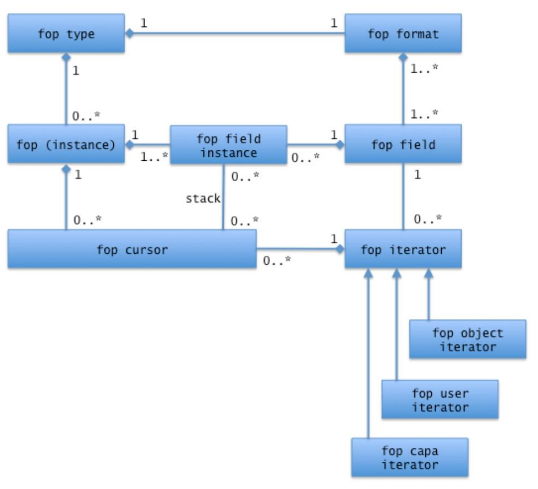
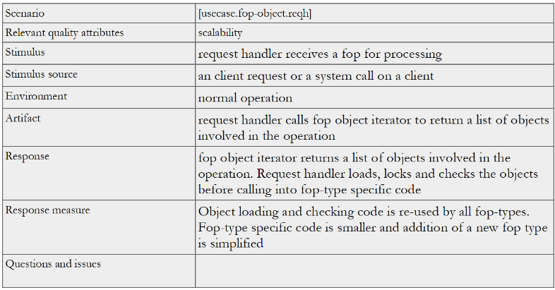
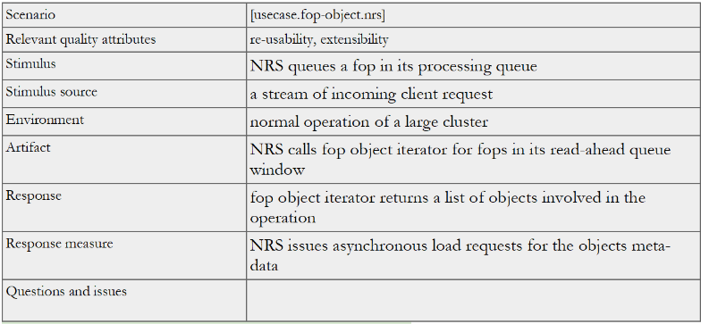

==========================
HLD of fop object Iterator
==========================

This document presents a high level design (HLD) of a fop object iterator. The main purposes of this document are: (i) to be inspected by C2 architects and peer designers to ascertain that high level design is aligned with C2 architecture and other designs, and contains no defects, (ii) to be a source of material for Active Reviews of Intermediate Design (ARID) and detailed level design (DLD) of the same component, (iii) to serve as a design reference document.

This component introduces an infrastructure for “generic fop methods”. To recall, a fop1 is a file operation packet, that contains fields describing a file system operation. Generic fop methods, described in the request handler HLD, allow common tasks such as authorization, authentication, resource pre-allocation, etc. to be done by the generic code (rather than in a per-fop-type way). This can be thought of as a more uniform and generic variant of habeo flags in Lustre 2.0 MDT.

*************
Definitions
*************

- a file operation packet (fop) is description of file system state modification that can be passed across the network and stored in a data-base;

- a fop belongs to one of fop types. E.g., there is a fop type for MKDIR, another for WRITE. A fop, belonging to a particular fop type is called an instance of this type;

- structure of data in instances of a fop type is defined by a fop format. A format defines the structure of instance in terms of fop fields. A data value in a fop instance, corresponding to a fop field in instance's format is called a fop field instance.

- for the purposes of the present specification, a file system object is something identified by a fid. A fop identifies objects involved in the operation by carrying their fids as field instances. A fid might be accompanied by a version number, specifying to which version of the object the operation is to be applied.

***************
Requirements
***************

- [r.fop-object.reqh]: the major requirements for the fop object iterator interface is to allow object handling code to be lifted from per-fop-type code into a generic request hander part;

- [r.fop-object.batch]: fop batching must be supported. For a batched fop, iterator should return the objects in component fops (recursively, if needed);

- [r.fop-object.ordering]: fop object iterator must return objects in a consistent order, so that request handler can deal with objects without risking dead-locks and without additional sorting pass.

******************
Design Highlights
******************

A fop format defines the structure of fields within a fop (of a given fop type). For each fop format, a list is maintained, enumerating format's fields identifying file system objects. This list is built statically when the fop format is constructed. A fop object iterator goes through this list, descending into sub-fields and sub-fops.

*************************
Functional Specification
*************************

Fop object iterator component exports a fop object cursor data-type. A cursor is initialized for a given fop instance.

Fop object cursor is used in the following ways (among others):

- by the Network Request Scheduler to asynchronously read-ahead objects involved into queued operations;

- by request handler generic code to load all the objects involved in the operation;

- by distributed transaction manager to check versions of objects against the versions specified in the fop.

To support flexible generic operations, a fop cursor returns some additional information associated with a fop field. E.g., a fop object cursor returns bit-flags indicating whether the object should be checked for existence (or non-existence), whether it should be locked.

*********************
Logical Specification
*********************

This pseudo-UML diagram describes the relationships between fop iterator related entities:

A fop object cursor keeps a stack of fop field instances, corresponding to the current cursor position in a (potentially multiply nested) batched fop.

Each fop field has associated with it an enumeration of sub-fields identifying file system objects (this enumeration is empty most of the time). To advance a cursor, the position in this enumeration for the top of the cursor field stack is advanced and the top is popped off the stack when end of the enumeration is reached.

Conformance
===============

- [r.fop-object.reqh]: with the help of fop object iterator, request handler can load all the objects in the generic code. With the addition of other iterators, such as fop user iterator, all authorization checks can be lifted into generic code;

- [r.fop-object.batch]: the design of fop object cursor, supports fop batching by recording a stack of positions in a cursor

- [r.fop-object.ordering]: the fop iterator assumes that objects are listed in a fop in the proper order.

Dependencies
=============

- fop

  - [r.fop.batching]: fops can be batched;

  - [r.fop.nrs]: fops can be used by NRS;

  - [r.fop.ordering]: fields in a fop are ordered so that fids occur in the desired order;

- fid: a file system object is identified by a fid;

***************
Scenarios
***************

Scenario 1

Scenario 2

***************
Rationale
***************

There are two obvious ways to implement iteration over fop fields:

- iterate over all field instances and skip all instances except for the required ones (e.g., except for field instances representing file system objects), or

- introduce additional data, associated with a fop format, enumerating all required fields.

The first approach allows for a greater degree of code sharing between various iterators (iterators returning lists of file system objects, users, capabilities, etc.) because "iterate over all field instances" part is common, but has a drawback of requiring multiple passes over every field instance in a fop. Given that fop iterators are used in the request handler hot code path, the second approach was selected.
