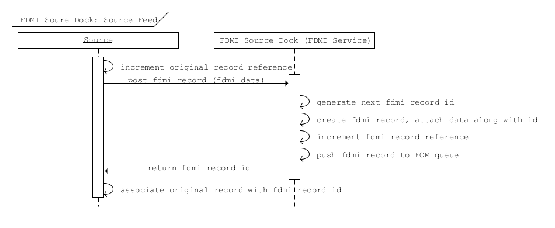
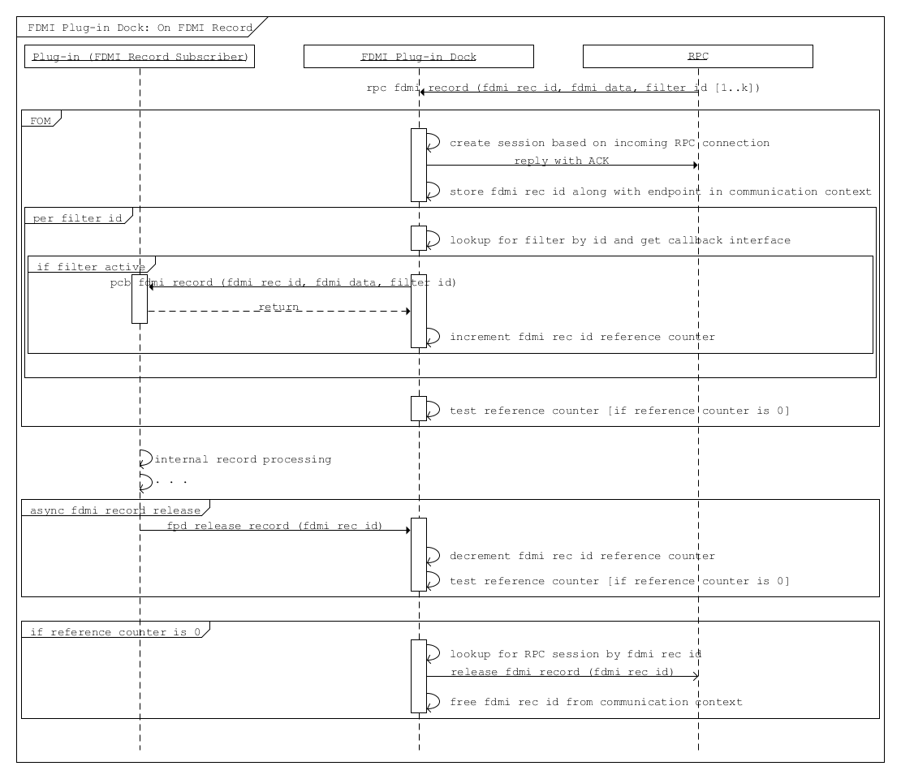

**HLD of FDMI**
===============

This document presents a High-Level Design (HLD) of Motr’s FDMI interface.

Introduction
------------

This document specifies the design of the Motr FDMI interface. FDMI is a part of the Motr product and provides an interface for the Motr plugins. It horizontally extends the features and capabilities of the system. The intended audience for this document includes product architects, developers, and QA engineers.

Definitions
-----------

-  FDMI: File Data Manipulation Interface

-  FDMI source

-  FDMI plugin

-  FDMI source dock

-  FDMI plugin dock

-  FDMI record

-  FDMI record type

-  FDMI filter

Overview
========

Motr is a storage core capable of deployment for a wide range of large-scale storage regimes from the cloud and enterprise systems to exascale HPC installations. FDMI is a part of Motr core, providing an interface for plugins implementation. FDMI is built around the core and allows for horizontally extending the features and capabilities of the system in a scalable and reliable manner.

.. Product Purpose 

.. Assumptions and Limitations

Architecture
=============

This section provides the architectural information including the below but not limited to:

1. Common design strategy including

   -  General approach to the decomposition

   -  Chosen architecture style and template if any

2. Key aspects and consideration that affect on the other design

FDMI Position in Overall Motr Core Design
-----------------------------------------

FDMI is an interface to allow the Motr Core to scale horizontally. The scaling includes two aspects:

-  Core expansion in the aspect of adding core data processing abilities, including data volumes as well as transformation into alternative representation. The expansion is provided by introducing FDMI plugins.

-  Initial design implies that the FOL records are the only data plugins that can process.

-  Core expansion in an aspect of adding new types of data that core can feed plugins. This sort of expansion is provided by introducing FDMI sources.

-  Initial design implies that the FOL record is the only source data type that Motr Core provides.

The FDMI plugin is linked with the Motr Core to make use of corresponding FDMI interfaces. It runs as a part of the Motr instance or service and provides various capabilities (data storing, etc.). The purpose of the FDMI plugin is to receive notifications from the Motr Core on events of interest for the plugin and further post-processing of the received events for producing some additional classes of service the Core currently is not able to provide.

The FDMI source is a part of Motr instance linked with the appropriate FDMI interfaces and allowing connection to additional data providers.

Considering the amount of data Motr Core operates, it is obvious that the plugin typically requires a sufficiently reduced bulk of data to be routed to it for post-processing. The mechanism of subscription provides data reduction to particular data types and conditions met at runtime. The subscription mechanism is based on a set of filters that the plugin registers in the Motr Filter Database during its initialization.

Source in its turn, refreshes its subset of filters against the database. The subset selects filters from the overall filters as per the knowledge of data types. The source feeds the FDMI as well as operations with the data that the source supports.

FDMI Roles
----------

The FDMI consists of APIs that implements particular roles as per the FDMI use cases. The roles are:

-  plugin dock, responsible for:

   -  plugin registration in FDMI instance

   -  Filter registration in Motr Filter Database

   -  Listening to notifications coming over RPC

   -  Payload processing

   -  Self-diagnostic (TBD)

-  Source dock (FDMI service), responsible for:

   -  Source registration

   -  Retrieving/refreshing filter set for the source

   -  Input data filtration

   -  Deciding on and posting notifications to filter subscribers over
      Motr RPC

   -  Deferred input data release

   -  Self-diagnostic (TBD)

FDMI plugin dock
-----------------

**Initialization**
~~~~~~~~~~~~~~~~~~

The application starts with getting a private FDMI plugin dock API allowing it to start communicating with the dock.

Further initialization consists of registering the number of filters in the filterd database. Every filter instance is given by the plugin creator with a filter ID unique across the whole system.

On the filter registration, the plugin dock checks filter semantics. If the filter appears invalid, the registration process stops.

**NB:**

The plugin performs the filter check at the time of registration, there can be errors in the run-time during the filter condition check. The criteria for filter correctness will be defined later. If the filter is treated as incorrect by the FDMI source dock, the corresponding ADDB record is posted and optionally HA will be informed.

.. NB:

.. TBD if we really need to determine the moment when all sources appear to be running filter sets consistent across the whole system. Currently we need to consider if plugin should be notified about this point.

**Data Processing**
~~~~~~~~~~~~~~~~~~~

The remote FDMI instance has the Source Dock role and provides data payload via the RPC channel. The RPC sink calls back the local FDMI instance has the plugin Dock role. Later, resolves the filter ID to plugin callback and calls the one passing the data to the plugin instance.

It may take some time for the plugin to do post-processing and decide if the FDMI record could be released. Meanwhile, the plugin instructs FDMI to notify the corresponding source to allow the particular FDMI record to be released.
   

**Filter “active” status**
~~~~~~~~~~~~~~~~~~~~~~~~~~

.. image:: Images/FDMI_Controlling_filter_status.png
   :alt: FDMI_plugin_dock_Plugin_deinitialization.png
   :width: 6.89583in
   :height: 4.10331in

The filter *active* status is used to enable/disable this filter from the database. The *active* status filter notifies all the registered sources. If the filter *active* status is set to false (filter is disabled), it is ignored by sources.

The application plugin can change filter *active* status by sending the *enable filter* or *disable filter* command for the already registered filter:

-  The Initial value of filter *active* status is specified during the filter registration

-  To enable/disable the filter, the application sends *enable filter* or *disable filter* request to the filter service. The Filter ID is specified as a parameter.

**De-initialization**
~~~~~~~~~~~~~~~~~~~~~

The plugin initiates de-initialization by calling the local FDMI. The latter deregisters the plugin’s filter set with filterd service. After confirmation, it deregisters the associated plugin’s callback function.

All the registered sources are notified about changes in the filter set if any occurred as the result of the plugin coming off.

FDMI source dock
----------------

**Initialization**
~~~~~~~~~~~~~~~~~~

\* TBD where to validate, on Source side or inside FDMI

The FDMI Source dock does not need explicit registration in filterd. Each FDMI source dock on start requests the filter list from the filterd and stores it locally.

In order to notify FDMI source dock about ongoing changes in filter data set, the Resource manager’s locks mechanism is used. Filters change notification: TBD. On read operation, the FDMI source acquires Read lock for the filterd database. On filter metadata change, each instance holding read lock is being notified.

On receiving filter metadata change notification, the FDMI source dock re-requests filter data set.

On receiving each new filter, the FDMI source dock parses it, checks for its consistency, and stores its in-memory representation suitable for calculations.

As an optimization, execution plan could be built for every added filter to be kept along with the one. As an option, execution plan can be built on every data filtering action to trade off memory consumption for CPU ticks.

**Input Data Filtering**
~~~~~~~~~~~~~~~~~~~~~~~~

\* In case of RPC channel failure, input data reference counter has to be decremented. See Deferred Input Data Release.

\*\* RPC mechanism is responsible for reliable data delivery, and is expected to do its best for re-sending data appeared to be stuck in the channel. The same way it is responsible for freeing RPC items once the connection found broken.

Steps (\*\*\*) and (\*\*\*\*\*) are needed to lock data entry during internal FDMI record processing. To make sure that the source would not dispose it before FDMI engine evaluates all filters. Step (\*\*\*), on the other hand, increases the counter for each record FDMI sends out. Matching decrement operation is not displayed on this diagram, it’s discussed later.

When input data identified by FDMI record ID go to Source, the latter calls local FDMI instance with the data. Once the data is arrived, the FDMI starts iterating through local filter set.

According to its in-memory representation (execution plan) each filter is traversed node by node, and for every node a predicate result is calculated by appropriate source callback.

**NB:**

It is expected that source will be provided with operand definitions only. Inside the callback the source is going to extract corresponding operand as per the description passed in. The predicate result is calculated as per the extracted and transformed data.

Note how the FDMI handles tree: all the operations are evaluated by the FDMI engine, and only get the atomic values from the FDMI record payload are delegated to Source.

When traversing is completed, the FDMI engine calculates the final Boolean result for the filter tree and decides whether to put serialized input data onto RPC for the plugin associated with the filter.

**Deferred Input Data Release**
~~~~~~~~~~~~~~~~~~~~~~~~~~~~~~~

The input data may require to remain preserved in the Source until the moment when plugin does not need it anymore. The preservation implies the protection from being deleted/modified. The data processing inside the plugin is an asynchronous process in general, and the plugin is expected to notify corresponding source allowing it to release the data. The message comes from the plugin to the FDMI instance hosting the corresponding source.

.. NB

.. TBD: We need to establish a way to resolve fdmi record identifier to FDMI instance hosting particular source. Most probably the identifier itself may contain the information, easily deduced or calculated.

**FDMI Service Found Dead**
~~~~~~~~~~~~~~~~~~~~~~~~~~~

When interaction between Motr services results in a timeout exceeding pre-configured value, the not responding service needs to be announced dead across the whole system. First of all confc client is notified by HA about the service not responding and announced dead. After being marked dead in confc cache, the service has to be reported by HA to filterd as well.

Interfaces
----------

1. FDMI service

2. FDMI source registration

3. FDMI source implementation guideline

4. FDMI record

5. FDMI record post

6. FDMI source dock FOM

   a. Normal workflow

   b. FDMI source: filters set support

   c. Corner cases (plugin node dead)

7. FilterD

8. FilterC

9. FDMI plugin registration

10. FDMI plugin dock FOM

11. FDMI plugin implementation guideline

FDMI Service
------------

The FDMI service runs as a part of Motr instance. The FDMI service stores context data for both FDMI source dock and FDMI plugin dock. The FDMI service is initialized and started on Motr instance start up, the FDMI Source dock and FDMI plugin dock are both initialised on the service start unconditionally.

TBD:

Later the docks can be managed separately and specific API may be provided for this purposes.

fdmi source registration
------------------------

The FDMI source instance main task is to post the FDMI records of a specific type to FDMI source dock for further analysis, Only one FDMI source instance with a specific type should be registered: the FDMI record type uniquely identifies FDMI source instance. A list of FDMI record types:

-  FOL record type

-  ADDB record type

-  TBD

The FDMI source instance provides the following interface functions for the FDMI source dock to handle the FDMI records:

-  Test filter condition

-  Increase/decrease record reference counter

-  Xcode functions

On the FDMI source registration all its internals are initialized and saved as FDMI generic source context data. Pointer to the FDMI source instance is passed to the FDMI source dock and saved in a list. In its turn, the FDMI source dock provides back to the FDMI source instance an interface function to perform the FDMI record posting. The FDMI generic source context stores the following:

-  FDMI record type

-  FDMI generic source interface

-  FDMI source dock interface

FDMI source implementation guideline
------------------------------------

The FDMI source implementation depends on data domain. Specific FDMI source type stores:

-  FDMI generic source interface

-  FDMI specific source context data (source private data)

Currently, the FDMI FOL source is implemented as the 1\ :sup:`st` FDMI source. The FDMI FOL source provides ability for detailed FOL data analysis. As per the generic FOL record knowledge, the *test filter condition* function implemented by the FOL source checks FOP data: the FOL operation code and pointer to FOL record specific data.

For the FOL record specific data handling the FDMI FOL record type is declared and registered for each specific FOL record type. For example, write operation FOL record, set attributes FOL record, etc.

The FDMI FOL record type context stores the following:

-  FOL operation code

-  FOL record interface

The FOL record interface functions are aware of particular FOL record structure and provides basic primitives to access data:

-  Check condition

On the FDMI FOL record type FDMI record registration all its internals are initialized and saved as FDMI FOL record context data. Pointer to FDMI FOL record type is stored as a list in FDMI specific source context data.

FDMI Record Post
----------------

Source starts with local locking data to be fed to the FDMI interface, then it calls post FDMI API. On the FDMI side a new FDMI record (data container) is created with new record ID, and posted data gets packed into the record. The record is queued for further processing to the FDMI FOM queue, and the FDMI record ID is returned to Source.

To process further calling back from the FDMI about a particular data (such as original record) the Source establishes the relation between returned FDMI record ID and original record identifier.

**NB:**

The Source is responsible for the initial record locking (incrementing ref counter), but the FDMI is responsible for further record release.

FDMI Source Dock FOM
--------------------

The FDMI source dock FOM implements the main control flow for the FDMI source dock:

-  Takes out posted FDMI records

-  Examines filters

-  Sends notifications to FDMI plugins

-  Analyzes FDMI plugin responses

**Normal workflow**
~~~~~~~~~~~~~~~~~~~

The FDMI source dock FOM remains in an idle state if no FDMI record is posted (FDMI record queue is empty). If any FDMI record is posted, the FOM switches to the busy state to take out the FDMI record from a queue and start the analysis.

Before examining against all the filters, the FOM requests filter list from filterc. On getting the filter list, the FOM iterates throw the filter list and examine the filter one by one. If the filter number is quite big, a possible option is to limit the number of filters examined in one FOM invocation to avoid task blocking.

To examine the filter, the FOM builds filter execution plan. The Filter execution plan is a tree structure, with expressions specified in its nodes.

Each expression is described by elementary operation to execute and one or two operands. The Operand may be a constant value, already calculated result of previous condition check or FDMI record specific field value.

The FDMI source dock calculates all expressions by itself. If some of the operands are the FDMI record specific field value, then the source dock executes callback provided by the FDMI source to get operand value.

Also, the operations supported during filter execution by the FDMI source dock can be extended. So the FDMI source can add new operation codes and corresponding handlers to support processing data types specific to the FDMI source. Operation overloading is not supported, if the FDMI source wants to define the multiplication for some “non-standard” type, it should add a new operation and handler for that operation.

If no filter shows a match for a FDMI record, the record is released. To inform the FDMI source that *this record is no more needed for FDMI system*, the FDMI generic source interface function *decrease record reference counter* is used.

If one or more filters match the FDMI record, the record is scheduled to be sent to a particular FDMI node(s). If several filters matched, the following operations are performed to optimize data flow:

-  Send the FDMI record only once to a particular FDMI node. Filter provides RCP endpoint to communicate.

-  Specify a list of matched filters, include only filters that are related to the node.

-  On receipt, the FDMI plugin dock is responsible for dispatching received FDMI records and pass it to plugins according to specified matched filters list

In order to manage the FDMI records I/O operations, the following information should be stored as the FDMI source dock context information:

-  Sent the FDMI record stored in a FDMI source dock communication context

-  Relation between destination Filter ID and FDMI record ID being sent to the specified Filter ID

   -  Map <Filter Id, FDMI record id> may be used in this case

   -  This information is needed to handle Corner case “Motr instance running “FDMI plugin dock” death” – see below.

The FDMI record is sent and serialized using FDMI generic source interface function *Xcode functions*

To send the FDMI record, its reference counter is increased: The FDMI generic source interface function *increase record reference counter* is used.

The FDMI source dock increments the internal FDMI record reference counter for the FDMI record sent for each send operation.

On the FDMI record receipt, the FDMI plugin dock should answer with a reply understood as a data delivery acknowledgement. The data acknowledgment should be sent as soon as possible – no blocking operations are allowed.

On the received data acknowledgement, the internal FDMI record reference counter for the FDMI record is decremented. If internal reference counter becomes 0, the FDMI record is removed from the FDMI source dock communication context.

After the FDMI record is handled by all involved plugins, the FDMI plugin dock should send the FDMI record release request to the FDMI record originator (FDMI source dock). On receiving this request, the FDMI source dock removes appropriate pair <Filter Id, FDMI record id> from its context and informs FDMI source that the record is released. FDMI generic source interface function *decrease record reference counter* is used for this purpose. If the FDMI source reference counter for a particular FDMI record becomes 0, FDMI source may release this FDMI record.

**NOTE**: What value should be returned if “Test filter condition” cannot calculate particular filter? “record mismatch” (legal ret code) or “some error ret code”?

**Filters set support**
~~~~~~~~~~~~~~~~~~~~~~~

FilterC ID is responsible for storing a local copy of the filters database and supporting its consistency. By request, FilterC returns a set of filters, related to the specified FDMI record type. Filter set request/response operation is simple and easy to execute because a pointer to local storage is returned. It allows the FDMI source dock to re-request filter set from FilterC every time it needs it without any resources over-usage. No additional actions should be done by the FDMI source dock to maintain filter set consistency.

**Corner cases**
~~~~~~~~~~~~~~~~

Special handling should be applied for the following corner cases:

-  Motr instance running *FDMI plugin doc*” death

-  FDMI filter is disabled

Motr instance running *FDMI plugin dock* death may cause 2 cases:

-  RPC error while sending the FDMI record to a FDMI source dock. No data acknowledgement received.

-  No *FDMI record release* request is received from FDMI plugin dock

If the RPC error while sending the FDMI record to a FDMI source dock appears, the FDMI source dock should decrement the internal FDMI record reference counter and the FDMI Source specific reference counter, the general logic described above. In this case all the FDMI record context information is stored in the communication context; it makes it obvious how to fill in parameters for interface functions calls.

The *FDMI record release* request is not received from the FDMI plugin dock case is not detected by FDMI source dock explicitly. This case may cause storing the FDMI records on the source during unpredictable time period. It depends on FDMI source domain: it may store FDMI records permanently until receiving from the plugin confirmation on the FDMI record handling. Possible ways to escape the described issue:

-  Based on some internal criteria, the FDMI source resets reference counter information and re-posts FDMI record

-  FDMI source dock receives notification on a death of the node running the FDMI plugin dock. Notification is sent by HA.

In the latter case the FDMI source dock should inform the FDMI source to release all the FDMI records that were sent to plugins hosted on the dead node. To do this, the context information stored as relation between destination Filter Id and FDMI record id <Filter Id, FDMI record id > is used: all the filters related to the dead node may be determined by EP address. The same handling that is done for “FDMI record release request” should be done in this case for all the FDMI records, bound to the specified filters id.

.. image:: Images/FDMI_source_dock_Deferred_input_data_releases.png
   :alt: FDMI-source-dock--Deferred-input-data-release
   :width: 6.89583in
   :height: 3.375in

The FDMI filter may be disabled by plugin itself or by some 3\ :sup:`rd` parties (administrator, HA, etc.). On the filter state change (disabling the filter) a signal is sent to FDMI source dock. Upon receiving this signal, the FDMI source dock iterates through the stored map <Filter Id, FDMI record id> and check each filter status. If a filter status is found to be disabled, the same handling that is done for “FDMI record release request” should be done for all the FDMI records, bound to the specified filter id.

FilterD
-------

The FDMI plugin creates a filter to specify the criteria for FDMI records. The FDMI filter service (filterD) maintains a central database of FDMI filters available in the Motr cluster. There is only one (possibly duplicated) Motr instance with filterD service in the whole Motr cluster. The FilterD provides users read/write access to its database via RPC requests.

The FilterD service starts as a part of chosen for this purpose Motr instance. Address of FilterD service endpoint is stored in confd database. The FilterD database is empty after startup.

The FilterD database is protected by distributed read/write lock. When the FilterD database needs to changed, the filterD service acquires exclusive write lock from the Resource Manager (RM), thus invalidating all read locks held by database readers. This mechanism is used to notify readers about the filterD database changes, forcing them to re-read database content afterwards.

There are two types of filterD users:

-  FDMI plugin dock

-  FDMI filter client (filterC)

FDMI filter description stored in database contains following fields:

-  Filter ID

-  Filter conditions stored in serialized form

-  RPC endpoint of the FDMI plugin dock that registered a filter

-  Node on which FDMI plugin dock that registered a filter is running

FDMI plugin dock can issue following requests:

-  Add filter with provided description

-  Remove filter by filter ID

-  Activate filter by filter ID

-  Deactivate filter by filter ID

-  Remove all filters by FDMI plugin dock RPC endpoint

Also there are other events that cause some filters deactivation in database:

-  HA notification about node death

Filters stored in database are grouped by FDMI record type ID they are intended for.

FilterD clients can issue following queries to filterD:

-  Get all FDMI record type ID’s known to filterD

-  Get all FDMI filters registered for specific FDMI record type ID

**NB:**

Initial implementation of filterD will be based on confd. Actually, two types of conf objects will be added to confd database: 

- Directory of FDMI record types IDs
- Directory of filter descriptions for specific FDMI record type ID.

This implementation makes handling of HA notifications on filterD impossible, because confd doesn’t track the HA statuses for conf objects.

FilterC
-------

FilterC is a part of Motr instance that caches locally filters obtained from filterD. The FDMI source dock initialize the FilterC service at its startup.

Also, the FilterC have a channel in its context which is signaled when some filter state is changed from enabled to disabled.

The FilterC achieves local cache consistency with filterD database content by using distributed read/write lock mechanism. The FilterD database change is the only reason for the FilterC local cache update. The HA notifications about filter or node death are ignored by the FilterC.

**NB:**

The initial implementation of the FilterC will be based on confc. So the confc will cache filter descriptions locally. In that case implementation of the FilterC channel for signaling disabled filters is quite problematic.

FDMI Plugin Registration
------------------------

-  Filter id:

   -  Expected to be 128 bits long

   -  Filter ID is provided by plugin creator

   -  Providing filter ID uniqueness is a responsibility of plugin creator

   -  Filter id may reuse m0_fid structure declaration

**TBD:**

A possible situation when the plugin is being notified with the Filter ID and already announced inactive, which change did not reach the source to the moment of emitting notification. Should the id be passed to the plugin by FDMI?

Another thing to consider on: what should be done by the FDMI in case the filter ID arrived in notification is unknown to the node, i.e. no match to any locally registered filter rule encountered?

A complimentary case occurs when plugin was just fed with the FDMI record and did not instructed the FDMI to release the one yet. Instead, it declares the corresponding filter instance to be de-activated. Current approach implies that plugin is responsible for proper issuing release commands once it was fed with the FDMI record, disregarding filter activation aspect.

FDMI Plugin Dock FOM
--------------------

Received FDMI record goes directly to plugin Dock’s FOM. At this time a new session for re-using the incoming RPC connection needs to be created and stored in communication context being associated with **FDMI Record ID**. Immediately at this step RPC reply is sent confirming FDMI record delivery.

Per filter ID, the corresponding plugin is called feeding it with FDMI data, the FDMI record ID, and filter ID specific to the plugin. Every successful plugin feed results in incrementing the **FDMI Record ID** reference counter. When done with the ids, the FOM needs to test if at least a single feed succeeded. In case it was not successful, i.e. there was not a single active filter encountered, or plugins never confirmed FDMI record acceptance, the FDMI record has to be released immediately.

The plugin decides on its own when to report the FDMI original record to be released by the Source. It calls the plugin dock about releasing a particular record identified by the FDMI record ID. In the context of the call FDMI record reference counter is decremented locally, and in case the reference counter gets to 0, the corresponding Source is called via RPC to release the record (see Normal workflow, FDMI Source Dock: Release Request from plugin).

FDMI Plugin Implementation Guideline
------------------------------------

The main logic behind the use of the FDMI plugin is a subscription to some events in sources that comply with conditions described in the filters that the plugin registers at its start. In case some source record matches with at least one filter, the source-originated record is routed to the corresponding plugin.

**plugin responsibilities**
----------------------------

**During standard initialization workflow plugin:**
~~~~~~~~~~~~~~~~~~~~~~~~~~~~~~~~~~~~~~~~~~~~~~~~~~~~

-  Obtains private plugin Dock callback interface

-  Registers set of filters, where filter definition:

   -  Identifies the FDMI record type to be watched

   -  Provides plugin callback interface

   -  Provides description of condition(s) the source record to meet to invoke notification

**NB:**

Condition description syntax must follow the source functionality completely and unambiguously. Source of the type specified by filter description must understand every elementary construct of condition definition. This way the evolution of filter definition syntax is going to be driven by evolution of source functionality.

**NB:**

The source is responsible for validation of filter definition. This may result in deactivating filters that violate syntax rules the particular source supports. The facts of syntax violation ideally must become known some way to Motr cloud admin staff.

-  Starts subscription by activating registered filters. Opaquely for the plugin the filter set is propagated among Motr nodes running FDMI Source Dock role which enables source record filtering and notifications.

**During active subscription workflow looks like following:**
~~~~~~~~~~~~~~~~~~~~~~~~~~~~~~~~~~~~~~~~~~~~~~~~~~~~~~~~~~~~~

-  Plugin is called back with:

   -  FDMI record id

   -  FDMI record data

   -  Filter ID indicating the filter that signaled during the original source record processing

-  Plugin must keep trace of FDMI record (identified by FDMI record id globally unique across the Motr cloud) during its internal processing.

-  Plugin must return from the callback as quick as possible to not block other callback interfaces from being called. plugin writers must take into account the fact that several plugins may be registered simultaneously, and therefore, must do their best to provide smooth cooperation among those.

-  However plugin is allowed to take as much time as required for the FDMI record processing. During the entire processing the FDMI record remains locked in its source.

-  When done with the record, plugin is responsible for the record release.

-  Plugin is allowed to activate/deactivate any subset of its registered filters. The decision making is entirely on plugin’s side.

-  The same way plugin is allowed to de-register and quit any time it wants. The decision making is again entirely on plugin’s side. After de-registering itself the plugin is not allowed to call private FDMI plugin Dock in part of filter activation/deactivation as well as FDMI record releasing. The said actions become available only after registering filter set another time.

**Implementation Plan**
=======================

**Phase 1**

1. Implement FDMI service

2. FDMI source dock

   a. FDMI source dock API

   b. Generic FDMI records handling (check against filters, send matched records (only one recipient is supported))

   c. Handle FDMI records deferred release

3. FOL as FDMI source support

   a. Generic FDMI source support

   b. Limited FOL data analysis (operation code only)

4. Filters

   a. Simplified filters storing and propagation (use confd, confc)

   b. Static filter configuration

   c. Limited filtering operation set

   d. Generic filters execution

5. FDMI plugin dock

   a. FDMI plugin dock API

   b. Generic FDMI records handling (receive records, pass records to target filter)

6. Sample echo plugin

**Backlog**

1. Filters

   a. FilterD, FilterC

   b. Full filtering operation set

   c. Register/deregister filter command

   d. Enable/disable filter command

   e. Filter sanity check

   f. Query language to describe filters

2. FDMI Source dock

   a. Multiple localities support

   b. Filters validation

   c. FDMI kernel mode support

   d. Support several concurrent RPC connections to clients (FDMI plugin docks)

3. FDMI Plugin dock

   a. Filter management (register/enable/disable)

4. HA support (node/filter is dead) in:

   a. FDMI source dock

   b. FDMI plugin dock

   c. Filters subsystem

5. FOL as FDMI source support

   a. FOL data full analysis support

   b. Transactions support (rollback/roll-forward)

6. ADDB diagnostic support in both FDMI source dock and plugin dock

7. ADDB as FDMI source support
