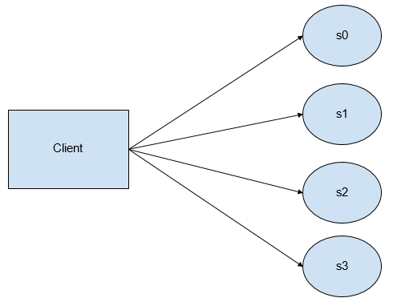
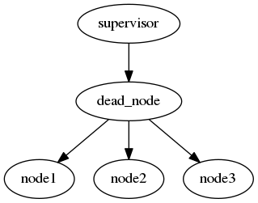

===============================================
HLD of Function Shipping and In-Storage Compute
===============================================

This document presents a High-Level Design (HLD) of the function-shipping (in-storage compute) subsystem of Motr.

The main purposes of this document are: 

- To be inspected by the Motr architects and peer designers to ascertain that HLD is aligned with Motr architecture and other designs and contains no defects.

- To be a source of material for Active Reviews of Intermediate Design (ARID) and Detailed-Level Design (DLD) of the same component.
  
- To serve as a design reference document.

The intended audience of this document consists of Motr customers, architects, designers, and developers.

Introduction
============

This document describes a framework for the client nodes to offload computations (or ship them) on the Motr-controlled storage nodes. In a traditional distributed file system, the data moves to the computation. This document provides a method to move the computation to the data. 

This document also defines the programming model and the shippable functions that must use.

Definitions
===========

-  Function-Shipping Subsystem: The subsystem described in this document.

-  In-storage Compute Subsystem: Another name for the function-shipping subsystem.

-  Distributable Function (or distributable computation): A function that conforms to a restricted model. This model allows the computation to be distributed and run in parallel on the storage cluster. 

   **NOTE:** This can also be called a shippable computation. However, this term may be confusing as the actual shipping is done by the function registration mechanism. These functions are in fact not necessarily distributable.

-  Offloaded Function (offloaded computation): A distributable computation which is shipped and running on the storage cluster. In other words, an offloaded computation is a running instance of a distributable computation.

Notations
---------

-  We write [x] for a bag of x .

-  The empty bag is denoted [] .

Requirements
============

Horizontal scalability
----------------------

A system features horizontal scalability if its performance increases linearly (or quasi-linearly) with the number of components. An ideal storage cluster should scale horizontally. This means the capacity and the bandwidth should increase linearly with the number of nodes. However, the network bandwidth may not be scaled proportionally with the number of nodes. If the observed trends continue, this situation will occur in exascale systems. In fact, the JASON group forecasts that due to this imbalance in the exascale systems, it will only be possible to run applications that require a small working set size relative to computational volume [1]_.

Fortunately, many useful computations are data-local. The computation is data-local when a portion of the input can be processed independently of the rest of the input [2]_. Whenever a computation is data-local, it satisfies the criterion spelled out by the JASON group. Indeed, the working set can be made sufficiently small by processing only a sufficiently small portion of the input at a time.

In fact, every data-local computation:

1. Can be carried out locally, where the data is stored. Thus, the overhead due to data transfer can be minimized.

2. Can run in parallel, maximizing the total storage bandwidth and the usage of processing units.

The primary function of the in-storage compute subsystem is to provide horizontal scalability by supporting the distribution and execution of data-local computations in the storage cluster. Such scalability is a critical feature for a storage system aiming to reach the exascale.

Support for Arbitrary Layouts
-----------------------------

The layout of data processed by the offloaded functions is arbitrary. In other words, the physical location of the data (typically) does not match its logical structure. For example, even though a given data set may be divided in records, any given record may be split between two storage nodes. For some other data sets, records are big enough that it is beneficial to split them across several nodes to increase bandwidth.

Supporting of arbitrary layouts is critical for ‘fourth paradigm’ [3]_ the scientific applications; namely the *post-hoc* analysis of experimental data. Indeed, the definition of the analysis procedure is not known at the time of recording experimental data; thus the best layout of data on disk cannot be dictated by the needs of the analysis.

Support for Writing Outputs in place
------------------------------------

In certain cases, the computation executed locally will not significantly decrease the amount of data to transfer on the network. Offloading such computations may make sense anyway if the output is to be written locally on each node (for example for processing in a subsequent phase).

Integration with HSM
--------------------

Data transformation
~~~~~~~~~~~~~~~~~~~

A specific use-case motivating the above requirement for writing outputs in place is when a function is applied to a file as it is being moved between tiers, for HSM purposes. Indeed, when the HSM subsystem triggers a copy, it may want to apply filtering of data, compression –– or any form of custom transformation.

Informing HSM
~~~~~~~~~~~~~

The data usage (or data usage patterns) made by the queries executed by the function-shipping subsystem should be made available to the HSM subsystem. To do so, the function-shipping subsystem should use the same API as other subsystem (e.g. regular I/O). [TODO: what should this API be? (It does not exist as of May 2016.)]

Non requirement: taking advantage of SAGE layers
~~~~~~~~~~~~~~~~~~~~~~~~~~~~~~~~~~~~~~~~~~~~~~~~

Some functions may be more computationally intensive as others. As such, it may make sense to execute them on a 'low-level' tier (with less storage but higher computational capabilities). However, it is not the responsibility of the function-shipping subsystem to move the data. The data should be moved by other means (e.g. HSM, containers, ...) prior to running the computation on the storage cluster.

Resilience
----------

Components of the network storage may be brought down (and possibly brought back up) during operations, including during the execution of an offloaded function on a storage nodes. Such components include disks, nodes, network connections, etc. 

Accessing data via the function-shipping subsystem must offer the same level of resiliency as accessing it via regular I/O operations. That is:

1. If any result is reported to the client or stored back to storage, the observed result must not be affected by failures that would not affect regular I/O. Note in particular that malfunctioning hardware may return data which is incorrect. A consequence of such a failure is that the reported data is wrong. Such hardware errors will compromise function-shipping correctness as well. [TODO: (Probably we do not want to have error correction?)]

2. Furthermore, if a regular read operation would succeed on a given data set and a given set of failures, then a computation over the same data set and assuming the same set of failures should report a result.

Additionally, when results are written back to storage, any change must be performed in a transaction.

Security
--------

Assuming that a node runs the function-shipping subsystems, it may be running application code. This application code cannot be trusted:
whatever this code is, it must not be able to compromise the node in question (and *a-fortiori* of the rest of the storage cluster). Specifically, confidentiality, integrity and availability must not be compromised.

Confidentiality
~~~~~~~~~~~~~~~

The application code may access only the data relevant to the computation to be performed, namely the inputs provided by the application, either directly or indirectly, via the files that the offloaded function is intended to process.

Integrity
~~~~~~~~~

The application code may not corrupt or otherwise modify the state of the node, except to the extent of reporting results. (Harmless side effects such as writing to debugging logs are of course allowed, to the extent that they do not otherwise compromise availability or confidentiality.)

Availability
~~~~~~~~~~~~

Running the application code may only use up a reasonable amount of resources of the node, so that it continues to be available for other operations during the run of the offloaded function. Consequently, system policies may throttle the resource consumption of offloaded functions. The policies supported will be the same as those supported in general by Motr services.

The security requirements cannot be fulfilled by solely relying on a time-consuming review process of application code by the storage cluster administration.

The rationale is that some applications will require a short code-deploy-execute cycle. For example, when developing a new application, the programmer will typically repeat the following cycle of operations at short intervals:

1. Write (or modify) a computation to offload

2. Deploy the function on the storage cluster

3. Run the application and realise it has problems which require to repeat the cycle.

In such a scenario, the time to deploy a new function should be in the order of minutes (at most), while the code-review process may take of the order of days.

Resource release
----------------

The run-time of the offloaded function may span indefinitely after the request is completed. That is, under normal conditions if the user cancels their request, all the currently running offloaded functions related to the request should be terminated and the corresponding resources freed. There may be an acceptable delay between the time of termination of the request and the completion of the termination. This delay corresponds to the amount of time necessary to propagate the termination message and run the necessary operations on each server.

.. [TODO: what should be a reasonable (distribution) bound for this time?]. (This feature is particularly useful when a user mistakenly offloaded an extremely resource-hungry computation.)

Performance requirements 
------------------------

The performance of the in-storage compute facility should be dictated primarily on the one side by the performance of the offloaded functions themselves and on the other side by the performance of the IO subsystem as a whole.

The overhead incurred by the in-storage compute infrastructure in itself should be minimal. This overhead should be inferior to the overhead of the `Flink <https://flink.apache.org>`__ [4]_ [TODO: which version] data-flow engine.

The measurement should be performed as follows:

-  The offloaded function should ignore the data read off disk (make no actual computation)

-  The total time to run the query should be measured 

.. TODO: how many samples

The result should be less than that the equivalent query run via Flink 
.. TODO: how do we compare the distributions? Perhaps compare median, 10%, 1%, 0.1% times?

.. TODO: the comparison with Flink may turn out to be difficult to implement as we may risk comparing apples to oranges. Not sure how to do better though.

.. TODO: when we have a benchmark protocol, this should be moved there.

Design highlights
=================

The overall idea of in-storage compute is compute *f(d)*, where *f* is a function dependent on the application, and *d* is some data distributed on the storage cluster. If the data is distributed across the servers *s0* to *s3*, then the picture may look as follow:

The box represents the client node (a Motr client process running on it). The ellipses represent the server nodes (processes). Arrows represent network communication channels. The direction of arrows corresponds to the direction of requests. The servers send replies in the opposite direction. The client will request for each server the computation of a *part* of *f(d)*. Each server will communicate the partial result to the client. These results will aggregate partial results into a value equal to *f(d)*.

The principal difficulty of distributing the computation is that the distribution of data across the servers is determined by the layout algorithms within the Motr. Thus, the function *f* must be (re-)expressed using a restricted programming model, described in detail in a dedicated section. The key features of this programming model are:

- Each piece of data can be processed independently (so each server can process the data that it hosts concurrently)
- The intermediate results can be recombined using an associative (but not necessarily commutative) function. (A commutative function would not allow to take into account the order of the data in the file to determine the final result. This restriction is problematic if the file can be split between servers at arbitrary boundaries.)

While the programming model itself is restricted (by the requirements imposed on the system), the application is (to a large degree) free to use whatever technology to implement of the functions themselves. The in-storage compute subsystem require the application to provide plugins supporting a low-level interface. However, this interface is simple enough to allow an implementation using whatever language is most convenient (Python, C++, R, etc.). It is even possible to delegate the execution to a sandboxed environment, such as a virtual machine.

Functional Specification
========================

Overview
--------

-  The application programmers will describe a computation using the notion of 'distributable computation', described below. To do so, programmers are directed to the user-manual. 

.. TODO: reference it (when it's written)

-  Motr will provide a service allowing to distribute, run and report the results of applying such a distributed computation to a given file.

Modes of operation
------------------

Any distributable computation may operate in either of the two following modes:

- Read only: The system applies the computation to an object and returns the results to a client.

- Read/write: The system applies the computation to an object and writes the result back on the file-system.

Distributable computation
-------------------------

In this section we rigorously characterise the interface that a distributable computation must respect, using mathematical notation.
We will impose constraints on what an application may supply as a distributable function. In return, we specify the result that the function-shipping subsystem will provide when it runs such a function.

In the rest of the section we abstract over the inputs and outputs of the function. If *s* is a distributable computation which maps a sequence of *i* to a bag of *o*, we write *s : i ⇒ o* .

Examples:

-  Typically *i = MotrBlock* where *MotrBlock* is a Motr block of data.

-  When doing a search, the type *o* will be an occurrence of the data being searched (and/or the location thereof).

   **Note:** if the client wishes to impose a logical order over outputs, it may do so by letting *o* be a pair of an item and an index.

-  When the output data to be written in place (see “Modes of operations” above), *o* will be a pair of a Motr block and a logical address where the block will be written (typically, this address may be a file identifier and a block-index within that file). In this situation the output blocks should not be overlapping.

Components
~~~~~~~~~~

A distributable computation *s : i ⇒ o* is a tuple *(M,u,∘,e,d)* where:

-  *M* is a set whose elements represent intermediate results

-  *u : (Index × i) → M* is a function computing an intermediate result on a block. An *Index* is the index of the data inside the object.

-  *(∘) : (M × M) → M* is a function combining two intermediate results

-  *e : M* is the intermediate result for the empty input

-  *l : M → (M × [o])* is a function which tries to extract a part of the result from an intermediate result. (If no result can be extracted the returned bag is empty.)

-  *ω : M → [o]* is a function extracting the results from an intermediate result corresponding to the whole input. (This intermediate result will not be further combined.)

   **Note:** intermediate results (*M*) may have a richer structure than the final Output. This flexibility is critical when implementing certain distributed functions.

Laws
~~~~

Additionally, the above values must satisfy the following laws:

-  *(∘)* is associative and *e* is its unit. In other words, the tuple *(M,∘,e)* is a monoid.

-  *l(e) = (e,[])* . There is no output to extract from the empty intermediate result.

-  If *(x',x\ o) = l(x)*, then *x' = x* iff *x\ o* is empty. That is, the extraction function is the identity on M if, no result can be extracted.

-  The *l* function extracts as much as possible. That is: if *(x',x\ o) = l(x)* then *l(x') = (x',[])* .

-  Local extraction is monotonous with respect to combination. That is:

   -  let

      *(x',x\ o) = l(x) ;*

      *(y',y\ o) = l(y) ;*

      *(z'',z\ o') = l (x' ∘ y') ;*

      *(z',z\ o) = l (x ∘ y) :*

   -  then *z'' = z'* and *z\ o = x\ o + z\ o' + y\ o*

-  Final extraction is monotonous: if *(x',x\ o) = l(x)* then *ω(x') + x\ o = ω(x)*

Output
~~~~~~

Given a sequence of input parts *b\ 0* to *b\ n-1*, the system will compute *ω(r\ n)* where

-  *r\ 0 = e*

-  *r\ i+1 = r\ i ∘ u(i,b\ i)*

The monoid structure ensures that the data can be computed locally and combined in a way that follows the structure of the storage cluster, rather than using a strict left-to-right order. The extraction laws ensure that extraction of partial results can be performed locally (on any partial result) instead of when the final intermediate result is aggregated.

-  In the ‘read only’ mode of operation, the bag *ω(r\ n)* is sent to the client.

-  In the ‘read/write’ mode of operation, the bag *ω(r\ n)* is not sent to the client. Instead, each of the elements of the bag (which in this case must take the form (blockData,(fid,blockIndex)) will be written on the filesystem.

TODO Hints
~~~~~~~~~~

Additionally, a distributable computation should be able to provide hints such as:

-  How expensive computations are (memory and CPU) in flop/byte.

-  How much memory is used to compute data in byte of working memory for each byte of input.

-  In fact, the above two hints should be functions of the form *h(x) = k\ 1 x + k\ 2*\ log\ *(x) + k\ 3.* The rationale is that if the consumption is higher that linear then the function is not data-local.

Discussion: why use bags as output?
~~~~~~~~~~~~~~~~~~~~~~~~~~~~~~~~~~~

One may wonder why the algebraic definition of the distributable computation does not support ordered outputs, while it would be only a relatively modest complication.

The use cases for having several outputs are sending early results to the client or writing output locally.

In the case of sending early results to the client, the client wants to process the results as early as possible, regardless of where the results correspond to in the input.

If one wishes to maintain an order of results, in most cases it is easy to just pair the ‘actual’ results with the corresponding index in the input. For example, when performing a search, one will report the position of the occurrences.

When writing outputs locally, the pairing technique is used too (see the logical specification).

Turning applications into distributable computations
~~~~~~~~~~~~~~~~~~~~~~~~~~~~~~~~~~~~~~~~~~~~~~~~~~~~

The above definition is a precise specification of the interface that distributable computations must follow. It is not a pedagogical document explaining how to write applications using the model of a distributable computation. For this purpose, readers are referred to the function-shipping user manual. [TODO]

Registered computation
----------------------

-  Motr will be extended with a service to register arbitrary computations, on any given node set. 

.. TODO: is a node-set a notion that already exists? Containers? What if the node set does not contain the data?] A registered computation will be addressable by an id, allocated by the registration mechanism itself. [TODO: Function-shipping can only work if the function is registered on all nodes; or at least all nodes of a given container.

-  The registration request will come with a certificate that the function to register respects the safety requirements specified in the above section. This certificate is cryptographic. This certificate will be issued by the cluster administration authority. The programmatic interface that the function must comply to is defined in the next subsection. 

.. TODO: do we care about revocation of certificates?

-  Once registration is completed, the registration ID will identify the function uniquely. The identifier will be valid for the remainder of the lifetime of the system. The registration mechanism will guarantee that a given ID will identify the registered function uniquely.

-  A registered function may be un-registered, by identifier. Once the release request has been issued, current and future requests to execute the given function may fail. Should such failure occur, security will not be more compromised than if the function would not have been unregistered.

C-level shippable computation
-----------------------------

The main difference between the mathematical definition of distributable computation given above and its implementation is that a concrete distributable computation must take an environment as parameter. This parameterisation is critical because most concrete distributable computations will depend on an environment that changes from run to run.

The environment can be used for many purposes, because it is up to each individual distributable computation to interpret the environment.

For example, consider a function performing the multiplication of a given vector with a matrix, when the matrix is stored on the cluster and the vector varies between queries. In this situation, one does not want to register a new function every time one uses a new vector. The environment can then contain the vector in question, and thus be used to transmit a new vector for each query.

Another example is when the distributable computation is actually realised by interpretation of another language. For example, LLVM bytecode or special-purpose bytecode. In this case the environment can be a library encoded in the chosen bytecode (a set of entry points and an embedded bytecode-level environment).

A final example is that the environment may be an identifier for a function running itself in a protected context (For example, a VirtualBox virtual machine or Chrome Native Client). The registered computation will then just be a shim forwarding data back and forth between Motr and the sandbox.

.. TODO: how to do the dynamic linking? What is the format? dlopen?

The binary interface for the distributable computation is the ABI of the distributable_t type below.

.. TODO: platform?]

.. code-block:: C

  typedef u8\* env_t;

  typedef u8\* m_t; // intermediate (buffer) type

  typedef u8\* i_t; // input (buffer) type

  typedef u8\* o_t; // output (buffer) type

  struct distributable {

    m_t (*unit) (env_t,index_t, i_t);

    m_t (*combine) (env_t,m_t,m_t);

    m_t (*empty)(env_t);

    m_t (*local_extract)(env_t,o_t);

    void (*global_extract)(env_t,o_t);

  }

//typedef struct distributable\* distributable_t (env_t*);

typedef struct distributable distributable_t;

Here we use a naming convention fitting that of C. The correspondence between C-level functions and mathematical model is the following.

============== ========
**C**          **Math**
unit           u
combine        ∘
empty          e
local_extract  l
global_extract ω
============== ========

.. TODO: this should probably be moved to another document (DLD? Function shipping manual?) --- yet I leave it here until that document is created.

.. TODO: Should the function make_distributable be allowed access to Motr functions ? If so the interface should be defined. We need at least:

-  Allocation of memory

-  De-allocation

**Note:** The user may not rely on any of the number of times that the above functions being run any given number of times, or on any given location. Indeed, if a fault happens, functions need to be restarted, or the whole computation may be cancelled. Therefore, it is advised not to run harmful side effects from these functions. Harmful side effects include committing object data to the disk. Non-harmful effects include logging.

Form of the offloading request
------------------------------

Every offloading request made to the storage cluster (as a whole) should contain:

-  The mode of operation (read only or read/write)

-  An identifier to the C-level distributable computation to execute

-  And environment suitable for the above function

-  The identifier of the object to apply the function on

-  The range (within the object) to consider, as a pair of a starting block index and an ending block index.

-  A transaction from within the request should be executed

Operational Behaviour
---------------------

The outline of the operational behaviour of the cluster should be as follows, and it is detailed in the logical specification section of this document.

-  The client (on the compute cluster) makes and offloading request to the Motr library.

-  The Motr library issues one or several requests to the storage nodes containing the relevant data.

-  The storage nodes evaluate the relevant parts of the requests. If an error occurs, it should be recovered.

-  Each node writes the result locally and/or reply to the client depending on the mode of the request.

Logical Specification
=====================

.. TODO: registration of functions

Computation of Results: Overview
--------------------------------

This section describes (from a high-level view) how to run a distributed computation on the storage cluster. We assume a distributable computation (M,u,∘,e,d) , and an object composed of blocks b\ :sub:`0` to b\ :sub:`n-1` , distributed on the storage cluster.

We first assume that no error happens (error recovery is described below) and a single client communicates directly with the servers.

The client requests the layout information via the metadata service. This turns the logical range in the original object into a sequence of ranges into component objects and the addresses of servers where these component objects are located.

-  It sends a partial offloading request to each of the servers hosting the data blocks. The partial offloading request consists of a the ranges of data to perform the computation over and a computation.

   -  Each range consists of a physical range of data on disk and plus an index in the original file.

   -  The computation consists of a registered function identifier and an environment.

-  To compute a result, *u* is run locally (on servers) for each input block. These computations can be run concurrently.

-  Intermediate (consecutive) results can be combined (using (∘)) as they become available. The combinations can be run either on the servers or on the client. These computations can also be run concurrently.

.. TODO: in case of long-lived queries intermediate liveness proofs should be sent.

   **Note:** Associativity and the laws of *l* ensure that the blocks can be treated independently, and that several combinations can be run concurrently, with no influence on the final result.

-  Finally, results can be extracted. Results can be extracted either on the client using ω or on servers using *l*. Local extraction is preferred, as it makes intermediate results available early.

.. TODO: diagram, see outbox/search-two-disks.pdf

Writing Back In-Place
---------------------

.. TODO: how do we arrange for a copy to be done 'all within Motr'? This task may be similar to what happens when HSM performs the copy of a file.

In the read/write mode of operation, the final output of the shippable computation is a bag of pairs of an address and a block of data. The address is a pair of a FID and the index of the block inside the object designated by the FID.

The output blocks should be extracted using the *l* function before reporting any intermediate results. This minimizes the amount of data transfer. Thus obtained blocks are then written locally on the node which extracted the output. 

.. TODO: Designate nodes to reconstruct the parity blocks. Can we reuse an existing Motr component for this?

Distribution of Aggregation
---------------------------

In fact, the servers should not necessarily send the intermediate results back immediately to the client, but to another server instead. This ensures that the client does not need to handle too much data (see the analysis below). Indeed, the computation of aggregates may use too much computational, storage, or networking resources for a single node, and therefore may need to be distributed as well.

In this case, the shape of the aggregation network is a tree. The aggregation tree is computed as follows.

.. TODO: Do we have an underlying topology to map to in Motr configuration?

We assume a tree t\ :sub:`0` of corresponding to the network topology of the storage cluster. (Leaves are storage nodes and nodes are switches). Consider n\ :sub:`i` all the nodes containing data (including parity data) for the query. Let t\ :sub:`1` be the tree of the unions of the paths from the root of t\ :sub:`0` to each n\ :sub:`i`.

For each non leaf node n in t\ :sub:`1`, we compute:

-  input n = sum {output n \| n ∈ children n}

-  assignedWorkers n = input n / threshold

-  output n = if assignedWorkers n > 0 then aggregateLeftOverEstimate else input n

Workers assigned from a node n should be taken from a pool of nodes attached to n. These nodes should have sufficient computation capability. 

.. NOTE: In the case of SAGE, I understand that the tier 0 nodes are attached to the 'main' switch, and they should be the workers in question.

The requests is sent to (the children of) the root only. The request includes the aggregation sub-tree rooted at the receiving server.

.. TODO: not precise 
 
Each node forwards the request to its children.

TODO Function registration mechanism
------------------------------------

Proposal:

-  Store the bulk of the computation (signed code and static data) as a regular Motr object.

-  Register the FID of the object (plus relevant meta-data), as well as an epoch referring to a specific version of the object. The registration should probably be done with the configuration server so that all nodes have a consistent view of the registered functions.

-  To make sure that all nodes have quick access to a version of the code, we should probably use a caching mechanism. Perhaps this is already supported within Motr?

Error Recovery
--------------

-  A key concept is that the servers should provide proofs of liveness. i.e., whenever a server is running a computation it should periodically inform a supervising authority that it is alive.

-  If the computation tree is flat, it is the client which is the supervising authority for all servers. 

.. TODO: If the output is supposed to be written back in place, what is the authority?

-  If the computation is organised as a tree; it is the parent which is the supervising authority.

.. TODO: How do we detect that a node is dead? How many retries should be attempted?

-  Whenever a server is suspected dead, its supervising authority needs to take in charge all the tasks of the dead node. This includes running the computation on the data stored on the dead node. To do this one must fetch the parity group data; reconstruct the missing data and rerun the job of the dead server.

-  If the computation is organised as a tree, a dead node itself may be supervising nodes. Consider the situation when the following graph is a subgraph of the supervision graph.

In the above situation the supervisor needs to do all the work done by dead_node. This includes taking in charge the role of supervisor that dead_node had over node1, node2 and node3. In turn, this means that supervisor must request node1 to node2 to perform their computation (possibly a second time) and report the corresponding intermediate results to supervisor.

Read-only
~~~~~~~~~

There is a client and they are responsible for handling errors. The same mechanism as for file read should be used.

Copy
~~~~

This may be similar to what happens with a file copy done in the HSM. 

.. Q: Is there a strategy for HSM written already?

Abort
-----

-  Clients may send an abort request for each query that they spawn.

-  Servers will respond to the query by forwarding the abort request to the nodes they supervise then they will release all the resources associated with the query.

Conformance
-----------

Horizontal Scalability and Support for Arbitrary Layouts
~~~~~~~~~~~~~~~~~~~~~~~~~~~~~~~~~~~~~~~~~~~~~~~~~~~~~~~~

-  The requirement that computation must be executed locally and in arbitrarily split chunks imposes restrictions on the form of computations which can be run on the storage cluster.

We specify these restrictions in the mathematical definition of a distributable computation. The notion of distributable computation effectively provides the necessary guarantees to support this requirement:

- We have to be able to run the computation at the location of the data. Together with the requirement that the structure of the data is arbitrary, this forces the processing of blocks of input data independently. Hence, the u function must process an independent block.

   The requirement that the data must be processed in parallel is given by the monoid (M,∘,e) .

   The requirement that the output can be extracted (in parallel) is given by the local extraction function and its laws.

Commutativity: Discussion
~~~~~~~~~~~~~~~~~~~~~~~~~

A major difference between the model of distributable function given above and that of many distributed computing frameworks such as Spark or Flink is that the combination function is not required to be commutative.

The problem with commutativity is that it prevents applications to depend on the order of the data blocks that it receives in input. Consequently, the input data must be pre-divided into meaningful records which are conveniently spread between nodes. This may be problematic for the SAGE applications. Namely, an object store is not always used like a data-base, where small records are neatly organized between nodes. This is especially probable in the context of post-hoc analysis of experimental data, as discussed above.

As an example, consider the search of a pattern in a large object, spanning several nodes. If the occurrence of the pattern spans several nodes, then a commutative approach cannot find it.

TODO Resilience
~~~~~~~~~~~~~~~

.. TODO See Error recovery section

-  Side-effects. Because computations have no harmful side-effects, they may be re-started at will by the system.

Security
~~~~~~~~

-  Requests will be authenticated using the existing Motr authentication mechanism.

-  The security requirement at odds with the requirement to run the application code. Indeed, checking the code for safety is undecidable for Turing-complete languages. To provide maximal flexibility (including maximal performance), we allow registering the code that comes with an appropriate cryptographic certificate. This ensures that no untrusted code can be run. Yet, code can be written, verified, and deployed posterior to the deployment of Motr itself.

-  As it is, the interface allows for registration of an interpreter. In particular, the language being interpreted may be guaranteed to be safe. Indeed, examples of language to be interpreted include:

   -  Special-purpose bytecodes which can only support safe operations

   -  Code to be run in a sandbox (protected using hardware means.)

-  The in-storage compute will be implemented as a Motr service. The Motr will guarantee that each service does not use too many resources.

.. TODO: The service should 'yield control' often enough.

Consistency
~~~~~~~~~~~

No feature specific to function-shipping is necessary to support consistency. In order to ensure the consistency of the data read throughout a function-shipping query, the user will rely on the Motr transaction facilities. The consistency will therefore be respected by ensuring that all function-shipping IO operations are properly performed within a Motr transaction.

.. TODO Integration with HSM

.. TODO Performance requirements

.. Should be measured.

.. TODO Resource release

.. Support for writing outputs in place

.. See relevant section above TODO

.. Dependencies

.. Security model

Refinement
----------

The refinement will be done as part of DLD.

The following changes to the design are made on the DLD level:

.. TODO

TODO Mapping to Motr concepts [for DLD?]
----------------------------------------

-  The in-storage compute subsystem will be implemented as a Motr service.

-  Requests and replies will be implemented as FOPs.

-  Consequently, the regular request handler from the Motr will be in charge of dispatching the requests to the appropriate FOM in the server code.

.. TODO: how will results be sent? It’s difficult to use RDMA because the replies will vary in size.

.. State

.. States, events, transitions

.. State invariants

.. Concurrency control

.. TODO Use-cases

.. Standard scenarios

.. TODO Read-only query

.. e.g. Filtering particles and integrating their velocities

.. TODO Filtering as HSM runs

.. Failures

.. Analysis

Scalability
-----------

Can get away with a single node managing the distribution of the in-storage computation, or if we need a hierarchical division of labour?

Parallelisation of error-recovery: analysis
~~~~~~~~~~~~~~~~~~~~~~~~~~~~~~~~~~~~~~~~~~~

We compute the query running time and the error-recovery work.

Assumption:

-  Size of output (*M* type) is negligible

Parameters:

-  *g* = Size of parity group

-  *η* = Node failure rate, for a single node

-  *s* = Size of file read

-  *n* = Nnumber of nodes

-  *b* = Bandwidth of a node (bounded by disk bandwidth, computing, etc.)

-  *B* = Maximum processing bandwidth for processing recovery data (bounded by network, computing, etc.)

Variables:

-  *d* = Amount of data read on a node

-  *f* = Number of failing nodes

-  *r* = Total amount of data to recover

-  *t0* = Time to read data from a node

-  *t1* = Time to recover errors on the client

-  *t* = Total query running time

-  *o* = Overhead due to error recovery

Assuming that the client tasks are not parallelised, we have the following equations:

-  *d = s/n* (Assuming that data is equally shared between nodes)

-  *t0 = s/bn*

-  *f = nηt0 = sη/b*

-  *r = gdf = g(s/n)(nηt0) = gηs t0 = gηs\ 2/bn*

(We must get the data on all the nodes of the parity group where the failure happened; also assuming that no two failures occur in the same parity group.)

-  *t1 = r/B = gηs\ 2/Bbn*

-  *o = t1/t0 - 1 = gηs/B*

Thus, the overhead work due to error recovery is gηs/B.

**Note:** This factor is independent of *b* or *n*. Thus, scaling up the aggregate storage cluster I/O bandwidth (*bn*) will make the total running time smaller, and will not change the overhead.

Example
^^^^^^^

Let's pick values for the parameters:

-  *s =* 10PB

-  *g =* 8

-  *η =* 1/year

-  *B = 10GB/*\ s

Then we compute:

-  *o* = 0.253510117

This means that if a single node is assigned the task of recovering errors, it will be about 25% of the time busy during the request. We can conclude that error recovery does not need to be parallelised for this example.

Number of failures
''''''''''''''''''

Let us compute the total number of failures (extending the above example).

Let us further assume that

-  *n* = 10000

-  *b* = 10GB/s

Then

*d* = 1 terabyte

*t0* = 1 terabyte/10GB/s = 1000 seconds

*f* = 1000 seconds \* (1/year) \* 10000 = 0.316887646

We conclude that in this example we will experience an error 31% of the time (and most of the time a single error will occur).

Request recovery time
~~~~~~~~~~~~~~~~~~~~~

In the computation of *f*, we count only the failures that happen during execution of the request. In reality this should be increased by the time to recover from a failure.

let *q* be the failure recovery time.

We amend the formula for f to account for failures occurring during the time interval of length *q* before the start of the query:

-  *f = nη(t0+q)*

-  *r = gdf = g(s/n)(nη(t0+q))*

-  *t1 = r/B = gηs (t0+q/n)/B*

-  *t = t0 + t1 = t0 + gηs (t0+q/n)/B = t0 (gηs/B) (1+qb/s)*

-  *o =gηs/B (1+qb/s)*

Example
^^^^^^^

-  let *b* = 10GB/s and *q* = 1 hour.

In this case *qb/s* = 0.0036. Thus we have not made a significant error.

Impact of error recovery on latency
~~~~~~~~~~~~~~~~~~~~~~~~~~~~~~~~~~~

If the error-recovering node is dedicated to the task, and if there is a single error or less, then the total time for the query is the maximum of t0 and the time to recover from the (possible) error from the moment it occurred. Mathematically, this is equal to the integral for *d* ranging from 0 to *t*\ 0 of: 

max *(t0, d + t1)*

which evaluates to

*t = t0 + t1\ 2/2t0*

so the overhead (in latency) is

*o' = (t - t0)/t0 = o\ 2/2*

Aggregation overhead
~~~~~~~~~~~~~~~~~~~~

We estimate the overhead due to aggregation queries

Assume:

-  c = contiguous block size

-  m = size of a aggregation structure

Then, the amount of aggregation structures transmitted during the query is:

*N = s/c*

And the bandwidth that aggregators will need to handle is at least:

*w = Nm/t0*

Example

(continued)

*c* = 1MB

*m* = 4KB

We have:

*N* = 10PB / 1MB = 10 000 000 000

*w* = 10PB / 1MB \* 4KB / 1000 seconds = 40GB/s

The value of *w* may be too high to process on a single node (and *m* is set to an optimistically low value). Thus this analysis justifies the distribution of the aggregation of results.

.. Other

.. Rationale

.. Deployment

.. Network

.. Persistent storage

.. Core

.. Footnotes

References
==========

.. [1] 
   Technical Challenges of Exascale Computing. The JASON Group. April 2013. JSR-12-310. https://fas.org/irp/agency/dod/jason/exascale.pdf

.. [2] 
   Or quasi-independently. That is, there is a bound on the amount of data that needs to be communicated between the processing units dedicated to any two given portions. (This bound does not increase when the total size of the input increases.)

.. [3] 
   The fourth paradigm. Data-Intensive Scientific Discovery. Edited by Tony Hey, Stewart Tansley, and Kristin Tolle. Microsoft Research, 2009.

.. [4] 
   The Flink Data Flow Engine. https://flink.apache.org/

