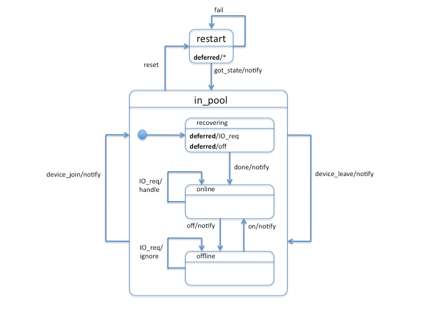

High Level Design of SNS Repair
===============================

This document provides a High-Level Design (HLD) of SNS repair for Motr. The main purposes of this document are:

- To be inspected by Motr architects and peer designers to make sure that HLD is aligned with Motr architecture and other designs, and contains no defects
- To be a source of material for Active Reviews of Intermediate Design (ARID) and Detailed Level Design (DLD) of the same component
- To serve as a design reference document

The intended audience of this document consists of Motr customers, architects, designers and developers.

0. Introduction
---------------

.. **Note:** This document has been revised to exclude the copy machine related information. The copy machine design has been included in a separate document HLD of copy machine and agents.

Redundant striping is a proven technology to achieve higher throughput and data availability. The Server Network Striping (SNS) applies this technology to network devices and achieves similar goals as a local RAID.
In the case of storage and/or server failure, the SNS repair reconstructs the lost data from survived data reliably and quickly, without major impact to the production systems. This document presents the HLD of SNS repair.

1. Definitions
--------------

.. Definitions of terms and concepts used by the design go here. The definitions must be as precise as possible. References to the `Motr Glossary</doc/PDF/Glossary.pdf>`__ are permitted and encouraged. Agreed upon terminology should be incorporated in the glossary.

Repair is a scalable mechanism to reconstruct data or meta-data in a redundant striping pool. Redundant striping stores a *cluster-wide object* in a collection of *components*, according to a particular *striping pattern*. 

The following terms are used to discuss and describe Repair:

-  Storage devices: Attached to data servers.
-  Storage objects: Provide access to storage device contents using a linear namespace associated with an object.
-  Container objects: Some of the objects are containers, capable of storing other objects. Containers are organized into a hierarchy.
-  Cluster-wide object data: Object linear namespace called cluster-wide object data. 
-  A cluster-wide object is an array of bytes, accompanying meta-data, storing in the containers, and accessed using the read and write operations. It can also be accessed using the potentially other operations of the POSIX or a similar interface. The index in this array is called an *offset*. An *offset* is a cluster-wide object that can appear as a file if visible in the file system namespace.
-  Fid: A cluster-wide object is uniquely identified by an identifier.
-  A cluster-wide object layout is a map used to determine the location of a particular element and its byte array on the storage. For this purpose, the current discussion is about the striping layouts, and it will be called layouts. There are other layouts for encryption, deduplication, etc. that look different. In addition to the cluster-wide object data, a cluster-wide object layout specifies where and how redundant information is stored.
-  A cluster-wide object layout specifies a location of its data or redundancy information as a pair (component-id, component-offset). The component-id is the FID of a component stored in a certain container. (On the components FIDs, the layouts are introduced for the provided cluster-wide object. But these are not important for the present specification.)
-  A component is an object like a cluster-wide object. It is an array of bytes (component data) and can be identified by component offset plus some meta-data.
-  A component has the allocation data; the meta-data to specify the location of the container component data.
-  The cluster-wide object layouts used in this document are `piecewise linear <http://en.wikipedia.org/wiki/Piecewise_linear_function>`__ mappings in the sense that for every layout there exists a positive integer S, called a (layout) striping unit size. Such as, the layout maps any extent [p*S, (p + 1)*S - 1] onto some [q*S, (q + 1)*S - 1] extent of target, that is some component. Such an extent in a target is called a *striping unit* of the layout. The layout mapping within a striping unit is increasing (this characterizes it uniquely).
- In addition to placing object data, the striping layouts to define the contents, and placement of *redundancy information* are used to recreate the lost data. Simplest example of redundancy information is given by RAID5 parity. In general, redundancy information is some form of check-sum over data.
- A striping unit to which cluster-wide object or component data are mapped is called a *data unit*.
- A striping unit to which redundancy information is mapped is called a *parity unit* (this standard term will be used even though the redundancy information might be something different than parity).
-  A striping layout belongs to a *striping pattern* (N+K)/G. If it stores the K parity unit with the redundancy information for every N data unit and the units are stored in G containers. Typically G is equal to the number of storage devices in the pool. Where G is not important or clear from the context, one talks about N+K striping pattern (which coincides with the standard RAID terminology).
-  A *parity group* is a collection of data units and their parity units. We only consider layouts where data units of a parity group are contiguous in the source. We do consider layouts where units of a parity group are not contiguous in the target (parity declustering). Layouts of N+K pattern allow data in a parity group to be reconstructed when no more than K units of the parity group are missing.
-  For completeness, this specification does not consider the meta-data objects associated with layouts. The meta-data object layouts are described in terms of meta-data *keys* (rather than byte offsets) and also based on redundancy, typically in the form of mirroring. Replicas in such mirrors are not necessary byte-wise copies of each other, but they are key-wise copies.
-  components of a cluster-wide object are normally located on the servers of the same pool. For example, during the migration, a cluster-wide object can have a more complex layout with the components scattered across multiple pools.
-  A layout is said *to intersect* (at the moment) with a storage device or a data-server if it maps any data to the device or to any device currently attached to the server, respectively.
-  A pool is a collection of storage, communication, and computational resources (server nodes, storage devices, and network interconnects) configured to provide IO services with certain fault-tolerance characteristics. Specifically, cluster-wide objects are stored in the pool with striping layouts with such striping patterns that guarantee that data are accessible after a certain number of server and storage device failures. Additionally, pools guarantee (using the SNS repair described in this specification) that a failure is repaired in a certain time.

Examples of striping patterns:

-  K = 0. RAID0, striping without redundancy

-  N = K = 1. RAID1, mirroring

-  K = 1 < N. RAID5

-  K = 2 < N. RAID6

A cluster-wide object layout owns its target components. That is, no two cluster-wide objects store data or redundancy information in the same component object.

**2. Requirements**
---------------------------

.. This section enumerates requirements collected and reviewed at the Requirements Analysis (RA) and Requirements Inspection (RI) phases of development. References to the appropriate RA and RI documents should go here. In addition this section lists architecture level requirements for the component from the Summary requirements table and appropriate architecture documentation.

These requirements are already listed in the SNS repair requirement analysis document:

-  [r.sns.repair.triggers] Repair can be triggered by a storage, network or node failure.

-  [r.sns.repair.code-reuse] Repair of a network array and of a local array is done by the same code.

-  [r.sns.repair.layout-update] Repair changes layouts as data are reconstructed.

-  [r.sns.repair.client-io] Client IO continues as repair is going on.

-  [r.sns.repair.io-copy-reuse] The following variability points are implemented as a policy applied to the same underlying IO copying and re-structuring mechanism:

   -  Do the client writes target the same data that are being repaired or the client writes are directed elsewhere?

   -  Does the repair reconstruct only a sub-set of data (*For example*, data missing due to a failure) or all data in the array?

..

   The following use cases are covered by the same IO restructuring mechanism:

================ ====================== ====================
\                **same layout**        **separate layouts**
**missing data** in-place repair        NBA
**all data**     migration, replication snapshot taking
================ ====================== ====================

..

   Here "same layout" means the client IO continues to the source layouts while data restructuring is in-progress and "separate layout" means the client IO is re-directed to a new layout at the moment when data restructuring starts.

   "Missing" data means only a portion of source data is copied into a target and "all data" means all the data in the source layouts are copied.

   While the data restructuring is in-progress, the affected objects that have the composite layouts display the parts of the object linear name-space that have already been restructured. Due to the possibly on-going client IO against an object, such a composite layout can have a structure more complex than "old layout up to a certain point, new layout after".

-  [r.sns.repair.priority] Containers can be assigned a *repair priority* specifying in what order they are to be repaired. This allows to restore critical cluster-wide objects (meta-data indices, cluster configuration data-base, etc.) quickly and reduce the damage of a potential double failure.

-  [r.sns.repair.degraded] Pool state machine is in degraded mode during repair. Individual layouts are moved out of degraded mode as they are reconstructed.

-  [r.sns.repair.c4] Repair is controllable by an advanced C4 settings: can be paused, aborted, and its IO priority can be changed. Repair reports its progress to C4.

-  [r.sns.repair.addb] Repair should produce ADDB records of its actions.

-  [r.sns.repair.device-oriented] Repair uses device-oriented repair algorithm.

-  [r.sns.repair.failure.transient] Repair survives transient node and network failures.

-  [r.sns.repair.failure.permanent] Repair handles permanent failures gracefully.

-  [r.sns.repair.used-only] Repair should not reconstruct unused (free) parts of failed storage.

.. _section-1:

**3. Design highlights**
---------------------------

.. This section briefly summarizes key design decisions that are important for understanding of the functional and logical specifications and enumerates topics that a reader is advised to pay special attention to.

The current design structures SNS repair implementation is a composition of two sub-systems: 

- Generic data restructuring engine (copy machine): A copy machine is a scalable distributed mechanism to restructure data in multiple ways (copying, moving, re-striping, reconstructing, encrypting, compressing, re-integrating, *etc*.). It can be used in variety of scenarios, some enumerated in the following text.
- SNS repair specific part: An SNS specific part of repair interacts with sources of repair relevant events (failures, recoveries, administrative commands, client IO requests). It constructs a copy machine suitable for SNS repair and controls its execution. 

Following topics deserve attention:

-  All issues and questions mentioned in the requirements analysis document must be addressed.

-  Pool state machine must be specified precisely.

-  Repair state machine must be specified precisely.

-  Handling of transient and permanent failures during repair must be specified precisely.

-  Interaction between repair and layouts must be specified.

-  Definitions must be made precise.

-  Details of iteration over objects must be specified.

-  Details of interaction between repair and DTM must be specified.

-  Redundancy other than N+1 (N+K, K > 1) must be regarded as a default configuration.

-  Multiple failures and repair in the presence of multiple failures must be considered systematically.

-  Repair and re-balancing must be clearly distinguished.

-  Reclaim of a distributed spare space must be addressed (this is done in a separate Distributed Spare design documentation).

-  `locking optimizations <#concurrency-control>`__.

4. Functional specification
---------------------------

.. This section defines a `functional structure <http://en.wikipedia.org/wiki/Functional_specification>`__ of the designed component; the decomposition showing *what* the component does to address the requirements.]

4.0. Overview
~~~~~~~~~~~~~

When a failure is detected, the system decides to do the SNS repair. The SNS repair can simultaneously read data from the multiple storage devices, aggregates them, transfer them over the network, and place them into distributed spare space. The entire process can utilize the system resources with the complete bandwidth. If another failure happens during this process, it is reconfigured with new parameters and starts repair again, or fails gracefully.

4.1. Failure type
~~~~~~~~~~~~~~~~~

-  *Transient failure*: Transient failure includes a short network partition or a node crash followed by a reboot. Formally, a transient failure is a failure that was healed before the system decided to declare the failure permanent. RPC and networking layer (resend) handles the transient network failures transparently. The DTM (recovery) handles the transient node failures. The Data or meta-data stored on the media drive is not damaged.

-  *Permanent failure*. Permanent failure means permanent damage to media drives and there is no way to recover the data physically from the drive. The Data will have to be reconstructed from redundant information living in surviving drives or restored from archival backups.

-  For the SNS repair purposes, we only talk about permanent failure of the storage devices or nodes. The C4 and/or SNS repair manager can distinguish the two types of failures from each other.

-  Failure detections will be done by various components, e.g. liveness.

4.2. Redundancy level
~~~~~~~~~~~~~~~~~~~~~

-  A pool using the N+K striping pattern can recover most from the K drives failures. System can reconstruct lost units from the surviving unit. K can be selected so that a pool can recover from a given number K\ :sub:`d` or device failures and a given number K\ :sub:`s` of server failures (assuming uniform distribution of units across servers).

-  The default configuration will always have K > 1 (and L > 1) to insure the system can tolerate multiple failure. 

-  More detailed discussion on this can be found at: "Reliability Calculations and Redundancy Level" and in the *Scalability analysis* section.

4.3. Triggers of SNS repair
~~~~~~~~~~~~~~~~~~~~~~~~~~~

-  When a failure of storage, network, or node is detected by various components (For example, liveness layer). It will be reported to components which are interested in the failure, including pool machine and C4. The Pool machine will decide whether to trigger a SNS repair. 

-  Multiple SNS repairs can be running simultaneously.

4.4. Control of SNS repair
~~~~~~~~~~~~~~~~~~~~~~~~~~

-  Running and queued SNS repair can be listed upon query by management tools.

-  Status of individual SNS repair can be retrieved upon query by management tools: estimated progress, estimated size, estimated time left, queued or running or completed, etc.

-  Individual SNS repair can be paused/resumed.

-  A fraction of resource usage can be set to individual repair by management tools. These resources include disk bandwidth, network bandwidth, memory, CPU usage, and others. System has a default value when SNS repair initiated. This value can be changed dynamically by management tools.

-  Resource usage will be reported and collected at some rate.  These information will be used to guide the future repair activities.

-  Status report will be trapped asynchronously to C4 while a repair is started, completed, or failed, or progressed.

4.5. Concurrency & priority
~~~~~~~~~~~~~~~~~~~~~~~~~~~

-  To guarantee that sufficient fraction of system resource are used, we:
      -  Guarantee that only a single repair can go on a given server pool and 
      -  Different pools do not compete for resources.

-  Every container has a repair priority. A repair for failed container has the priority derived from the container.

4.6.  Client I/O during SNS repair
~~~~~~~~~~~~~~~~~~~~~~~~~~~~~~~~~~

-  From client's point of view, the client I/O will be served while the SNS repair is going on. Some performance degradation may be experienced, but this should not lead to starvation or indefinite delays.

-  Client I/O to surviving containers or servers will be handled normally. But the SNS repair agent will also read from or write to the containers while SNS repair is going on.

-  Client I/O to failed container (or failed server) will be directed to proper container according to the new layout, or data will be served by retrieving from other containers and computing from parity/data unit. This depends on the implementation options. We will discuss this later.

-  When repair is completed, the client I/O will restore to its normal performance.

4.7. Repair throttling
~~~~~~~~~~~~~~~~~~~~~~

-  The SNS manager can throttle the repair according to system bandwidth, user control. This is done by dynamically changing the fraction of resource usage of individual repair or overall.

4.8. Repair logging
~~~~~~~~~~~~~~~~~~~

-  SNS repair will produce ADDB records about its operations and progress. These records include, but not limited to, (start, pause, resume, or complete) of individual repair, failure of individual repair, progress of individual repair, throughput of individual repair, etc.

4.9. Device-oriented repair
~~~~~~~~~~~~~~~~~~~~~~~~~~~

Agent iterates components over the affected container or all the containers which have surviving data/parity unit in the need-to-reconstruct parity group. These data/parity unit will be read and sent to proper agent where spare space lives, and used to re-compute the lost data. Please refer to "HLD of Copy Machine and Agents".

4.10. SNS repair and layout
~~~~~~~~~~~~~~~~~~~~~~~~~~~

The SNS manager gets an input set configuration and output set configuration as the repair initiated. These input/output set can be described by some form of layout. The SNS repair will read the data/parity from the devices described with the input set and reconstruct the missing data. In the process of reconstruction object layouts affected by the data reconstruction (layouts with data located on the lost storage device or node) are transactionally updated to reflect changed data placement. Additionally, while the reconstruction is in-progress, all affected layouts are switched into a degraded mode so that the clients can continue to access and modify data. 

..

   Note that the standard mode of operation is a so called
   "*non-blocking availability*" (NBA) where after a failure the client can immediately continue the writing new data without any IO degradation. To this end a client is handed out a new layout where it can write to. After this point, the cluster-wide object has a composite layout: some parts of object linear name-space are laid accordingly to the
   old layout and other parts (ones where clients write to after a failure)—a new one. In this configuration, clients never write to the old layout, while its content is being reconstructed.

   The situation where there is a client-originated IO against layouts being reconstructed is possible because of:

      -  Reads have to access old data even under NBA policy and

      -  The non-repair reconstructions like migration or replication.

5. Logical specification
------------------------

.. _section-2:

.. This section defines a logical structure of the designed component: the decomposition showing how the functional specification is met. Subcomponents and diagrams of their interrelations should go in this section.

Please refer "HLD of Copy Machine and Agents" for logical specifications of copy machine.

Concurrency control
~~~~~~~~~~~~~~~~~~~

Motr will support variety of concurrency control mechanisms selected dynamically to optimize resource utilization. Without going into much detail, following mechanisms are considered for controlling access to cluster-wide object data:

-  A complete file lock acquired on a meta-data server when the cluster-wide object meta-data are fetched. This works only for the cluster-wide objects visible in a file system name-space (*i.e.*, for files).

-  An extent lock taken on one of the lock servers. A replicated lock service runs on the pool servers. Every cluster-wide object has an associated locking server where locks on extents of object data are taken. Locking server might be one of the servers where object data are stored.

-  "Component level locking" is achieved by taking lock on an extent of object data on the same server where these data are located.

-  Time-stamp based optimistic concurrency control. See "Scalable Concurrency Control and Recovery for Shared Storage".

Independently of whether a cluster-wide object level locking model [1]_, where the data are protected by locks taken on cluster-wide object (these can be either extent locks taken in cluster-wide object byte offset name-space [2]_ or "whole-file" locks [3]_), or component level locking model, or time-stamping model is used, locks or time-stamps are served by a potentially replicated locking service running on a set of *lock servers* (a set that might be equal to the set of servers in the pool). The standard locking protocol as used by the file system clients would imply that all locks or time-stamps necessary for an aggregation group processing must be acquired before any processing can be done. This implies a high degree of synchronization between agents processing copy packets from the same aggregation group.

Fortunately, this ordering requirement can be weakened by making every agent to take (the same) required lock and assuming that lock manager recognizes, by comparing transaction identifiers, that lock requests from different agents are part of the same transaction and, hence, are not in conflict [4]_. Overhead of locking can be amortized by batching and locking-ahead.

Pool machine
~~~~~~~~~~~~

Pool machine is a `replicated state machine <http://en.wikipedia.org/wiki/State_machine_replication>`__, having replicas on all pool nodes. Each replica maintains the following state:

   node          : array of struct { id    : node identity, 

                                state : enum state };

   device        : array of struct { id    : device identity,

                                state : enum state };

   read-version  : integer;

   write-version : integer;

where state is enum { ONLINE, FAILED, OFFLINE, RECOVERING }. It is assumed that there is a function device-node() mapping device identity to the index in node[] corresponding to the node the device is currently attached to. The elements of the device[] array corresponding to devices attached to non-ONLINE nodes are effectively undefined (state transition function does not depend on them). To avoid mentioning this condition in
the following, it is assumed that: 

   device-node(device[i].id).state == ONLINE, 

For any index i in device[] array, that is, devices attached to
non-ONLINE nodes are excised from the state.

State transitions of a pool machine happen when the state is changed on a quorum [5]_ of replicas. To describe state transitions the following derived state (that is not necessary actually stored on replicas) is introduced:

-  nr-nodes : number of elements in node[] array

-  nr-devices : number of elements in device[] array

-  nodes-in-state[S] : number of elements in node[] array with the state field equal to S

-  devices-in-state[S] : number of elements in device[] array with the state field equal to S

-  nodes-missing = nr-nodes - nodes-in-state[ONLINE]

-  devices-missing = nr-devices - devices-in-state[ONLINE]

In addition to the state described above, a pool is equipped with a "constant" (in the sense that its modifications are beyond the scope of the present design specification) configuration state including:

-  max-node-failures   : integer, a number of node failures that the pool tolerates;

-  max-device-failures : integer, a number of storage device failures that the pool tolerates.

A pool is said to be *a dud* (Data possibly Unavailable or Damaged) when more device and node failed in it than the pool is configured to tolerate.

Based on the values of derived state fields, the pool machine state space is partitioned as:

+------------------+----------+------------------+------------------+
| devices-missing  | 0        | 1 ..             | m                |
| \\ nodes-missing |          | m                | ax-node-failures |
|                  |          | ax-node-failures | + 1 .. nr-nodes  |
+------------------+----------+------------------+------------------+
| 0                | normal   | degraded         | dud              |
+------------------+----------+------------------+------------------+
| 1 ..             | degraded | degraded         | dud              |
| max              |          |                  |                  |
| -device-failures |          |                  |                  |
+------------------+----------+------------------+------------------+
| max              | dud      | dud              | dud              |
| -device-failures |          |                  |                  |
| + 1 .. nr-device |          |                  |                  |
+------------------+----------+------------------+------------------+

A pool state with nodes-missing = n and devices-missing = k is said to belong to a *state class* S\ :sub:`(n, k)`, for example, any normal state belongs to the class S\ :sub:`(0,0)`.

As part of changing its state, a pool machine interacts with external entities such as layout manager or client caches. During this interaction multiple failures, delays, and concurrent pool machine state transitions might happen. In general, it is impossible to guarantee that all external state will be updated by the time the pool machine reaches its target state. To deal with this, pool state contains a version vector, some components of which are increased on any state transition.
All external requests to the pool (specifically, IO requests) are tagged with the version vector of the pool state the request issuer knows about. The pool rejects requests with incompatibly stale versions, forcing issuer to renew its knowledge of the pool state. Separate read and write versions are used to avoid unnecessary rejections. For example,
read requests are not invalidated by adding a new device or a new server to the pool. Finer grained version vector can be used, if necessary.

Additional STOPPED state can be introduced for nodes and devices. This state is entered when a node or a device is deliberately temporarily inactivated, for example, to move a device from one node to another or to re-cable a node as part of preventive maintenance. After a device or a node stood in STOPPED state for more than some predefined time, it enters OFFLINE state. See details in the State section.

Server state machine
~~~~~~~~~~~~~~~~~~~~

Persistent server state consists of its copy of the pool
state.

On boot a server contacts a quorum [6]_ of pool servers (counting itself) and updates its copy of the pool state. If recovery is necessary (unclean shutdown, server state as returned by the quorum is not OFFLINE), the server changes the pool state (through the quorum) to register that it is recovering. After the recovery of distributed transactions completes, the server changes the pool state to indicate that the server is now in ONLINE state (which must have been the server's pre-recovery state). See details in the State section.

.. _section-3:

**5.1. Conformance**

.. For every requirement in the Requirements section, this sub-section explicitly describes how the requirement is discharged by the design. This section is part of a requirements tracking mechanism, so it should be formatted in some way suitable for (semi-)automatic processing.

-  [i.sns.repair.triggers] A pool machine registers with health layer its interest [7]_ in hearing about device [8]_, node [9]_, and network [10]_ failures. When health layer notifies [11]_ the pool machine about a failure, state transition happens [12]_ and repair, if necessary, is triggered.

-  [i.sns.repair.code-reuse] Local RAID repair is a special case of general repair. When a storage device fails that requires only local repair, the pool machine records this failure as in general case and creates a copy engine to handle the repair. All agents of this machine are operating on the same node.

-  [i.sns.repair.layout-update] When a pool state machine enters a non-normal state, it changes its version. The client attempts to do the IO on layouts tagged with the old version, would have to re-fetch the pool state. Optionally, the requests layout manager proactively revokes all layouts intersecting [13]_  with the failed device or node. Optionally, use the copy machine "enter layout" progress call-back to revoke a particular layout. As part of re-fetching layouts, clients learn the updated list of alive nodes and devices. This list is a parameter to the layout [14]_. The layout IO engine uses this parameter to do IO in degraded mode [15]_.

-  [i.sns.repair.client-io] The Client IO operation continues as repair is going on. This is achieved by redirecting the clients to degraded layouts. This allows clients to collaborate with the copy machine in repair. After the copy machine notifies the pool machine of processing progress (through the "leave" progress call-back), repaired parts of the layout [16]_ are upgraded.

-  [i.sns.repair.io-copy-reuse] The following table provides the input parameters to the copy machines implementing required shared functionality:

+----------+----------+----------+----------+----------+----------+
|          | layout   | agg      | transf   | "enter   | "leave   |
|          | setup    | regation | ormation | layout"  | layout"  |
|          |          | function | function | progress | progress |
|          |          |          |          | c        | c        |
|          |          |          |          | all-back | all-back |
+----------+----------+----------+----------+----------+----------+
| in-place |          | a        | rec      | layout   | upgrade  |
| repair   |          | ggregate | alculate | moved    | layout   |
|          |          | striping | lost     | into     | out of   |
|          |          | units    | striping | degraded | degraded |
|          |          |          | units    | mode     | mode     |
+----------+----------+----------+----------+----------+----------+
| NBA      | original | a        | rec      |          | update   |
| repair   | layout   | ggregate | alculate |          | NBA      |
|          | moved    | striping | lost     |          | layout   |
|          | into     | units    | striping |          |          |
|          | degraded |          | units    |          |          |
|          | mode,    |          |          |          |          |
|          | new NBA  |          |          |          |          |
|          | layout   |          |          |          |          |
|          | created  |          |          |          |          |
|          | for      |          |          |          |          |
|          | writes   |          |          |          |          |
+----------+----------+----------+----------+----------+----------+
| m        | m        | no       | identity |          | discard  |
| igration | igration | agg      |          |          | old      |
|          | layout   | regation |          |          | layout   |
|          | created  |          |          |          |          |
+----------+----------+----------+----------+----------+----------+
| rep      | rep      | no       | identity |          | nothing  |
| lication | lication | agg      |          |          |          |
|          | layout   | regation |          |          |          |
|          | created  |          |          |          |          |
+----------+----------+----------+----------+----------+----------+
| snapshot | new      | no       | identity |          | nothing  |
| taking   | layout   | agg      |          |          |          |
|          | created  | regation |          |          |          |
|          | for      |          |          |          |          |
|          | writes   |          |          |          |          |
+----------+----------+----------+----------+----------+----------+

-  [i.sns.repair.priority] Containers can be assigned a *repair priority* specifying in what order they are to be repaired. Prioritization is part of the storage-in agent logic.

-  [i.sns.repair.degraded] The pool state machine is in degraded mode during repair: described in the pool machine logical specification. Individual layouts are moved out of degraded mode as they are reconstructed. When the copy machine is done with all components of a layout. It sends signals to the layout manager that the layout can be upgraded (either lazily [17]_ or by revoking all degraded layouts).

-  [i.sns.repair.c4] 

   -  Repair is controllable by advanced C4 settings: It can be paused and its IO priority can be changed. This is guaranteed by dynamically adjustable copy machine resource consumption thresholds.

   -  Repair reports its progress to C4. This is guaranteed by the standard state machine functionality.

-  [i.sns.repair.addb] Repair should produce ADDB records of its actions: this is a part of standard state machine functionality.

-  [i.sns.repair.device-oriented] Repair uses device-oriented repair algorithm, as described in *On-line Data reconstruction in Redundant Disk Arrays* dissertation: this follows from the storage-in agent processing logic.

-  [i.sns.repair.failure.transient] Repair survives transient node and network failures. After the failed node restarts or network partitions heals, distributed transactions, and including repair transactions created by copy machine are redone or undone to restore consistency. Due to the construction of repair transactions, the recovery also restores repair to a consistent state from which it can resume.

-  [i.sns.repair.failure.permanent] Repair handles permanent failures gracefully. Repair updates file layouts with at the transaction boundary. Together with copy machine state replication, this guarantees that repair can continue in the face of multiple failures.

-  [i.sns.repair.used-only] Repair should not reconstruct unused (free) parts of failed storage: this is a property of a container based repair design.

5.2. Dependencies
~~~~~~~~~~~~~~~~~
.. This sub-section enumerates other system and external components the component depends on. For every dependency a type of the dependency (uses, generalizes, etc.) must be specified together with the particular properties (requirements, invariants) the design depends upon. This section is part of a requirements tracking mechanism.

-  Layouts

   -  [r.layout.intersects]: It must be possible to efficiently find all layouts intersecting with a given server or a given storage device.

   -  [r.layout.parameter.dead]: A list of failed servers and devices is a parameter to a layout formula.

   -  [r.layout.degraded-mode]: Layout IO engine does degraded mode IO if directed to do so by the layout parameters.

   -  [r.layout.lazy-invalidation]: Layout can be invalidated lazily, on a next IO request.

-  DTM

   -  [r.fol.record.custom]: Custom FOL record type, with user defined redo and undo actions can be defined.

   -  [r.dtm.intercept]: It is possible to execute additional actions in the context of a user-level transaction.

   -  [r.dtm.tid.generate]: Transaction identifiers can be assigned by DTM users.

-  Management tool

-  RPC

   -  [r.rpc.maximal.bulk-size]

   -  [r.network.utilization]: An interface to estimate network utilization.

   -  [r.rpc.pluggable]: It is possible to register a call-back to be called by the RPC layer to process a particular RPC type.

   -  Health and liveness layer:

   -  [r.health.interest], [r.health.node], [r.health.device], [r.health.network] It is possible to register interest in certain failure event types (network, node, storage device) for certain system components (e.g., all nodes in a pool).

   -  [r.health.call-back] Liveness layer invokes a call-back when an event on interest happens.

   -  [r.health.fault-tolerance] Liveness layer is fault-tolerant. Call-back invocation is carried through the node and network failures.

   -  [r.rpc.streaming.bandwidth]: Optimally, streamed RPCs can utilize at least 95% of raw network bandwidth.

   -  [r.rpc.async]: There is an asynchronous RPC sending interface.

-  DLM

   -  [r.dlm.enqueue.async]: A lock can be enqueued asynchronously.

   -  [r.dlm.logical-locking]: Locks are taken on cluster-wide objects.

   -  [r.dlm.transaction-based]: Lock requests issued on behalf of transactions. Lock requests made on behalf of the same transaction are never in conflict.

-  Meta-data:

   -  [u.md.iterator]: Generic meta-data iterators suitable for input set description.

   -  [u.md.iterator.position]: Meta-data iterators come with a totally ordered space of possible iteration positions.

-  State machines:

   -  [r.machine.addb]: State machines report statistics about their state transitions to ADDB.

   -  [r.machine.persistence]: State machine can be made persistent and recoverable. Local transaction manager invokes restart event on persistent state machines after node reboots.

   -  [r.machine.discoverability]: State machines can be discovered by C4.

   -  [r.machine.queuing]: A state machine has a queue of incoming requests.

-  Containers:

   -  [r.container.enumerate]: It is possible to efficiently iterate through the containers stored (at the moment) on a given storage device.

   -  [r.container.migration.call-back]: A container notifies interested parties in its migration events.

   -  [r.container.migration.vote]: Container migration, if possible, includes a voting phase, giving interested parties an opportunity to prepare for the future migration.

   -  [r.container.offset-order]: Container offset order matches underlying storage device block ordering enough to make container offset ordered transfers optimal.

   -  [r.container.read-ahead]: Container do read-ahead.

   -  [r.container.streaming.bandwidth]: Large-chunk streaming container IO can utilize at least 95% of raw storage device throughput.

   -  [r.container.async]: There is an asynchronous container IO interface.

-  Storage:

   -  [r.storage.utilization]: An interface to measure a utilization a given device for a certain time period.

   -  [r.storage.transfer-size]: An interface to determine maximal efficient request size of a given storage device.

   -  [r.storage.intercept]: It should be possible to intercept IO requests targeting a given storage device.

-  SNS:

   -  [r.sns.trusted-client] (constraint): Only trusted clients can operate on SNS objects.

-  Miscellaneous:

   -  [r.processor.utilization]: An interface to measure processor utilization for a certain time period.

-  Quorum:

   -  [r.quorum.consensus]: Quorum based consensus mechanism is needed.

   -  [r.quorum.read]: Read access to quorum decisions is needed.

5.3. Security model
~~~~~~~~~~~~~~~~~~~

.. The security model, if any, is described here.

5.3.1. Network
^^^^^^^^^^^^^^

It is assumed that messages exchanged over the network are signed so that a message sender can be established reliably. Under this condition, nodes cannot impersonate each other.

5.3.2. Servers
^^^^^^^^^^^^^^

The present design provides very little protection against a compromised server. While compromised storage-in or network agents can be detected by using striping redundancy information, there is no way to independently validate the output of a collecting agent or check that the storage-out agent wrote the right data to the storage. In general, this issue is unavoidable as long as the output set can be non-redundant.

If we restrict ourselves to the situations where output set is always redundant, quorum based agreement can be used to deal with malicious servers in the spirit of Practical Byzantine Fault Tolerance. Replicated state machine design of a copy machine lends itself naturally to a quorum based solution.

The deeper problem is due to servers collaborating in the distributed transactions. Given that the transaction identifiers used by the copy machine are generated by a known method. A server can check that the server-to-server requests it receives are from well-formed transactions and a malicious server cannot cause chaos by initiating malformed transactions. What is harder to counter is a server *not* sending requests that it must send according to the copying algorithm. We assume that the worst thing that can happen when a server delays or omits certain messages is that the corresponding transaction will eventually be aborted and undone. An unresponsive server is evicted from the cluster and the pool handles this as a server failure. This still doesn't guarantee progress, because the server might immediately re-join the cluster only to sabotage more transactions.

The systematic solution to such problems is to utilize the already present redundancy in the input set. For example, when a layout with N+K (where K > 2) striping pattern is repaired after a single failure, the N+K-1 survived striping units are gathered from each parity group. The collecting agent uses the additional units to check in three ways that every received unit matches the redundancy and uses the majority in case of mismatch. This guarantees a single malign server can be detected. RAID-like striping patterns can be generalized from fail-stop failures to Byzantine failures. It seems that as typical for agreement protocols, an N+K pattern with K > 2*F would suffice to handle up to F arbitrary failures (including usual fail-stop failures).

5.3.3. Clients
^^^^^^^^^^^^^^

In general, the fundamental difference between a server and a client is that the latter cannot be replicated because it runs arbitrary code outside of Motr control. While the well-formedness of client-supplied transactions and client liveness can be checked with some effort, there is no obvious way to verify that a client calculates redundancy information correctly, without sacrificing system performance to a considerable degree. It is, hence, posited that SNS operations, including client interaction with repair machinery, can originate only from the trusted clients [18]_.

5.3.4. Others
^^^^^^^^^^^^^

The SNS repair interacts with and depends on variety of core distributed Motr services including liveness layer, lock servers, distributed transaction manager, and management tool. Security concerns for such services should be addressed generically and are beyond the scope of the present design.

5.3.5. Issues
^^^^^^^^^^^^^

It is in no way clear that the analysis above is any close to
exhaustive. A formal security model is required [19]_.

5.4. Refinement
~~~~~~~~~~~~~~~

.. This sub-section enumerates design level requirements introduces by the design. These requirements are used as input requirements for the detailed level design of the component. This sub-section is part of a requirements tracking mechanism.

-  Pool machine:

   -  Device-node function: Mapping between the device identifier and the node identifier is an implicit part of pool state.

6. State
--------

.. This section describes the additions or modifications to the system state (persistent, volatile) introduced by the component. As much of component behavior from the logical specification should be described as state machines as possible. The following sub-sections are repeated for every state machine.]

6.1. Pool machine states, events, transitions
~~~~~~~~~~~~~~~~~~~~~~~~~~~~~~~~~~~~~~~~~~~~~

.. This sub-section enumerates state machine states, input and output events and state transitions incurred by the events with a table or diagram of possible state transitions. `UML state diagrams <http://en.wikipedia.org/wiki/UML_state_machine>`__ can be used here.

The pool machine states can be classified into state
classes S\ :sub:`(n, k)`. "Macroscopic" transitions
between state classes re described by the following state machine
diagram:

Here *device leave* is any event that increases *devices-missing* field of pool machine state: planned device shutdown, device failure, detaching a device from a server, *etc*. Similarly, device join is any event that decreases *devices-missing*: addition of a new device to the pool, device startup, *etc*. The same, *mutatis mutandis* for *node leave* and *node join* events.

Within each state-class the following "microscopic" state transitions happen:

Where *join* is either *node_join* or *device_join* and *leave* is either *node_leave* or *device_leave*; and *spare* means distributed spare space.

Or, in the table form:

+--------------+-------------+-------------+-------------+----------------------------+------------+-----------------------+
|              |             |             |             |                            | join       | leave                 |
|              | has_spare   | !has_spare  | repair_done | rebalance_done             |            |                       |
|              | _space      | _space      |             |                            |            |                       |
+--------------+-------------+-------------+-------------+----------------------------+------------+-----------------------+
| choice       | repair      | dud         |             |                            |            |                       |
|              |             |             |  impossible |        impossible          | impossible | impossible            |
| pseudo-state | /spare_grab |             |             |                            |            |                       |
|              | ();         |             |             |                            |            |                       |
|              |             |             |             |                            |            |                       |
|              | start_re    |             |             |                            |            |                       |
|              | pair_ma     |             |             |                            |            |                       |
|              | chine()     |             |             |                            |            |                       |
+--------------+-------------+-------------+-------------+----------------------------+------------+-----------------------+
| repair       |             |             |             |                            |    defer,  | S\ :sub:`(n+a, k+b)`  |
|              | impossible  | impossible  | repair_c    |        impossible          |    queue   |                       |
|              |             |             | omplete     |                            |            |                       |
|              |             |             |             |                            |            |                       |
|              |             |             |             |                            |            | /stop_repair()        |
|              |             |             |             |                            |            |                       |
+--------------+-------------+-------------+-------------+----------------------------+------------+-----------------------+
|              |             |             |             |                            |            | S\ :sub               |
| repair       | impossible  | impossible  | impossible  | impossible                 | rebalance  | :`(n+a, k+b)`         |
| _complete    |             |             |             |                            |            |                       |
+--------------+-------------+-------------+-------------+----------------------------+------------+-----------------------+
| rebalance    | impossible  | impossible  | impossible  | S\ :sub:`(n-a, k-b) `\     | defer,     | S\ :sub:`(n+a, k+b)`\ |
|              |             |             |             | \ :sub:`/spare_release()`/ | queue      |                       |
|              |             |             |             |                            |            |                       |
|              |             |             |             |                            |            |                       |
|              |             |             |             |                            |            | /stop_rebalance       |
|              |             |             |             |                            |            |                       |
|              |             |             |             |                            |            |                       |
|              |             |             |             |                            |            |                       |
+--------------+-------------+-------------+-------------+----------------------------+------------+-----------------------+

Recall that a pool state machine is replicated and its state transition is in fact, a state transition on a quorum of replicas. Impossible state transitions happening when a replica receives an unexpected event are logged and ignored. It's easy to see that every transition out of S\ :sub:`(n, k)`\  state class is either directly caused by a *join* or *leave* event or  directly preceded by such an event. 

Events:

-  storage device failure

-  node failure

-  network failure

-  storage device recovery

-  node recovery

-  network recovery

-  media failure

-  container transition

-  client read

-  client write

.. _section-4:

6.2. Pool machine state invariants
~~~~~~~~~~~~~~~~~~~~~~~~~~~~~~~~~~

In a state class  S\ :sub:`(n, k)` the following invariants are maintained (for a replicated machine a state invariant is a condition that is true on at least some quorum of state replicas):

-  If  n <= max-node-failures and k <= max-device-failures, then exactly F(n, k)/F(max-node-failures, max-device-failures) of pool (distributed) spare space is busy, where the definition of F(n, k) function depends on details of striping pattern is used by the pool (described elsewhere). Otherwise the pool is a dud and all spare space is busy.

-  (This is not, technically speaking, an invariant) Version vector a part of pool machine state is updated so that layouts issued before cross-class state transition can be invalidated if necessary.

-  No repair or rebalancing copy machine is running when a state class is entered or left.

6.3. Server machine states, events, transitions
~~~~~~~~~~~~~~~~~~~~~~~~~~~~~~~~~~~~~~~~~~~~~~~

State transition diagram:

Where

-  *Restart* state queries pool quorum (including the server itself) for the pool machine state (including the server state).

-  *Notify* action notifies replicated pool machine about changes in the server state or in the state of some storage device attached to the server.

In the table form:

+-------------+-------------+-------------+-------------+-------------+
|             | restart     | in_pool     | in_pool     | in_pool     |
|             |             | .recovering | .online     | .offline    |
+-------------+-------------+-------------+-------------+-------------+
| got_state   | in_pool.    | impossible  | impossible  | impossible  |
|             | .recove     |             |             |             |
|             | ring/notify |             |             |             |
+-------------+-------------+-------------+-------------+-------------+
| fail        | restart     | impossible  | impossible  | impossible  |
+-------------+-------------+-------------+-------------+-------------+
| done        | impossible  | on          | impossible  | impossible  |
|             |             | line/notify |             |             |
+-------------+-------------+-------------+-------------+-------------+
| off         | impossible  | impossible  | off         | impossible  |
|             |             |             | line/notify |             |
+-------------+-------------+-------------+-------------+-------------+
| on          | impossible  | impossible  | impossible  | on          |
|             |             |             |             | line/notify |
+-------------+-------------+-------------+-------------+-------------+
| IO_req      | defer       | defer       | onl         | off         |
|             |             |             | ine/process | line/ignore |
+-------------+-------------+-------------+-------------+-------------+
| device_join | defer       | defer       | on          | off         |
|             |             |             | line/notify | line/notify |
+-------------+-------------+-------------+-------------+-------------+
| d           | defer       | defer       | on          | off         |
| evice_leave |             |             | line/notify | line/notify |
+-------------+-------------+-------------+-------------+-------------+
| reset       | restart     | restart     | restart     | restart     |
+-------------+-------------+-------------+-------------+-------------+

6.4. Server state machine invariants
~~~~~~~~~~~~~~~~~~~~~~~~~~~~~~~~~~~~

.. This sub-section describes relations between parts of the state invariant through the state modifications.

Server state machine: no storage operations in OFFLINE state.

.. _concurrency-control-1:

6.5. Concurrency control
~~~~~~~~~~~~~~~~~~~~~~~~

.. This sub-section describes what forms of concurrent access are possible and what forms on concurrency control (locking, queuing, *etc*.) are used to maintain consistency.

All state machines function according to the Run-To-Completion (RTC) model. In RTC model each state transition is executed completely before the next state transition is allowed to start. *Queuing* [20]_ is used to defer concurrently incoming events.

7. Use cases
------------

.. This section describes how the component interacts with rest of the system and with the outside world.]

7.1. Scenarios
~~~~~~~~~~~~~~

.. This sub-section enumerates important use cases (to be later used as seed scenarios for ARID) and describes them in terms of logical specification.]

.. `UML use case diagram <http://en.wikipedia.org/wiki/Use_case_diagram>`__ can be used to describe a use case.]

+-----------------------------+---------------------------------------+
| Scenario                    | usecase.repair.throughput-single      |
+-----------------------------+---------------------------------------+
| Business goals              | High availability                     |
+-----------------------------+---------------------------------------+
| Relevant quality attributes | Scalability                           |
+-----------------------------+---------------------------------------+
| Stimulus                    | Repair invocation                     |
+-----------------------------+---------------------------------------+
| Stimulus source             | Node, storage or network failure, or  |
|                             | administrative action                 |
+-----------------------------+---------------------------------------+
| Environment                 | Server pool                           |
+-----------------------------+---------------------------------------+
| Artifact                    | Repair data reconstruction process    |
|                             | running on the pool                   |
+-----------------------------+---------------------------------------+
| Response                    | Repair utilises hardware efficiently  |
+-----------------------------+---------------------------------------+
| Response measure            | Repair can utilize at least 90        |
|                             | percent of a raw hardware bandwidth   |
|                             | of any storage device and any network |
|                             | connection it uses, subject to        |
|                             | administrative restrictions. This is  |
|                             | achieved by:                          |
|                             |                                       |
|                             | -  The streaming IO done by           |
|                             |    storage-in and storage-out         |
|                             |    agents, together with the          |
|                             |    guarantee that large-chunk         |
|                             |    streaming container IO can         |
|                             |    consume at least 95% of raw        |
|                             |    storage device bandwidth [21]_.    |
|                             |                                       |
|                             | -  Streaming network transfers done   |
|                             |    by network-in and -out agents,     |
|                             |    together with the guarantee        |
|                             |    that optimal network transfers     |
|                             |    can consume at least 95% of raw    |
|                             |    network bandwidth [22]_.           |
|                             |                                       |
|                             | -  Assumption that there is enough    |
|                             |    processor cycles to reconstruct    |
|                             |    data from redundant information    |
|                             |    without the processor being        |
|                             |    bottleneck.                        |
|                             |                                       |
|                             | More convincing argument can be made  |
|                             | by simulating the repair.             |
+-----------------------------+---------------------------------------+
| Questions and issues        |                                       |
+-----------------------------+---------------------------------------+

+-----------------------------+---------------------------------------+
| Scenario                    | usecase.repair.throughput-total       |
+-----------------------------+---------------------------------------+
| Business goals              | High availability                     |
+-----------------------------+---------------------------------------+
| Relevant quality attributes | Scalability                           |
+-----------------------------+---------------------------------------+
| Stimulus                    | Repair invocation                     |
+-----------------------------+---------------------------------------+
| Stimulus source             | Node, storage or network failure, or  |
|                             | administrative action                 |
+-----------------------------+---------------------------------------+
| Environment                 | A pool                                |
+-----------------------------+---------------------------------------+
| Artifact                    | Repair data reconstruction process    |
|                             | running on the pool                   |
+-----------------------------+---------------------------------------+
| Response                    | Repair process utilizes storage and   |
|                             | network bandwidth of as many pool     |
|                             | elements as possible, even if some    |
|                             | elements have already failed and are  |
|                             | not being replaced.                   |
+-----------------------------+---------------------------------------+
| Response measure            | Fraction of pool elements             |
|                             | participating in the repair, as a     |
|                             | function of a number of failed units. |
|                             | This is achieved by distributed       |
|                             | parity layouts, on average uniformly  |
|                             | spreading parity groups across all    |
|                             | devices in a pool.                    |
+-----------------------------+---------------------------------------+
| Questions and issues        |                                       |
+-----------------------------+---------------------------------------+

+-----------------------------+---------------------------------------+
| Scenario                    | usecase.repair.degradation            |
+-----------------------------+---------------------------------------+
| Business goals              | Maintain an acceptable level of       |
|                             | system performance in degraded mode   |
+-----------------------------+---------------------------------------+
| Relevant quality attributes | Availability                          |
+-----------------------------+---------------------------------------+
| Stimulus                    | Repair invocation                     |
+-----------------------------+---------------------------------------+
| Stimulus source             | Node, storage or network failure, or  |
|                             | administrative action                 |
+-----------------------------+---------------------------------------+
| Environment                 | A pool                                |
+-----------------------------+---------------------------------------+
| Artifact                    | Repair process competing with ongoing |
|                             | IO requests to the pool               |
+-----------------------------+---------------------------------------+
| Response                    | fraction of the total pool throughput |
|                             | consumed by the repair at any moment  |
|                             | in time is limited                    |
+-----------------------------+---------------------------------------+
| Response measure            | Fraction of total throughput consumed |
|                             | by the repair at any moment is lower  |
|                             | than the specified limitation.  This  |
|                             | is achieved by:                       |
|                             | Repair algorithm throttles itself to  |
|                             | consume no more than a certain        |
|                             | fraction of system resources (storage |
|                             | bandwidth, network bandwidth, memory) |
|                             | allocated to it by a system           |
|                             | parameter. The following agents will  |
|                             | do the throttle respectively          |
|                             | according to its parameters:          |
|                             |                                       |
|                             | -  Storage-in agent,                  |
|                             |                                       |
|                             | -  Storage-out agent,                 |
|                             |                                       |
|                             | -  Network-in agent,                  |
|                             |                                       |
|                             | -  Network-out agent,                 |
|                             |                                       |
|                             | -  Collecting agent                   |
|                             |                                       |
|                             | Additionally, the storage and network |
|                             | IO requests are issued by repair with |
|                             | a certain priority, controllable by a |
|                             | system parameter.                     |
+-----------------------------+---------------------------------------+
| Questions and issues        |                                       |
+-----------------------------+---------------------------------------+

+-----------------------------+---------------------------------------+
| Scenario                    | usecase.repair.io-copy-reuse          |
+-----------------------------+---------------------------------------+
| Business goals              | Flexible deployment                   |
+-----------------------------+---------------------------------------+
| Relevant quality attributes | Reuseability                          |
+-----------------------------+---------------------------------------+
| Stimulus                    | Local RAID repair                     |
+-----------------------------+---------------------------------------+
| Stimulus source             | Storage unit failure on a node        |
+-----------------------------+---------------------------------------+
| Environment                 | Motr node with a failed storage unit  |
+-----------------------------+---------------------------------------+
| Artifact                    | Local RAID repair                     |
+-----------------------------+---------------------------------------+
| Response                    | Local RAID repair uses the same       |
|                             | algorithms and the same data          |
|                             | structures as network array repair    |
+-----------------------------+---------------------------------------+
| Response measure            | A ratio of code shared between local  |
|                             | and network repair. This is achieved  |
|                             | by:                                   |
|                             |                                       |
|                             | -  The same algorithm and data        |
|                             |    structures will be used to do      |
|                             |    the parity computing, data         |
|                             |    reconstructing, resource           |
|                             |    consumption limitation, *etc*.     |
+-----------------------------+---------------------------------------+
| Questions and issues        |                                       |
+-----------------------------+---------------------------------------+

+-----------------------------+---------------------------------------+
| Scenario                    | usecase.repair.multiple-failure       |
+-----------------------------+---------------------------------------+
| Business goals              | System behaves predictably in any     |
|                             | failure scenario - Failures beyond    |
|                             | redundancy need to have a likelihood  |
|                             | over the lifetime of the system (e.g. |
|                             | 5-10 years) to achieve a certain      |
|                             | number of 9's in data                 |
|                             | availability/reliability. The case    |
|                             | where not an entire drive fails       |
|                             | beyond the redundancy level (media    |
|                             | failure) is considered elsewhere.     |
+-----------------------------+---------------------------------------+
| Relevant quality attributes | Fault-tolerance                       |
+-----------------------------+---------------------------------------+
| Stimulus                    | A node, storage or network failure    |
|                             | happens while repair is going on.     |
+-----------------------------+---------------------------------------+
| Stimulus source             | Hardware or software malfunction      |
+-----------------------------+---------------------------------------+
| Environment                 | A pool in degraded mode               |
+-----------------------------+---------------------------------------+
| Artifact                    | More units from a certain parity      |
|                             | group are erased by the failure than  |
|                             | a striping pattern can recover from.  |
+-----------------------------+---------------------------------------+
| Response                    | Repair identifies lost data and       |
|                             | communicates the information about    |
|                             | data loss to the interested parties.  |
+-----------------------------+---------------------------------------+
| Response measure            | Data loss is contained and            |
|                             | identified. This is achieved by       |
|                             | proper pool state machine transition: |
|                             |                                       |
|                             | -  When more units from a certain     |
|                             |    parity group are detected to be    |
|                             |    failed than a stripe patter can    |
|                             |    tolerate, the pool machine         |
|                             |    transits to DUD, and               |
|                             |                                       |
|                             | -  Internal read-version and          |
|                             |    write-version of the state         |
|                             |    machine will be increased, and     |
|                             |    pending client I/O will get        |
|                             |    error.                             |
+-----------------------------+---------------------------------------+
| Questions and issues        |                                       |
+-----------------------------+---------------------------------------+

+-----------------------------+---------------------------------------+
| Scenario                    | usecase.repair.management             |
+-----------------------------+---------------------------------------+
| Business goals              | System behavior is controllable by    |
|                             | C4, but normally automatic. Will be   |
|                             | reported by C4, some parameters are   |
|                             | somewhat tunable (in the              |
|                             | advanced-advanced-advanced box).      |
+-----------------------------+---------------------------------------+
| Relevant quality attributes | Observability, manageability          |
+-----------------------------+---------------------------------------+
| Stimulus                    | A control request to repair from a    |
|                             | management tool                       |
+-----------------------------+---------------------------------------+
| Stimulus source             | Management tool                       |
+-----------------------------+---------------------------------------+
| Environment                 | An array in degraded mode             |
+-----------------------------+---------------------------------------+
| Artifact                    | Management tool can request repair    |
|                             | cancellation, and change to repair    |
|                             | IO priority.                          |
+-----------------------------+---------------------------------------+
| Response                    | Repair executes control request.      |
|                             | Additionally, repair notifies         |
|                             | management tool about state changes:  |
|                             | start, stop, double failure, ETA.     |
+-----------------------------+---------------------------------------+
| Response measure            | Control requests are handled          |
|                             | properly, correctly and timely.       |
|                             | Repair status and events are reported |
|                             | to C4 properly, correctly and         |
|                             | timely. This is achieved by the       |
|                             | commander handler in the SNS repair   |
|                             | manager and its call-backs to C4.     |
+-----------------------------+---------------------------------------+
| Questions and issues        |                                       |
+-----------------------------+---------------------------------------+

+-----------------------------+---------------------------------------+
| Scenario                    | usecase.repair.migration              |
+-----------------------------+---------------------------------------+
| Business goals              |                                       |
+-----------------------------+---------------------------------------+
| Relevant quality attributes | reusability                           |
+-----------------------------+---------------------------------------+
| Stimulus                    | Migration of a file-set from one pool |
|                             | to another.                           |
+-----------------------------+---------------------------------------+
| Stimulus source             | Administrative action or policy       |
|                             | decision (For example,                |
|                             | space re-balancing).                  |
+-----------------------------+---------------------------------------+
| Environment                 | Normal system operation               |
+-----------------------------+---------------------------------------+
| Artifact                    | A process to migrate data from the    |
|                             | pool starts                           |
+-----------------------------+---------------------------------------+
| Response                    | -  Migrate data according to its      |
|                             |    policy correctly, under the        |
|                             |    limitation of resource usage.      |
|                             |                                       |
|                             | -  Data migration re-uses algorithms  |
|                             |    and data-structures of repair      |
+-----------------------------+---------------------------------------+
| Response measure            | -  Data is migrated correctly.        |
|                             |                                       |
|                             | -  A ratio of code shared between     |
|                             |    migration and repair               |
|                             |                                       |
|                             | These are achieved by:                |
|                             |                                       |
|                             | -  Using the same components and      |
|                             |    algorithm with repair, but with    |
|                             |    different integration.             |
+-----------------------------+---------------------------------------+
| Questions and issues        |                                       |
+-----------------------------+---------------------------------------+

+-----------------------------+---------------------------------------+
| Scenario                    | usecase.repair.replication            |
+-----------------------------+---------------------------------------+
| Business goals              |                                       |
+-----------------------------+---------------------------------------+
| Relevant quality attributes | Reusability                           |
+-----------------------------+---------------------------------------+
| Stimulus                    | Replication of a file-set from one    |
|                             | pool to another.                      |
+-----------------------------+---------------------------------------+
| Stimulus source             | Administrative action or policy       |
|                             | decision.                             |
+-----------------------------+---------------------------------------+
| Environment                 | Normal file system operation.         |
+-----------------------------+---------------------------------------+
| Artifact                    | A process to replicate data from the  |
|                             | pool.                                 |
+-----------------------------+---------------------------------------+
| Response                    | Data replication reuses algorithms    |
|                             | and data-structures of repair.        |
+-----------------------------+---------------------------------------+
| Response measure            | A ratio of code shared between        |
|                             | replication and repair. This is       |
|                             | achieved by using the same components |
|                             | and algorithm with repair, but with   |
|                             | different integration.                |
+-----------------------------+---------------------------------------+
| Questions and issues        |                                       |
+-----------------------------+---------------------------------------+

+-----------------------------+---------------------------------------+
| Scenario                    | usecase.repair.resurrection           |
|                             | (optional)                            |
+-----------------------------+---------------------------------------+
| Business goals              |                                       |
+-----------------------------+---------------------------------------+
| Relevant quality attributes | fault tolerance                       |
+-----------------------------+---------------------------------------+
| Stimulus                    | A failed storage unit or data server  |
|                             | comes back into service.              |
+-----------------------------+---------------------------------------+
| Stimulus source             |                                       |
+-----------------------------+---------------------------------------+
| Environment                 | A storage pool in a degraded mode.    |
+-----------------------------+---------------------------------------+
| Artifact                    | Repair detects that reconstructed     |
|                             | data are back online.                 |
+-----------------------------+---------------------------------------+
| Response                    | Depending on the fraction of data     |
|                             | already reconstructed various         |
|                             | policies can be selected:             |
|                             |                                       |
|                             | -  Abort the repair and copy all data |
|                             |    modified since reconstruction      |
|                             |    back to the original, restore      |
|                             |    the layout to its original one.    |
|                             |                                       |
|                             | -  Abandon original data and continue |
|                             |    repair.                            |
+-----------------------------+---------------------------------------+
| Response measure            | Less time and resource should be      |
|                             | used, regardless to continue the      |
|                             | repair or not.                        |
+-----------------------------+---------------------------------------+
| Questions and issues        | If we choose to restore layouts to    |
|                             | its original state, it is a           |
|                             | potentially lengthy process           |
|                             | (definitely not atomic) and           |
|                             | additional failures can happen while  |
|                             | it is in progress. It requires        |
|                             | scanning already processed layouts    |
|                             | and reverting them to their original  |
|                             | form, freeing spare space. This is    |
|                             | further complicated by the            |
|                             | possibility of client IO modifying    |
|                             | data stored in the spare space before |
|                             | roll-back starts. So, resurrection    |
|                             | will be marked as "optional" feature  |
|                             | to be implemented later.              |
+-----------------------------+---------------------------------------+

+-----------------------------+---------------------------------------+
| Scenario                    | usecase.repair.local                  |
+-----------------------------+---------------------------------------+
| Business goals              |                                       |
+-----------------------------+---------------------------------------+
| Relevant quality attributes | Resource usage                        |
+-----------------------------+---------------------------------------+
| Stimulus                    | Local RAID repair starts              |
+-----------------------------+---------------------------------------+
| Stimulus source             | Storage unit failure on a node        |
+-----------------------------+---------------------------------------+
| Environment                 | Motr node with a failed storage unit  |
+-----------------------------+---------------------------------------+
| Artifact                    | Local RAID repair                     |
+-----------------------------+---------------------------------------+
| Response                    | Local RAID repair uses copy machine   |
|                             | buffer pool to exchange data. No      |
|                             | network traffic is needed.            |
+-----------------------------+---------------------------------------+
| Response measure            | No network traffic in the repair.     |
|                             | This is achieved by running           |
|                             | storage-in agent, collecting agent,   |
|                             | and storage out agent on the same     |
|                             | node, and exchanging data through     |
|                             | buffer pool.                          |
+-----------------------------+---------------------------------------+
| Questions and issues        |                                       |
+-----------------------------+---------------------------------------+

+-----------------------------+---------------------------------------+
| Scenario                    | usecase.repair.ADDB                   |
+-----------------------------+---------------------------------------+
| Business goals              | Better diagnostics                    |
+-----------------------------+---------------------------------------+
| Relevant quality attributes | ADDB                                  |
+-----------------------------+---------------------------------------+
| Stimulus                    | Repair                                |
+-----------------------------+---------------------------------------+
| Stimulus source             | SNS repair                            |
+-----------------------------+---------------------------------------+
| Environment                 | Running SNS repair in Motr            |
+-----------------------------+---------------------------------------+
| Artifact                    | Diagnostic information are logged in  |
|                             | ADDB.                                 |
+-----------------------------+---------------------------------------+
| Response                    | SNS repair log status, state          |
|                             | transition, progress etc. in ADDB for |
|                             | better diagnostic in the future.      |
+-----------------------------+---------------------------------------+
| Response measure            | The amount of ADDB records useful for |
|                             | later diagnostic.  This is achieved   |
|                             | by integrating ADDB infrastructure    |
|                             | tightly into SNS repair, and          |
|                             | producing ADDB records correctly,     |
|                             | efficiently, timely.                  |
+-----------------------------+---------------------------------------+
| Questions and issues        |                                       |
+-----------------------------+---------------------------------------+

+-----------------------------+---------------------------------------+
| Scenario                    | usecase.repair.persistency            |
+-----------------------------+---------------------------------------+
| Business goals              | Availability                          |
+-----------------------------+---------------------------------------+
| Relevant quality attributes | Local and distributed transactions    |
+-----------------------------+---------------------------------------+
| Stimulus                    | SNS                                   |
+-----------------------------+---------------------------------------+
| Stimulus source             | SNS                                   |
+-----------------------------+---------------------------------------+
| Environment                 | Node in Motr                          |
+-----------------------------+---------------------------------------+
| Artifact                    | State machines survive from node      |
|                             | failures.                             |
+-----------------------------+---------------------------------------+
| Response                    | State machines use services of local  |
|                             | and distributed transaction managers  |
|                             | to recover from node failures. After  |
|                             | a restart, persistent state machine   |
|                             | receives a restart event, that it can |
|                             | use to recover its lost volatile      |
|                             | state.                                |
+-----------------------------+---------------------------------------+
| Response measure            | State machines survive from node      |
|                             | failures. This is achieved by using   |
|                             | replicated state machine mechanism.   |
+-----------------------------+---------------------------------------+
| Questions and issues        |                                       |
+-----------------------------+---------------------------------------+

+-----------------------------+---------------------------------------+
| Scenario                    | usecase.repair.priority               |
+-----------------------------+---------------------------------------+
| Business goals              | availability                          |
+-----------------------------+---------------------------------------+
| Relevant quality attributes | container                             |
+-----------------------------+---------------------------------------+
| Stimulus                    | SNS repair initialization             |
+-----------------------------+---------------------------------------+
| Stimulus source             | Pool machine                          |
+-----------------------------+---------------------------------------+
| Environment                 | a running SNS repair                  |
+-----------------------------+---------------------------------------+
| Artifact                    | Priority of SNS repair assigned.      |
+-----------------------------+---------------------------------------+
| Response                    | A priority is set for every container |
|                             | included in the input set, and the    |
|                             | SNS repair will be executed by this   |
|                             | priority.                             |
+-----------------------------+---------------------------------------+
| Response measure            | SNS repairs are executed with higher  |
|                             | priority first.  This is achieved by  |
|                             | a looping from the highest priority   |
|                             | to the lowest one to initiate new     |
|                             | repairs.                              |
+-----------------------------+---------------------------------------+
| Questions and issues        |                                       |
+-----------------------------+---------------------------------------+

7.2. Failures
~~~~~~~~~~~~~

.. This sub-section defines relevant failures and reaction to them. Invariants maintained across the failures must be clearly stated. Reaction to `Byzantine failures <http://en.wikipedia.org/wiki/Byzantine_fault_tolerance>`__ (*i.e.*, failures where a compromised component acts to invalidate system integrity) is described here.

See *Logical specification* and *State* section for failure handling and *Security model* sub-section for Byzantine failures.

8. Analysis
-----------

8.1. Scalability
~~~~~~~~~~~~~~~~

.. This sub-section describes how the component reacts to the variation in input and configuration parameters: number of nodes, threads, requests, locks, utilization of resources (processor cycles, network and storage bandwidth, caches), *etc*. Configuration and work-load parameters affecting component behavior must be specified here.

Major input parameters, affecting SNS repair behavior are:

-  Number of storage devices attached to a server

-  Number of servers in the pool

-  Storage device bandwidth

-  Storage device capacity

-  Storage device space utilization

-  Server-to-server network bandwidth

-  Processor bandwidth per server

-  Frequency and statistical distribution of client IO with the pool

-  Frequency and distribution of permanent device failures

-  Frequency and distribution of permanent server failures

-  Frequency and distribution of transient server failures (restarts)

-  Mean time to replace a storage device

-  Mean time to replace a server

-  Fraction of storage bandwidth used by repair

-  Fraction of storage bandwidth used by rebalancing

-  Fraction of network bandwidth used by repair

-  Fraction of network bandwidth used by rebalancing

-  Degradation in visible client IO rates

-  Pool striping pattern: (N+K)/G

Major SNS repair behavior metrics, affected by the above parameters are:

-  Mean time to repair a storage device

-  Mean time to repair a server

-  Mean time to re-balance to a new storage device

-  Mean time to re-balance to a new server

To keep this section reasonably short, a number of simplifying assumptions, some of which can be easily lifted, are made:

-  A pool consists of N\ :sub:`D` devices attached to N\ :sub:`S` servers (the same number of devices on each server)

-  Every cluster-wide object is N+K striped across all servers and devices in the pool using parity declustering

-  Device size is S\ :sub:`D` (bytes)

-  Average device utilization (a fraction of used device space) is U

-  Device bandwidth is B\ :sub:`D` (bytes/sec)

-  Server-to-server network bandwidth is B\ :sub:`S` (bytes/sec)

-  Server processor bandwidth is B\ :sub:`P` (defined as a rate at which RAID6 redundancy codes can be calculated, bytes/sec)

-  Fractions of respectively storage, network and processor bandwidth dedicated to repair are A\ :sub:`S`, A\ :sub:`N` and A\ :sub:`P`

Let's consider a steady state of repair in a pool with F\ :sub:`S` failed servers and F\ :sub:`D` failed devices (F\ :sub:`D` includes all
devices on failed servers), assuming at most one unit is lost in any parity group. Define G\ :sub:`D`, G\ :sub:`S`, G\ :sub:`P` and G\ :sub:`O` as rates (bytes/sec) at which repair reads data from a device, sends data from a given server, computes redundancy codes and writes data to a device respectively. 

Every one of N\ :sub:`S` - F\ :sub:`S` survived servers has on average (N\ :sub:`D` - F\ :sub:`D`)/(N\ :sub:`S` - F\ :sub:`S`) devices attached
and from each of these data are read at the rate G\ :sub:`D`. Assuming that none of this data are for "internal consumption" (that is, assuming
that no parity group has a spare space unit on a server where it has data or parity units),  servers sends out all these data, giving

.. .. math:: G_{D}^{} \cdot \frac{N_{D}^{} - F_{D}^{}}{N_{S}^{} - F_{S}^{}} = G_{S}^{}

Every server fans data out to every other survived server. Hence, every server receives data at the same G\ :sub:`S` rate. Received data (again
assuming no "internal consumption") are processed at G\ :sub:`P` rate, giving

G\ :sub:`S` = G\ :sub:`P`

Redundancy codes calculation produces a byte of output for every N bytes of input. Finally, reconstructed data are uniformly distributed across all the devices of the server and written out, giving

.. .. math:: G_{P}^{} \cdot \frac{1}{N} = G_{O}^{} \cdot \frac{N_{D}^{} - F_{D}^{}}{N_{S}^{} - F_{S}^{}}

Steady state rates are subject to the following constraints:

.. .. math:: G_{D}^{} + G_{O}^{} \leq A_{D}^{} \cdot B_{D}^{}

.. .. math:: G_{S}^{} \leq A_{S}^{} \cdot B_{S}^{}

.. .. math:: G_{P}^{} \leq A_{P}^{} \cdot B_{P}^{}

To reconstruct a failed unit in a parity group, N of its N + K - 1 units, scattered across N\ :sub:`D` - 1 devices have to be read, meaning that to reconstruct a device an N/(N\ :sub:`D` - 1) fraction of used space on every device in the pool has to be read, giving

.. .. math:: \text{MTTR}_{D}^{} = \frac{U \cdot S_{D}^{}}{G_{D}^{}} \cdot \frac{N}{N_{D}^{} - \ 1}

As a mean time to repair a device. To minimize MTTR\ :sub:`D`, G\ :sub:`D` has to be maximized. From the equations and inequalities above, the maximal possible value of G\ :sub:`D` is obviously

.. .. math:: G_{D}^{} = \min_{}\left( A_{S}^{} \cdot B_{S}^{} \cdot \chi,\ A_{P}^{} \cdot B_{P}^{} \cdot \chi,\ \frac{A_{D}^{} \cdot B_{D}^{}}{1\  + \ 1/N} \right)

.. where :math:`\chi = \frac{N_{S}^{} - F_{S}^{}}{N_{D}^{} - F_{D}^{}}`

Let's substitute vaguely reasonable data: 

+-------------+--------+-----------+-----------------------------------------------------------+
| Parameter   | Value  | Unit      | Explanation                                               |
+-------------+--------+-----------+-----------------------------------------------------------+
| U           | 1.0    |           |                                                           |
+-------------+--------+-----------+-----------------------------------------------------------+
| S\ :sub:`D` | 2.0e12 | bytes     | 2TB drive                                                 |
+-------------+--------+-----------+-----------------------------------------------------------+
| B\ :sub:`S` | 4.0e9  | bytes/sec | IB QDR                                                    |
+-------------+--------+-----------+-----------------------------------------------------------+
| B\ :sub:`P` | 8.0e9  | bytes/sec |                                                           |
+-------------+--------+-----------+-----------------------------------------------------------+
| B\ :sub:`D` | 7.0e7  | bytes/sec |                                                           |
+-------------+--------+-----------+-----------------------------------------------------------+
| A\ :sub:`S` | 1      |           |                                                           |
+-------------+--------+-----------+-----------------------------------------------------------+
| A\ :sub:`D` | 1      |           |                                                           |
+-------------+--------+-----------+-----------------------------------------------------------+
| A\ :sub:`P` | 1      |           |                                                           |
+-------------+--------+-----------+-----------------------------------------------------------+

For a small configuration with N\ :sub:`S` = 1, N\ :sub:`D` = 48:

-  4+2 striping: G\ :sub:`D` is 56MB/sec, MTTR\ :sub:`D` is 3800 sec;

-  1+1 striping (mirroring): G\ :sub:`D` is 35MB/sec, MTTR\ :sub:`D` is 1215 sec.

For a larger configuration with N\ :sub:`S` = 10, N\ :sub:`D` = 480:

-  10+3 striping: G\ :sub:`D` is 64MB/sec, MTTR\ :sub:`D` is 787 sec;

-  1+1 striping: G\ :sub:`D` is 35MB/sec, MTTR\ :sub:`D` is 119 sec.

In all cases, storage IO is the bottleneck.

.. 8.2. Other

.. As applicable, this sub-section analyses other aspects of the design, *e.g.*, recoverability of a distributed state consistency, concurrency control issues.

8.2. Rationale
~~~~~~~~~~~~~~

.. This sub-section describes why particular design was selected; what alternatives (alternative designs and variations of the design) were considered and rejected.

-  Flow control. Should network-in agents drop incoming copy packets when node runs out of resource limits?

-  Pipeline based flow control.

-  A dedicated lock(-ahead) agent can be split out of storage-in agent for uniformity.

 
.. 9. Deployment

.. 9.1. Compatibility

.. Backward and forward compatibility issues are discussed here. Changes in system invariants (event ordering, failure modes, *etc*.)

.. _network-1:

.. 9.1.1. Network
 
.. 9.1.2. Persistent storage

.. 9.1.3. Core

.. Interface changes. Changes to shared in-core data structures.

..  9.2. Installation

.. How the component is delivered and installed.

.. [1]
   [u.dlm.logical-locking]

.. [2]
   [u.IO.EXTENT-LOCKING] ST

.. [3]
   [u.IO.MD-LOCKING] ST

.. [4]
   [u.dlm.transaction-based]

.. [5]
   [u.quorum.consensus]

.. [6]
   [u.quorum.read]

.. [7]
   [u.health.interest]

.. [8]
   [u.health.device]

.. [9]
   [u.health.node]

.. [10]
   [u.health.network]

.. [11]
   [u.health.call-back]

.. [12]
   [u.health.fault-tolerance]

.. [13]
   [u.layout.intersects]

.. [14]
   [u.layout.parameter.dead]

.. [15]
   [u.layout.degraded-mode]

.. [16]
   [u.LAYOUT.EXTENT] ST

.. [17]
   [u.layout.lazy-invalidation]

.. [18]
   [u.sns.trusted-client]

.. [19]
   [u.SECURITY.FORMAL-MODEL] ST

.. [20]
   [u.machine.queuing]

.. [21]
   [u.container.streaming.bandwidth]

.. [22]
   [u.rpc.streaming.bandwidth]
