High Level Design of Motr Spiel API
===================================

This document presents a High-Level Design (HLD) for Motr Spiel API. The main purposes of this document are: 
- To be inspected by the Motr architects and the peer designers to ascertain that the HLD is aligned with Motr architecture and other designs, and contains no defects
- To be a source of material for the Active Reviews of Intermediate Design (ARID) and the Detailed Level Design (DLD) of the same component 
- To serve as a design reference document

The intended audience of this document consists of Motr customers, architects, designers, and developers.

0. Introduction
---------------

.. This section succinctly introduces the subject matter of the design. 1--2 paragraphs. The following color marking is used in this document: incomplete or todo item, possible design extension or future directions.

1. Definitions
--------------

.. Definitions of terms and concepts used by the design go here. The definitions must be as precise as possible. References to the `Motr Glossary </doc/PDF/Glossary.pdf>`__ are permitted and encouraged. Agreed upon terminology should be incorporated in the glossary.

-  CMI: Spiel Configuration Management Interface

-  CI: Spiel Command Interface

1. Requirements
---------------

.. This section enumerates requirements collected and reviewed at the Requirements Analysis (RA) and Requirements Inspection (RI) phases of development. References to the appropriate RA and RI documents should go here. In addition this section lists architecture level requirements for the component from the Summary requirements table and appropriate architecture documentation.

**Spiel requirements**

-  **[r.m0.spiel]** Spiel library implements the API to allow the controlling of cluster elements state/subordination/etc. opaquely for API user.

-  **[r.m0.spiel.concurrency-and-consistency]** Every CMI API call results in originating a *Spiel transaction* to:

   -  Allow the concurrent calls originated by several API users

   -  Allow the maintaining of the cluster configuration database consistent in the concurrent environment

-  **[r.m0.spiel.transaction]** Currently expected transaction is to:

   -  Compose the complete configuration database from the scratch as per the information from the Spiel supplementary functionality (HALON/SSPL)

   -  Post the new configuration to all instances of **confd** databases currently known in the Spiel environment

   -  Result in the newly introduced configuration change propagation across all cluster nodes having:

      -  **confd** database instances eventually consistent

      -  **confc** caches eventually matching to stable **confd** database version

-  **[r.m0.spiel.conf-db-abstraction]** From the API user's point of view, the configuration database is considered as an abstract elements tree, where the aspects of physical database replication must be hidden from the API user and are resolved at the correct lower levels and/or with appropriate mechanisms

-  **[r.m0.spiel.element-id]** A database element is identified by the ID unique across the entire cluster:

   -  This implies that the Spiel API must resolve the element ID to node endpoint, where the action is to be executed, based on information initially provided as CLI parameters but later updated from recent configuration transactions

   -  The API user remains unaware of any details related to transport level

-  **[r.m0.spiel.element-id-generation]** The Spiel API user is responsible for the correct Element ID generation:

   -  ID is unique (see **[r.m0.spiel.element-id]**) across the cluster

   -  Particular Element ID embeds element type ID

-  **[r.m0.spiel.element-types]** Element types to be supported so far:

   -  Regular:

      -  Filesystem

      -  Node

      -  Process

      -  Service

      -  Device

      -  Pool

      -  Rack

      -  Enclosure

      -  Controller

      -  Pool version

   -  V-objects

      -  Rack_v

      -  Enclosure_v

      -  Controller_v

-  **[r.m0.spiel.conf-actions]** Currently, actions to be supported, per element:

   -  Add

   -  Delete

-  **[r.m0.spiel.conf-validation]** The validity of configuration is created by a series of Spiel calls is to be tested only outside of Spiel, e.g. on **confd** side, but not in Spiel calls themselves

   -  However, some level of trivial on-the-run validation is required. For example, m0_fid embedded type must match with the processed call semantically, and similar aspects.

-  **[r.m0.spiel.environment]** The Spiel must always make sure it runs on a consistently made list of confd servers, i.e., the passed list of confd endpoints is identical to the list of confd servers in every existent database replica

-  **[r.m0.spiel.cmd-iface]** The Spiel APIs allow to changing the cluster state via special operation requests to dedicated Motr service. Spiel API user is unaware of any underlying transport details.

-  **[r.m0.spiel.cmd-iface-sync]** The Spiel command interface is synchronous.

-  **[r.m0.spiel.cmd-iface-ids]**\ The Command action is applicable only to objects avaialble in the configuration database and identified by the element ID.

-  **[r.m0.spiel.cmd-explicit]**\ A configuration change that occurs does not imply any automatic command execution. Any required command must be issued explicitly.

-  **[r.m0.spiel.supported-commands]** Commands supported so far:

   -  Service

      -  Initialize

      -  Start

      -  Stop

      -  Health

      -  Quiesce

   -  Device

      -  Attach

      -  Detach

      -  Format

   -  Process

      -  Stop

      -  Reconfigure

      -  Health

      -  Quiesce

      -  List services

   -  Pool

      -  Start rebalance

      -  Quiesce rebalance

      -  Start repair

      -  Quiesce repair

**Supplementary requirements**

-  Resource Manager

   -  **[r.m0.rm.rw-lock]** Need to introduce an additional type of shared resource Read/Write Lock:

      -  The Read lock acquisition requires letting every confc instance access/update the local cache

      -  The Write lock acquires the start updating configuration database instances in a consistent and non-conflicting manner

      -  The Write lock acquisition has to invalidate already provided read locks and this way to force confc instances to initiate version re-election and updating local caches

   -  **[r.m0.rm.failover]** If the RM service serving configuration RW lock fails, the new RM service should be chosen to serve configuration RW lock resource.

-  Configuration database:

   -  **[r.m0.conf.replicas]** Cluster must run more than one database instances (replicas) available at any moment, and served by a single configuration server each

   -  **[r.m0.conf.consistency]** Configuration database replicas at any given moment are allowed to be inconsistent under condition that one particular version number reaches a quorum across all the cluster

   -  **[r.m0.conf.quorum]** The number of configuration servers running simultaneously in the cluster must meet the following requirement:

      N\ :sub:`confd` = Q + A

      where Q is a quorum number to be reached during version negotiation, and A is a number meeting the condition: A < Q

         Note: The simplest case is A = Q -1, which gives N\ :sub:`confd` = 2Q - 1

-  **[r.m0.conf.transaction]** Configuration database version needs to be distributed to all known confd servers in transactional manner. The Spiel client must be able to distribute the version in normal way, i.e. reaching quorum on the cluster, as well as forcible way, when the version is uploaded to as many confd servers as possible at the moment. In the latter case the forcible version upload must allow multiple attempts for the same transaction dataset.

-  **[r.m0.conf.attributes]** Configuration database version needs to be identified by the following attributes:

   -  Version number, incremented from update to update

   -  Transaction ID, generated uniquely across the entire cluster

   -  Epoch (to be decided later)

-  Configuration server (confd):

   -  **[r.m0.confd.update-protocol]** Two-phase database update protocol, LOAD (long but non-blocking) preceding FLIP (short and blocking) need to be supported to minimize the blocking effect on the entire cluster

-  Configuration client (confc):

   -  **[r.m0.confc.rw-lock]** The new lock is adopted by confc implementation where applicable

   -  **[r.m0.confc.quorum]** Client needs to poll all known configuration servers to find out a configuration version reaching quorum Q in the cluster right now. The quorum version must be the only one used in process of serving configuration requests from Motr modules

3. Design highlights
--------------------

.. This section briefly summarises key design decisions that are important for understanding of the functional and logical specifications and enumerates topics that a reader is advised to pay special attention to.

The Spiel roughly falls into 2 types of interfaces: 

- Configuration Management Interface (CMI) 
- Command Interface (CI)
 
Logically these interfaces provide different modes of operation.

The CMI calls series must explicitly form a transaction. The CI calls does not require any transaction mechanism.

4. Functional specification
----------------------------

.. This section defines a `functional structure <http://en.wikipedia.org/wiki/Functional_specification>`__ of the designed component: the decomposition showing *what* the component does to address the requirements.

4.1 Configuration database
~~~~~~~~~~~~~~~~~~~~~~~~~~~

The configuration database format remains as is. But a new configuration path must be introduced to represent current database attributes:

-  Version number

-  Quorum Q

-  Epoch (??)

TBD: A possible option would be storing the attributes as a metadata, i.e. not in configuration database but somewhere outside the one. In this case, an extra call to confd must be introduced to let version attributes be communicated between confc and confd.

Configuration change
^^^^^^^^^^^^^^^^^^^^

The Spiel client is able to compose new database from the scratch using information on the cluster configuration stored/collected outside of Motr.

**Note:** Collecting configuration information is out of the Spiel responsibility.

**[i.m0.conf.transaction]** The Spiel library guides the entire process and completes it in a transactional manner. The Spiel client is responsible for the explicit transaction opening, composing a new configuration database tree, and committing the transaction. The transaction commits opaquely for the Spiel client does all the required communication, version negotiation, and distribution.

The same opened transaction may be committed either the normal way or forcibly. The normal way implies the successful transaction dataset uploaded to the number of confd servers reaching the quorum or greater than that. The forcible transaction commit succeeds always no matter how many successful uploads were done. The same transaction dataset being repeatedly committed to uploading all known confd servers available in the environment.

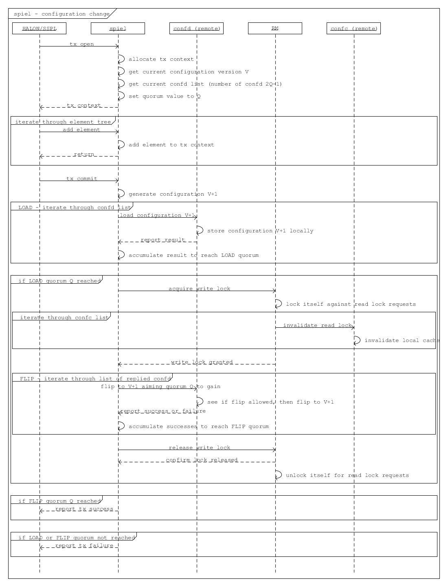

TBD: Potential issues identified to the moment:

-  Read lock invalidation is too slow or fails with some credit borrower

   -  This may block write lock acquisition

-  Write lock acquired but never released due to unrecoverable communication failure or Spiel client death

   -  This may cause all the cluster to lock out, as no confc is going to be able to complete reading configuration data

**Note:**

**[i.m0.spiel.environment]** To comply with **[r.m0.spiel.environment]** requirements the transaction must end with the Spiel making sure its confd list was initialised with identical to the list of confd contained in the newly distributed quorum version. Or the transaction make sure at the very beginning it starts with the list of confd identical to the latest known list of ones.

Otherwise the requirement seems excessive and should not be imposed at all, having only the Spiel confd initialisation list to rely on.

4.2 Configuration client
~~~~~~~~~~~~~~~~~~~~~~~~~

Cache refresh
^^^^^^^^^^^^^

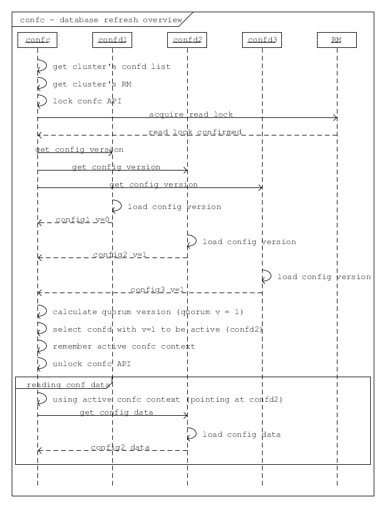

Roughly, refreshing looks like gather the current version numbers of all the known confd servers currently run, decide which version number reaches the quorum, and further loading requested configuration data from the confd server currently assigned to be active.

   **Note:** The Read lock acquisition is not a standalone call, but in    accordance with current RM design it is hidden inside every GET operation issued to the confc cache. The diagram just highlights the fact of mandatory lock acquisition to let operation complete.

Version re-election
^^^^^^^^^^^^^^^^^^^

Re-election comes in effect either on client’s start, or when the read lock revocation detected.

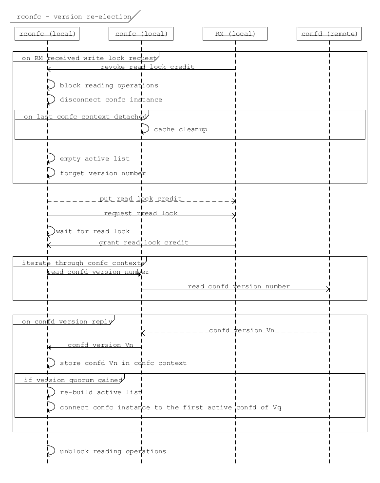

The configuration client emits asynchronous requests to all currently known confd servers aiming to collect their configuration database version numbers. When  some version reaches a quorum, it becomes a working (active) version until next re-election.

TBD: In case the required quorum was not reached, the node appears inoperable having no active confc context to communicate over. This sort of ambiguity must be solved somehow, or reporting to HA may take place as a fallback policy.

**Note:** Ideally, the process of version re-election must end with the rconfc updating its list of known confd getting the one from the newly elected version Vq, as the list may appear changed.

TBD: The Quorum number Q must be re-calculated either, immediately or on next re-election start.

RCONFC - Redundant configuration client
^^^^^^^^^^^^^^^^^^^^^^^^^^^^^^^^^^^^^^^

To work in the cluster with the multiple configuration servers, the consumer (Motr module) makes use of redundant configuration client (rconfc). The client aware of the multiple confd instances, is able to poll all the confd servers, find out the version number of configuration databases the servers run, and decide on the version to be used for reading. The decision is made when some version reaches a quorum. The rconfc carries out the whole process of version election providing communication with confd instances.

When the appropriate version elected, the rconfc acquires the read lock from RM. Successful acquisition of the lock indicates that no configuration change is currently in-progress. The lock remains granted until the next configuration change is initiated by some Spiel client.

   **Note:** The rconfc provides no special API for reading configuration data. Instead, it exposes a standard confc instance the consumer is to deal with standard way. When the rconfc initialisation succeeded, the confc instance is properly set up and connected to one of confd servers running the elected version.

When the read lock is acquired, the rconfc sets up its confc by connecting it to a confd instance running the version that reached quorum. Rconfc remains in control of all confc contexts initialisations, blocking them when the read lock is being revoked.

Having confc context initialised, consumer is allowed to conduct reading operations until the context finalisation. Rconfc is not to interfere into reading itself. When confc cache cleanup is needed, rconfc waits for all configuration objects to be properly closed and all configuration contexts to be detached from the corresponding confc instance. During this waiting rconfc is to prevent all new contexts from initialisation, and therefore, attaching to the controlled confc.

**Note:** The confc instances participating in version election are never blocked by rconfc.

RCONFC Initialisation
^^^^^^^^^^^^^^^^^^^^^

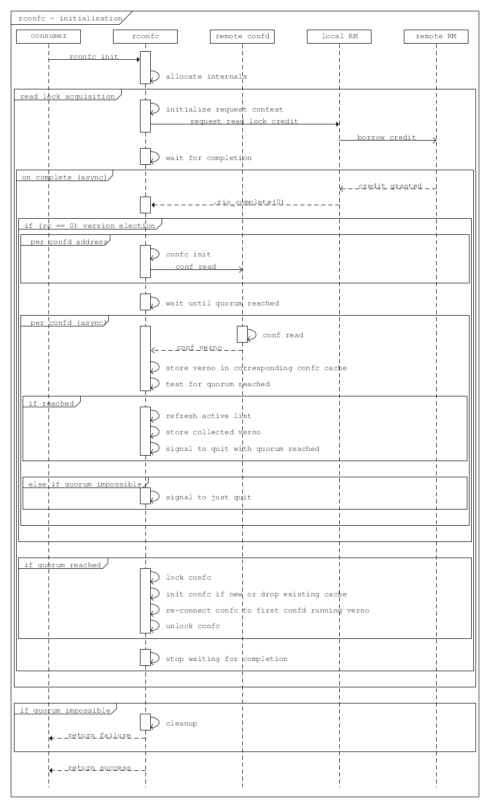

The RCONFC initialisation starts with allocation of internal structures. Mainly those are quorum calculation context and read lock context. The read lock is requested on the next step, and once successfully acquired, is continued by version election. On this step all known confd servers are polled for configuration version number. Based on the replied values a decision is made on the version number the consumer is going to read from in subsequent operations. With this version number a list of active confd servers is built, and the confc instance, hosted and exposed by the rconfc instance, is connected to one of those servers. Being successfully connected it appears ready for reading configuration data.

Normal Processing
^^^^^^^^^^^^^^^^^

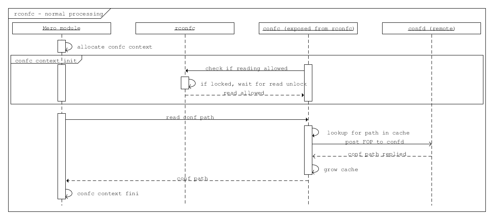

After the successful rconfc initialisation the consumer (Motr module) operates with configuration client exposed from the rconfc. The client reads the requested path usual way starting with initialising configuration context.. Internally the operation starts with confc referring to rconfc if read operation allowed at the moment, then when rconfc is not locked, the context appears initialised, and consumer goes to reading configuration path from the confc’s cache. In case the path is not in the cache, the corresponding confd is requested for the data.

In case when rconfc is locked for reading due to read lock revocation occurred because of configuration change and/or new version election, the configuration context initialisation appears blocked until the moment of rconfc unlock. Multiple configuration context initialisations done simultaneously on the same confc will be waiting for the same rconfc unlock.

Fault tolerance
^^^^^^^^^^^^^^^

Robustness is based on the configuration redundancy and provided by the ability of rconfc to switch its confc dynamically among confd instances without need in invalidating any currently cached data, because each time the switch is done to confd running the same configuration version.

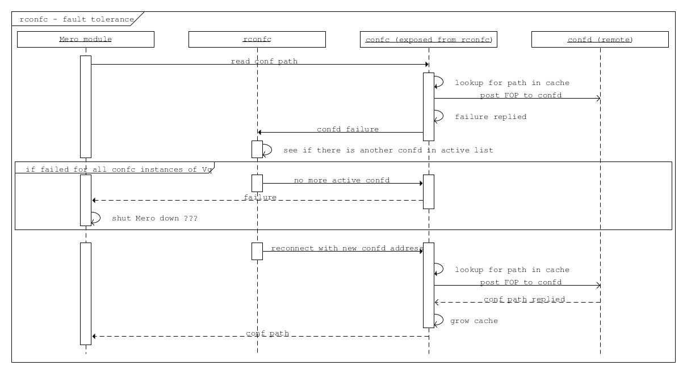

Read operation from the selected confd may fail in some cases. In this case, the rconfc must pass the configuration client using the list of confd addresses. The confd addresses point to the same quorum version (Vq) of the configuration database and try to request the respective confd servers one-by-one until getting to success or end of the list.

In the latter case the call returns failure to Motr module originated the call.

   **Note:** It is up to module what scenario to choose to properly react to the failure.

It might decide to wait and re-try to accomplish the call, or notify HA about the failure(s) and do nothing, or initiate the caller’s Motr node shutdown, etc.

Resilience against top-level RM death
^^^^^^^^^^^^^^^^^^^^^^^^^^^^^^^^^^^^^

**Requirements:**

As long as the RCONFC workflow relies on the proper handling (getting/releasing) Conf Read Lock between client and remote RM, in case of remote RM’s death there must be a way for RCONFC instance for the following:

-  Detect the fact of RM death

-  Properly handle (drop in timely fashion) all previously borrowed
   resource credits on client side

-  Initiate RCONFC restart routine

-  In the course of the latter one, discover an endpoint of top-level *online* RM newly designated by HA as well as refresh the set of CONFD services currently expected to be up and running

-  Based on the endpoints obtained from cluster, conduct RCONFC restart and re-borrow the required credits

**Assumptions:**

-  Two-tier RM architecture is in effect. (is it? does it matter???)

-  Conf database:

   -  Profile includes a set of CONFD and top-level RM services sharing same endpoints with similar services in all other profiles.

      -  The point is: no matter what profile client runs in, the set of CONFDs+ RMs endpoints remains the same, and the same *online* top-level RM endpoint is announced among profiles’ clients.

-  RM service:

   -  No matter local or remote one, is aware of HA notification mechanism, and smart enough to handle on its own any node death that may affect the balance of credits/loans.

      -  Therefore, RM client side is responsible for a limited number of aspects to take into consideration, and must not care about remote service side.

   -  Running top-level, is present in configuration on every node running CONFD service, this way making the cluster run redundant set of top-level RM services remaining in *transient* state all but one chosen by HA and promoted to *online* state.

   -  Serves simultaneously all requests for all known resource types

      -  This may be a subject for change in future design when RM service may be configured for serving some particular resource type(s) requests only

-  RM client:

   -  Initially is unaware of any CONFD/RM endpoints

   -  On (re)initialisation, is responsible for discovering from cluster:

      -  The set of CONFD endpoints to connect its conf clients to

      -  Current online RM and guaranteeing this only RM is to be used until getting explicit death notification

   -  is expected to be aware of HA notification mechanism and subscribe to HA notifications whenever required

-  HA service:

   -  is responsible for nodes’ HA status delivery to every part constituting Motr cluster. This implies, clients are to be notified the same way as the servers.

   -  is responsible for detection of current top-level RM death and designating in place of just died one a new one from the rest of *transient* RMs.

   -  notifies all known cluster nodes, currently reachable ones, about death of particular **process** as well as all its **services**.

      -  It is up to HA about the logic behind the notion of ‘dead process’

         -  This aspect may be a subject for future change, as conflict between ‘dead service’ and ‘dead process’ may cause some ambiguity in understanding and evaluating HA state for particular conf object. *The simplest resolution of the ambiguity might be considering ‘process is dead’ when having at least one ‘service is dead’ state*.

      -  The process FID is included into notification vector

         -  This may require current HA state update mechanism to be revised in the aspect of updating **process** conf object status

      -  The process’ service FIDs are included into notification vector

   -  is responsible for announcing a new epoch to disable processing requests came from the past

**Questions, points for consideration:**

-  Should *transient* RM care about its current HA state and actively reject client requests?

-  Should formerly *online* RM care about its current HA state and start actively reject client requests once being announced dead?

   -  **Note:** HA may decide to announce dead a node that actually is alive but suffered from degradation in performance or network environment.

-  Conf database versions are expected to be governed based on the same set of CONFD service endpoints, no matter what profile conf clients run in. So should be with top-level RM service used for Conf Read-Write Locks. But this scheme may appear inapplicable when we are talking about other resource types.

   -  So the question of **resource-type dependent RM service/endpoint** still requires for additional consideration.

   -  So does the question of relationship between **RM service** and **conf profile**.

**RCONFC initialisation details**

The HA session is established when module setup takes place. The session is kept in globally accessible HA context along with the list of confc instances. The Client is allowed to add an arbitrary confc instance to the list, and further HA acceptance routine is to apply standard way the received change vector to every instance in the list.

When RCONFC gets started, it obtains an already established session to HA and sends request about information regarding current set of CONFD servers and top-level RM server. The returned information is expected to include the mentioned servers’ endpoints as well as fids.

RCONFC stores the server endpoints internally to use those in subsequent calls. And received service fids are put into special ‘phoney’ instance of **confc**, while the **confc** is added to HA context. RCONFC subscribes to all **confc** objects placed into the **confc** instance cache.

**Note**: The *confc* cache is to be artificially filled with the fids of interest, but not standard ways. The reason is that at the moment RCONFC has no quorum, therefore, does not know what CONFD server to read from.

Local RM is to use the said **confc** instance for its owner’s subscription as well.

With the subscription successfully done RCONFC continues its start routine with getting read lock and starting version election.

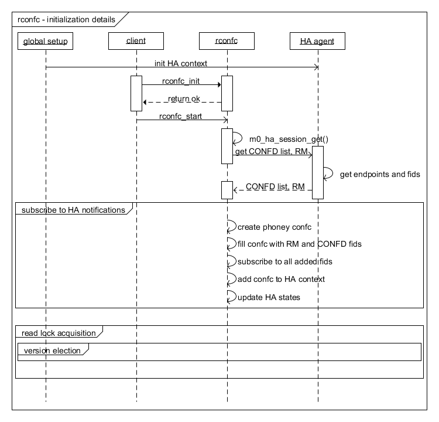

**RCONFC behavior on top-level RM death**

When HA notification about top-level RM death comes, local RM performs standard processing for creditor’s death case. That implies, RCNOFC’s resource conflict callback is called, which makes RCONFC put the held read lock. At the time RCONFC detects that its credit owner object got to final state, and after that RCONFC invokes ‘start’ routine, i.e. queries HA about current CONFD and top-level RM servers, re-subscribes in accordance with the most recent information and goes on with read lock acquisition and configuration version election.

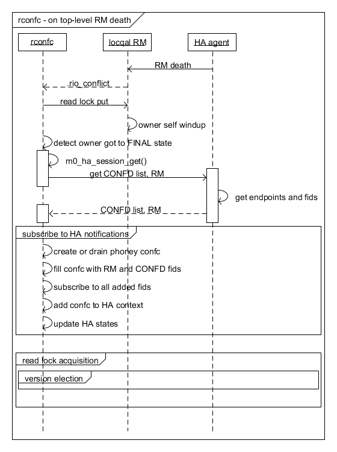

4.3 Configuration server
~~~~~~~~~~~~~~~~~~~~~~~~

The configuration server remains operating as before, i.e. on locally stored configuration database snapshot. However, the server is able to update the database file being explicitly instructed to do that.

The configuration files are placed on server side as files in the IO STOB domain. Folder STOB domain equal folder current configure FID file consists of two version number - old, new and TX ID.

The update procedure is implemented by introducing two-phase protocol.

Phase 1: LOAD
^^^^^^^^^^^^^

The command semantic implies the new database file is to be just locally stored without any interference with currently active version.

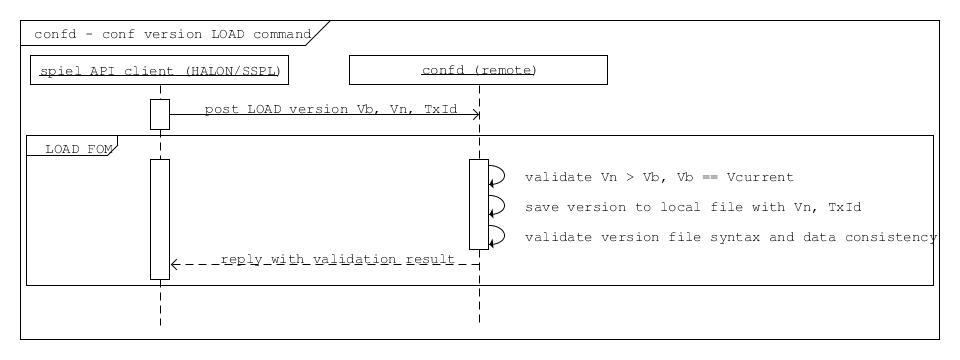

where:

   Vb: Base version number, the number recently read by confc when reaching quorum

   Vn: New version number, the number generated by Spiel on transaction start, expected to be Vmax + 1 (maximum number reported by confc contexts plus one)

   Vcurrent: Current version number stored on confd, normally equal to Vb

Though, the minimal database validation is required before saving it to local file.

During this command execution the server is able to serve any read requests from clients.

TBD: Any dead-end situations like being lack of drive free space, etc. are to be resolved some way, most probably by reporting to HA about being unable to operate any further, and possibly confd leaving cluster.

Phase 2: FLIP
^^^^^^^^^^^^^

The command explicitly instructs to find a previously loaded particular version and put it in effect.

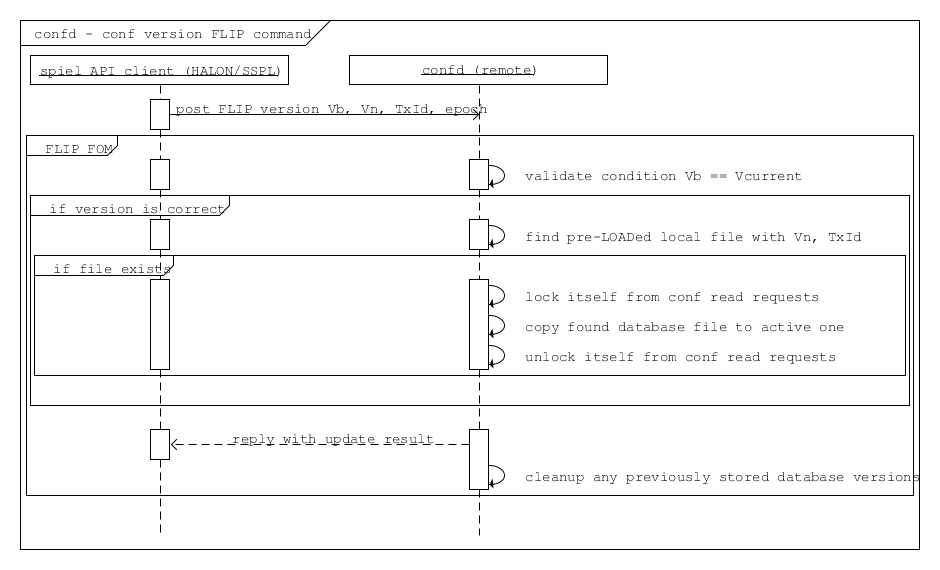

4.4 Resource Manager
~~~~~~~~~~~~~~~~~~~~

Resource manager is used to control access to the contents of confd configuration database replicas

There are mainly three types of configuration database users that operate concurrently: 

- confc
- confd
- spiel client 
 

The Confc makes read-only requests to the confd. The confd maintains configuration database and handles read/write requests to it. The spiel client issues both read and write requests to the confd.

In order to serialize access to the confd configuration database new read/write lock (**RW lock**) resource type is introduced. One RW lock is used to protect an access for all confd configuration databases.

RW Lock
^^^^^^^

The distributed RW lock is implemented over Motr resource manager. The distributed RW Lock allows concurrent access for read-only operations, while write operations require exclusive access. The confc acquires read lock and holds it to protect its local database cache. The confd does not acquire RW lock by itself, but confd clients acquire RW lock instead. The spiel client acquire read lock on transaction opening to reach the quorum and acquires write lock in order to accomplish FLIP operation.

RM Service Failover
^^^^^^^^^^^^^^^^^^^

RM service controls the access to configuration database essential for proper functioning of the whole cluster and becomes single point of failure. The following algorithm addresses this issue:

1. There are N\ :sub:`rms` RM services starting automatically at cluster startup. N\ :sub:`rms`\ = N\ :sub:`confd`.

2. Only one RM service is active at any point in time.

3. There is no synchronisation between RM services. While one is active, tracking credits for RW lock, others are idle and do nothing.

4. HA is responsible for making decision about active RM service failure.

5. When active RM service fails, HA selects new active RM service and notifies all nodes about the switch to new RM service.

6. On reception of “RM service switch” HA notification, every node drops cached credits for configuration RW lock and reacquires them using new RM address.

HA decision about RM service failure is based on notifications that are sent by Motr nodes encountering RPC timeouts during interaction with RM service. The decision about the next RM instance to be used is done by HA. This decision is provided through general HA object state notifications interface. In order to switch to new version consistently across the cluster rm services states are maintained the following way:

1. Initially states of all, but one, RM instances are set to TRANSIENT, the remaining instance being ONLINE.

2. Then, each state transition notification fop, which brings an RM service to FAILED state, simultaneously moves another RM instance to ONLINE state, maintaining an invariant that no more than one RM instance is ONLINE at any time.

If all RMs are FAILED, then it is a system failure.

Since currently active RM address should be known prior to accessing configuration database, it is provided explicitly to configuration database users (command-line parameter for m0d, initialisation parameter for spiel).

The spiel is initialised with active RM service address and then maintains this address internally, changing it on HA updates if necessary.

HA guarantees that it doesn’t change configuration database until all notifications about switching to new RM service are replied. That prevents situation when configuration database changes and some part of clients works with it through new RM service and other part works through RM service considered failed. If some node doesn’t reply for switch notification, then it should be considered FAILED by HA.

4.5 Command Interface
~~~~~~~~~~~~~~~~~~~~~

Common Part
^^^^^^^^^^^

Command interface provides an ability to change cluster state by applying actions to the objects stored in configuration database. The command interface performs actions by sending operation requests (FOPs) to the dedicated service on remote node and waiting for reply synchronously. Dedicated service RPC endpoint is determined using the information presented in the configuration database. Start-stop service (SSS) service will play role of dedicated service in current implementation.

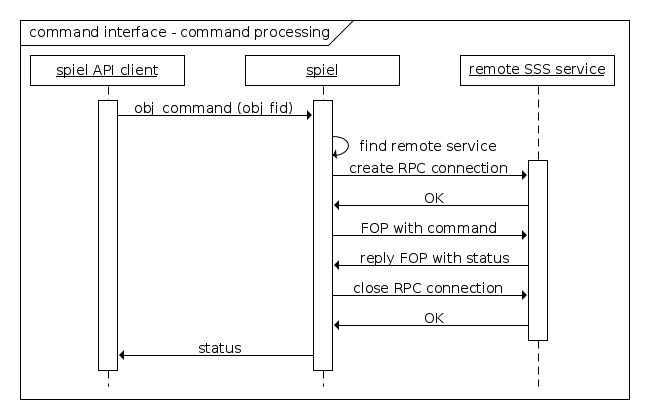

Note: Some commands return not only status, but some other information as well. For example “list services” command for process object returns status of the command and list of services.

Device Commands
^^^^^^^^^^^^^^^

Device command: attach, detach and format. Target service for these commands - SSS service.

Current devices context was loaded at start Motr instance or before Load/Flip command. Device command change current status Disk on Pool machine.

**Attach**

Search disk item in current Pool machine. Set disk status to Online uses Pool machine API (State Transit function). If call State Transit is success then create STOB if STOB not exist yet.

**Detach**

Search disk item in current Pool machine. The set disk status to Offline uses Pool machine API (State Transit function). If call State Transit is success then free STOB.

**Format**

.. This section will be written later

Process Reconfig Command
^^^^^^^^^^^^^^^^^^^^^^^^

Reconfig command applies Motr process configuration parameters stored in configuration database. There are two parameters for now: memory limits and processor cores mask.

Memory limits can be applied easily using *setrlimit* Linux API call in *m0_init* before initialisation of all subsystems.

Core mask specifies on which processors (cores) localities should be running. The core mask is applied through restarting localities. Localities is a part of FOM domain, which is initialised during Motr initialisation (*m0_init*). So, in order to restart localities the whole Motr instance should be re-initialised. That involves stopping all running services, Motr instance reinitialisation (*m0_fini/m0_init*) and starting basic services again. Motr library user is responsible for proper Motr reinitialisation. Reconfig command will be supported only by *m0d* Motr user for now. In order to notify *m0d* that Motr should be re-initialised UNIX signal is used. After reception of this signal *m0d* finalizes Motr instance and start it again.

Note that unit test can’t check process reconfiguration since UT framework behaves differently than *m0d*.

Reply to for process reconfig command is sent to the spiel user before actual reconfiguration is done. The is becasue during the reconfiguration RPC infrastructure for sending reply is lost. Therefore reply is sent before running services are stopped.

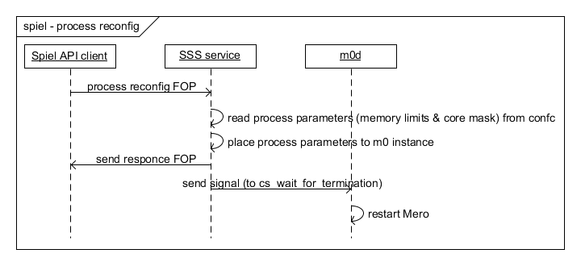

Pool commands
^^^^^^^^^^^^^

**Pool repair start command**

This command starts SNS repair processes on nodes related to the pool.

The algorithm is:

1. Find all nodes related to a pool in cluster configuration. A configuration node has pointer to the appropriate configuration pool. Therefore, nodes can be found by the pool FID.

2. Find SNS repair services, that belong to the nodes. Endpoints of a SNS repair service and the corresponding ioservice are the same. Thus, it suffices to find endpoints of ioservices.

3. Send a FOP with REPAIR opcode to every service.

4. Once the fop received, SNS repair service sends reply fop immediately and start repair process. Spiel client is able to check status of the running repair process with “pool repair status” command.

5. Return success result code to the spiel client if every service replies with success result code or return error code if one replies with error code.

.. image:: Images/SpielAPI13.png
   :alt: spiel - pool repair start.png
   :width: 6.5in
   :height: 2.81944in

**Pool rebalance start command**

This command starts SNS rebalance processes on nodes related to the pool.

The algorithm is similar to SNS repair:

1. Find all nodes related to a pool in cluster configuration. A configuration node has pointer to the appropriate configuration pool. Therefore, nodes can be found by the pool fid.

2. Find SNS rebalance services, that belong to the nodes. The endpoints of a SNS rebalance service and the corresponding ioservice are the same. Thus, it suffices to find endpoints of ioservices.

3. Send a FOP with REBALANCE opcode to every service.

4. Once the FOP received, the SNS repair service sends reply FOP immediately and start rebalance process. Spiel client is able to check status of the running rebalance process with “pool rebalance status” command.

5. Return success result code to Spiel client if every service replies with success result code or return error code if one replies with error code.

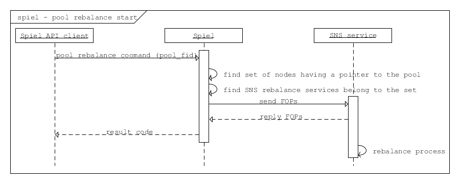

**Pool repair quiesce command**

This command pauses the SNS repair processes on nodes related to the pool.

**Note**: Currently, functionality of SNS repair pause or resume is not implemented. Therefore, the Spiel function returns -ENOSYS.

**Pool rebalance quiesce command**

This command pauses SNS rebalance processes on nodes related to the pool.

**Note**: Currently, the functionality of SNS rebalance pause or resume is not implemented. Therefore, the Spiel function returns -ENOSYS.

**Pool repair continue command**

This command resumes SNS repair process which was paused on nodes related to the pool.

The algorithm is:

1. Find all nodes related to a pool in cluster configuration. A configuration node has pointer to the appropriate configuration pool. Therefore, nodes can be found by the pool FID.

2. Find SNS repair services, that belong to the nodes. Endpoints of a SNS repair service and the corresponding ioservice are the same. Thus, it suffices to find endpoints of ioservices.

3. Send a fop with CONTINUE opcode to every service.

4. Once the fop received, SNS repair service sends reply fop immediately and resumes repair process.

5. Return success result code to Spiel client if every service replies with success result code or return error code if one replies with error code.

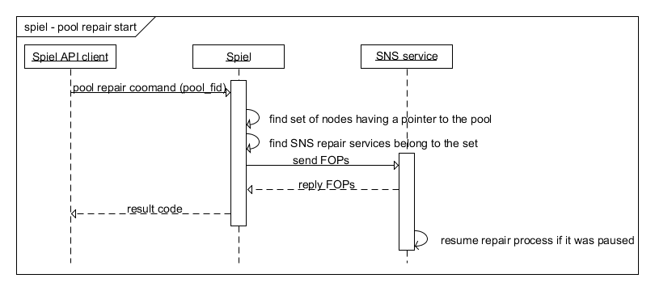

**Pool rebalance continue command**

This command resumes the SNS rebalance process which was paused on nodes related to the pool, but the SNS rebalance services imply instead SNS repair.

**Pool repair status command**

This command polls the progress of current repair process on nodes related to the pool. The SNS service reply consists of two values: 

- State of current repair process 

- Progress in percentage or number of copied bytes/total bytes or error code if repair was failed.

SNS repair may be in the following states: IDLE, STARTED, PAUSED, FAILED.

-  The service is considered IDLE, if no running repair at the moment.

-  It is STARTED, if repair is running.

-  It is PAUSED, if repair was paused.

-  It is FAILED if an error occurred during the repair;

The state diagram for repair status:

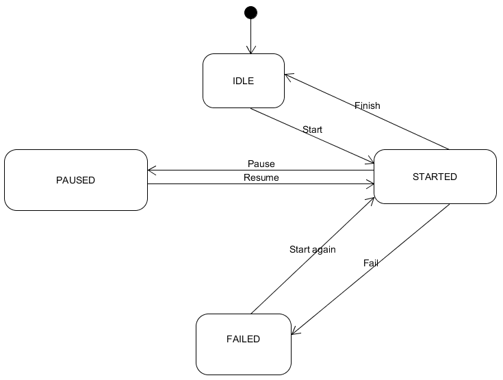

The algorithm is:

1. Find all nodes related to a pool in the cluster configuration. A configuration node has pointer to the appropriate configuration pool. Therefore, nodes can be found by the pool FID.

2. Find SNS repair services, that belong to the nodes. The endpoints of a SNS repair service and the corresponding ioservice are the same. Thus, it suffices to find endpoints of ioservices.

3. Send a FOP with STATUS opcode to every service.

4. Return success result code to Spiel client if every service replies with the progress of current repair process if it is happening.

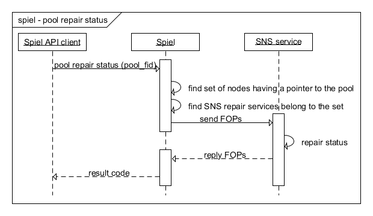

**Pool rebalance status command**

This command polls the progress of current rebalance process on nodes related to the pool.

The algorithm is the same as for the SNS repair, but the SNS rebalance services imply instead the SNS repair.

File System Commands
^^^^^^^^^^^^^^^^^^^^

This section describes commands specific to FS object.

**Get FS free/total space**

This command is intended to report free/total space the distributed file system provides across all its nodes. The counters are to be of **uint64_t** size. So far, only **ioservice** and **mdservice** are going to report the space counters. The counters are used as those are at the moment of querying, constituting no transaction of any sort.

To obtain the space sizes the spiel user has to always make an explicit call, as no size change notification mechanism is expected so far. Schematically execution is done as follows:

-  Spiel user calls API entry providing it with FS FID

-  Spiel finds FS object with the FID in configuration profile and iterates through FS node objects

-  Per node, iterates through process objects

-  Per process,

   -  Spiel makes a call for process health

      -  On correspondent SSS service side:

         -  It iterates through m0 list of BE domain segments

            -  Per segment

               -  Information is obtained from segment’s BE allocator object

                  -  total size

                  -  free size

               -  Free/total size is added to respective accumulator values

         -  If IO service is up and running, it iterates through m0 list of storage devices

            -  Per device object:

               -  Stob domain object is fetched, the one device operates on information is extracted from domain’s allocator object:

                  -  free blocks

                  -  block size

                  -  total size

               -  Total size is added to respective accumulator value unconditionally

               -  Free size is added to respective accumulator value only in case the storage device is found in the list of pool devices stored in m0 pool machine state object, and corresponding pool device state is “on-line”

         -  The final accumulator values are included into service status reply

   -  The call returns process status reply including free/total size values

   -  Spiel accumulates the size values collected per process call

-  Resultant free/total size values are returned to Spiel user

4.6 System Tests
~~~~~~~~~~~~~~~~

This section defines scenarios for system tests for Spiel functionality.

Tests are to cover two major areas:

-  Distributed confd management.

-  Control commands.

Confd#1: normal case
^^^^^^^^^^^^^^^^^^^^

-  All confd instances get the same initial DB.

-  Start all Motr nodes.

-  Validate all the confc consumers are connected to confd and loaded the same DB version.

Confd#2: split versions, with quorum
^^^^^^^^^^^^^^^^^^^^^^^^^^^^^^^^^^^^

-  First N confd instances get initial DB with version v1.

-  Remaining N + 1 confd instances get initial DB with version v2.

-  Start all Motr nodes.

-  Validate all confc consumers are connected to confd, and loaded DB version v2.

Confd#3: start with broken quorum and then restore it
^^^^^^^^^^^^^^^^^^^^^^^^^^^^^^^^^^^^^^^^^^^^^^^^^^^^^

-  First N confd instances get initial DB with version v1.

-  Next N confd instances get initial DB with version v2.

-  Remaining 1 confd instance gets initial DB with version v3.

   **Note:** there’s no “winner”, no quorum in this setup.

-  Start all Motr nodes.

-  Expected behavior:

   -  No crashes, but

   -  Cluster is not functioning.

       **Note:** This behavior needs discussion; as of now behavior for this situation is not defined.

-  Use spiel client to apply new DB version, v4.

   -  Expected to succeed.

-  Validate that all the confc consumers are now unlocked, services are started, and Motr cluster is ready to process requests (probably the easiest way would be to feed some I/O requests to Motr and make they succeeded).

Confd#4: concurrent DB updates
^^^^^^^^^^^^^^^^^^^^^^^^^^^^^^

-  Launch N spiel clients (processes or threads).

-  Each client, in a loop, tries to upload new DB version to the confd.

   -  This has to happen simultaneously over all clients, with minimal delays, in attempt to make them send actual LOAD/FLIP commands at the same time.

   -  Run a loop for some prolonged time, to increase the chances of getting the conflict.

     **Note:** This is non-deterministic test, but there does not seem to be a way within current system test framework to make this test deterministic.

-  Use (N+1)th spiel client to monitor confd state. Expectations are:

   -  confd remains “in quorum” means the algo is stable against load

   -  confd version increases means that at least some of those parallel clients succeed in updating the db -- no permanent dead-lock situations occur.

Cmd#1: control commands
^^^^^^^^^^^^^^^^^^^^^^^

-  Start Motr cluster.

-  Use spiel commands to validate health of all services and processes.

-  Restart M services.

-  Reconfig N processes. (Make sure that there are untouched services, untouched processes, restarted services within untouched processes and vice versa, and restarted services within reconfigured processes.)

-  Use spiel commands to validate health of all services and processes.

-  Perform some I/O on the Motr fs, make sure it all succeeds (thus validating that cluster is truly alive, and all services and processes are truly OK).

-  Use spiel commands to validate health of all services and processes.

Cmd#2: FS stats commands
^^^^^^^^^^^^^^^^^^^^^^^^

-  Start Motr cluster.

-  Use spiel commands to validate health of all services and processes.

-  Test IO operation effects:

   -  Get file system stats.

   -  Create new file, inflate it by a predefined number of bytes.

   -  Get file system stats, make sure free space decreased, total space remained.

   -  Delete the new file.

   -  Get file system stats, make sure free space returned to original value, total space remained.

-  Test file system repair effects:

   -  Provoke file system error.

   -  Start repair process

   -  While repairing, get file system stats, make sure free space decreased.

   -  When repair completed, get file system stats, make sure free space recovered.

-  Test reconfigure effects:

   -  Detach some device, make sure free space decreased, total space decreased.

   -  Attach the device back, make sure free space recovered, total space recovered.

   -  Format device.

   -  When formatted, make sure free space increased.

-  Stop Motr cluster.

5. Logical specification
-------------------------

.. This section defines a logical structure of the designed component: the decomposition showing *how* the functional specification is met. Subcomponents and diagrams of their interrelations should go in this section.

5.1 Conformance
~~~~~~~~~~~~~~~

.. For every requirement in the Requirements section, this sub-section explicitly describes how the requirement is discharged by the design. This section is part of a requirements tracking mechanism, so it should be formatted in some way suitable for (semi-)automatic processing.

**[i.m0.spiel]**

The Spiel library purpose, behavior patterns, and mechanisms are explicitly and extensively described by the current design document.

**[i.m0.spiel.concurrency-and-consistency]**

The concurrent and consistent configuration change distribution is described in `Configuration change, <#configuration-change>`__ `Cache refresh, <#cache-refresh>`__ `Version re-election <#version-re-election>`__ sections.

**[i.m0.spiel.transaction], [i.m0.conf.transaction]**

The transaction basic flow is described in `Configuration change <#configuration-change>`__ section.

**[i.m0.spiel.conf-db-abstraction]**

The configuration database abstraction approach is described in `Normal processing <#normal-processing>`__ and `Fault tolerance <#fault-tolerance>`__ sections.

**[i.m0.spiel.element-id-generation]**

Element ID is provided by the spiel API user by design.

**[i.m0.spiel.element-types]**

The supported element types coverage is subject for DLD.

**[i.m0.spiel.conf-actions]**

The supported configuration actions is subject for DLD.

**[i.m0.spiel.conf-validation]**

The configuration validation is described in `Phase 1: LOAD <#phase-1-load>`__ section.

**[i.m0.spiel.environment]**

See `final note <#hmpsf4n753dn>`__ in `Configuration change <#configuration-change>`__ section.

**[i.m0.spiel.cmd-iface]**

Command interface control flow is described in `Command interface <#_2jxsxqh>`__ section. Implementation details will be covered with Command interface DLD.

**[i.m0.spiel.cmd-iface-sync]**

The spiel command interface is synchronous. See `Command interface <#_2jxsxqh>`__ section.

**[i.m0.spiel.cmd-iface-ids]**

Every command interface API function has element ID as parameter.

**[i.m0.spiel.cmd-explicit]**

The configuration database change does not trigger any commands execution in the cluster (starting services, attaching new devices, etc.) These commands are issued explicitly by Spiel API user. See `Phase 1: LOAD <#phase-1-load>`__ and `Phase 2: FLIP <#phase-2-flip>`__ sections, where on configuration change no automatic command execution occurs.

**[i.m0.spiel.supported-commands]**

The supported commands list is subject for DLD.

**[i.m0.rm.rw-lock]**

The RW lock usage is described in `Cache refresh <#cache-refresh>`__ and `Version re-election <#version-re-election>`__ sections.

**[i.m0.rm.failover]**

Failover is provided by means described in `RM service failover <#rm-service-failover>`__ section.

**[i.m0.conf.replicas]**

The use of configuration database replicas is described in `Cache refresh, <#cache-refresh>`__ `Version re-election, <#version-re-election>`__ `Phase 1: LOAD, <#phase-1-load>`__ and `Phase 2: FLIP <#phase-2-flip>`__ sections.

**[i.m0.conf.consistency]**

The issue of providing consistent use of potentially inconsistent replicas is described in `Cache refresh, <#cache-refresh>`__ `Version re-election, <#version-re-election>`__ `Phase 1: LOAD, <#phase-1-load>`__ and `Phase 2: FLIP <#phase-2-flip>`__ sections.

**[i.m0.conf.delivery]**

TBD

**[i.m0.conf.quorum]**

The process of reaching quorum is described in `Cache refresh <#cache-refresh>`__ and `Version re-election <#version-re-election>`__ sections.

**[i.m0.conf.attributes]**

The use of configuration database attributes is described in `Cache refresh <#cache-refresh>`__ and `Version re-election <#version-re-election>`__ sections.

**[i.m0.confd.update-protocol]**

The two-phase update protocol is described in `Phase 1: LOAD <#phase-1-load>`__ and `Phase 2: FLIP <#phase-2-flip>`__ sections.

**[i.m0.confc.rw-lock]**

<..>

**[i.m0.confc.quorum]**

The process of reaching quorum in configuration client is described in `Version re-election <#version-re-election>`__ section.

.. 5.2 Dependencies

.. This sub-section enumerates other system and external components the component depends on. For every dependency a type of the dependency (uses, generalizes, *etc*.) must be specified together with the particular properties (requirements, invariants) the design depends upon. This section is part of a requirements tracking mechanism.

.. 5.3 Security model

.. The security model, if any, is described here.

.. 5.4 Refinement

.. This sub-section enumerates design level requirements introduced by the design. These requirements are used as input requirements for the detailed level design of the component. This sub-section is part of a requirements tracking mechanism.

.. 6 State

.. This section describes the additions or modifications to the system state (persistent, volatile) introduced by the component. As much of component behavior from the logical specification should be described as state machines as possible. The following sub-sections are repeated for every state machine.

.. 6.1 States, events, transitions

.. This sub-section enumerates state machine states, input and output events and state transitions incurred by the events with a table or diagram of possible state transitions. `UML state diagrams <http://en.wikipedia.org/wiki/UML_state_machine>`__ can be used here.

.. 6.2 State invariants

.. This sub-section describes relations between parts of the state invariant through the state modifications.

.. 6.3 Concurrency control

.. This sub-section describes what forms of concurrent access are possible and what forms on concurrency control (locking, queuing, *etc*.) are used to maintain consistency.

6. Use cases
-------------

.. This section describes how the component interacts with rest of the system and with the outside world.

6.1 Scenarios
~~~~~~~~~~~~~

.. This sub-section enumerates important use cases (to be later used as seed scenarios for ARID) and describes them in terms of logical specification. 

+-----------------------------+---------------------------------------+
| Scenario                    | [usecase.component.name]              |
+-----------------------------+---------------------------------------+
| Relevant quality attributes | [*e.g.*, fault tolerance,             |
|                             | scalability, usability, re-usability] |
+-----------------------------+---------------------------------------+
| Stimulus                    | [an incoming event that triggers the  |
|                             | use case]                             |
+-----------------------------+---------------------------------------+
| Stimulus source             | [system or external world entity that |
|                             | caused the stimulus]                  |
+-----------------------------+---------------------------------------+
| Environment                 | [part of the system involved in the   |
|                             | scenario]                             |
+-----------------------------+---------------------------------------+
| Artifact                    | [change to the system produced by the |
|                             | stimulus]                             |
+-----------------------------+---------------------------------------+
| Response                    | [how the component responds to the    |
|                             | system change]                        |
+-----------------------------+---------------------------------------+
| Response measure            | [qualitative and (preferably)         |
|                             | quantitative measures of response     |
|                             | that must be maintained]              |
+-----------------------------+---------------------------------------+
| Questions and issues        |                                       |
+-----------------------------+---------------------------------------+

.. `UML use case diagram <http://en.wikipedia.org/wiki/Use_case_diagram>`__ can be used to describe a use case.]

.. 7.2 Failures

.. This sub-section defines relevant failures and reaction to them. Invariants maintained across the failures must be clearly stated. Reaction to `Byzantine failures <http://en.wikipedia.org/wiki/Byzantine_fault_tolerance>`__ (*i.e.*, failures where a compromised component acts to invalidate system integrity) is described here.

.. 8. Analysis

.. 8.1 Scalability

.. This sub-section describes how the component reacts to the variation in input and configuration parameters: number of nodes, threads, requests, locks, utilization of resources (processor cycles, network and storage bandwidth, caches), *etc*. Configuration and work-load parameters affecting component behavior must be specified here.

.. 8.2 Other

.. As applicable, this sub-section analyses other aspects of the design, *e.g.*, recoverability of a distributed state consistency, concurrency control issues.

.. 8.3 Rationale

.. This sub-section describes why particular design was selected; what alternatives (alternative designs and variations of the design) were considered and rejected.

.. 9. Deployment

.. 9.1 Compatibility

.. Backward and forward compatibility issues are discussed here. Changes in system invariants (event ordering, failure modes, *etc*.)

.. Network

.. Persistent storage

.. Core

.. Interface changes. Changes to shared in-core data structures.

.. Installation

.. How the component is delivered and installed.

