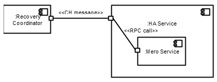

================
Motr Epochs HLD
================
Motr services may, in general, depend on global state that changes over time. Some of this global state changes only as a result of failures, such as changing the striping formula across storage pools. Since these changes are failure driven, it is the HA subsystem that coordinates state transition as well as broadcasts of state updates across the cluster.

Because failures can happen concurrently, broadcasting state updates across the cluster can never be reliable. In general, some arbitrarily large portion of the cluster will be in a crashed state or otherwise unavailable during the broadcast of a new state. It is therefore unreasonable to expect that all nodes will share the same view of the global state at all times. For example, following a storage pool layout change, some nodes may still assume an old layout. Epochs are a Motr-specific mechanism to ensure that operations from one node to another are done with respect to a shared understanding of what the global state is. The idea is to assign a number (called the epoch number) to each global state (or item thereof), and communicate this number with every operation. A node should only accept operations from other nodes if the associated epoch number is the same same as that of the current epoch of the node. In a sense, the epoch number acts as a proxy to the shared state, since epoch numbers uniquely identify states.

This document describes the design of the HA subsystem in relation to coordinating epoch transitions and recovery of nodes that have not yet joined the latest epoch.

***************
Definitions
***************   

- Shared state item: a datum, copies of which are stored on multiple in the cluster. While a set S of nodes are in a given epoch, they all agree on the value of the shared state. 

- State transition: a node is said to transition to a state when it mutates the value of a datum to match that state. 

- Epoch failure: a class of failures whose recovery entails a global state transition. It is safe to include all failures in this class, but in practice some failures might be excluded if doing so does not affect correctness but improves performance.  

- Epoch: the maximal interval in the system history through which no epoch failures are agreed upon. In terms of HA components, this means that an epoch is the interval of time spanning between two recovery sequences by the Recovery Coordinator, or between the last recovery sequence and infinity. 

- Epoch number: an epoch is identified by an epoch number, which is a 64-bit integer. A later epoch has a greater number. Epoch numbers are totally ordered in the usual way. 

- HA domain: an epoch is always an attribute of a domain. Each domain has its own epoch. Nodes can be members of multiple domains so each node may be tracking not just one epoch but in fact multiple epochs. A domain also has a set of epoch handlers associated with it.

***************
Requirements
***************

- [R.MOTR.EPOCH.BROADCAST] When the HA subsystem decides to transition to a new epoch, a message is broadcast to all nodes in the cluster to notify them of an epoch transition. This message may include (recovery) instructions to transition a new shared state. 

- [R.MOTR.EPOCH.DOMAIN] There can be multiple concurrent HA domains in the cluster. Typically, there is one epoch domain associated with each Motr request handler. 

- [R.MOTR.EPOCH.MONOTONE] The epoch for any given domain on any given node changes monotonically. That is, a node can only transition to a later epoch in a domain, not an older one. 

- [R.MOTR.EPOCH.CATCH-UP] A node A that is that is told by another node B that a newer epoch exists, either in response to a message B or because B sent a message to A mentioning a later epoch, can send to failure event to the HA subsystem to request instructions on how to reach the latest epoch.

*******************
Design Highlights
*******************

- Upon transitioning to a new epoch, the HA subsystem broadcasts the new epoch number to the entire cluster. 

- The HA subsystem does not wait for acknowledgements from individual nodes that they have indeed transitioned to the new epoch. Aggregation of acknowledgements is therefore not required. 

- Communication of HA subsystem to nodes is done using Cloud Haskell messages, to make communication with services uniform within the HA subsystem, and to circumscribe the Motr-specific parts of the epoch functionality to the services themselves.

*************************
Functional Specification
*************************

It is the Recovery Coordinator (RC), a component of the HA subsystem, that maintains the authoritative answer as to which is the current epoch of any particular HA domain. Within an HA domain, failures which fall in the class of epoch failures warrant changing the epoch of that domain. This is done by the RC following receipt of an HA event failure.

Because the epoch of a domain is global, the RC notifies the entire cluster of the fact that the domain has just transitioned to a new epoch, through a broadcast.

The broadcasted message contains instructions for the node to transition to a new state. A destination node processes the message and transitions both to the new state and the new epoch, both as per the content of the message. Transitioning to both a new state and a new epoch is an atomic operation.

Because only nodes that have transitioned to the new epoch also transition to the new state, it is safe for such nodes to communicate. Moreover, because nodes normally refuse to process RPC requests from other nodes unless the epoch number attached to the request matches the expected one, only nodes that are in the same epoch can communicate. A corollary of this fact is that nodes do not need to acknowledge to the RC that it has in fact transitioned to a new epoch. The RC can merely assume that it has, because even if the node fails to transition to the new epoch, it does not jeopardize the safety of the cluster. A node that fails to transition while all other nodes have is effectively quarantined, since it can no longer communicate in any meaningful way with any other node in the cluster.

Maximal Epoch Failure Events
============================

A node is expected to post an HA event to the HA subsystem when receiving a RPC request 
R in any of the following scenarios, where e(R) denotes the epoch of the RPC request and e(self) the epoch of the current node:

                          if e(R)≠e(self) then post an HA event to report

                                             
                                             fst(max((e(R),src(R)), (e(self),self)))

                          as late, where pairs are ordered lexicographically. 

If in addition, src(R) expects a response, then the node should respond with a “wrong epoch” error.

**********************
Logical Specification
**********************

In general, the RC interacts with services using a messaging protocol internal to the HA subsystem. This protocol is that of Cloud Haskell (CH). We introduce Cloud Haskell processes to wrap actual Motr services. This provides an endpoint for Cloud Haskell messages as well as a place to monitor the Motr service. Communication between the actual Motr service and the wrapping Cloud Haskell process happens using a Motr specific communication protocol, Motr RPC.

Reporting a Late Node
=====================

Upon receipt of an RPC request, the matching request handler checks the epoch of the sender of the message. If the epoch does not match its current epoch, then epoch handlers are invoked in turn until one epoch handler is found that returns an outcome other than M0_HEO_CONTINUE.

An epoch handler is installed that sends a message to an RPC endpoint associated with the wrapper process upon epoch mismatch, mentioning the current epoch of the HA domain to which the service belongs. If the original RPC request requires a response, then the outcome of this handler is M0_HEO_ERROR. Otherwise, the outcome is M0_HEO_DROP.

The wrapper CH process listens on the designated endpoint and waits for messages from the Motr service. Upon receipt of an epoch failure message, it forwards this message in the form of an HA event to the tracking station, through the usual channels for HA events.   

Setting the Epoch
=================

In response to a late epoch HA event, the RC needs to perform recovery of the affected node, by replaying each recovery message associated with each epoch change since the current epoch of the affected node. These messages are sent to the wrapper process, who then forwards them using Motr RPC to the actual Motr service. In the extreme, such messages can be as simple as just updating the epoch of the affected HA domain, without touching any other state in the node. Transitioning to the new epoch is done using an epoch handler, who must respond to messages from the wrapper process of a set type with the outcome M0_HEO_OBEY.

Each wrapper process maintains a structure representing the HA domain. Upon receiving an epoch transition message, the wrapper process acquires a write lock on the HA domain structure, increments the epoch and then releases the write lock. In this manner, any RPC request in given HA domain sent between the wrapper process and the actual Motr service will mention the new epoch, and hence trigger the epoch handlers in the Motr service.

***************
Interfaces
***************

To handle epoch failures, we introduce the following HA event: 

::

 EpochTransitionRequest { service :: ServiceId 
 
                        , currentEpoch :: EpochId
                        
                        , targetEpoch  :: EpochId }
                        
HA services that wrap Motr services must be able to accept the following additional messages:

::

 EpochTransition { targetEpoch            :: EpochId
 
                 , epochTransitionPayload :: a }
                 
Nodes cannot skip epochs. Therefore, an EpochTransition can only be processed if the current epoch is the one immediately preceding the target epoch. In general, to reach the target epoch of an EpochTransitionRequest, several EpochTransition messages must be sent. These will be processed in order by the target node. An EpochTransition message is parameterized by the type a of the transition payload. The transition payload is specific to each Motr service and in general contains instructions understood by the Motr service to alter the item of shared state associated with HA domain of the epoch.

We do not include an HA domain identifier explicitly in messages. This is because the HA domain is implicit in the service identifier, since we assume that there is exactly one (possibly shared) HA domain for each Motr service.

***************
Variability
***************

This design has the Cloud Haskell wrapping process communicate with a Motr service using Motr RPC. However, the internal communication mechanism between the wrapper and the Motr service could well be done through command line instead, pipes, or Unix sockets. The details of how this will be done is a point to be clarified in the future. 

