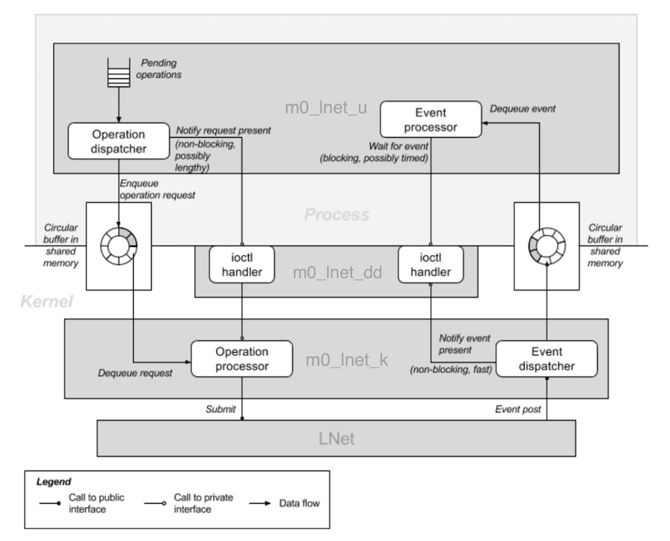

==============================
HLD OF Motr LNet Transport
==============================

This document presents a high level design (HLD) of the Motr LNet Transport. The main purposes of this document are: (i) to be inspected by Motr architects and peer designers to ascertain that high level design is aligned with Motr architecture and other designs, and contains no defects, (ii) to be a source of material for Active Reviews of Intermediate Design (ARID) and detailed level design (DLD) of the same component, (iii) to serve as a design reference document.

***************
Introduction
***************

The scope of this HLD includes the net.lnet-user and net.lnet-kernel tasks described in [1]. Portions of the design are influenced by [4].

***************
Definitions
***************

- **Network Buffer**: This term is used to refer to a struct m0_net_buffer. The word “buffer”, if used by itself, will be qualified by its context - it may not always refer to a network buffer.

- **Network Buffer Vector**: This term is used to refer to the struct m0_bufvec that is embedded in a network buffer. The related term, “I/O vector” if used, will be qualified by its context - it may not always refer to a network buffer vector.

- **Event queue, EQ LNet**: A data structure used to receive LNet events. Associated with an MD. The Lustre Networking module. It implements version 3.2 of the Portals Message Passing Interface, and provides access to a number of different transport protocols including InfiniBand and TCP over Ethernet.

- **LNet address**: This is composed of (NID, PID, Portal Number, Match bits, offset). The NID specifies a network interface end point on a host, the PID identifies a process on that host, the Portal Number identifies an opening in the address space of that process, the Match Bits identify a memory region in that opening, and the offset identifies a relative position in that memory region.

- **LNet API**: The LNet Application Programming Interface. This API is provided in the kernel and implicitly defines a PID with value LUSTRE_SRV_LNET_PID, representing the kernel. Also see ULA.

- **LNetNetworkIdentifierString**: The external string representation of an LNet Network Identifier (NID). It is typically expressed as a string of the form “Address@InterfaceType[Number]” where the number is used if there are multiple instances of the type, or plans to configure more than one interface in the future. e.g. “10.67.75.100@o2ib0”.

- **Match bits**: An unsigned 64 bit integer used to identify a memory region within the address space defined by a Portal. Every local memory region that will be remotely accessed through a Portal must either be matched exactly by the remote request, or wildcard matched after masking off specific bits specified on the local side when configuring the memory region.

- **Memory Descriptor, MD**: An LNet data structure identifying a memory region and an EQ.

- **Match Entry, ME**: An LNet data structure identifying an MD and a set of match criteria, including Match bits. Associated with a portal.

- **NID, lnet_nid_t**: Network Identifier portion of an LNet address, identifying a network end point. There can be multiple NIDs defined for a host, one per network interface on the host that is used by LNet. A NID is represented internally by an unsigned 64 bit integer, with the upper 32 bits identifying the network and the lower 32 bits the address. The network portion itself is composed of an upper 16 bit network interface type and the lower 16 bits identify an instance of that type. See LNetNetworkIdentifierString for the external representation of a NID.

- **PID, lnet_pid_t**: Process identifier portion of an LNet address. This is represented internally by a 32 bit unsigned integer. LNet assigns the kernel a PID of LUSTRE_SRV_LNET_PID (12345) when the module gets configured. This should not be confused with the operating system process identifier space which is unrelated.

- **Portal Number**: This is an unsigned integer that identifies an opening in a process address space. The process can associate multiple memory regions with the portal, each region identified by a unique set of Match bits. LNet allows up to MAX_PORTALS portals per process (64 with the Lustre 2.0 release)

- **Portals Messages Passing Interface**: An RDMA based specification that supports direct access to application memory. LNet adheres to version 3.2 of the specification.

- **RDMA ULA**: A port of the LNet API to user space, that communicates with LNet in the kernel using a private device driver. User space processes still share the same portal number space with the kernel, though their PIDs can be different. Event processing using the user space library is relatively expensive compared to direct kernel use of the LNet API, as an ioctl call is required to transfer each LNet event to user space. The user space LNet library is protected by the GNU Public License. ULA makes modifications to the LNet module in the kernel that have not yet, at the time of Lustre 2.0, been merged into the mainstream Lustre source repository. The changes are fully compatible with existing usage. The ULA code is currently in a Motr repository module.

- **LNet Transport End Point Address**: The design defines an LNet transport end point address to be a 4-tuple string in the format “LNETNetworkIdentifierString : PID : PortalNumber : TransferMachineIdentifier”. The TransferMachineIdentifier serves to distinguish between transfer machines sharing the same NID, PID and PortalNumber. The LNet Transport End Point Addresses concurrently in use on a host are distinct.

- **Mapped memory page A memory page (struct page)**: that has been pinned in memory using the get_user_pages subroutine.

- **Receive Network Buffer Pool**: This is a pool of network buffers, shared between several transfer machines. This common pool reduces the fragmentation of the cache of receive buffers in a network domain that would arise were each transfer machine to be individually provisioned with receive buffers. The actual staging and management of network buffers in the pool is provided through the [r.m0.net.network-buffer-pool] dependency.

- **Transfer Machine Identifier**: This is an unsigned integer that is a component of the end point address of a transfer machine. The number identifies a unique instance of a transfer machine in the set of addresses that use the same 3-tuple of NID, PID and Portal Number. The transfer machine identifier is related to a portion of the Match bits address space in an LNet address - i.e. it is used in the ME associated with the receive queue of the transfer machine.

Refer to [3], [5] and to net/net.h in the Motr source tree, for additional terms and definitions.

***************
Requirements
***************

- **[r.m0.net.rdma]** Remote DMA is supported. [2]

- **[r.m0.net.ib]** Infiniband is supported. [2] 

- **[r.m0.net.xprt.lnet.kernel]** Create an LNET transport in the kernel. [1] 

- **[r.m0.net.xprt.lnet.user]** Create an LNET transport for user space. [1]

- **[r.m0.net.xprt.lnet.user.multi-process]** Multiple user space processes can concurrently use the LNet transport. [1]

- **[r.m0.net.xprt.lnet.user.no-gpl]** Do not get tainted with the use of GPL interfaces in the user space implementation. [1]

- **[r.m0.net.xprt.lnet.user.min-syscalls]** Minimize the number of system calls required by the user space transport. [1]

- **[r.m0.net.xprt.lnet.min-buffer-vm-setup]** Minimize the amount of virtual memory setup required for network buffers in the user space transport. [1]

- **[r.m0.net.xprt.lnet.processor-affinity]** Provide optimizations based on processor affinity.

- **[r.m0.net.buffer-event-delivery-control]** Provide control over the detection and delivery of network buffer events.

- **[r.m0.net.xprt.lnet.buffer-registration]** Provide support for hardware optimization through buffer pre-registration.

- **[r.m0.net.xprt.auto-provisioned-receive-buffer-pool]** Provide support for a pool of network buffers from which transfer machines can automatically be provisioned with receive buffers. Multiple transfer machines can share the same pool, but each transfer machine is only associated with a single pool. There can be multiple pools in a network domain, but a pool cannot span multiple network domains.

******************
Design Highlights
******************

The following figure shows the components of the proposed design and usage relationships between it and other related components:

.. image:: Images/LNET.PNG

- The design provides an LNet based transport for the Motr Network Layer, that co-exists with the concurrent use of LNet by Lustre. In the figure, the transport is labelled m0_lnet_u in user space and m0_lnet_k in the kernel.

- The user space transport does not use ULA to avoid GPL tainting. Instead it uses a proprietary device driver, labelled m0_lnet_dd in the figure, to communicate with the kernel transport module through private interfaces.

- Each transfer machine is assigned an end point address that directly identifies the NID, PID and Portal Number portion of an LNet address, and a transfer machine identifier. The design will support multiple transfer machines for a given 3-tuple of NID, PID and Portal Number. It is the responsibility of higher level software to make network address assignments to Motr components such as servers and command line utilities, and how clients are provided these addresses.

- The design provides transport independent support to automatically provision the receive queues of transfer machines on demand, from pools of unused, registered, network buffers. This results in greater utilization of receive buffers, as fragmentation of the available buffer space is reduced by delaying the commitment of attaching a buffer to specific transfer machines.

- The design supports the reception of multiple messages into a single network buffer. Events will be delivered for each message serially.

- The design addresses the overhead of communication between user space and kernel space. In particular, shared memory is used as much as possible, and each context switch involves more than one operation or event if possible.

- The design allows an application to specify processor affinity for a transfer machine.

- The design allows an application to control how and when buffer event delivery takes place. This is of particular interest to the user space request handler.

****************************
Functional Specification
****************************

The design follows the existing specification of the Motr Network module described in net/net.h and [5] for the most part. See the Logical Specification for reasons behind the features described in the functional specification.

LNet Transfer Machine End Point Address
========================================

The Motr LNet transport defines the following 4-tuple end point address format for transfer machines:

- NetworkIdentifierString : PID : PortalNumber : TransferMachineIdentifier

where the NetworkIdentifierString (a NID string), the PID and the Portal Number are as defined in an LNet Address. The TransferMachineIdentifier is defined in the definition section.

Every Motr service request handler, client and utility program needs a set of unique end point addresses. This requirement is not unique to the LNet transport: an end point address is in general pattern

- TransportAddress : TransferMachineIdentifier

with the transfer machine identifier component further qualifying the transport address portion, resulting in a unique end point address per transfer machine. The existing bulk emulation transports use the same pattern, though they use a 2-tuple transport address and call the transfer machine identifier component a “service id” [5]. Furthermore, there is a strong relationship between a TransferMachineIdentifier and a FOP state machine locality [6] which needs further investigation. These issues are beyond the scope of this document and are captured in the [r.m0.net.xprt.lnet.address-assignment] dependency.

The TransferMachineIdentifier is represented in an LNet ME by a portion of the higher order Match bits that form a complete LNet address. See Mapping of Endpoint Address to LNet Address for details.

All fields in the end point address must be specified. For example:

- 10.72.49.14@o2ib0:12345:31:0

- 192.168.96.128@tcp1:12345:32:0

The implementation should provide support to make it easy to dynamically assign an available transfer machine identifier by specifying a * (asterisk) character as the transfer machine component of the end point addressed passed to the m0_net_tm_start subroutine:

- 10.72.49.14@o2ib0:12345:31:*

If the call succeeds, the real address assigned by be recovered from the transfer machine’s ntm_ep field. This is captured in refinement [r.m0.net.xprt.lnet.dynamic-address-assignment].

Transport Variable
------------------

The design requires the implementation to expose the following variable in user and kernel space through the header file net/lnet.h:

- extern struct m0_net_xprt m0_lnet_xprt;

The variable represents the LNet transport module, and its address should be passed to the m0_net_domain_init() subroutine to create a network domain that uses this transport. This is captured in the refinement [r.m0.net.xprt.lnet.transport-variable].

**Support for automatic provisioning from receive buffer pools**

The design includes support for the use of pools of network buffers that will be used to receive messages from one or more transfer machines associated with each pool. This results in greater utilization of receive buffers, as fragmentation is reduced by delaying the commitment of attaching a buffer to specific transfer machines. This results in transfer machines performing on-demand, minimal, policy-based provisioning of their receive queues. This support is transport independent, and hence, can apply to the earlier bulk emulation transports in addition to the LNet transport.

The design uses the struct m0_net_buffer_pool object to group network buffers into a pool. New APIs will be added to associate a network buffer pool with a transfer machine, to control the number of buffers the transfer machine will auto-provision from the pool, and additional fields will be added to the transfer machine and network buffer data structures.

The m0_net_tm_pool_attach() subroutine assigns the transfer machine a buffer pool in the same domain. A buffer pool can only be attached before the transfer machine is started. A given buffer pool can be attached to more than one transfer machine, but each transfer machine can only have an association with a single buffer pool. The life span of the buffer pool must exceed that of all associated transfer machines. Once a buffer pool has been attached to a transfer machine, the transfer machine implementation will obtain network buffers from the pool to populate its M0_NET_QT_ACTIVE_BULK_RECV queue on an as-needed basis [r.m0.net.xprt.support-for-auto-provisioned-receive-queue].

The application provided buffer operation completion callbacks are defined by the callbacks argument of the attach subroutine - only the receive queue callback is used in this case. When the application callback is invoked upon receipt of a message, it is up to the application callback to determine whether to return the network buffer to the pool (identified by the network buffer’s nb_pool field) or not. The application should make sure that network buffers with the M0_NET_BUF_QUEUED flag set are not released back to the pool - this flag would be set in situations where there is sufficient space left in the network buffer for additional messages. See Requesting multiple message delivery in a single network buffer for details.

When a transfer machine is stopped or fails, receive buffers that have been provisioned from a buffer pool will be put back into that pool by the time the state change event is delivered.

The m0_net_domain_buffer_pool_not_empty() subroutine should be used, directly or indirectly, as the “not-empty” callback of a network buffer pool. We recommend direct use of this callback - i.e. the buffer pool is dedicated for receive buffers provisioning purposes only.

Mixing automatic provisioning and manual provisioning in a given transfer machine is not recommended, mainly because the application would have to support two buffer release mechanisms for the automatic and manually provisioned network buffers, which may get confusing. See Automatic provisioning of receive buffers for details on how automatic provisioning works.

**Requesting multiple message delivery in a single network buffer**

The design extends the semantics of the existing Motr network interfaces to support delivery of multiple messages into a single network buffer. This requires the following changes:

- A new field in the network buffer to indicate a minimum size threshold.

- A documented change in behavior in the M0_NET_QT_MSG_RECV callback.

The API will add the following field to struct m0_net_buffer:

.. code-block:: C

 struct m0_net_buffer {
 
    …
    
    m0_bcount_t nb_min_receive_size; 
    
    uint32_t nb_max_receive_msgs;
    
 };
 
These values are only applicable to network buffers on the M0_NET_QT_MSG_RECV queue. If the transport supports this feature, then the network buffer is reused if possible, provided there is at least nb_min_receive_size space left in the network buffer vector embedded in this network buffer after a message is received. A zero value for nb_min_receive_size is not allowed. At most nb_max_receive_msgs messages are permitted in the buffer.

The M0_NET_QT_MSG_RECV queue callback handler semantics are modified to not clear the M0_NET_BUF_QUEUED flag if the network buffer has been reused. Applications should not attempt to add the network buffer to a queue or de-register it until an event arrives with this flag unset.

See Support for multiple message delivery in a single network buffer.

**Specifying processor affinity for a transfer machine**

The design provides an API for the higher level application to associate the internal threads used by a transfer machine with a set of processors. In particular the API guarantees that buffer and transfer machine callbacks will be made only on the processors specified.

.. code-block:: C

 #include “lib/processor.h”
 
 ...
 
 int m0_net_tm_confine(struct m0_net_transfer_mc *tm, const struct m0_bitmap *processors);
 
Support for this interface is transport specific and availability may also vary between user space and kernel space. If used, it should be called before the transfer machine is started. See Processor affinity for transfer machines for further detail.

**Controlling network buffer event delivery**

The design provides the following APIs for the higher level application to control when network buffer event delivery takes place and which thread is used for the buffer event callback.

.. code-block:: C

 void m0_net_buffer_event_deliver_all(struct m0_net_transfer_mc *tm); 
 int m0_net_buffer_event_deliver_synchronously(struct m0_net_transfer_mc *tm); 
 bool m0_net_buffer_event_pending(struct m0_net_transfer_mc *tm); 
 void m0_net_buffer_event_notify(struct m0_net_transfer_mc *tm, struct m0_chan *chan);
 
See Request handler control of network buffer event delivery for the proposed usage.

The m0_net_buffer_event_deliver_synchronously() subroutine must be invoked before starting the transfer machine, to disable the automatic asynchronous delivery of network buffer events on a transport provided thread. Instead, the application should periodically check for the presence of network buffer events with the m0_net_buffer_event_pending() subroutine and if any are present, cause them to get delivered by invoking the m0_net_buffer_event_deliver_all() subroutine. Buffer events will be delivered on the same thread making the subroutine call, using the existing buffer callback mechanism. If no buffer events are present, the application can use the non-blocking m0_net_buffer_event_notify() subroutine to request notification of the arrival of the next buffer event on a wait channel; the application can then proceed to block itself by waiting on this and possibly other channels for events of interest.

This support will not be made available in existing bulk emulation transports, but the new APIs will not indicate error if invoked for these transports. Instead, asynchronous network buffer event delivery is always enabled and these new APIs will never signal the presence of buffer events for these transports. This allows a smooth transition from the bulk emulation transports to the LNet transport.

Additional Interfaces
----------------------

The design permits the implementation to expose additional interfaces if necessary, as long as their usage is optional. In particular, interfaces to extract or compare the network interface component in an end point address would be useful to the Motr request handler setup code. Other interfaces may be required for configurable parameters controlling internal resource consumption limits.

**Support for multiple message delivery in a single network buffer**

The implementation will provide support for this feature by using the LNet max_size field in a memory descriptor (MD).

The implementation should de-queue the receive network buffer when LNet unlinks the MD associated with the network buffer vector memory. The implementation must ensure that there is a mechanism to indicate that the M0_NET_BUF_QUEUED flag should not be cleared by the m0_net_buffer_event_post() subroutine under these circumstances. This is captured in refinement [r.m0.net.xprt.lnet.multiple-messages-in-buffer].

**Automatic provisioning of receive buffers**

The design supports policy based automatic provisioning of network buffers to the receive queues of transfer machines from a buffer pool associated with the transfer machine. This support is independent of the transport being used, and hence can apply to the earlier bulk emulation transports as well.

A detailed description of a buffer pool object itself is beyond the scope of this document, and is covered by the [r.m0.net.network-buffer-pool] dependency, but briefly, a buffer pool has the following significant characteristics:

- It is associated with a single network domain.

- It contains a collection of unused, registered network buffers from the associated network domain.

- It provides non-blocking operations to obtain a network buffer from the pool, and to return a network buffer to the pool.

- It provides a “not-empty” callback to notify when buffers are added to the pool.

- It offers policies to enforce certain disciplines like the size and number of network buffers.

The rest of this section refers to the data structures and subroutines described in the functional specification section, Support for auto-provisioning from receive buffer pools.

The m0_net_tm_pool_attach() subroutine is used, prior to starting a transfer machine, to associate it with a network buffer pool. This buffer pool is assumed to exist until the transfer machine is finalized. When the transfer machine is started, an attempt is made to fill the M0_NET_QT_MSG_RECV queue with a minimum number of network buffers from the pool. The network buffers will have their nb_callbacks value set from the transfer machine’s ntm_recv_pool_callbacks value.

The advantages of using a common pool to provision the receive buffers of multiple transfer machines diminishes as the minimum receive queue length of a transfer machine increases. This is because as the number increases, more network buffers need to be assigned (“pinned”) to specific transfer machines, fragmenting the total available receive network buffer space. The best utilization of total receive network buffer space is achieved by using a minimum receive queue length of 1 in all the transfer machines; however, this could result in messages getting dropped in the time it takes to provision a new network buffer when the first gets filled. The default minimum receive queue length value is set to 2, a reasonably balanced compromise value; it can be modified with the m0_net_tm_pool_length_set() subroutine if desired.

Transports automatically dequeue receive buffers when they get filled; notification of the completion of the buffer operation is sent by the transport with the m0_net_buffer_event_post() subroutine. This subroutine will be extended to get more network buffers from the associated pool and add them to the transfer machine’s receive queue using the internal in-tm-mutex equivalent of the m0_net_buffer_add subroutine, if the length of the transfer machine’s receive queue is below the value of ntm_recv_queue_min_length. The re-provisioning attempt is made prior to invoking the application callback to deliver the buffer event so as to minimize the amount of time the receive queue is below its minimum value.

The application has a critical role to play in the returning a network buffer back to its pool. If this is not done, it is possible for the pool to get exhausted and messages to get lost. This responsibility is no different from normal non-pool operation, where the application has to re-queue the receive network buffer. The application should note that when multiple message delivery is enabled in a receive buffer, the buffer flags should be examined to determine if the buffer has been dequeued.

It is possible for the pool to have no network buffers available when the m0_net_buffer_event_post() subroutine is invoked. This means that a transfer machine receive queue length can drop below its configured minimum, and there has to be a mechanism available to remedy this when buffers become available once again. Fortunately, the pool provides a callback on a “not-empty” condition. The application is responsible for arranging that the m0_net_domain_recv_pool_not_empty() subroutine is invoked from the pool’s “not-empty” callback. When invoked in response to the “not-empty” condition, this callback will trigger an attempt to provision the transfer machines of the network domain associated with this pool, until their receive queues have reached their minimum length. While doing so, care should be taken that minimal work is actually done on the pool callback - the pool get operation in particular should not be done. Additionally, care should be taken to avoid obtaining the transfer machine’s lock in this arbitrary thread context, as doing so would reduce the efficacy of the transfer machine’s processor affinity. See Concurrency control for more detail on the serialization model used during automatic provisioning and the use of the ntm_recv_queue_deficit atomic variable.

The use of a receive pool is optional, but if attached to a transfer machine, the association lasts the life span of the transfer machine. When a transfer machine is stopped or failed, receive buffers from (any) buffer pools will be put back into their pool. This will be done by the m0_net_tm_event_post() subroutine before delivering the state change event to the application or signalling on the transfer machine’s channel.

There is no reason why automatic and manual provisioning cannot co-exist. It is not desirable to mix the two, but mainly because the application has to handle two different buffer release schemes- transport level semantics of the transfer machine are not affected by the use of automatic provisioning.

**Future LNet buffer registration support**

The implementation can support hardware optimizations available at buffer registration time, when made available in future revisions of the LNet API. In particular, Infiniband hardware internally registers a vector (translating a virtual memory address to a "bus address") and produces a cookie, identifying the vector. It is this vector registration capability that was the original reason to introduce m0_net_buf_register(), as separate from m0_net_buf_add() in the Network API.

**Processor affinity for transfer machines**

The API allows an application to associate the internal threads used by a transfer machine with a set of processors. This must be done using the m0_net_tm_confine() subroutine before the transfer machine is started. Support for this interfaces is transport specific and availability may also vary between user space and kernel space. The API should return an error if not supported.

The design assumes that the m0_thread_confine() subroutine from “lib/thread.h” will be used to implement this support. The implementation will need to define an additional transport operation to convey this request to the transport.

The API provides the m0_net_tm_colour_set() subroutine for the application to associate a “color” with a transfer machine. This colour is used when automatically provisioning network buffers to the receive queue from a buffer pool. The application can also use this association explicitly when provisioning network buffers for the transfer machine in other buffer pool use cases. The colour value can be fetched with the m0_net_tm_colour_get() subroutine.

**Synchronous network buffer event delivery**

The design provides support for an advanced application (like the Request handler) to control when buffer events are delivered. This gives the application greater control over thread scheduling and enables it to co-ordinate network usage with that of other objects, allowing for better locality of reference. This is illustrated in the Request handler control of network buffer event delivery use case. The feature will be implemented with the [r.m0.net.synchronous-buffer-event-delivery] refinement.

If this feature is used, then the implementation should not deliver buffer events until requested, and should do so only on the thread invoking the m0_net_buffer_event_deliver_all() subroutine - i.e. network buffer event delivery is done synchronously under application control. This subroutine effectively invokes the m0_net_buffer_event_post() subroutine for each pending buffer event. It is not an error if no events are present when this subroutine is called; this addresses a known race condition described in Concurrency control.

The m0_net_buffer_event_pending() subroutine should not perform any context switching operation if possible. It may be impossible to avoid the use of a serialization primitive while doing so, but proper usage by the application will considerably reduce the possibility of a context switch when the transfer machine is operated in this fashion.

The notification of the presence of a buffer event must be delivered asynchronously to the invocation of the non-blocking m0_net_buffer_event_notify() subroutine. The implementation must use a background thread for the task; presumably the application will confine this thread to the desired set of processors with the m0_net_tm_confine() subroutine. The context switching impact is low, because the application would not have invoked the m0_net_buffer_event_notify() subroutine unless it had no work to do. The subroutine should arrange for the background thread to block until the arrival of the next buffer event (if need be) and then signal on the specified channel. No further attempt should be made to signal on the channel until the next call to the m0_net_buffer_event_notify() subroutine - the implementation can determine the disposition of the thread after the channel is signalled.

**Efficient communication between user and kernel spaces**

The implementation shall use the following strategies to reduce the communication overhead between user and kernel space:

- Use shared memory as much as possible instead of copying data.

- The LNet event processing must be done in the kernel.

- Calls from user space to the kernel should combine as many operations as possible.

- Use atomic variables for serialization if possible. Dependency [r.m0.lib.atomic.interoperable-kernel-user-support].

- Resource consumption to support these communication mechanisms should be bounded and configurable through the user space process.

- Minimize context switches. This is captured in refinement [r.m0.net.xprt.lnet.efficient-user-to-kernel-comm].

As an example, consider using a producer-consumer pattern with circular queues to both initiate network buffer operations and deliver events. These circular queues are allocated in shared memory and queue position indices (not pointers) are managed via atomic operations. Minimal data is actually copied between user and kernel space - only notification of production. Multiple operations can be processed per transition across the user-kernel boundary.

- The user space transport uses a classical producer-consumer pattern to queue pending operations with the operation dispatcher in the kernel. The user space operation dispatcher will add as many pending operations as possible from its pending buffer operation queue, to the circular queue for network buffer operations that it shares with its counterpart in the kernel, the operations processor. As part of this step, the network buffer vector for the network buffer operation will be copied to the shared circular queue, which minimizes the payload of the notification ioctl call that follows. Once it has drained its pending operations queue or filled the circular buffer, the operation dispatcher will then notify the operation processor in the kernel, via an ioctl, that there are items to process in the shared circular queue. The operation dispatcher will schedule these operations in the context of the ioctl call itself, recovering and mapping each network buffer vector into kernel space. The actual payload of the ioctl call itself is minimal, as all the operational data is in the shared circular queue.

- A similar producer-consumer pattern is used in the reverse direction to send network buffer completion events from the kernel to user space. The event processor in user space has a thread blocked in an ioctl call, waiting for notification on the availability of buffer operation completion events in the shared circular event queue. When the call returns with an indication of available events, the event processor dequeues and delivers each event from the circular queue until the queue is empty. The cycle then continues with the event processor once again blocking on the same kernel ioctl call. The minor race condition implicit in the temporal separation between the test that the circular queue is empty and the ioctl call to wait, is easily overcome by the ioctl call returning immediately if the circular queue is not empty. In the kernel, the event dispatcher arranges for such an blocking ioctl call to unblock after it has added events to the circular queue. It is up to the implementation to ensure that there are always sufficient slots available in the circular queue so that events do not get dropped; this is reasonably predictable, being a function of the number of pending buffer operations and the permitted reuse of receive buffers.

This is illustrated in the following figure:

Conformance
===============

- [i.m0.net.rdma] LNET supports RDMA and the feature is exposed through the Motr network bulk interfaces.

- [i.m0.net.ib] LNET supports Infiniband.

- [i.m0.net.xprt.lnet.kernel] The design provides a kernel transport.

- [i.m0.net.xprt.lnet.user] The design provides a user space transport.

- [i.m0.net.xprt.lnet.user.multi-process] The design allows multiple concurrent user space processes to use LNet.

- [i.m0.net.xprt.lnet.user.no-gpl] The design avoids using user space GPL interfaces. 

- [i.m0.net.xprt.lnet.user.min-syscalls] The [r.m0.net.xprt.lnet.efficient-user-to-kernel-comm] refinement will address this.

- [i.m0.net.xprt.lnet.min-buffer-vm-setup] During buffer registration user memory pages get pinned in the kernel.

- [i.m0.net.xprt.lnet.processor-affinity] LNet currently provides no processor affinity support. The [r.m0.net.xprt.lnet.processor-affinity] refinement will provide higher layers the ability to associate transfer machine threads with processors. 

- [r.m0.net.buffer-event-delivery-control] The [r.m0.net.synchronous-buffer-event-delivery] refinement will provide this feature.

- [i.m0.net.xprt.lnet.buffer-registration] The API supports buffer pre-registration before use. Any hardware optimizations possible at this time can be utilized when available through the LNet API. See Future LNet buffer registration support.

- [i.m0.net.xprt.auto-provisioned-receive-buffer-pool] The design provides transport independent support to automatically provision the receive queues of transfer machines on demand, from pools of unused, registered, network buffers.

Dependencies
===============

- [r.lnet.preconfigured] The design assumes that LNET modules and associated LNDs are pre-configured on a host.

- [r.m0.lib.atomic.interoperable-kernel-user-support] The design assumes that the Motr library’s support for atomic operations is interoperable across the kernel and user space boundaries when using shared memory.

- [r.m0.net.xprt.lnet.address-assignment] The design assumes that the assignment of LNet transport addresses to Motr components is made elsewhere. Note the constraint that all addresses must use a PID value of 12345, and a Portal Number that does not clash with existing usage (Lustre and Cray). It is recommended that all Motr servers be assigned low (values close to 0) transfer machine identifiers values. In addition, it is recommended that some set of such addresses be reserved for Motr tools that are relatively short lived - they will dynamically get transfer machine identifiers at run time. These two recommendations reduce the chance of a collision between Motr server transfer machine identifiers and dynamic transfer machine identifiers. Another aspect to consider is the possible alignment of FOP state machine localities [6] with transfer machine identifiers.

- [r.m0.net.network-buffer-pool] Support for a pool of network buffers involving no higher level interfaces than the network module itself. There can be multiple pools in a network domain, but a pool cannot span multiple network domains. Non-blocking interfaces are available to get and put network buffers, and a callback to signal the availability of buffers is provided. This design benefits considerably from a “colored” variant of the get operation, one that will preferentially return the most recently used buffer last associated with a specific transfer machine, or if none such are found, a buffer which has no previous transfer machine association, or if none such are found, the least recently used buffer from the pool, if any.

Supporting this variant efficiently may require a more sophisticated internal organization of the buffer pool than is possible with a simple linked list; however, a simple ordered linked list could suffice if coupled with a little more sophisticated selection mechanism than “head-of-the-list”. Note that buffers have no transfer machine affinity until first used, and that the nb_tm field of the buffer can be used to determine the last transfer machine association when the buffer is put back into the pool. Here are some possible approaches:

- Add buffers with no affinity to the tail of the list, and push returned buffers to the head of the list. This approach allows for a simple O(n) worst case selection algorithm with possibly less average overhead (n is the average number of buffers in the free list). A linear search from the head of the list will break off when a buffer of the correct affinity is found, or a buffer with no affinity is found, or else the buffer at the tail of the list is selected, meeting the requirements mentioned above. In steady state, assuming an even load over the transfer machines, a default minimum queue length of 2, and a receive buffer processing rate that keeps up with the receive buffer consumption rate, there would only be one network buffer per transfer machine in the free list, and hence the number of list elements to traverse would be proportional to the number of transfer machines in use. In reality, there may be more than one buffer affiliated with a given transfer machine to account for the occasional traffic burst. A periodic sweep of the list to clear the buffer affiliation after some minimum time in the free list (reflecting the fact that that the value of such affinity reduces with time spent in the buffer pool), would remove such extra buffers over time, and serve to maintain the average level of efficiency of the selection algorithm. The nb_add_time field of the buffer could be used for this purpose, and the sweep itself could be piggybacked into any get or put call, based upon some time interval. Because of the sorting order, the sweep can stop when it finds the first un-affiliated buffer or the first buffer within the minimum time bound.

- A further refinement of the above would be to maintain two linked lists, one for un-affiliated buffers and one for affiliated buffers. If the search of the affiliated list is not successful, then the head of the unaffiliated list is chosen. A big part of this variant is that returned buffers get added to the tail of the affiliated list. This will increase the likelihood that a get operation would find an affiliated buffer toward the head of the affiliated list, because automatic re-provisioning by a transfer machine takes place before the network buffer completion callback is made, and hence before the application gets to process and return the network buffer to the pool. The sweep starts from the head of the affiliated list, moving buffers to the unaffiliated list, until it finds a buffer that is within the minimum time bound.

Better than O(n) search (closer to O(1)) can be accomplished with more complex data structures and algorithms. Essentially it will require maintaining a per transfer machine list somewhere. The pool can only learn of the existence of a new transfer machine when the put operation is involved and will have to be told when the transfer machine is stopped. If the per transfer machine list is anchored in the pool, then the set of such anchors must be dynamically extensible. The alternative of anchoring the list in the transfer machine itself has pros and cons; it would work very well for the receive buffer queue, but does not extend to support other buffer pools for arbitrary purposes. In other words, it is possible to create an optimal 2-level pool (a per transfer machine pool in the data structure itself, with a shared backing store buffer pool) dedicated to receive network buffer processing, but not a generalized solution. Such a pool would exhibit excellent locality of reference but would be more complex because high water thresholds would have to be maintained to return buffers back to the global pool.

Security Model
==============

No security model is defined; the new transport inherits whatever security model LNet provides today.

Refinement
==========

- [r.m0.net.xprt.lnet.transport-variable]

  - The implementation shall name the transport variable as specified in this document.

- [r.m0.net.xprt.lnet.end-point-address]

  - The implementation should support the mapping of end point address to LNet address as described in Mapping of Endpoint Address to LNet Address, including the reservation of a portion of the match bit space in which to encode the transfer machine identifier.

- [r.m0.net.xprt.support-for-auto-provisioned-receive-queue] The implementation should follow the strategy outlined in Automatic provisioning of receive buffers. It should also follow the serialization model outlined in Concurrency control.

- [r.m0.net.xprt.lnet.multiple-messages-in-buffer]

  - Add a nb_min_receive_size field to struct m0_net_buffer.

  - Document the behavioral change of the receive message callback.

  - Provide a mechanism for the transport to indicate that the M0_NET_BUF_QUEUED flag should not be cleared by the m0_net_buffer_event_post() subroutine.

  - Modify all existing usage to set the nb_min_receive_size field to the buffer length.

- [r.m0.net.xprt.lnet.efficient-user-to-kernel-comm] 

  - The implementation should follow the strategies recommended in Efficient communication between user and kernel spaces, including the creation of a private device driver to facilitate such communication.

- [r.m0.net.xprt.lnet.cleanup-on-process-termination]

  - The implementation should release all kernel resources held by a process using the LNet transport when that process terminates.

- [r.m0.net.xprt.lnet.dynamic-address-assignment]

  - The implementation may support dynamic assignment of transfer machine identifier using the strategy outlined in Mapping of Endpoint Address to LNet Address. We recommend that the implementation dynamically assign transfer machine identifiers from higher numbers downward to reduce the chance of conflicting with well-known transfer machine identifiers.

- [r.m0.net.xprt.lnet.processor-affinity] 

  - The implementation must provide support for this feature, as outlined in Processor affinity for transfer machines. The implementation will need to define an additional transport operation to convey this request to the transport. Availability may vary by kernel or user space.

- [r.m0.net.synchronous-buffer-event-delivery] 

  - The implementation must provide support for this feature as outlined in Controlling network buffer event delivery and Synchronous network buffer event delivery.
  
State
=====

A network buffer used to receive messages may be used to deliver multiple messages if its nb_min_receive_size field is non-zero. Such a network buffer may still be queued when the buffer event signifying a received message is delivered.

When a transfer machine stops or fails, all network buffers associated with buffer pools should be put back into their pool. The atomic variable, ntm_recv_pool_deficit, used to count the number of network buffers needed should be set to zero. This should be done before notification of the state change is made.

Transfer machines now either support automatic asynchronous buffer event delivery on a transport thread (the default), or can be configured to synchronously deliver buffer events on an application thread. The two modes of operation are mutually exclusive and must be established before starting the transfer machine.

State Invariants
-----------------

User space buffers pin memory pages in the kernel when registered. Hence, registered user space buffers must be associated with a set of kernel struct page pointers to the referenced memory.

The invariants of the transfer machine and network buffer objects should capture the fact that if a pool is associated with these objects, then the pool is in the same network domain. The transfer machine invariant, in particular, should ensure that the value of the atomic variable, ntm_recv_pool_deficit is zero when the transfer machine is in an inoperable state.

See the refinement [r.m0.net.xprt.support-for-auto-provisioned-receive-queue].

Concurrency Control
--------------------

The LNet transport module is sandwiched between the asynchronous Motr network API above, and the asynchronous LNet API below. It must plan on operating within the serialization models of both these components. In addition, significant use is made of the kernel’s memory management interfaces, which have their own serialization model. The use of a device driver to facilitate user space to kernel communication must also be addressed.

The implementation mechanism chosen will further govern the serialization model in the kernel. The choice of the number of EQs will control how much inherent independent concurrency is possible. For example, sharing of EQs across transfer machines or for different network buffer queues could require greater concurrency control than the use of dedicated EQs per network buffer queue per transfer machine.

Serialization of the kernel transport is anticipated to be relatively straightforward, with safeguards required for network buffer queues.

Serialization between user and kernel space should take the form of shared memory circular queues co-ordinated with atomic indices. A producer-consumer model should be used, with opposite roles assigned to the kernel and user space process; appropriate notification of change should be made through the device driver. Separate circular queues should be used for buffer operations (user to kernel) and event delivery (kernel to user). [r.m0.net.xprt.lnet.efficient-user-to-kernel-comm]

Automatic provisioning can only be enabled before a transfer machine is started. Once enabled, it cannot be disabled. Thus, provisioning operations are implicitly protected by the state of the transfer machine - the “not-empty” callback subroutine will never fail to find its transfer machine, though it should take care to examine the state before performing any provisioning. The life span of a network buffer pool must exceed that of the transfer machines that use the pool. The life span of a network domain must exceed that of associated network buffer pools.

Automatic provisioning of receive network buffers from the receive buffer pool takes place either through the m0_net_buffer_event_post() subroutine or triggered by the receive buffer pool’s “not-empty” callback with the m0_net_domain_buffer_pool_not_empty subroutine. Two important conditions should be met while provisioning:

- Minimize processing on the pool callback: The buffer pool maintains its own independent lock domain; it invokes the m0_net_domain_buffer_pool_not_empty subroutine (provided for use as the not-empty callback) while holding its lock. The callback is invoked on the stack of the caller who used the put operation on the pool. It is essential, therefore, that the not-empty callback perform minimal work - it should only trigger an attempt to reprovision transfer machines, not do the provisioning.

- Minimize interference with the processor affinity of the transfer machine: Ideally, the transfer machine is only referenced on a single processor, resulting in a strong likelihood that its data structures are in the cache of that processor. Provisioning transfer machines requires iteration over a list, and if the transfer machine lock has to be obtained for each, it could adversely impact such caching. We provided the atomic variable, ntm_recv_pool_deficit, with a count of the number of network buffers to provision so that this lock is obtained only when the transfer machine really needs to be provisioned, and not for every invocation of the buffer pool callback. The transfer machine invariant will enforce that the value of this atomic will be 0 when the transfer machine is not in an operable state.

Actual provisioning should be done on a domain private thread awoken for this purpose. A transfer machine needs provisioning if it is in the started state, it is associated with the pool, and its receive queue length is less than the configured minimum (determined via an atomic variable as outlined above). To provision, the thread will obtain network buffers from the pool with the get() operation, and add them to the receive queue of the transfer machine with the (internal equivalent) of the m0_net_buffer_add_call that assumes that the transfer machine is locked.

The design requires that receive buffers obtained from buffer pools be put back to their pools when a transfer machine is stopped or fails, prior to notifying the higher level application of the change in state. This action will be done in the m0_net_tm_event_post() subroutine, before invoking the state change callback. The subroutine obtains the transfer machine mutex, and hence has the same degree of serialization as that used in automatic provisioning.

The synchronous delivery of network buffer events utilizes the transfer machine lock internally, when needed. The lock must not be held in the m0_net_buffer_event_deliver_all() subroutine across calls to the m0_net_buffer_event_post() subroutine.

In the use case described in Request handler control of network buffer event delivery there is a possibility that the application could wake up for reasons other than the arrival of a network buffer event, and once more test for the presence of network buffer events even while the background thread is making a similar test. It is possible that the application could consume all events and once more make a request for future notification while the semaphore count in its wait channel is non-zero. In this case it would return immediately, find no additional network events and repeat the request; the m0_net_buffer_event_deliver_all() subroutine will not return an error if no events are present.

Scenarios
===============
A Motr component, whether it is a kernel file system client, server, or tool, uses the following pattern for multiple-message reception into a single network buffer.

#. The component creates and starts one or more transfer machines, identifying the actual end points of the transfer machines.

#. The component provisions network buffers to be used for receipt of unsolicited messages. The method differs based on whether a buffer pool is used or not.

   #. When a buffer pool is used, these steps are performed.

      #. The network buffers are provisioned, with nb_min_receive_size set to allow multiple delivery of messages. The network buffers are added to a buffer pool.

      #. The buffer pool is registered with a network domain and associated with one or more transfer machines. Internally, the transfer machines will get buffers from the pool and add them to their M0_NET_QT_MSG_RECV queues.

   #. When a buffer pool is not used, these steps are performed.

      #. Network buffers are provisioned with nb_min_receive_size set to allow multiple delivery of messages.

      #. The network buffers are registered with the network domain and added to a transfer machine M0_NET_QT_MSG_RECV queue.

#. When a message is received, two sub-cases are possible as part of processing the message. It is the responsibility of the component itself to coordinate between these two sub-cases.

   #. When a message is received and the M0_NET_BUF_QUEUED flag is set in the network buffer, then the client does not re-enqueue the network buffer as there is still space remaining in the buffer for additional messages.

   #. When a message is received and the M0_NET_BUF_QUEUED flag is not set in the network buffer, then the component takes one of two paths, depending on whether a buffer pool is in use or not.

      #. When a buffer pool is in use, the component puts the buffer back in the buffer pool so it can be re-used.

      #. When a buffer pool is not in use, the component may re-enqueue the network buffer after processing is complete, as there is no space remaining in the buffer for additional messages.
     
     
**Sending non-bulk messages from Motr components**

A Motr component, whether a user-space server, user-space tool or kernel file system client uses the following pattern to use the LNet transport to send messages to another component. Memory for send queues can be allocated once, or the send buffer can be built up dynamically from serialized data and references to existing memory.

#. The component optionally allocates memory to one or more m0_net_buffer objects and registers those objects with the network layer. These network buffers are a pool of message send buffers.

#. To send a message, the component uses one of two strategies.

   #. The component selects one of the buffers previously allocated and serializes the message data into that buffer.

   #. The component builds up a fresh m0_net_buffer object out of memory pages newly allocated and references to other memory (to avoid copies), and registers the resulting object with the network layer.

#. The component enqueues the message for transmission.

#. When a buffer operation completes, it uses one of two strategies, corresponding to the earlier approach.

   #. If the component used previously allocated buffers, it returns the buffer to the pool of send buffers.

   #. If the component built up the buffer from partly serialized and partly referenced data, it de-registers the buffer and de-provisions the memory.
  
  
**Kernel space bulk buffer access from file system clients**

A motr file system client uses the following pattern to use the LNet transport to initiate passive bulk transfers with motr servers. Memory for bulk queues will come from user space memory. The user space memory is not controlled by motr; it is used as a result of system calls, eg read() and write().

#. The client populates a network buffer from mapped user pages, registers this buffer with the network layer and enqueues the buffer for transmission.

#. When a buffer operation completes, the client will de-register the network buffer and de-provision the memory assigned.

**User space bulk buffer access from Motr servers**

A Motr server uses the following pattern to use the LNet transport to initiate active bulk transfers to other Motr components.

#. The server establishes a network buffer pool. The server allocates a set of network buffers provisioned with memory and registers them with the network domain.

#. To perform a bulk operation, the server gets a network buffer from the network buffer pool, populates the memory with data to send in the case of active send, and enqueues the network buffer for transmission.

#. When a network buffer operation completes, the network buffer can be returned to the pool of network buffers.

**User space bulk buffer access from Motr tools**

A Motr tool uses the following pattern to use the LNet transport to initiate passive bulk tranfers to Motr server components:

#. The tool should use an end point address that is not assigned to any mero server or file system client. It should use a dynamic address to achieve this.

#. To perform a bulk operation, the tool provisions a network buffer. The tool then registers this buffer and enqueues the buffer for transmission.

#. When a buffer operation completes, the buffer can be de-registered and the memory can be de-provisioned.

**Obtaining dynamic addresses for Motr tools**

A Motr tool is a relatively short lived process, typically a command line invocation of a program to communicate with a Motr server. One cannot assign fixed addresses to such tools, as the failure of a human interactive program because of the existence of another executing instance of the same program is generally considered unacceptable behavior, and one that precludes the creation of scriptable tools.

Instead, all tools could be assigned a shared combination of NID, PID and Portal Number, and at run time, the tool process can dynamically assign unique addresses to itself by creating a transfer machine with a wildcard transfer machine identifier. This is captured in refinement [r.m0.net.xprt.lnet.dynamic-address-assignment] and Mapping of Endpoint Address to LNet Address. Dependency: [r.m0.net.xprt.lnet.address-assignment]

**Request handler control of network buffer event delivery**

The user space Motr request handler operates within a locality domain that includes, among other things, a processor, a transfer machine, a set of FOMs in execution, and handlers to create new FOMs for FOPs. The request handler attempts to perform all I/O operations asynchronously, using a single handler thread, to minimize the thread context switching overhead.

Failures
========

One failure situation that must be explicitly addressed is the termination of the user space process that uses the LNet transport. All resources consumed by this process must be released in the kernel. In particular, where shared memory is used, the implementation design should take into account the accessibility of this shared memory at this time. Refinement: [r.m0.net.xprt.lnet.cleanup-on-process-termination]

Analysis
=========

The number of LNet based transfer machines that can be created on a host is constrained by the number of LNet portals not assigned to Lustre or other consumers such as Cray. In Lustre 2.0, the number of unassigned portal numbers is 30.

In terms of performance, the design is no more scalable than LNet itself. The design does not impose a very high overhead in communicating between user space and the kernel and uses considerably more efficient event processing than ULA.

Other
=====

We had some concerns and questions regarding the serialization model used by LNet, and whether using multiple portals is more efficient than sharing a single portal. The feedback we received indicates that LNet uses relatively coarse locking internally, with no appreciable difference in performance for these cases. There may be improvements in the future, but that is not guaranteed; the suggestion was to use multiple portals if possible, but that also raises concerns about the restricted available portal space left in LNet (around 30 unused portals) and the fact that all LNet users share the same portals space. [4].

Rationale
===============

One important design choice was the choice to use a custom driver rather than ULA, or a re-implementation of the ULA. The primary reason for not using the ULA directly is that it is covered by the GPL, which would limit the licensing choices for Motr overall. It would have been possible to implement our own ULA-like driver and library. After that, a user-level LNet transport would still be required on top of this ULA-like driver. However, Motr does not require the full set of possible functions and use cases supported by LNet. Implementing a custom driver, tailored to the Motr net bulk transport, means that only the functionality required by Motr must be supported. The driver can also be optimized specifically for the Motr use cases, without concern for other users. For these reasons, a re-implementation of the ULA was not pursued.

Certain LNet implementation idiosyncrasies also impact the design. We call out the following, in particular:

The portal number space is huge, but the implementation supports just the values 0-63 [4].

- Only messages addressed to PID 12345 get delivered. This is despite the fact that LNet allows us to specify any address in the LNetGet, LNetPut and LNetMEAttach subroutines.

- ME matches are constrained to either all network interfaces or to those matching a single NID, i.e. a set of NIDs cannot be specified.

- No processor affinity support.

Combined, this translates to LNet only supporting a single PID (12345) with up to 64 portals, out of which about half (34 actually) seem to be in use by Lustre and other clients. Looking at this another way: discounting the NID component of an external LNet address, out of the remaining 64 bits (32 bit PID and 32 bit Portal Number), about 5 bits only are available for Motr use! This forced the design to extend its external end point address to cover a portion of the match bit space, represented by the Transfer Machine Identifier.

Additional information on current LNet behavior can be found in [4].

Deployment
===============

Motr’s use of LNet must co-exist with simultaneous use of LNet by Lustre on the same host.

Network
------------------

LNet must be set up using existing tools and interfaces provided by Lustre. Dependency: [r.lnet.preconfigured].

LNet Transfer machine end point addresses are statically assigned to Motr runtime components through the central configuration database. The specification requires that the implementation use a disjoint set of portals from Lustre, primarily because of limitations in the LNet implementation. See Rationale for details.

Core
-----

This specification will benefit if Lustre is distributed with a larger value of MAX_PORTALS than the current value of 64 in Lustre 2.0.

Installation
---------------

LNet is capable of running without Lustre, but currently is distributed only through Lustre packages. It is not in the scope of this document to require changes to this situation, but it would be beneficial to pure Motr servers (non-Lustre) to have LNet distributed in packages independent of Lustre.

References
===========

- [1] T1 Task Definitions

- [2] Mero Summary Requirements Table 

- [3] m0 Glossary 

- [4] m0LNet Preliminary Design Questions 

- [5] RPC Bulk Transfer Task Plan

- [6] HLD of the FOP state machine

