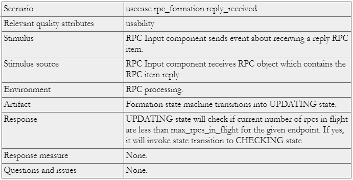

==============
RPC Formation
==============

RPC formation component is part of RPC core component [0], which determines when an RPC can be created and what its contents will be. This helps in optimal use of network bandwidth and helps in maximizing the IO throughput.

RPC formation component acts as a state machine in the RPC core layer.

***************
Definitions
*************** 

- fop, file operation packet, a description of file operation suitable for sending over network and storing on a storage device. File operation packet (FOP) identifies file operation type and operation parameters; 

- rpc item is an entity containing FOP or other auxiliary data which is grouped into RPC object after formation. 

- rpc, is a collection of rpc items. 

- endpoint (not very good term, has connotations of lower levels) is a host on which service is being executed. 

- session, corresponds to network connection between two services. 

- max_rpcs_in_flight, is the number of RPC objects that can be in-flight (on-wire) per endpoint. This parameter will be handled as a resource by resource manager.  

- max_message_size, is the largest possible size of RPC object. 

- max_message_fragments, is the number of maximum disjoint buffer an RPC object can contain. 

- urgent rpc item, is rpc item with zero deadline value.

***************
Requirements
***************

- [r.rpc_formation.network_optimization]: Formation component should make optimum use of network bandwidth. 

- [r.rpc_formation.maximize_io_throughput]: Form RPCs in such a manner that will help maximize the IO throughput. 

- [r.rpc_formation.extensible]: RPC Formation component should be extensible enough to accommodate further changes so that a Lustre like algorithm could be plugged in [1]. 

- [r.rpc_formation.send_policy]: Formation component will decide when to send an RPC to the output component in compliance with certain network parameters.

******************
Design Highlights
******************

RPC formation component will incorporate a formation algorithm which will create RPC objects from RPC items taking into consideration various parameters. 

The formation component will be implemented as a state machine with state transitions based on certain external events.

*************************
Functional Specification
*************************

RPC formation component will employ a formation algorithm which will act on a cache of RPC items. The algorithm will decide the items to be selected from the cache and it will put them together in an RPC object. The formation algorithm will make sure that maximum size of an RPC object is limited by max_message_size so that it makes optimal use of network bandwidth. The maximum number of disjoint buffers in an RPC object is limited by max_message_fragments. The max_message_fragments limit is enforced due to a limitation of RDMA to transfer only certain number of disjoint buffers in a request.

Multiple RPC items will be coalesced into one RPC item if intents are similar. This will be typically useful in case of vectored read/writes3. The individual rpc items being coalesced will be kept intact and an intermediate structure will be introduced to which all member rpc items will be tied. On receiving reply of the coalesced rpc item, callbacks to individual rpc items will be called which are part of the intermediate structure. The coalesced rpc item will put the constituent items in increasing order of file offset thus benefiting from sequential IO (reduced disk head seek). As far as possible, coalescing will be done within rpc groups. If not, coalescing can be done across groups. Coalescing is not done for items belonging to different update streams.

The RPC item cache could contain bounded and unbounded items in the sense that they may or may not have session information embedded within them. The formation algorithm queries and retrieves the session information for unbounded items after formation is complete and before sending the RPC object on wire.

The RPC Formation algorithm will be triggered only if current rpcs in flight per endpoint are less than max_rpcs_in_flight. It will also take care of distributed deadlocks.

**********************
Logical Specification
**********************

- Formation algorithm is implemented as cooperation of multiple policies like 

  - network transport type policy (guided by max_message_size, max_message_fragments) 

  - target service policy (guided by max_rpcs_in_flight) 

  - item type policies: pack IO requests together in offset order, honoring rpc item deadlines, its priorities and sending rpc groups as one unit.  

- The formation component is a state machine mostly driven by external events. 

- When there are no events, the formation component is in idle state. 

- Other components like RPC Grouping, Sessions and Input component post most of the events to the Formation component. 

- The various external events are  

  - Addition of item in rpc item cache. 

  - Deletion of item from rpc item cache. 

  - Change in parameter for an item from rpc item cache. 

  - Reply received from network layer. 

  - Deadline expired for item from rpc item cache. 

- On triggering of events like mentioned above, corresponding state functions will be called which will carry out necessary actions. 

- RPC Formation component uses an abstract data structure to gather information of rpc items from input cache. The details of this structure are part of Detailed Level Design. 

- This abstract data structure gathers critical information like number of groups, number of rpc items in each group, possible candidates for coalescing, URGENT items &c. 

- Formation algorithm will follow hints about rpc groups which are indications of more items following the current one and will not form a RPC object right away. 

- The formation algorithm will consult this abstract data structure to make optimal rpc objects. 

- On successful formation of an RPC object, it will be posted to the output component. 

- Any deadline expiry event will trigger immediate formation of RPC object with whatever size RPC object that can be formed. 

- If current rpcs in flight for an endpoint have already reached the number max_rpcs_in_flight for that endpoint, no more rpc formation is done until any replies from that endpoint are received and the current rpcs in flight number drop to less than max_rpcs_in_flight. 

- The overpowering criteria is current rpcs in flight should be less than max_rpcs_in_filght. So, even if a timeout event is triggered for an rpc item but if current rpcs in flight have reached max_rpcs_in_flight, no formation will be done.

Conformance
===============

- [r.rpc_formation.network_optimization]: Formation component takes care of amortizing the message as compared to the overhead of sending the message.  

- [r.rpc_formation.maximize_io_throughput]: IO requests (read, write) are coalesced instead of sending multiple requests.  

- [r.rpc_formation.extensible]: Formation algorithm is a simple state machine which can accommodate changes as required. The abstract data structures used are also extensible to make future additions. 

- [r.rpc_formation.send_policy]: Formation component throttles the transmission of RPC objects so that only certain number of RPC objects exist on the wire between 2 endpoints. The size of RPC object is also restricted to a limit.

Dependencies
=============== 

#. RPC Grouping component: needed for populating the rpc items cache. 

   #. Grouping will put the items in the cache in a sorted manner corresponding to timeouts. This will help to ensure timely formation of needy rpc items.  

   #. Grouping component will make one list per endpoint and hence there will be multiple lists in the rpc items cache(one per endpoint). 

   #. raising events like addition of rpc item to cache, deletion of rpc item from cache, rpc item parameter changed. 

   #. rpc core/grouping component should take care of attaching timer objects with rpc items to take care of deadlines. 

#. RPC Sessions component: needed for getting sessions information for unbounded items. 

#. RPC Input component: needed to raise events for an incoming reply. 

#. RPC Output component: needed to keep track of current rpcs in flight per endpoint. 

#. RPC Statistics component: needed to get/set various parameters crucial to RPC formation.

Refinement
=============== 

#. The rpc items need to be sorted based on some criteria (timeouts) by the grouping layer.

#. Session component provides an API to get sessions information for an unbounded rpc item.

***************
State
*************** 

The RPC formation component is implemented as a state machine mostly driven by triggering of external events.

States, Events, and Transitions
===============================

The table below describes the flow of states on triggering of all events. The rows describe the states and there is a column per event. The resultant state is mentioned at the intersection of row and column. 

 
 
The table below describes the intent of each state in the formation state machine.

Concurrency Control
===================

The internal abstract data structure will have locks for concurrency control. The rpc item cache should have some mechanism to guarantee concurrency control.

Formation algorithm makes no assumptions about threads and is purely driven by events.

***************
Scenarios
*************** 

Scenario 1

Scenario 2

.. image:: Images/SSC2.PNG

Scenario 3

Scenario 4

Scenario 5

Failures
===============

Failures are mostly handled by retries. No failures are permanent and are not propagated to other components.

***************
Analysis
*************** 

#. Motr components use "non-blocking server model" where

   #. scheduler overhead is reduced by using state machines instead of context switching among threads.

   #. keeping the number of threads limited and proportional to number of CPU cores in the system instead of thread per request.

#. Similarly, formation algorithm is a state machine which does not use any threads of its own and relies only on incoming threads. The formation algorithm always tries to form RPC bounded by a threshold which is max_message_size. This ensures the scalability in terms of change in number of incoming rpc items.

Rationale
===============

The formation component uses a pre-algorithm-execution state which collates information about various properties of rpc items in the cache. The algorithm itself depends on data generated by this state. This helps to reduce the frequent scanning of rpc items from the cache and gives a big picture view to form RPC objects efficiently.  

