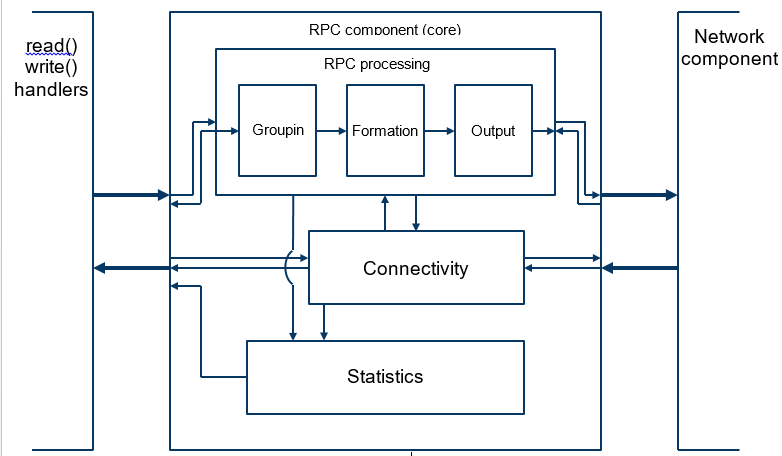
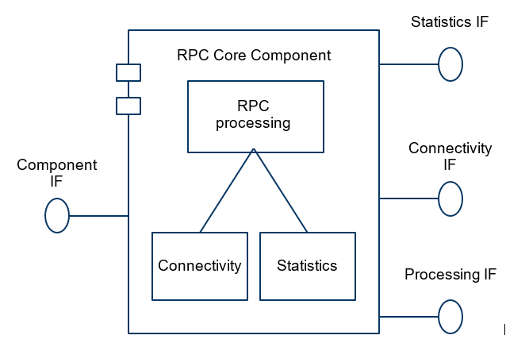
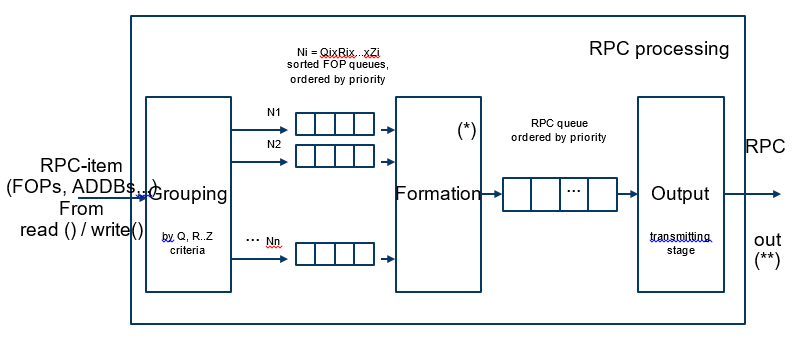

==================
RPC Layer Core
==================

This document presents a high level design (HLD) of rpc layer core of Motr core. The main purposes of this document are: (i) to be inspected by Motr architects and peer designers to ascertain that high level design is aligned with Motr architecture and other designs, and contains no defects, (ii) to be a source of material for Active Reviews of Intermediate Design (ARID) and detailed level design (DLD) of the same component, (iii) to serve as a design reference document. The intended audience of this document consists of Motr customers, architects, designers and developers.

**************
Introduction
**************

RPC layer is a high level part of Motr network stack. It contains operations allowing user to send RPC items, containing File Operation Packets (FOP) to network destinations. RPC layer speaks about FOPs being sent from and to end-points and RPCs, which are containers for FOPs, being sent to services. RPC layer is a part of a Motr server as well as a Motr client.

**************
Definitions
**************

- **fop**, file operation packet, a description of file operation suitable for sending over network and storing on a storage device. File operation packet (FOP) identifies file operation type and operation parameters;

- rpc, is a container for fops and other auxiliary data. For example, addb records are placed in rpcs alongside with fops

- service, process, running on an endpoint, allowing to execute user requests.

- endpoint (not very good term, has connotations of lower levels), host on which service is being executed.

- message, communication mechanism, allowing to send requests and receive replies.

- network address, IP address.

- session, corresponds to network connection between two services.

- (update) stream, is established between two end-points and fops are associated with the update streams.

- slot, context of update stream.

- replay

- resend

- action (forward fop, ylper?), operation of RPC item transition from client to service.

- reply (backward fop), operation of RPC item transition from client to service with results of "ylper" operation.

- RPC-item, item is being processed and sent by RPC layer.

- fop group

**************
Requirements
**************

- [r.rpccore.flexible] supports synchronous and asynchronous communication;

- [r.rpccore.flexible] supports priorities;

- [r.rpccore.flexible] supports sending various auxiliary information;

- [r.rpccore.efficient] the network bandwidth is utilized fully by sending concurrent messages;

- [r.rpccore.efficient] the messaging overhead is amortised by issuing larger compound message;

- [r.rpccore.efficient.bulk] 0-copy, if provided by the underlying network transport, is utilized;

- [r.rpccore.eos] support ordered exactly once semantics (EOS) of delivery;

- [r.rpccore.formation.settings] support different setting like max_rpc_in_flight, max_page_per_rpc, etc.

******************
Design Highlights
******************

To achieve the requirement of flexibility and efficiency design is based on multi-threaded principles. Parameters of efficiency, like thread count, network utilization, CPU utilization should be controlled on fly.

********************************
Functional Specification
********************************

RPC core component can be decomposed into the following subcomponents:

- RPC processing;

- Connectivity;

- Statistics.

Listed subcomponents share RPC component state e.g. RPC-items, connections, slots, sessions, channels, etc. RPC processing is a subcomponent which is responsible of the following actions:

- Grouping input items (FOPs, ADDB, etc.) into containers (RPCs). Grouping subcomponent performs grouping of input items and produces the RPC items cache. Items are grouped by the following criteria:

  - By the endpoint item (FOP, ADDB) is following to (sessions);

  - By priority (assigned via ext. interface).

- Formation subcomponent proceeds with classification by some criteria and produces RPCs which are containers of RPC items. It is responsible for data preparation in an order that is optimal for network utilization. The following options are used:

  - Do grouping by fid of file;

  - Maximal count of RPCs in processing (M0_MAX_RPCS_IN_FLIGHT);

  - Maximal count of pages per RPC (M0_MAX_PAGES_PER_RPC).

  Further description of formation is out of the scope of this document and described in formation HLD [4].

- The main goal of output subcomponent is to communicate with networking layer optimally by producing update streams associated with slots. The main method here is to control the level of concurrency according to gathered statistics to influence network utilization level. It's also possible to control resources utilization via external interface (discussed below). Output subcomponent is also producing RPCs for bulk-transfers converting incoming RPCs from formation subcomponent if possible.

RPC processing exposes the following interfaces:

- Send RPC items (FOP and ADDBs) with:

  - Priority;

  - Caching type;

  - Synchronously/asynchronously;

  - To sevice id;

- Wait for reply items (FOPs) with the same options like in sending.

- Publisher/subscriber [6] based interface (synchronous callback) to control sequence of RPC-items transmission. User has to have an ability to subscribe on the following events:

  - Updatestream which contains given RPC-item created / deleted;

  - Given RPC-item processing started / finished;

  - etc.
  
Connectivity subcomponent has to provide asynchronous and synchronous functions to send/receive FOPs and bulks, and establish/close connections between end-points via networking layer and provide high level logic abstractions over connections by introducing sessions and slots. Session is a dynamically created server object, created and destroyed by client requests. It maintains the server's state relative to the connection(s) belonging to a client instance. Slot is created by a client request and attached to active client session. Slot is a context in which some operations on RPC items are being applied sequentially one by one (execution for FOPs, write to ADDB for ADDB-records). RPC items related to different slots can be processed concurrently.

Connectivity exposes interfaces:

- Establish/close connection to end-point and return session.

- Create/destroy slot.

- Asynchronous and synchronous RPC-item transmitting functions.

- Specify properties of subcomponent like max slots existing simultaneously.

Further description of connectivity is out of the scope of this document and described in sessions HLD [5].

Statistics subcomponent is used to gather and share various statistics of RPC layer. This can be different vital and miscellaneous information regarding RPC component state and other properties. The following properties look to be important for RPC core component user:

- Items in caches and their count;

- Items in formation stage;

- RPCs count in output stage;

- Count of processing threads and their state;

- Number of opened sessions and slots;

- Time related statistics:

  - Min/max/average time of RPC-item processing;

  - Utilization of various resources (% of max network bandwidth used);

  - Usage ranking statistics (79% of RPCs were high-priority, 4% RPCs came from client X, etc.);

  - RPCs per second;

  - Some units measured in bytes/sec or pages/sec;

- Some constant and slow varying properties like M0_MAX_PAGES_PER_RPC or M0_MAX_RPCS_IN_FLIGHT.

Statistics subcomponent expose simple interface which takes property name or key and returns its value in raw form.

Interface description:

Component IF:

- int m0_rpc_core_init(...);

- void m0_rpc_core_fini();

Statistics IF:

- void* m0_rpc_stat_get_prop();

Connectivity IF:

- m0_rpc_session_id m0_rpc_session_link(m0_service_id);

- m0_rpc_slot_id m0_rpc_slot_link(m0_rpc_session_id);

- void m0_rpc_session_unlink(m0_rpc_session_id);

- void m0_rpc_slot_unlink(m0_rpc_slot_id);

- void m0_rpc_slot_max_set(uint32_t max);

Processing IF:

- int m0_rpc_item_send(m0_rpc_item*, m0_service_id, m0_rpc_prio, m0_rpc_caching_type, m0_rpc_callback*);

- int m0_rpc_items_send(m0_upstream*, m0_service_id, m0_rpc_prio, m0_rpc_caching_type, m0_rpc_callback*); // send with defined update stream

- int m0_rpc_fop_wait(m0_service_id, m0_rpc_prio, m0_rpc_caching_type, m0_rpc_callback*);

- int m0_rpc_upstream_register(m0_rpc_item*, m0_upstream_callback*);

- void m0_rpc_upstream_unregister(m0_upstream_callback*);

********************************
Logical Specification
********************************

Conformance
===============

To implement high-speed RPC processing subcomponent implementation should optimally utilize the resources of the host system. To perform this, Grouping, Formation and Output subcomponents should exploit multithreading. It’s well known fact that CPU utilization is optimal when the number of “processing threads” is equal to CPU cores plus number of “IO-threads”. That’s why mentioned subcomponents should use thread pool with optimal parameters. Output (transmitting) stage may have its separate pool, a number of threads which can vary and correlate with network statistics. The level of parallelism can be also tuned from the outside of RPC core component. It's possible to control it by limiting number of slots being processed simultaneously (m0_rpc_slot_max_set IF).

Simplification: FOP processing can be organized via pipeline multithreaded pattern [3]. It would be slower in performance aspect, but faster to implement, easier to support and it could be also reused (not insisting for some reasons).

As it was mentioned, subcomponents of “RPC processing” run in their own separate threads acquired from pool. To organize multithreaded interaction and mandatory (constraining) load balancing, “one-side” bounded queues [2] are used. Number of queues between stages and fetching policy is performance related subject and should be reviewed in DLD.

Dependencies
================

Cached FOPs might have dependencies each on other. This could affect the order of fop sending. That's why formation subcomponent should analyse those dependencies and produce RPCs accordingly

- m0_rpc_queue type is used to implement a queue for the staged interaction of the FOP processing subcomponent. This ADT can be based on a generic bounded queue for the first implementation, and specialized with more effective implementations for concrete case at later stages (fetching policy, locking/unlocking policy, etc.);

- m0_rpc_session and m0_rpc_slot map directly to sessions and slots described in [1,2];

- m0_rpc is a container of m0_rpc_items;

- m0_rpc_item is a container of FOPs or ADDBs (or something to be transmitted) with attributes related to RPC processing, like priority, caching, etc.

- m0_rpcmachine is a RPC processing machine, several instances of it might be existing simultaneously.

- m0_update_stream is an ADT associated with sessions and slots used for FOP sending with FIFO and EOS constrains.

*********************
State
*********************

Design has no explicit states. Data flow control depends on RPC-item placement in RPC queues and on some flags like caching and priority of RPC-item. The design is based on principles of streaming processing, where resources, like CPU, network, are allocated by a compulsory balancing scheme for each item being processed.

Concurrency Control
====================

RPC component creates thread pool (s), service threads of which are allocated for processing FOPs and RPC items on each stage of RPC processing subcomponent. It should be possible to provide automated load balancing based on statistics of network utilization, CPU utilization, etc.

*********************
Use Cases
*********************

Scenarios
==========

It's supposed that client handles IO read() / write(). On each such IO request a new FOP is created. These "reads" and "writes" run in a multi-threaded environment. After FOPs are built they are passed to "RPC processing".

*********************
Analysis
*********************

Scalibility
===========

It is believed that significant improvements in the RPC processing efficiency and general throughput can be achieved by limited number of threads in pool. Number of these threads should be controlled according to CPU usage and network utilization statistics, provided by statistics subcomponent and according to RPC component settings like m0_rpc_slot_max.

***********
References
***********

- [0] Networking architecture 1-pager

- [1] Architecture review of rpc layer
 
- [2] Bounded queue for MT environment

- [3] Multithreaded pipeline and pipen filter (saw nicer referece somewhere...)

- [4] Formation HLD

- [5] Sessions HLD (will be linked when ready)

- [6] http://en.wikipedia.org/wiki/Publish/subscribe

