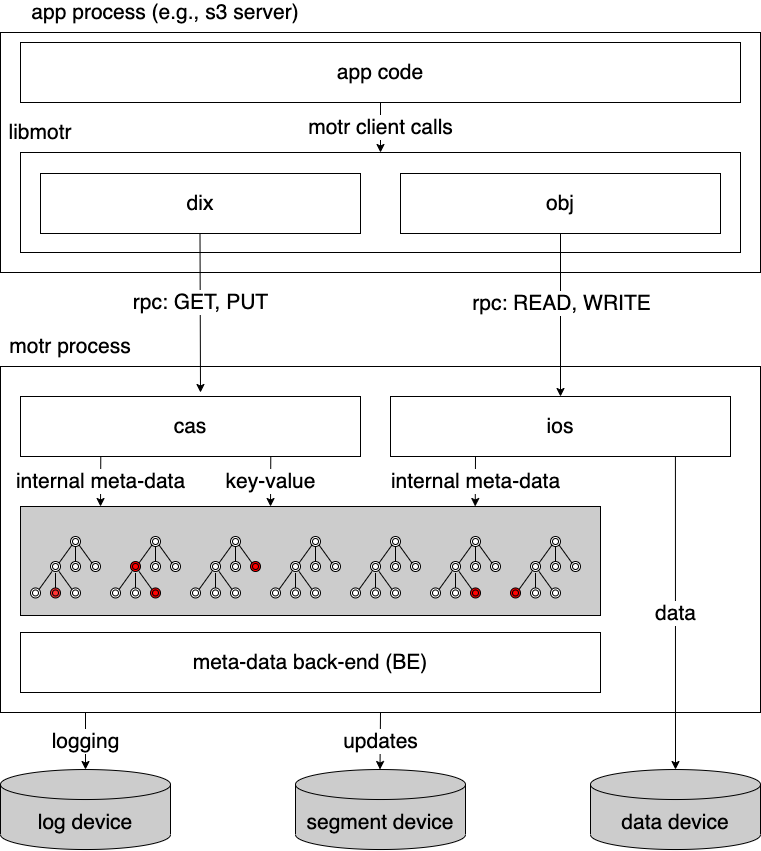

======
B-tree
======

:author: Nikita Danilov <nikita.danilov@seagate.com>
:state: INIT
:copyright: Seagate
:distribution: unlimited

:abstract: This document describes new b-tree module for motr (née mero, née eos
	 core, née colibri).

Stakeholders
============

+----------+----------------------+----------------------------+----------------+
| alias    | full name            | email                      | rôle           |
+==========+======================+============================+================+
| nikita   | Nikita Danilov       | nikita.danilov@seagate.com | author,        |
|          |                      |                            | architect      |
+----------+----------------------+----------------------------+----------------+

..
   Overview
   ========

   motr and, more generally, CORTX is deployed as a collection of processes running
   on multiple nodes in a cluster. Wihin each process there is a number of
   sub-system interacting with each other, other processes, network and
   storage. Sub-systems create and maintain state in form of structures in volatile
   memory and on persistent store. State is accessed concurrently from multiple
   threads.

   Development is any modification of the Project, which is complex enough to
   warrant tracking its internal states. For example, elimination of the spelling
   errors within a documentation file is too simple to be covered by the processes
   described in this document, whereas development of a new major feature is not.

   Examples of types of development are:

   * new feature;
   * bug fix;
   * technical debt elimination;
   * documentation creation or update;
   * refactoring.

   Process
   =======

   The overall development process structure is the following:

Initiation (INIT)
-----------------

..
   The modification is proposed. The origin of modification request can be:

     - marketing or sales;
     - feature request from a user (internal or external to Seagate);
     - bug report;
     - report of a defect in or an inconsistency between process, architecture,
       design, code, documentation, tests, *etc*.;
     - change in requirements;
     - change in timelines, deadlines, available development resources or
       schedules;

   At the initiation state, the modification can be described imprecisely or
   indirectly. For example, a bug report "the system crashes while executing
   operation X in environment Y" is implicitly a request to "modify the system so
   that it doesn't crash while executing the operation X in environment Y".

   The modification is always associated with a group of *initiators*. As the
   outcome of initiation state, an *owner* is assigned to the modification.

   **Owner assignment process**: to be defined. Depends on the modification type.

Existing motr b-tree implementation needs to be replaced for multiple reasons:

  - legal. See details elsewhere;

  - compatibility. Existing `b-tree code
    <https://github.com/Seagate/cortx-motr/blob/main/be/btree.c>`_ was not
    designed to be forward compatible. All motr meta-data structured are
    properly bracketed with a header and a footer and are checksum-protected, so
    in theory it is possible to identify the record version and convert between
    formats. But in practice, conversion of large and complex meta-data
    structure like b-tree (with millions of nodes and billions of records) is
    not possible unless it was designed with such conversion in mind. The
    deployments of the next release (ldrr2) are supposed to be online forever,
    which means that online meta-data format conversion is a critical feature;

  - functionality. Future releases of motr-based products will need additional
    features from b-tree (see details below). To reduce complexity and overhead
    of future format conversion, released b-tree format should accommodate for
    these features;

  - technical debt. Current b-tree implementation has low code quality and an
    ill-designed interface that leaks too many abstractions. Worse, it is an
    actual b-tree rather than preferable b+tree;

  - performance. Finally, performance of the existing b-tree implementation is
    sub-optimal. New implementation should have reduced io and memory footprints
    and improved concurrency.
   
Clarification (CLARIFY)
-----------------------

..
   At this state, the scope and intent of the modification are clarified between
   the initiators and the owner. This is an iterative process, that completes when
   the owner has enough data to start analysis. The data include descriptions of
   features, informal requirements, informal use cases, bug reproducibility
   conditions, *etc*.

The scope of b-tree development is defined by the following informal
requirements (refined in Requirements section):

  - [r.btree.clean] develop b-tree (b+tree) implementation from scratch;

  - [r.btree.r2p0] b-tree implementation has to be available in the first
    release (ldrr2p0);

  - [r.btree.future-proof] after the first release, online conversion to the
    later versions should be possible. Future versions of b-tree can add more
    features;

  - [r.btree.features] b-tree format and algorithms should be ready to support
    advanced features that will be necessary in the future;

  - [r.btree.performance] performance properties of the implementation
    (throughput, operations per second, concurrency levels, memory and io
    footprints) should be sufficient for fulfilment of the overall product
    performance requirements;

  - [r.btree.quality] the implementation should be of high quality. Quality
    should be measured and attained by comprehensive testing and documentation;

  - [r.btree.scale] the implementation should be sufficiently scalable to
    support the overall product scalability requirements.

Analysis (ANALYSIS)
-------------------

..
   The modification is analysed in terms of the Project software structure. An
   analysis produces:

   * a list of software components that have to be changed,
   * a high level description of changes, their intent, scope and interaction.

   At this point it is decided whether the modification falls under the development
   process described in this document. If it does, a unique meaningful *name* is
   assigned to it and a development *tracking file* is created in doc/dev/.

   The list of *stakeholders* is defined at this point and recorded in the tracking
   file. Stakeholders are peoples or groups interested in this development, their
   consent is required for state transitions of the development process. A
   stakeholder has a rôle (or rôles) with the development, for example,
   "architect", "designer", *etc*. The list of rôles and their responsibilities in
   the process is described **elsewhere**.

   All decisions, problems and artefacts associated with the development are
   recorded in the tracking file.

B-tree is `a standard data-structure
<https://en.wikipedia.org/wiki/B-tree>`_. It provides an implementation of
abstraction variously known as *associative array* or *dictionary* that can be
used to efficiently manage large collections of structured data in form of
key-value records. The flavour of b-tree that is actually used by storage,
file-system and data-base software is called `b+tree
<https://en.wikipedia.org/wiki/B%2B_tree>`_.

motr uses b-tree to store almost all meta-data:

  - internal meta-data:
    - cob list (used by ios and repair),
    - allocation data (used by ad stob),
    - balloc (used by ios),
    - global dix indices (used by dix),
    - meta index (used by cas)
  - external meta-data used by applications such as s3 server:
    - catalogues (used by cas, dix)

b-trees store the bulk of meta-data, potentially many terabytes and tens of
billions of key-value records per motr process. Performance, stability and
functionality of b-trees are critical for the overall system behaviour.

b-tree interacts with the multiple motr modules:

  - modules that use b-tree
    - adstob (use by ios)
    - cob (used by stob)
    - mdstore (use by m0t1fs, obsolete)
    - cas
  - modules used by b-tree
    - BE transaction engine
    - BE space allocator
    - BE page daemon
    - synchronisation primitives from motr library

Requirements (REQS)
-------------------

..
   The formal list of requirements is defined and recorded in the tracking
   file. This list is formed and maintained according to the *requirements tracking
   process* (defined elsewhere). Requirements are used to systematically find
   dependencies or inconsistencies between the developments and the existing code
   base.

  - [r.btree.clean] develop b-tree (b+tree) implementation from scratch;

  - [r.btree.r2p0] b-tree implementation has to be available in the first
    release (ldrr2p0);

  - [r.btree.future-proof] after the first release, online conversion to the
    later versions should be possible. Future versions of b-tree can add more
    features;

  - [r.btree.features] b-tree format and algorithms should be ready to support
    advanced features that will be necessary in the future;

  - [r.btree.performance] performance properties of the implementation
    (throughput, operations per second, concurrency levels, memory and io
    footprints) should be sufficient for fulfilment of the overall product
    performance requirements;

  - [r.btree.quality] the implementation should be of high quality. Quality
    should be measured and attained by comprehensive testing and documentation;

  - [r.btree.scale] the implementation should be sufficiently scalable to
    support the overall product scalability requirements.

High-level requirements from Clarification section are refined as following:

  - [r.btree.variable-size-key] variable-sized keys are supported (from
    [r.btree.features]);

  - [r.btree.variable-size-val] variable-sized values are supported (from
    [r.btree.features]);
    
  - [r.btree.large-key] large keys (up to 1MB) are supported (from
    [r.btree.features]);
    
  - [r.btree.large-val] large values (up to tens of MBs) are supported (from
    [r.btree.features]);
    
  - [r.btree.variable-node-size] nodes of different size within the same tree
    are supported (from [r.btree.performance] and [r.btree.future-proof]);
    
  - [r.btree.lingua-franca] features necessary for lingua franca can be
    supported in the future (from [r.btree.features], [r.btree.future-proof],
    [r.btree.r2p0]);
    
  - [r.btree.throughput] (from [r.btree.performance]);
    
  - [r.btree.concurrency] (from [r.btree.performance]);
    
  - [r.btree.ops-per-second] (from [r.btree.performance]);
    
  - [r.btree.memory] (from [r.btree.performance]);
    
  - [r.btree.io] (from [r.btree.performance]);
    
  - [r.btree.capture] (from [r.btree.performance]);
    
  - [r.btree.opt.key-chksum] optional key check-sums are supported (from
    [r.btree.features], [r.btree.fsck]);
    
  - [r.btree.opt.val-chksum] optional value check-sums are supported (from
    [r.btree.features], [r.btree.fsck]);
    
  - [r.btree.opt.key-chksum] optional node check-sums are supported (from
    [r.btree.features], [r.btree.fsck]);
    
  - [r.btree.opt.merkle] optional Merkle-hash of entire tree content is
    supported (from [r.btree.features], [r.btree.fsck]);
    
  - [r.btree.opt.prefix-compression] optional key prefix compression is
    supported (from [r.btree.features], [r.btree.lingua-franca]);
    
  - [r.btree.opt.blink] optional b-link is supported in the future (from
    [r.btree.features], [r.btree.concurrency]);
    
  - [r.btree.inplace-ops] in-place insert operation is supported (from
    [r.btree.memory]);
    
  - [r.btree.state-machine] b-tree operations are implemented as non-blocking
    state-machines (from [r.btree.r2p0]);
    
  - [r.btree.key-val-node-flags] flags per node, key and value to indicate
    possible future extensions (from [r.btree.future-proof]);
    
  - [r.btree.node-version] nodes with different versions can co-exist within the
    same tree (from [r.btree.future-proof]);
    
  - [r.btree.page-cache-aware] tree balancing algorithms use information about
    cached parts of the tree (from [r.btree.performance]);
    
  - [r.btree.page-daemon] the implementation interacts with BE page daemon
    module (from [r.btree.r2p0], [r.btree.performance]);
    
  - [r.btree.no-volatile] the implementation does not use deprecated 'volatile
    fields' BE mechanism (from [r.btree.future-proof]);
    
  - [r.btree.capture-minimize] tree balancing algorithms minimise the amount of
    transactionally captured memory (from [r.btree.memory]);
    
  - [r.btree.opt.per-node-locking] tree format is designed to support per-node
    locking in the future (from [r.btree.concurrency], [r.btree.future-proof]);
    
  - [r.btree.cookie-lookup] fast cookie-based lookup is supported (from
    [r.btree.ops-per-second]);
    
  - [r.btree.fsck] on-disk format and algorithms are designed to support fsck
    (from [r.btree.quality], [r.btree.future-proof]);
    
  - [r.btree.op.create] tree create operation is supported;
    
  - [r.btree.op.destroy] operation to destroy an (empty) tree is supported;
    
  - [r.btree.op.insert] key-value insert operation is supported;
    
  - [r.btree.op.insert-inplace] insert in-place operation is supported (from
    [r.btree.memory]);
    
  - [r.btree.op.insert-overwrite] overwrite operation is supported;
    
  - [r.btree.op.lookup] key lookup operation is supported;
    
  - [r.btree.op.lookup-slant] next key lookup operation is supported;
    
  - [r.btree.op.delete] key delete operation is supported;
    
  - [r.btree.op.delete-all] high-level operation to delete all keys from a tree
    is supported;
    
  - [r.btree.op.next] iteration operation is supported;
    
  - [r.btree.op.next-upto] iteration up to a specific key operation is
    supported;
    
  - [r.btree.addb] btree operations are instrumented with addb;
    
  - [r.btree.ri] run-time instruments for b-tree are implemented;
    
  - [r.btree.tools] command line tools for b-tree are implemented;
    
  - [r.btree.tools.save] a tool to save b-tree contents in a file is provided;
    
  - [r.btree.tools.load] a tool to load b-tree contents from a file is provided;
    
  - [r.btree.reflect] b-tree contains certain amount of meta-data to make
    debugging easier;
    
  - [r.btree.bg-check] background check of b-tree consistency will be provided
    in the future;
    
  - [r.btree.dynamic-adaptability] b-tree algorithms dynamically adapt to
    work-load patterns;
   
  - [r.btree.b+tree] the implementation uses b+tree algorithm;
   
  - [r.btree.]
   
Architecture (ARCH)
-------------------

..
   If the analysis (or any other) stage determines that changes to the Project
   architecture are needed, the *architecture modification process* is
   invoked. This process determines which parts of the architecture need to be
   altered, added or removed; develops a version of the architecture including this
   modification and checks it for consistency.

   If changes to the architecture are needed, the designs (high and low level),
   code and documentation that have to be changed (to reflect changes in the
   architecture) are identified and listed in the tracking file.

   If changes to the architecture change assumptions about external dependencies
   (software, hardware and environment), these changes in assumptions are
   identified and listed in the tracking file.

   All changes to the internal and external entities have to be discussed with and
   agreed by the appropriate stakeholders. The outcomes of these discussions are
   recorded in the tracking file.

   The outputs of the architecture stage:

   * agreed modifications to the architecture (both as a new architecture document
     and as a "delta");

   * agreed modifications to the assumptions about external dependencies.

Planning (PLAN)
---------------

..
   During the planning phase, the development is sub-divided into a list of
   development *tasks*. Examples of tasks are:

   * detailed-level design inspection;
   * integration of the system tests for the new feature.

   Each task is assigned a meaningful name unique within the development. If
   necessary, a tracking file doc/dev/development.task is created to record
   progress of the task execution, otherwise task progress is recorded within the
   development tracking file.

   The outcome of planning, recorded in the tracking file, is:

   * a list of development tasks,
   * dependencies between tasks,
   * an integration plan, which specifies how the modifications will be merged in
     the Project,
   * QA plan, which specifies how the QA team will test the tasks,
   * deployment plan, which specifies how tasks are deployed in the field,
   * estimates for task phases (development, test, integration, QA and deployment),
   * assignment of task phase responsibilities to developers, architects and
     managers,
   * an execution schedule

Execution (EXEC)
----------------

..
   During execution phase, development tasks are executed concurrently, according
   to the task execution process specified below.

   Periodically, development stakeholders perform a *checkpoint* to assess
   alignment with the planned schedule and necessary adjustments to the tasks.

   A task execution process can got *stuck* at any stage. This happens when further
   task execution is impossible for any reason, for example:

   * during task requirement collection or design phase it becomes clear that the
     task would take significantly more effort to complete than originally
     estimated;

   * high or detailed level design uncovers an inconsistency in other design or
     architecture;

   * change in requirements requires significant change to task designs or code.

   When a task is stuck, and this cannot be fixed at the checkpoint level, the
   development process is reset to an earlier stage, *e.g.*, architecture,
   requirements or planning, to address the issue with the task.

   Task execution process for a typical task is the following.

Task requirements (TREQ)
++++++++++++++++++++++++

..
   Task requirements are extracted from the development requirements and refined.

High-level design (HLD)
+++++++++++++++++++++++

..
   A high-level design is created and recorded in doc/hld. A link to the HLD file
   is placed in the tracking file.

   The resulting HLD should contain enough information to start the DLD. An HLD
   contains, among other things, functional and logical specification of the task,
   *testing*, *integration* and *deployment* plans (see
   doc/hld/hld-template.rst.in).

High-level design intermediate review (HLDIR)
+++++++++++++++++++++++++++++++++++++++++++++

..
   Creation of a complex HLD can be periodically informally reviewed (**by ...**)
   to assure that it goes in the right direction.

High-level design inspection (HLDINSP)
++++++++++++++++++++++++++++++++++++++

..
   An HLD is inspected. Inspection comments are recorded. The HLD authors discuss
   and address the comments. The HLD is updated. The inspection process is repeated
   until all found issues are addressed.

Detailed-level design (DLD)
+++++++++++++++++++++++++++

..
   A detailed-level design is created as a set of skeleton source files with embedded
   documentation (for C, Doxygen-formatted comments are used).

   A DLD describes

   * data-structures,
   * programming interfaces,
   * functions,
   * concurrency,
   * scope and ownership data objects,
   * data and control flow,
   * deployment procedures (install, upgrade, downgrade, removal, monitoring,
     logging, error reporting in the field, *etc*.).

   A DLD contains enough detail to start coding. A DLD contains a refinement of the
   testing and integration plans from the HLD.

Detailed-level design intermediate review (DLDIR)
+++++++++++++++++++++++++++++++++++++++++++++++++

..
   Creation of a complex DLD can be periodically informally reviewed (**by ...**)
   to assure that it goes in the right direction.

Detailed-level design inspection (DLDINSP)
++++++++++++++++++++++++++++++++++++++++++

..
   A DLD is inspected. Inspection comments are recorded. The DLD authors discuss
   and address the comments. The DLD is updated. The inspection process is repeated
   until all found issues are addressed.

   **Question**: how and where DLD inspection comments are recorded?

   **Proposal**: [nikita]: an inspection round is recorded as a separate commit,
    with questions directly embedded in the DLD. git diff will show the
    context. The answers and requests for clarification are added as a next
    commit. Then another next commit contains the new version of the DLD, with
    comments and answers removed (but preserved in the repository history).

Code (CODE)
+++++++++++

..
   Coding populates the set of skeleton source files, created at the DLD stage with
   the implementation conforming to the design. The code contains the set of tests,
   according to the testing plan specified in the designs.

   At the completion of the code phase, the design is implemented to the
   satisfaction of the inspectors.

Code intermediate review (CODEIR)
+++++++++++++++++++++++++++++++++

..
   A long code phase can be periodically informally reviewed (**by ...**) to assure
   that it goes in the right direction.

Dev testing (TEST)
++++++++++++++++++

..
   Developers execute tests, created as part of the code phase, and fix all the
   test failures.

   Test runs and failure analyses are recorded in the tracking file (either
   directly or by reference to a testing platform (jenkins, ci, *etc*.)).

Code inspection (CODEINSP)
++++++++++++++++++++++++++

..
   Code is inspected. Inspection comments are recorded. Code authors discuss and
   address the comments. Code is updated. The inspection process is repeated until
   all found issues are addressed.

Documentation (DOC)
+++++++++++++++++++

..
   Necessary documentation is created, reviewed and inspected concurrently with the
   designs and code.

Integration (INT)
+++++++++++++++++

..
   Integration happens according to the integration plan developed at the planning
   phase and refined (for this task) at the design and coding phases.

   Integration includes execution of integration and end-to-end tests involving the
   task.

   Integration completes with landing the designs and the code onto the appropriate
   branch.

   A group of tasks can be integrated together (this should be specified in the
   integration plan).

QA testing (QA)
+++++++++++++++

..
   QA team tests the landed tasks according to the planned QA plan.

   A group of tasks can be QAed together (this should be specified in the
   QA plan).

Deployment (DEPLOY)
+++++++++++++++++++

..
   Once the task has been tested by QA it can be deployed in the field (as part of
   a product). Deployment phase includes necessary modifications to the product
   packages, manifests, BOMs, *etc., installation procedures and responding to
   customer bug reports related to the task.

   A group of tasks can be deployed together (this should be specified in the
   deployment plan).

Patents (PATENTS)
+++++++++++++++++

..
   If any, IP disclosures are filed concurrently with the other task execution
   stages.

Abandoned (ABANDON)
-------------------

..
   A development can be retired when no longer needed. Its tracking file and
   artefacts are preserved.

..
   Pseudo-code
   ===========

   The development process can be represented by the following pseudo-code:

   .. highlight:: C
   .. code-block:: C

      development(input) {
	   do {
		   input = clarify(input);
	   } while (!clarified);
	   development = analysis(input);
	   development.reqs = requirements(development);
	   arch = architecture(development, arch);
	   plan = planning(development);
	   for (task in plan) {
		   task_process(task) &;
	   }
      }

   .. highlight:: C
   .. code-block:: C

      task_process(task) {
	   task.reqs = task_requirements(task.development, task);
	   document(task) &;
	   patent(task) &;
	   do {
	      do {
		 task.hld = hld(task);
		 task.hld = hldir(task.hld);
	      } while (!complete(task.hld));
	      issues = hldinsp(task.hld);
	   } while (issues != nil);
	   do {
	      do {
		 task.dld = dld(task);
		 task.dld = dldir(task.dld);
	      } while (!complete(task.dld));
	      issues = dldinsp(task.dld);
	   } while (issues != nil);
	   do {
	      do {
		 task.code = code(task);
		 task.code = codeir(task.code);
	      } while (!complete(task.code));
	      task.code = devtests(task);
	      issues = codeinsp(task.code);
	   } while (issues != nil);
	   integration(task);
	   qa(task);
	   deploy(task);
      }

   Notes
   =====

   * This document is itself managed by the process it describes.

   * This development process can be adjusted as needed. States can be omitted,
     added, re-ordered, as necessary by the agreement of the stakeholders.

   * The development owner and the list of development stakeholders can be changed
     during development to accommodate for changes in circumstances or additional
     information.

   * Artefacts, created as part of this process (tracking files, design documents,
     and so on) are kept under version control in the Project repository. If
     possible, they are formatted as reStructured text files pre-processed by the
     Project build system with a common set of m4 macros (as this file is). If this
     format is not suitable, the artefacts should be in a format that allows easy
     search, meaningful version control and links to particular items within a
     document. Artefacts should be in the English language and follow standard
     conventions of the Project: British spelling, no Oxford comma, *etc*. (see
     doc/coding-style.md).

Literature
==========

The Evolution of Effective B-tree Page Organization and Techniques: A Personal Account

Efficient Locking for Concurrent Operations on B-Trees]]

Bmad-Tree: An Efficient Data Structure for Parallel Processing]]

"On-line Reorganization of
                     	Sparsely-populated B^+-trees" by Chendong Zou and
                     	Betty Salzberg (http://citeseer.nj.nec.com/zou96line.html):

