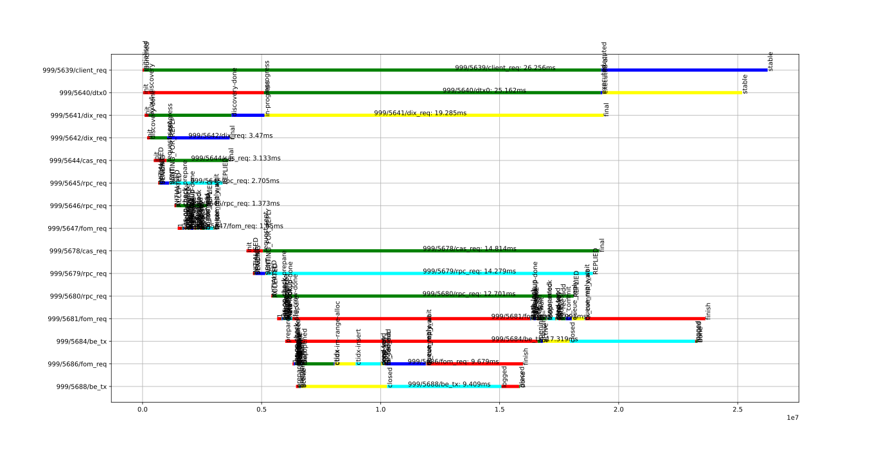
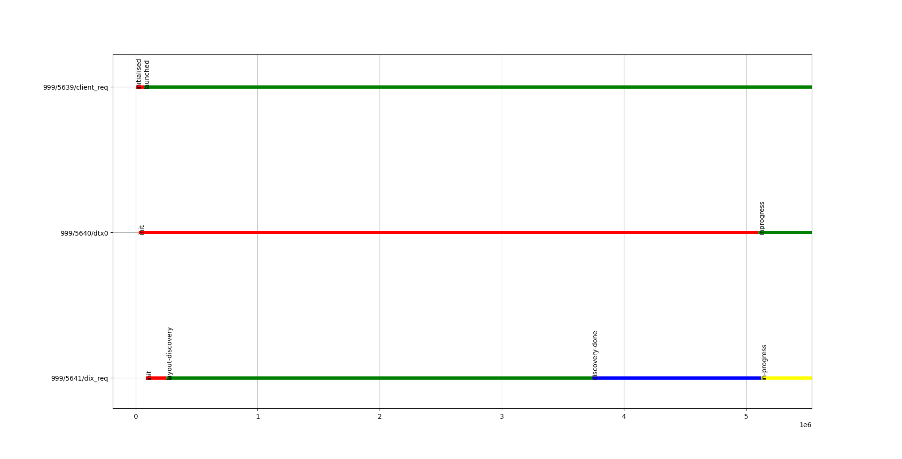
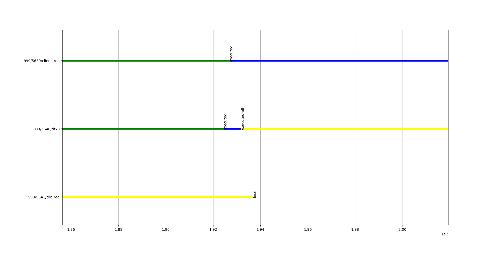
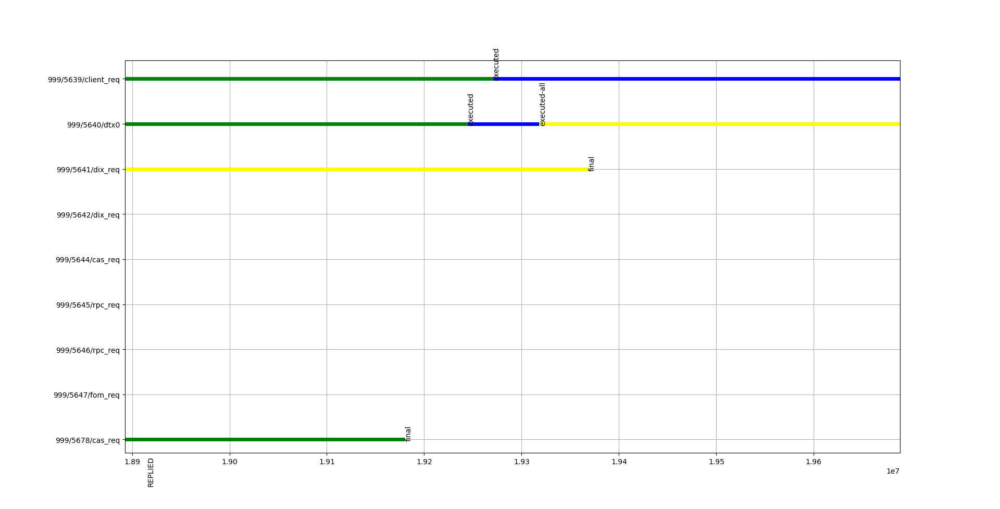
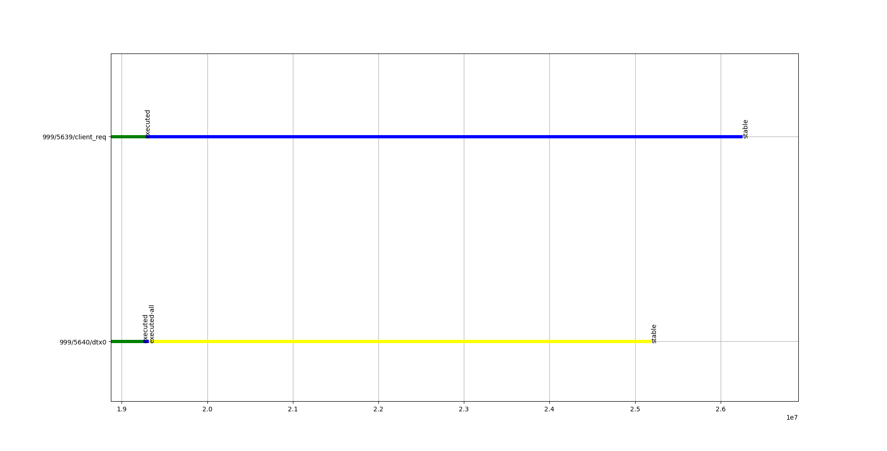

# TOC

1. Overview.

2. Motr client-related SMs.

3. DTX SM for Motr client.

4. CLINK + AST examples.

5. FOM.

# Overview

The document describes the way how the state machine concept is used
in Motr client code.

Further reading/pre-requisites:

* [Cooperative multitasking](https://en.wikipedia.org/wiki/Cooperative_multitasking)

* [Linux Kernel Development by Robert Love](https://rlove.org)

* [Protothreads](https://github.com/contiki-os/contiki/blob/master/core/sys/pt.h)

* [Motr Coroutines](https://github.com/Seagate/cortx-motr/blob/main/lib/coroutine.h)

# Motr client-related SMs.

There are 3 kinds of objects in the Motr client code that
are involved into KVS operations: CAS request, DIX request,
and Motr client operation (m0op).

The following diagrams are simplified versions of these
machines:

```
                      <RPC reply>
                       \|/
CAS_SM: INIT ---> SENT ---> FINAL
             \|/
              <RPC sent>

(Fig. 1 - CAS request SM)
```

```
                            <CAS_SM.FINAL N times>
                             \|/
DIX_SM: INIT ---> INPROGRESS ---> FINAL
              |
             \|/
             +----------------------+
             | CAS_SM: INIT -> SENT |
             | N times              |
             +----------------------+

(Fig. 2 - DIX request SM)
```

```
M0C_SM:
        INIT
         |
         |
        \|/
        LAUNCHED <-+    +---------------------------+
         |         | -> |DIX_SM: INIT -> INPROGRESS |
         +---------+    +---------------------------+
         |
         | <- DIX_SM.FINAL
         |
        \|/
        EXECUTED
         |
        \|/
        STABLE

(Fig 3. - M0C operation SM)
```

A state machine may receive events that trigger state
transitions, and it may emit events that trigger state
transitions of other state machines.

Here is an example of such triggers:

```
        <M0C_SM.LAUNCHED>: ... -> dix_put (CALL) -> dix_put_ast (AST) -> dix_discovery_ast (AST) -> ... ->
                                -> dix_discovery_completed (CALL) -> ... -> dix__rop (CALL) -> ... ->
                                -> <CAS_SM.SENT N times>.
        <RPC reply>: cas_req_replied_cb (CLINK) -> cas_req_replied_ast (AST)
                Causes SENT -> FINAL transition for CAS req SM.
        <RPC sent>: posts an RPC item into the queue.
        <CAS_SM.FINAL N times>: dix_cas_rop_clink_cb (CLINK) -> dix_rop_completed (AST)
        <DIX_SM.FINAL>: dixreq_clink_cb (CLINK) -> dixreq_completed_ast(AST) ->
                                -> idx_op_ast_complete (AST) -> idx_op_complete (CALL) ->
                                -> sm_move (Locking another SM group)

(Fig. 4 - Client-side triggers)
```

An SM may belong to a group of SM. State machine transitions
are serialized within the lock of such a group. Here are the
groups that are presented in the example:

```
        M0C operation sm group (op_sm_group)
        M0C index operation sm group (oi_sm_grp)
        DIX req sm group
        CAS req sm group
        RPC machine sm group

(Fig. 5 - SM groups)
```

State machine transitions happen on an "executor". For example,
in the kernel there is a set of `struct task` that are executed
on a single CPU core or on a set of CPU cores. In the same way,
in Motr we have several threads, and a group of SMs gets
"executed" with such a thread. Here are the threads
that we have in the example:

```
        RPC machine thread:
                RPC machine sm group.
        Locality thread:
                M0C index operation sm group;
                DIX req sm group;
                CAS req sm group.
        User thread (M0C operation sm group):
                M0C operation sm group.

(Fig. 6 - Threads)
```

In some cases, we cannot deliver an event just by calling a function
because SM may belong to different threads or SM groups. On the client side
we use the clink+ast mechanism (or similar mechanisms) that allow us
to handle such events. Here the boundaries between SMs that we are passing
through during KVS operation execution:

```
        RPC machine <-> CAS req
        M0C index operation sm group <-> M0C operation sm group

(Fig. 7 - Boundaries)
```

# DTX SM for Motr client.


```
                      <RPC reply>
                       \|/
CAS_SM: INIT ---> SENT ---> FINAL
             \|/
              <RPC sent>

                            <DTX_SM.STABLE>
                             \|/
DIX_SM: INIT ---> INPROGRESS ---> FINAL
              |
             \|/
             +----------------------+
             | CAS_SM: INIT -> SENT |
             | N times              |
             +----------------------+


DTX_SM:

                INIT
                 |
                 | <- <CAS_SM: INIT -> SENT N times>
                \|/
                INPROGRESS
                 |
 [<P notice>] -> | <- <CAS_SM: SENT -> FINAL once>
                 |
                 | -> M0C_SM: LAUNCHED -> EXECUTED
                \|/
                EXECUTED
                 |
 [<P notice>] -> | <- <CAS_SM: SENT -> FINAL N-1 times>
                \|/
                EXECUTED_ALL
                 |
 [<P notice>] -> |
                 |
               (is stable?)
                 |
                 |-------+
                \|/      | -> M0C_SM: EXECUTED -> STABLE
                STABLE ->+


M0C_SM:
        INIT
         |
         |
        \|/
        LAUNCHED <-+    +---------------------------+
         |         | -> |DIX_SM: INIT -> INPROGRESS |
         +---------+    |DTX_SM: INIT -> INPROGRESS |
         |              +---------------------------+
         |
         | <- DTX_SM: INPROGRESS -> EXECUTED
        \|/
        EXECUTED
         |
         | <- DTX_SM: EXECUTED_ALL -> STABLE
        \|/
        STABLE

(Fig. 8 - Client + DTX SMs)
```

# CLINK + AST examples.

Use-case: When SM1 moves to FINAL state we want to update SM2 state.
        SM1 is a part of SMG1, SM2 is a part of SMG2.

```
SMG1                                    SMG2
[ SMG1.SM1 ]                            [ SMG2.SM2 ]
Lock { FORKQ = [] }                     Lock { FORKQ = {} }
RunAsts { FORKQ = {} }                  ...
Run  { FORKQ = {} }
	SMG1.SM1: SENT -> FINAL
                clink_cb()
                SMG2.post_ast(AST1)     ... { FORKQ = [ AST1 ] }
RunAsts { FORKQ = {} }                  RunAsts { FORKQ = [ AST1 ] }
Unlock  { FORKQ = {} }                          AST1.sa_cb(AST1.sa_datum)
                                                        modify(SMG2.SM2)
                                                                SMG2.SM2.counter++;
                                        Unlock { FORKQ = [] }
(Fig. 9 - Clink+AST Ping)
```

Use-case: When SM1 moves to SENT state, SM2 must move to RECVD state;
        when SM2 moves to RECVD state, SM1 and SM2 must move to INIT state:


```
SM1: INIT -> SENT -+
     /|\           |
      +------------+

SM2: INIT -> RECV -+
      /|\          |
       +-----------+

(Fig. 10 - State transitions)

```

```
SMG1                                    SMG2
[ SMG1.SM1 ]                            [ SMG2.SM2 ]
Lock { FORKQ = [] }                     Lock { FORKQ = {} }
RunAsts { FORKQ = {} }                  ...
Run  { FORKQ = {} }
	SMG1.SM1: INIT -> SENT
                clink_cb()
                SMG1.post_ast(AST1)     ... { FORKQ = [ AST1 ] }
RunAsts { FORKQ = {} }                  RunAsts { FORKQ = [ AST1 ] }
Unlock  { FORKQ = {} }                          AST1.sa_cb(AST1.sa_datum)
                                                        SMG2.SM2: INIT -> RECVD
                                                        SMG2.SM2: RECVD -> INIT
                                                                clink_cb()
                                                                SMG1.post_ast(AST2)
                                        Unlock { FORKQ = [] }
Lock { FORKQ = [ AST2 ] }
RunAsts { FORKQ = [ AST2 ] }
        AST2.sa_cb(AST2.sa_datum)
                SMG1.SM1: SENT -> INIT
Run  { FORKQ = {} }
	SMG1.SM1: INIT -> SENT
                clink_cb()
                ...
(Fig. 11 - Clink+AST Ping-Pong)
```

# FOM

All the previous examples were revolving around the idea of postponed
"execution" of callbacks within different contexts (SM groups) and,
sometimes, different threads (localities). As you saw, we had a point
where we were awaiting on an "external" event - RPC reply. There are more
use-cases like that: await on a request, await on a timer, await on
a disk IO operation and so on. One of the common ways to implement
such kind of abstractions is to introduce the running+waiting
queues idea. When a task is block on something (IO, network, timer),
the scheduler puts it into the list of "sleeping" tasks, and then,
at some point, a event "wakes up" such a task, and the scheduler
puts it back into the run queue.

In Motr such mechanism mostly used to handle RPC requests, and
FOM is what does the work here. FOM localities are "FOM-specific"
executors for such tasks.

Additionally, FOMs have the following useful features:

* "Cooperative" locks (see the long lock) that allow the FOMs
	to wait on each other.

* Generic phases that execute common operations required for
	most of the FOPs.

# Time-lines for DTX











