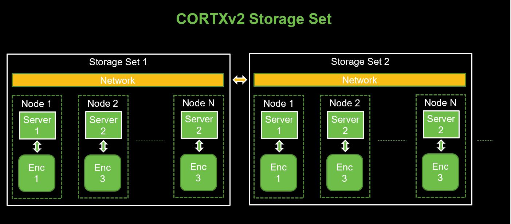
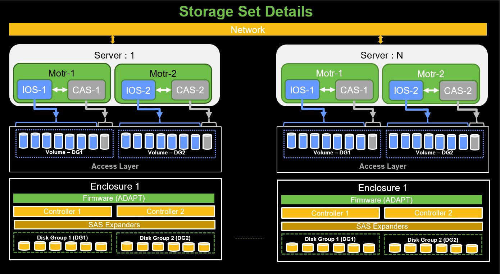
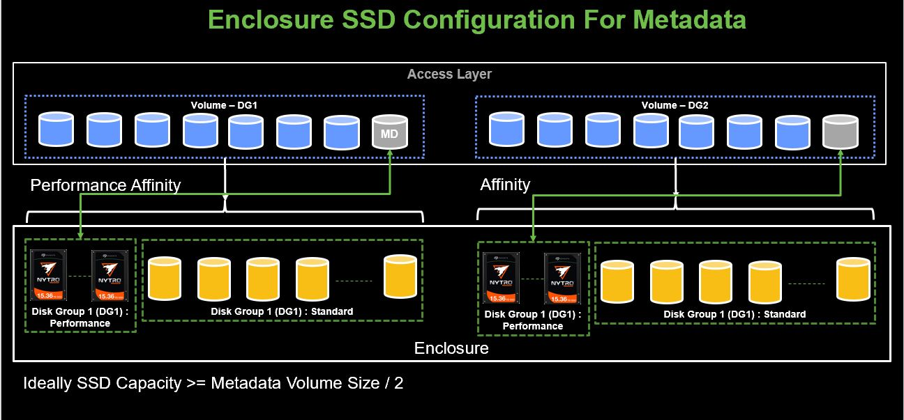
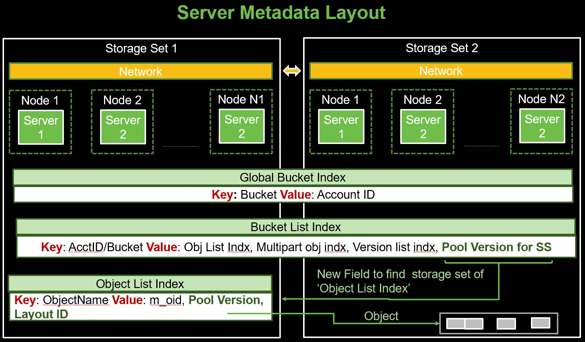
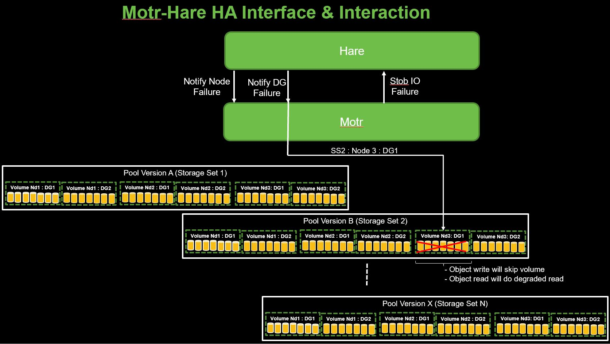
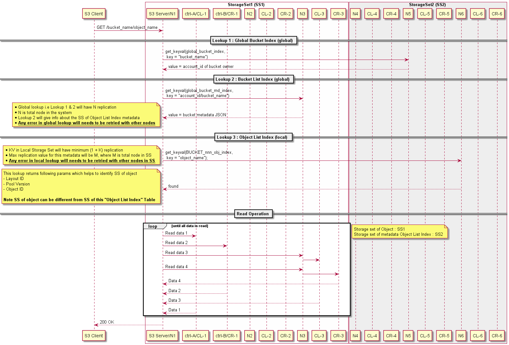
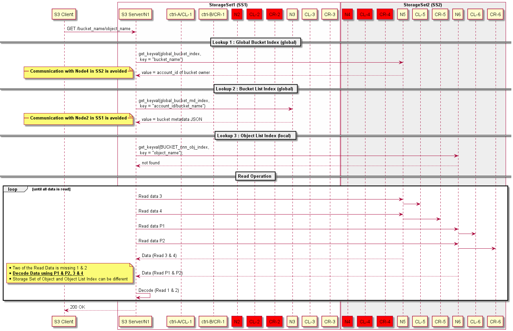
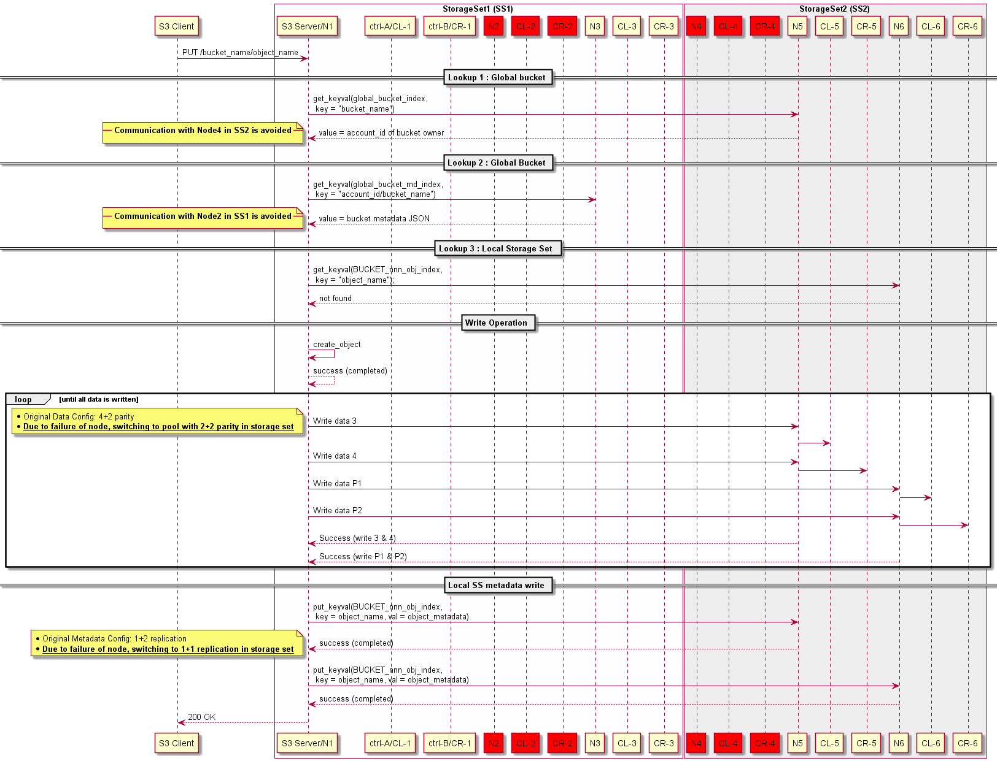
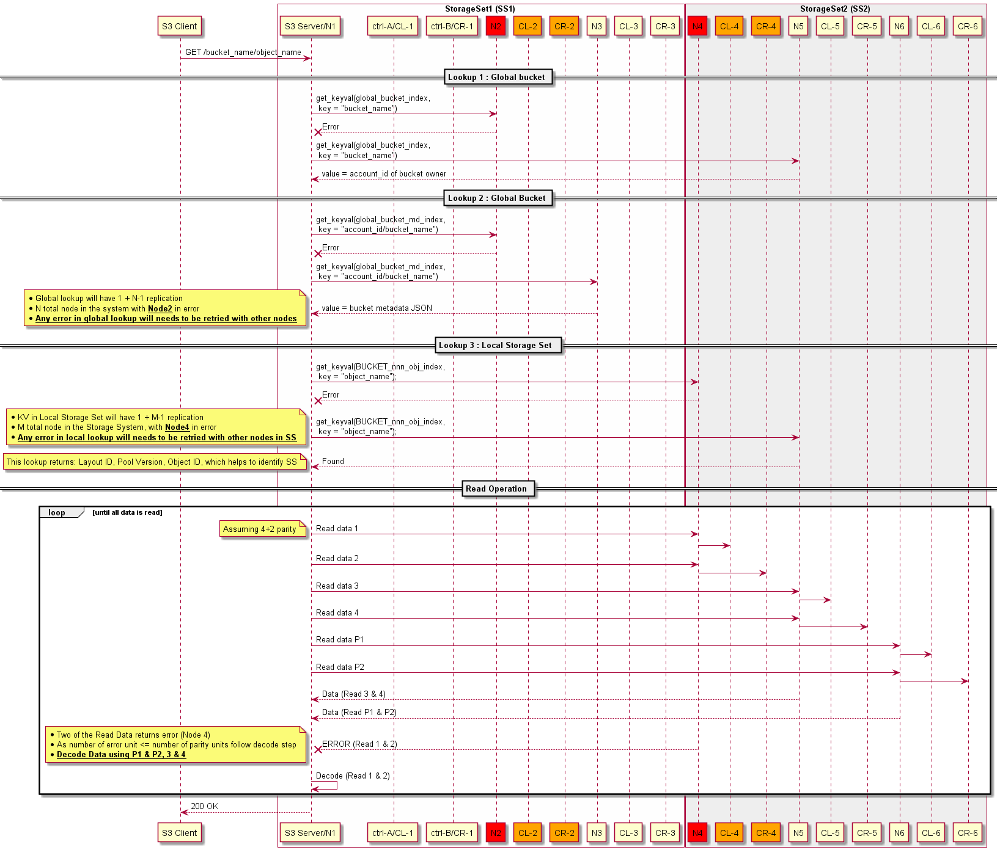
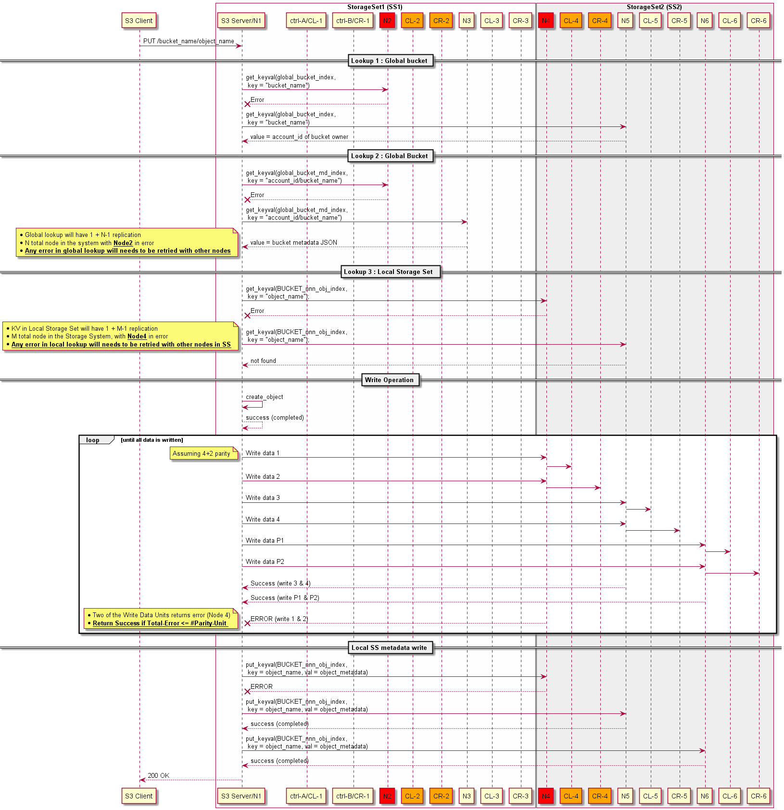

# Table of contents
- [1:Overview](#1:Overview)   
- [2:CORTX-Cluster-R2](#2:CORTX-Cluster-R2)
   - [2.1:Storage-Set](#2.1:Storage-Set)
      - [2.1.1:Enclosure](#2.1.1:Enclosure)
         - [2.1.1.1:Enclosure-SSD-Config-For-Metadata](#2.1.1.1:Enclosure-SSD-Config-For-Metadata)
      - [2.1.2:Server-MD-Layout](#2.1.2:Server-MD-Layout)
- [3:Failure-domain](#3:Failure-domain)
   - [3.1:Storage-Failure-Analysis](#3.1:Storage-Failure-Analysis)
   - [3.2:Network-Failure-Analysis](#3.2:Network-Failure-Analysis)
   - [3.3:Motr-Hare-HA-Notification](#3.3:Motr-Hare-HA-Notification)
- [4:Sequence-Flow-R2](#4:Sequence-Flow-R2)
   - [4.1:Simple-Object-Get](#4.1:Simple-Object-Get)
   - [4.2:Simple-Object-Put](#4.2:Simple-Object-Put)
   - [4.3:Failed-Node-Scenario](#4.3:Failed-Node-Scenario)
      - [4.3.1:Simple-Object-Get/Read](#4.3.1:Simple-Object-Get/Read)
      - [4.3.2:Simple-Object-Put/Write](#4.3.2:Simple-Object-Put/Write)
         - [4.3.2.1:Switching-Layout](#4.3.2.1:Switching-Layout)
   - [4.4:Failure-During-Operation](#4.4:Failure-During-Operation)
      - [4.4.1:Simple-Object-Get/Read](#4.4.1:Simple-Object-Get/Read)
      - [4.4.2:Simple-Object-Put/Write](#4.4.2:Simple-Object-Put/Write)

# Acronyms
| **Abbreviation** | **Description** |
| ----------- | ----------- | 
| DG | Disk Group : Set of disk associated with single controller |
| SS | Storage Set : Set of node on which data units are stripped. Note for R1 data are not stripped across SS  |

# 1:Overview
This document will be describe LDR R2 motr architecture and design

# 2:CORTX-Cluster-R2
Following are the hierarchy of Cortx Cluster
1. Cortx Cluster 
   - Top Level cluster will have multiple storage set
   - Each storage set will be connected at network layer
1. Storage Set 
   - Storage set will have multiple nodes
   - Number of nodes can vary with storage set (e.g N1 != N2) 
   - The capacity of storge set can differ even if number of nodes are same (N1 == N2)
1. Nodes
   - Node consist of server and enclosure pair. 
   - For R2, enclosure is isolated and only node can access its enclosure.

**Assumption**: CORTX R2 will have following characteristics
1. Storage set will communicate with each other at network layer. 
   - e.g In above figure Storage Set 1 and 2 are shown connected at network layer
1. **IOs will be confined to Storage Set.**
   - Data will only be striped across nodes in a Storage Set.
1. Any node in cluster can server S3 request for any storage set.
   - e.g In above figure Node 1 from Storage Set 1 can server read request for object stored in Storage Set 2

Note that any change in the above assumption will have implications on design.

## 2.1:Storage-Set
The figure below shows the details of storage set
- Storage set consist of N number of nodes i.e server and enclosure pair
- For LDRR2 each enclosure will have two Disk Droup (DG) and DG can be a failure domain.
- Two serve two DG, each server will need two instance of motr IO and CAS running on it.

Elements of Storage set are described in following section

### 2.1.1:Enclosure
Enclosure+Firmware creates Disk Group (DG) by groupping set of drives which contoller can access. Controller access drives through SAS Expander, so each contoller can access all DG. This helps to provide controller failover.

Enclosure Firmware also provides management interface to create set of volumes. As per enclosure team creating 8 volume gives optimal perfromance

#### 2.1.1.1:Enclosure-SSD-Config-For-Metadata
To improve the speed of metadata access SSDs can be used in following ways in enclosure.

- HDDs will be part of Standard Disk Group while
- SSDs will be part of Performance Disk Group 
- Metadata volume affinity should be set for Performance
- Ideally SSD Capacity >= Metadata Volume Size / 2

**TODO**: Analyze the impact of  multiple DG in a storage pool and it's failure handling

### 2.1.2:Server-MD-Layout
All the Servers in CORTX cluster are able to communicate with each other using network interface. As S3 request can arrive at any node in the cluster, S3 server (running on node) should be able to locate the storage set in which object info is located and then the further details about object can be retrieved. 
**Note**: Object info and Object can reside on different storage set.

To support the above functionality following S3 metadata should be replicated across storage set
1. Global Bucket Index
1. Bucket List Index

As the size of this metadata is small, it will be beneficial to replicate this across all the nodes of cluster and during lookup, the local node can provide all the data. Caching mechanism will also help to speedup the lookup for these data.

Note that following new fields needs to be added to existing S3 metadata:
- New field needs to be  added to the Bucket List Index metadata to locate storage set in  which 'Object List Table' is present. 
- 'Object List Table' to storage 'Pool Version' and 'Layout ID' locate the Storage Set in which object is located.

**JIRA**: S3 metadata should have version field and reserved field to allow upgraded to metadata without any need for migration?

** NOTE: Work In Progress **

# 3:Failure-domain
This section will analyze failure domain and its impact on data/metadata consistency. Motr failure will be mainly related to error in accessing storage or network. Sections below describes these failures.

## 3.1:Storage-Failure-Analysis
With respect of motr following category of storage failure can occur:

| **Failure Component** | **Description** | **Motr Failure Domain Mapping** | 
| --------------------- | --------------- | ------------------------------- | 
| DG Failure | More than acceptable number of drive failure in Enclosure | Disk Group Failure |
| Controller | Single Controller Failure | No Impact (User notification) |
| Both Controller Failure | Node Failure / Both DG unaccessible | Node Failure / Dual DG Failure  |
| SAS HBA  | Both DG unaccessible | Node Failure / Dual DG Failure  |
| Enclosure | Both DG unaccessible | Node Failure / Dual DG Failure  |
  
All the failure handling maps to DG failure in Motr.

## 3.2:Network-Failure-Analysis
With respect of motr following category of newtwork failure can occur:

| **Failure Type** | **Motr  Motr Action** |
| ---------------- | --------------------- | 
| Single Node Unreachable in SS | Node Failure in Storage Set* |    
| Single Node Unreachable in other SS | Avoid metadata reads on those nodes |
| Multiple Node Unreachable in SS 
   - With partition such that node is still part of SS | Node Failure in Storage Set* |
| Multiple Node Unreachable in SS
   - With partition such that node is not a part of SS | Return Error for all IOs, HA Action - Stop IO service? |
| Multiple Node Unreachable in other SS | Avoid metadata reads on those nodes |
| All Nodes Unreachable in other SS | Avoid metadata reads on those nodes & return error for if Object List Index metadata is part of that SS |

TODO: With the communication broken between two storage set how the two storage set continue to function with other distrubuted software e.g. Consul and how to sync data when they join back 

  ***Node Failure in Storage Set**:
- Mark volumes of node to be failed
- Avoid write on the volumes, switch to different protection config
- Degraded read for read IOs having data on the disk

## 3.3:Motr-Hare-HA-Notification
Hare will notify motr when Disk Group or Node is available/unavailable.
Motr

| **HA Notification**  | **Parameter** | 
| -------------------- | ------------- | 
| Disk Group Failure | Node ID, DG Number | 
| Disk Group Available | Node ID, DG Number | 
| Node Failure | Node ID | 
| Node Available | Node ID |  

Motr will mark the corresponding volume set as unavailable/available based on the event.
**Note**: Assuming Node ID unique across cluster otherwise NodeID:StorageSet pair will be needed to identify failure at motr

The figure below shows motr-hare interface for HA notification and DG failure related info.  

Motr will notify Hare when there is any error in accessing storage (STOB IO Error). Hare will not take any action on this error. Hare will take action on HA events related to storage hardware failure from SSPL.

# 4:Sequence-Flow-R2
This section will have sequence flow diagram for all the case in motr R2
Following is the configuration for the sequence flow diagram
* Two Storage Set (SS) in cluster
* Each storage set with 3 nodes
* Single node failure in a SS is allowed
* Global bucket is replicated across all nodes of cluster (N):
   - This is small amount of global bucket data
   - Frequency of creation of this bucket data is low
   - Replication to all nodes allows each storage set to easily support one node failure and will also help with case of Storage Set addition.
   - Full replication will help in performance as global metadata lookup can be done on local node/DG. 
   - Mimimum replication for global metadata needed in a storage set is 1+K 
* Similarly Local S3 metadata should be replicated across atleast 1+K nodes/DG
* Data is striped across DG in 4+2 parity config (K=2)

## 4.1:Simple-Object-Get
Sequence flow for simple object get is shown in figure below
1. S3 Client sends GET request with <bucket_name><object_name> and S3 Server will receive this request
1. S3 Server will do first lookup using <bucket_name>
   - Lookup will return <account_id> 
1. S3 Server will do second lookup with <bucket_name><account_id> 
   - Lookup will return <object_list_index> and details of corresponding SS <poll_ver>
1. S3 Server will do third lookup with <object_list_index><object_name>
   - Lookup will return <layout_id><pool_ver><object_ID>
1. Based on the layout ID and SS info, S3 server will send Read request to motr server
   - Read request will be routed to controller and data will be returned
1. Once all data is returned, status OK/200 will be returned to user.

## 4.2:Simple-Object-Put
Sequence flow for simple object get is shown in figure below
1. S3 Client sends PUT request with <bucket_name><object_name> and S3 Server will receive this request
1. S3 Server will do first lookup using <bucket_name>
   - Lookup will return <account_id> 
1. S3 Server will do second lookup with <bucket_name><account_id> 
   - Lookup will return <object_list_index> and details of corresponding SS <poll_ver>
1. S3 Server will do third lookup with <object_list_index><object_name>
   - Object should not be present as we are going to create it!
1. K-Parity unit for N-data unit will be created
   - N+K unit of data will be writen to volume distrubuted across DG
1. Object metadata e.g. <layout_id><pool_ver><object_ID> will be written to <object_list_index>
   - Metadata will be replicated across volumes of K DG
1. Once all data is written, status OK/200 will be returned to user.

## 4.3:Failed-Node-Scenario
The sequence diagram below describes GET/PUT flow for the scenario where node is failed and failure is registered by CORTX stack.

### 4.3.1:Simple-Object-Get/Read
* Read path error handling avoids communicating with failed node for metadata and data operations.

### 4.3.2:Simple-Object-Put/Write
* Write path error handling avoids communicating with failed node for metadata and data operations.

#### 4.3.2.1:Switching-Layout
<TODO: Add details of switching of layout>

### 4.3.3:Registration-of-failed-node
<TODO: Add details of node failure registration>

## 4.4:Failure-During-Operation
The sequence diagram below describes GET/PUT flow for the scenario where node is failing and failure is not yet registered by CORTX stack.

### 4.4.1:Simple-Object-Get/Read
* Read path should detect error in retriving data and should use parity units to get missing data.

### 4.4.1:Simple-Object-Put/Write
* Write path should detect error in writing data and should return success if the failed number of write unit is less than or equal to number of parity unit

# WIP
Following scenario will be analyzed w.r.t. DTM role to restore storage system to consistent state w.r.t metadata and data.

- IO Failure: Node or IO Service going down temporarily
- Software Upgrade: Node going through SW upgrade.
- Storage Set Addition: A new storage set becoming part of cluster

#### IO Failure
A node or storage unavailable for some time can cause following issues
1. Node will not be able to update following metadata and it will get out of sync with cluster
   1. Global Bucket List : Across Storage Set
   1. Bucket Object List Table : Within Storage Set
1. Data unit directed to the node will get dropped and object will lose units of data (1-MAX_DISK_GROUP_IN_SS) 

#### Software (SW) Upgrade
Without DTM, cluster can service Read Object request during SW upgrade but for write object and bucket creation metadata will need DTM. 

#### Storage Set Addition
A new storage set addition will need to sync Global Bucket List and DTM will be needed for that.

As for P0 we can live with object in degraded state, we can skip DTM for Data.
But the DTM is mandatory for keeping the cluster distributed metadata in consistent state.

# I. Node failure During IO
## Error Scenario : 
* One node from each storage set (SS) fails during IO.
* Any error in reading metadata should be retried with metadata available with replicated node

# II. Detected Node failed Scenario
## Error Scenario : 
* One node from each storage set (SS) has failed.
* Motr is aware of failure and Hare has notified to motr about the node failure

