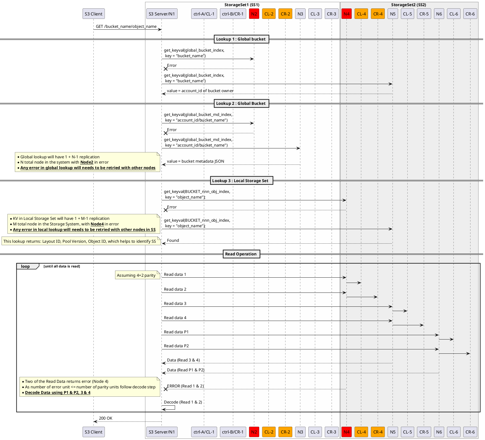
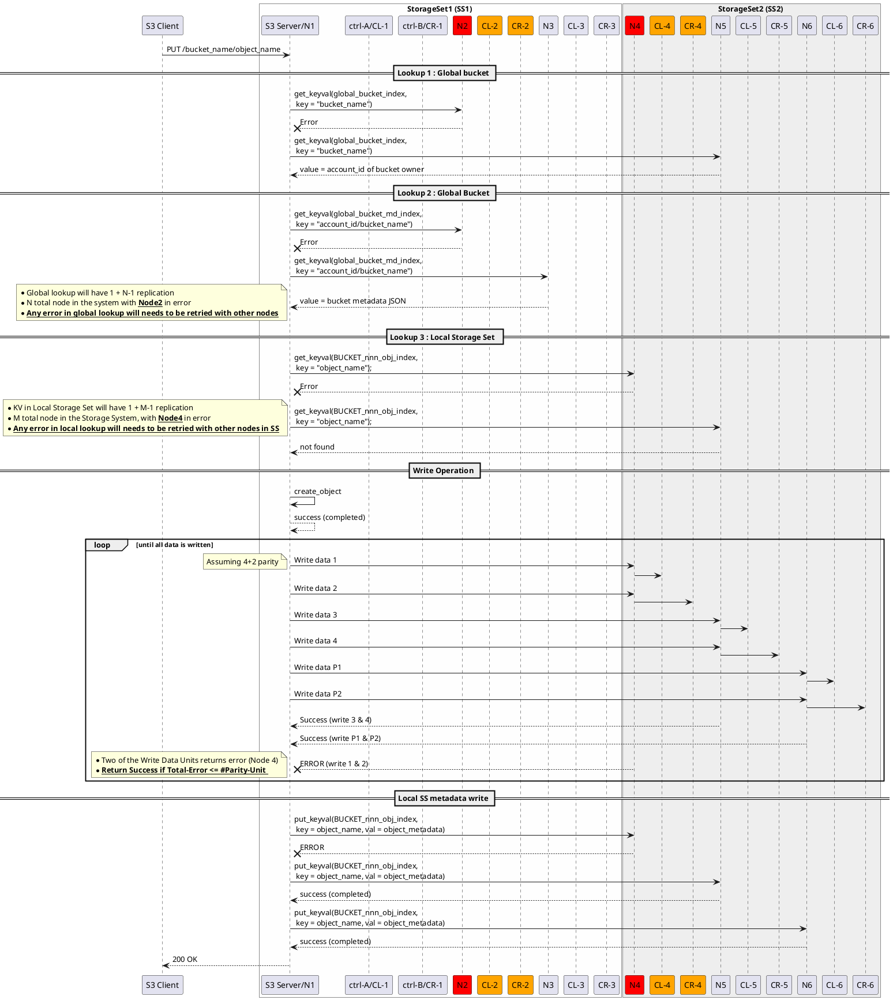
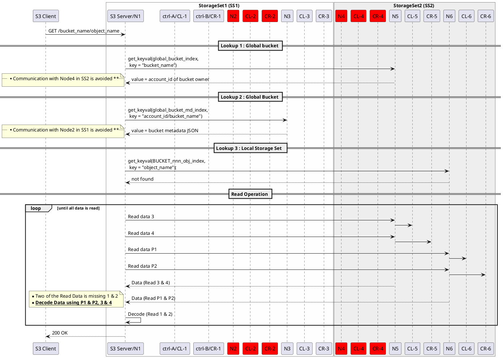
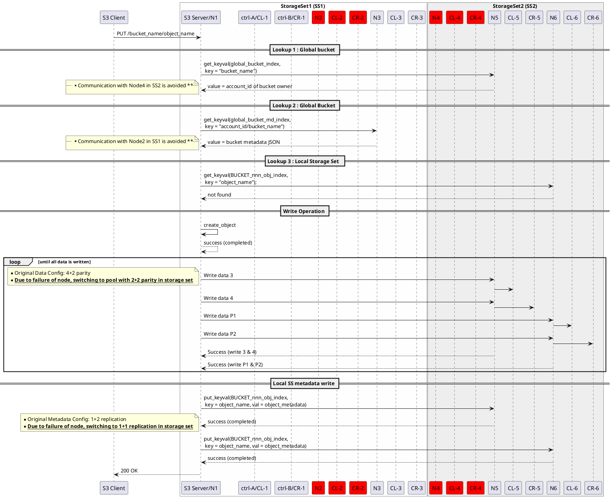

# Table of contents
1. [Overview](#Overview)
   - [CORTX-Cluster](#CORTX-Cluster)
2. [Function-Requirement](#Function-Requirement)
    1. [Sub paragraph](#subparagraph1)
3. [Another paragraph](#paragraph2)

# Overview
This document will be describe LDR R2 motr architecture and design
## CORTX-Cluster
Following are the hierarchy of Cortx Cluster
1. Cortx Cluster 
   - Top Level cluster will have multiple storage set
   - Each storage set will be connected at network layer
1. Storage Set 
   - Storage set will have multiple nodes
   - Number of nodes can vary with storage set (e.g N1 != N2) 
   - The capacity of storge set can differ even if number of nodes are same (N1 == N2)
1. Nodes
   - Node consist of server and enclosure pair. 
   - For R2, enclosure is isolated and only node can access its enclosure.

### R2-CORTX-Cluster
CORTX R2 will have following characteristics
1. Storage set will communicate with each other at network layer. 
   - e.g In above figure Storage Set 1 and 2 are shown connected at network layer
1. **IOs will be confined to Storage Set.**
   - Data will only be striped across nodes in a Storage Set.
1. Any node in cluster can server S3 request for any storage set.
   - e.g In above figure Node 1 from Storage Set 1 can server read request for object stored in Storage Set 2

### Storage-Set
Storage set

# Function-Requirement
This section will list all the functional requirement for motr scaleout architecture

## Basic Assumptions
Following are the basic assumptions for creating the sequence flow for various error scenarios
- Global Bucket list is replicated across stroage set.
-- Lookup into global metadata will give Stroage Set where the bucket list and data reside
- Bucket Object List Table is replcated within storage set
-- Bucket Object List Table if we make this global than size of global data inreases lot? So this should be within storage set, but objects can be part of different storage set but Object data does not span across storage set ?

## Initial Condition : 
* Two Storage Set (SS) in cluster
* Each storage set with 3 nodes
* Single failure in a node is allowed
* Global bucket is replicated across all nodes of cluster (N):
   - This is small amount of global bucket data
   - Frequency of creation of this bucket data is low
   - Replication to all nodes allows each storage set to easily support one node failure and will also help with case of Storage Set addition.
   -- Full replication will help in performance, mimimum replication needed in a storage set is #num_of_node_failure_in_storage_set + 1 
* Local S3 metadata should be replicated across atleast 3 nodes of a storage set
   - Replication of data across 3 nodes of storage set, will helps in node failure     
* Data is striped in 4+2 parity config

## DTM Usage
This section will analyze the DTM usage in various scenario with assumption that

### Scenario
Following scenario will be analyzed w.r.t. DTM role to restore storage system to consistent state w.r.t metadata and data.

- IO Failure: Node or IO Service going down temporarily
- Software Upgrade: Node going through SW upgrade.
- Storage Set Addition: A new storage set becoming part of cluster

#### IO Failure
A node or storage unavailable for some time can cause following issues
1. Node will not be able to update following metadata and it will get out of sync with cluster
   1. Global Bucket List : Across Storage Set
   1. Bucket Object List Table : Within Storage Set
1. Data unit directed to the node will get dropped and object will lose units of data (1-MAX_DISK_GROUP_IN_SS) 

#### Software (SW) Upgrade
Without DTM, cluster can service Read Object request during SW upgrade but for write object and bucket creation metadata will need DTM. 

#### Storage Set Addition
A new storage set addition will need to sync Global Bucket List and DTM will be needed for that.

As for P0 we can live with object in degraded state, we can skip DTM for Data.
But the DTM is mandatory for keeping the cluster distributed metadata in consistent state.

# I. Node failure During IO
## Error Scenario : 
* One node from each storage set (SS) fails during IO.
* Any error in reading metadata should be retried with metadata available with replicated node

## 1. Simple Object Get/Read
* Read path should detect error in retriving data and should use parity units to get missing data.

## 2. Simple Object Put/Write
* Write path should detect error in writing data and should return success if the failed number of write unit is less than or equal to number of parity unit

# II. Detected Node failed Scenario
## Error Scenario : 
* One node from each storage set (SS) has failed.
* Motr is aware of failure and Hare has notified to motr about the node failure

## 1. Simple Object Get/Read
* Read path error handling avoids communicating with failed node for metadata and data operations.

## 2. Simple Object Put/Write
* Write path error handling avoids communicating with failed node for metadata and data operations.

