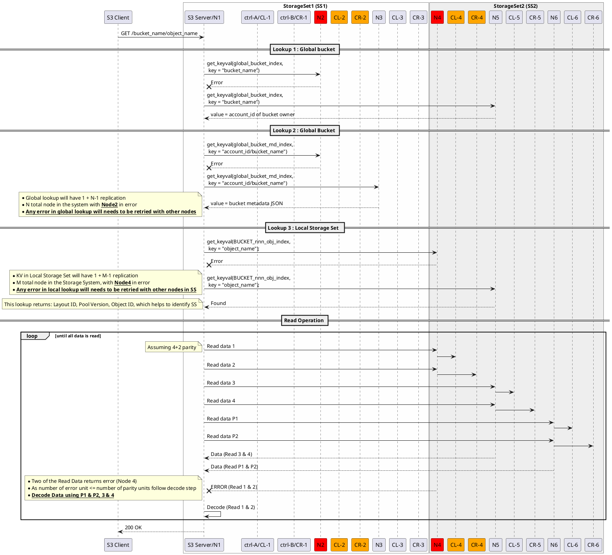

# Overview
* This document talks about get/read object flow with error scenario
* Various cases of error are described in section below
* Initial condition is same for all described below

## Initial Condition : 
* Two Storage Set (SS) in cluster
* Each storage set with 3 nodes
* Single failure in a node is allowed
* Global bucket is replicated across all nodes of cluster (N):
   - This is small amount of global bucket data
   - Frequency of creation of this bucket data is low
   - Replication to all nodes allows each storage set to easily support one node failure and will also help with case of Storage Set addition (or for SS replication of #num_of_node_failure_in_storage_set + 1) is sufficient) 
* Local S3 metadata should be replicated across atleast 3 nodes of a storage set
   - Replication of data across 3 nodes of storage set, will helps in node failure     
* Data is striped in 4+2 parity config

# I. Simple Object Download + 2 Storage Set Cluster + Node failure During IO
## Error Scenario : 
* One node from each storage set (SS) fails during IO.
* Read path should detect error in retriving data and should use parity units to get missing data.
* Any error in reading metadata should be retried with metadata available with replicated node



# II. Simple Object Download + 2 Storage Set Cluster + Node failed
## Assuming cluster is aware of SS-1 N2 and SS-2 N4 failure & communication is avoided with them
## Error Scenario : 
* One node from each storage set (SS) has failed.
* Motr is aware of failure and Hare has notified to motr about the node failure
* Read path error handling avoids communicating with failed node for metadata and data operations.

```plantuml
@startuml
participant "S3 Client" as client
box StorageSet1 (SS1) #FEFEFE
participant "S3 Server/N1" as N1
participant "ctrl-A/CL-1" as CL_1
participant "ctrl-B/CR-1" as CR_1
participant "N2" as N2 #red
participant "CL-2" as CL_2 #red
participant "CR-2" as CR_2 #red
participant "N3" as N3
participant "CL-3" as CL_3
participant "CR-3" as CR_3
end box
box StorageSet2 (SS2) #EEEEEE
participant "N4" as N4 #red
participant "CL-4" as CL_4 #red
participant "CR-4" as CR_4 #red
participant "N5" as N5
participant "CL-5" as CL_5
participant "CR-5" as CR_5
participant "N6" as N6
participant "CL-6" as CL_6
participant "CR-6" as CR_6
end box

client -> N1: GET /bucket_name/object_name

== Lookup 1 : Global bucket ==
N1 -> N5: get_keyval(global_bucket_index,\n key = "bucket_name")
N5 --> N1: value = account_id of bucket owner

note left
   __** Communication with Node4 in SS2 is avoided **__
end note

== Lookup 2 : Global Bucket ==
N1 -> N3: get_keyval(global_bucket_md_index,\n key = "account_id/bucket_name")
N3 --> N1: value = bucket metadata JSON

note left
   __** Communication with Node2 in SS1 is avoided **__
end note

== Lookup 3 : Local Storage Set  ==
N1 -> N6: get_keyval(BUCKET_nnn_obj_index,\n key = "object_name");
N6 --> N1: not found

== Read Operation ==

loop until all data is read
  N1 -> "N5": Read data 3
  "N5" -> CL_5
  N1 -> "N5": Read data 4
  "N5" -> CR_5

  N1 -> "N6": Read data P1
  "N6" -> CL_6
  N1 -> "N6": Read data P2
  "N6" -> CR_6

  N5 --> N1: Data (Read 3 & 4)
  N6 --> N1: Data (Read P1 & P2)
note left
   * Two of the Read Data is missing 1 & 2
   * __**Decode Data using P1 & P2, 3 & 4**__
end note
  "N1" -> N1 : Decode (Read 1 & 2)    
end

N1 --> client: 200 OK

@enduml
