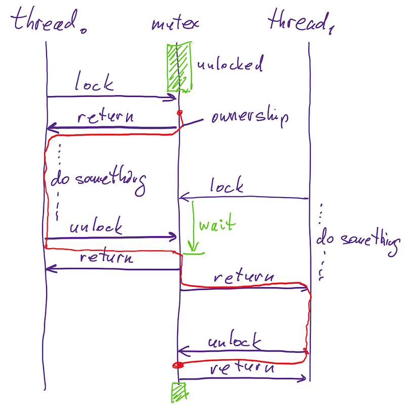

=====================
Library documentation
=====================

:author: Nikita Danilov <nikita.danilov@seagate.com>
:state: INIT
:copyright: Seagate
:distribution: unlimited

:abstract: This document describes motr library.

Stakeholders
============

+----------+----------------------+----------------------------+----------------+
| alias    | full name            | email                      | rôle           |
+==========+======================+============================+================+
| nikita   | Nikita Danilov       | nikita.danilov@seagate.com | author,        |
|          |                      |                            | architect      |
+----------+----------------------+----------------------------+----------------+

Overview
========

This document describes motr library. The library is a collection of software
modules in lib/ sub-directory of the top-level motr source directory. It is not
to be confused with "libmotr", which is the name of the shared library
containing the entirety of motr. The library contains code used by the rest of
motr.

The contents of the library can be roughly classified into:

  - data-structures:

    - double-linked list (list.c, list.h);

    - typed double-linked list (tlist.c, tlist.h)

    - queue (queue.c, queue.h)

    - typed hash-table (hash.c, hash.h)

    - bitmap (bitmap.c, bitmap.h)

    - bitstring (bitstring.c, bitstring.h)

    - extents (ext.c, ext.h)

    - virtual array (varr.c, varr.h)

    - vector (vec.c, vec.h)

    - buffer (buf.c, buf.h)

  - correctness, testing and debugging

    - assertions (assert.c, assert.h)

    - branded object (bob.c, bob.h)

    - failure injection (finject.c, finject.h)

    - tracing (trace.c, trace.h)

  - synchronisation

    - atomics (atomic.h)

    - mutex (mutex.c, mutex.h)

    - reference counter (refs.c, refs.h)

    - read-write lock (rwlock.h)

    - semaphore (semaphore.c, semaphore.h)

    - condition variables (cond.c, cond.h)

    - wait channels (chan.c, chan.h)

  - portability

    - error codes (errno.h)

    - processor features and topology (processor.h)

    - memory allocator (memory.c, memory.h)

    - string operations (string.c, string.h)

    - thread (thread.c, thread.h)

    - time (time.c, time.h)

    - timers (timer.c, timer.h)

    - types (type.c, type.h)

    - endianness (byteorder.h)

    - file system operations (fs.h)

    - command line options (getopts.c, getopts.c)

  - algorithms

    - combinatorics (combinations.c, combinations.h)

    - hash functions (hash_fnc.c, hash_fnc.h)

    - various helper functions (misc.c, misc.h, arith.h)

  - non-blocking per-core coding

    - locality (locality.c, locality.h)

    - locker (lockers.c, lockers.h)

    - coroutines (coroutine.c, coroutine.h)

  - other

    - thread pool (thread_pool.c, thread_pool.h)

    - cookie (cookie.c, cookie.h)

    - uuid (uuid.c, uuid.h)

Do not read too much into this classification, it is to some extent
arbitrary. For example, mutex can be alternatively classified into "portability"
section, because it provides the same interface over multiple platforms.

Platforms
=========

One of the advantages of motr is its portability. The library insulates the rest
of the motr code-base from details of the platform that executes a motr
process. Historically, motr supported 2 platforms:

   - linux user space. On this platform, a motr process is executed in a normal
     Linux user space environment and has access to all standard services:
     system calls, standard C library, virtual memory, file system, etc.;

   - linux kernel space. On this platform a motr process is executed as a Linux
     kernel module.

Recently, motr got a macos port
(https://github.com/Seagate/cortx-motr/tree/darwin).

In addition to generic code in lib/\*.[ch], platform specific code is located in
lib/$PLATFORM/\*.[ch].

Synchronisation
===============

The library provides some *synchronisation primitives* that is data-types used
to organise communication and cooperation between multiple threads. The set of
supported primitives is fairly standard:

    - atomics: atomic variables have well-defined semantics when updated and
      inspected concurrently by multiple threads. motr provides single atomic
      type ``struct m0_atomic64`` which is a 64-bit atomic value. Atomics
      modules also provides memory barriers.

    - mutex: mutual exclusion lock that can be used to implement critical
      sections. Plural of "mutex" is "mutices".

----

      Mutices come with ``mutex_is_locked()`` function. This function returns
      true iff the mutex is locked *by the current thread*. Similarly,
      ``mutex_is_not_locked()`` is true iff the mutex is not locked by the
      current thread. It is not necessarily true that 

.. highlight:: C
.. code-block:: C

   !mutex_is_locked(lock) == mutex_is_not_locked(lock)

----

      When mutex debugging support is disabled, both these functions always
      return true. They can only be used in assertions.

    - read-write lock: a lock that can be taken in shared or exclusive
      mode. Multiple readers can acquire a read-write lock at the same time. A
      writer is exclusive to other writers and readers.

    - semaphore: generic Dijkstra semaphore with down (P) and up (V)
      operations. Also, has a version of down operation with timeout.

      Locks have notion of *ownership*: only the same thread that locked the
      lock can unlock it. Semaphores do not have ownership.

    - condition variable: a more complex primitive. Historically appeared in
      so-called "Hansen-Hoare monitors". A thread can *signal* a condition
      variable. A thread can *wait* until a condition variable is signalled.

      Notionally, a condition variable packages two things: a predicate ("a
      condition", hence the name) on computation state, *e.g.*, "a free buffer is
      available", "an incoming request waits for processing" or "all worker
      threads have finished", and a mutex protecting changes to the state
      affecting the predicate.

      There are two parts in using condition variable:

        - in all places where state is changed in a way that affects the
	  predicate, the condition variable associated with the predicate has to
	  be signalled;

        - to wait for predicate to change, one takes the lock, checks the
	  predicate and calls cond_wait() until the predicate becomes true:

      Let's look at an example, a multiple producer, multiple consumer bounded
      queue:

.. highlight:: C
.. code-block:: C

  struct queue {
          struct mutex lock;
          struct cond  notempty;
          struct cond  notfull;
          int          produced; /* Total number of items ever inserted. */
          int          consumed; /* Total number of items ever removed. */
          int          items[N]; /* Produced, but not yet consumed items. */
  }

  int get(struct queue *q) {
          int item;
          lock(&q->lock);
          while (q->produced == q->consumed) {
                  cond_wait(&q->notempty);
          }
          assert(q->produced > q->consumed);
          item = q->item[q->consumed++ % N];
          cond_signal(&q->notfull);
          unlock(&q->lock);
          return item;
  }

  void put(struct queue *q, int item) {
          lock(&q->lock);
          while (q->produced - q->consumed == N) {
                  cond_wait(&q->notfull);
          }
          assert(q->produced - q->consumed < N);
          q->item[q->produced++ % N] = item;
          cond_signal(&q->notempty);
          unlock(&q->lock);
  }

----

      Note that one has to re-check the predicate after cond_wait() returns,
      because it might, generally, be false if multiple threads are waiting for
      predicate change (in the above example, if there are multiple concurrent
      calls to get()). This introduces one of the nicer features of condition
      variables: de-coupling of producers and consumers.

      There is also cond_broadcast() that is called to wake up all waiters.

      Note that signal and broadcast are typically called under the mutex. It is
      sometimes valid to call them without the mutex being held, but be careful.

    - reference counter: the idea of reference counter object comes from Linux
      kernel https://github.com/torvalds/linux/blob/master/include/linux/kref.h .

      Reference counters are deprecated, they are difficult to use correctly.
      
    - wait channel: this synchronisation primitive is a bit unusual. It is like
      a condition variable without a mutex, but with an ability to register a
      call-back instead of waiting.

      Channels have a rich interface. motr uses them extensively. They were
      designed to match motr non-blocking execution model.

.. image:: chan.png

----

.. highlight:: C
.. code-block:: C

  struct queue {
          struct mutex lock;
          struct chan  notempty;
          struct chan  notfull;
          int          produced; /* Total number of items ever inserted. */
          int          consumed; /* Total number of items ever removed. */
          int          items[N]; /* Produced, but not yet consumed items. */
  }

  int get(struct queue *q) {
          int          item;
	  struct clink waiter;
          lock(&q->lock);
	  clink_init(&waiter, NULL);
	  clink_add(&q->notempty, &waiter);
          while (q->produced == q->consumed) {
	          unlock(&q->lock);
                  chan_wait(&waiter);
                  lock(&q->lock);
          }
          assert(q->produced > q->consumed);
	  clink_del(&waiter);
	  clink_fini(&waiter);
          item = q->item[q->consumed++ % N];
          cond_signal(&q->notfull);
          unlock(&q->lock);
          return item;
  }

  void put(struct queue *q, int item) {
	  struct clink waiter;
          lock(&q->lock);
	  clink_init(&waiter, NULL);
	  clink_add(&q->notfull, &waiter);
          while (q->produced - q->consumed == N) {
	          unlock(&q->lock);
                  chan_wait(&waiter);
                  lock(&q->lock);
          }
          assert(q->produced - q->consumed < N);
	  clink_del(&waiter);
	  clink_fini(&waiter);
          q->item[q->produced++ % N] = item;
          cond_signal(&q->notempty);
          unlock(&q->lock);
  }

----

..  LocalWords:  Mutices mutices Atomics struct darwin macos iff
