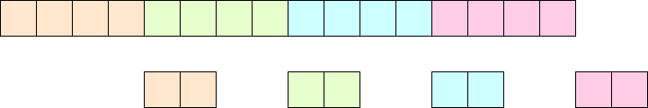
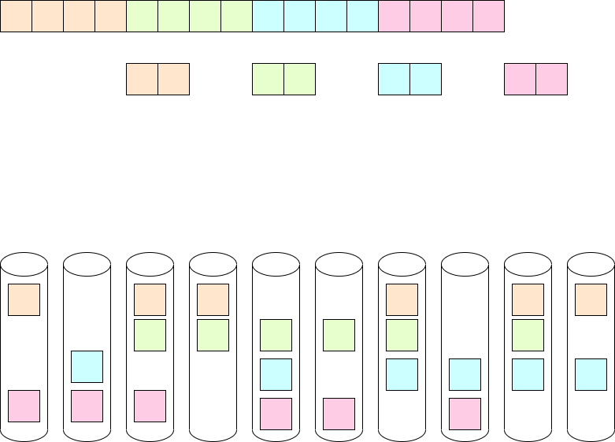
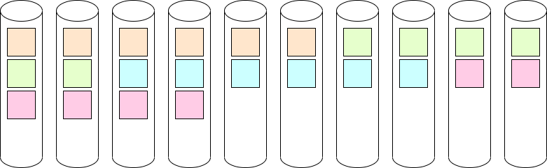
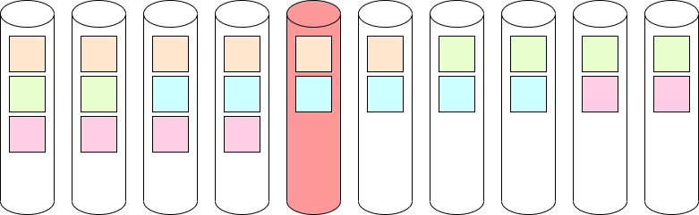
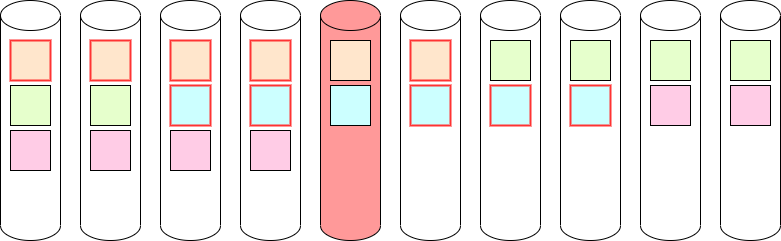
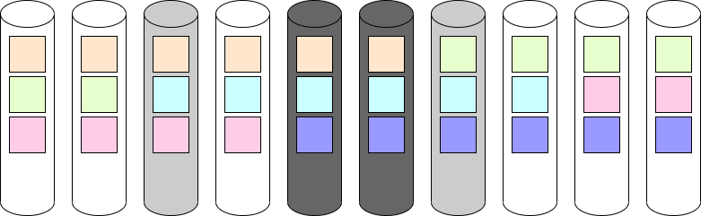
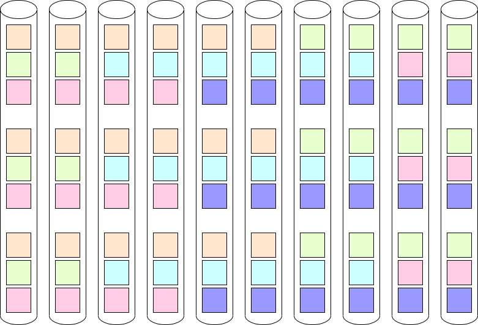
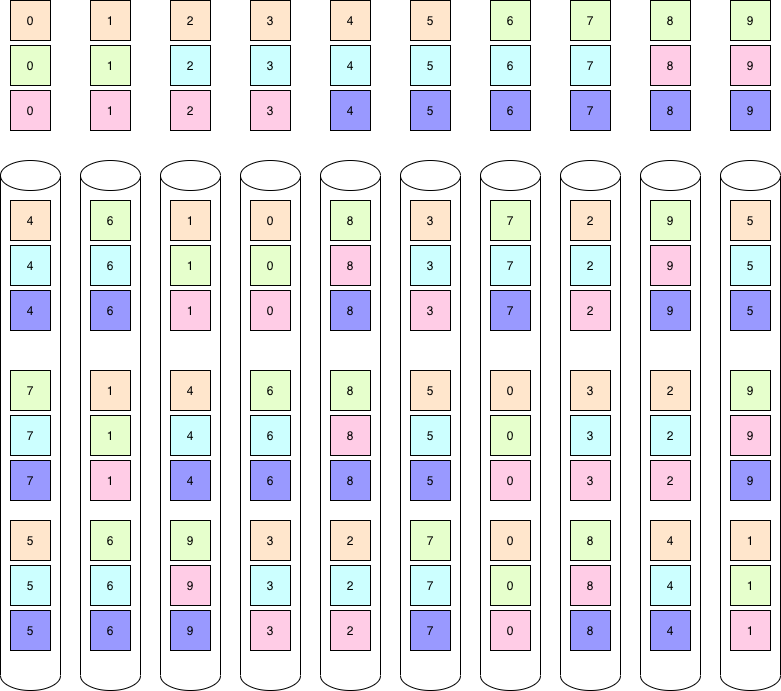
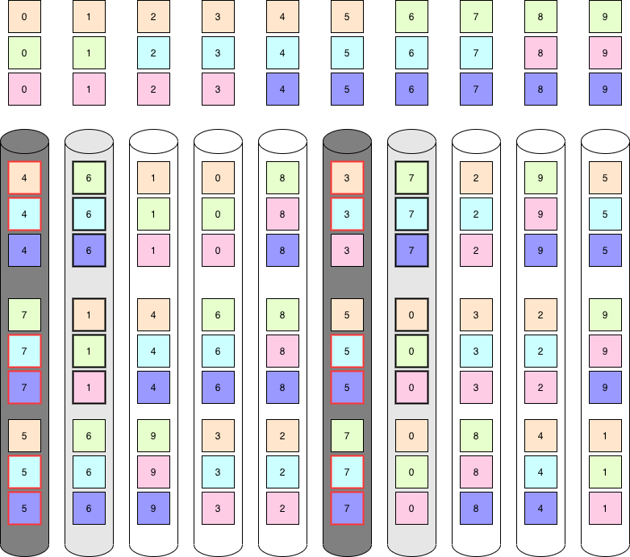

==================================
Parity de-clustering documentation
==================================

:author: Nikita Danilov <nikita.danilov@seagate.com>
:state: INIT
:copyright: Seagate
:distribution: unlimited

:abstract: This document describes how and why state machines are used by motr.

Stakeholders
============

+----------+----------------------+----------------------------+----------------+
| alias    | full name            | email                      | rôle           |
+==========+======================+============================+================+
| nikita   | Nikita Danilov       | nikita.danilov@seagate.com | author,        |
|          |                      |                            | architect      |
+----------+----------------------+----------------------------+----------------+

Introduction
============

*Parity de-clustering* (or pdclust for short) is a type of motr layout, but
let's define what layout is first. In motr every object (where applications
store blocks of data) and index (where applications store key-value records) has
a layout. For an object (indices will be covered later), the layout determines
where in the distributed storage system, object blocks are or should be
stored. The layout is stored as one of the object attributes, together with
other object meta-data. Ignoring, for the time being, the question of how
exactly the location of a block in the storage system is specified, the object
IO operations use layouts. A read operation queries the object layout about the
location of object blocks and then fetches the data from the locations returned
by the layout. A write operation, queries the layout where (overwritten) blocks
are located and (new) blocks should be located and updates the specified
locations with the user-provided data.

In addition to driving IO operations, layout also comes with certain
fault-tolerance characteristics and mechanisms. It might specify that object
data are stored *redundantly*, that is, the original data can still be recovered
is some system component hosting some part of the data fails, and might come
equipped with some fault-tolerance processes.

The layout of a particular object is an instance of some *layout
type*. Currently motr has the only layout type fully implemented: pdclust, other
layout types (compressed, encrypted, de-duplicated, composite, *etc*.) are
planned.

Parity de-clustering
====================

Parity de-clustering comes under many names in motr: "SNS" (server network
striping), network RAID, erasure coding. Network RAID gives probably the most
accessible initial intuition about what parity de-clustering is: it's like a
normal device RAID, but across multiple network nodes.

Recall how a typical RAID system works. Given an object to be stored, select a
certain *unit size* and divide the object in data units of this size. Then
aggregate consecutive N data units and calculate for them K units of
parity. Together N data units and K parity units constitute a *parity
group*. The most important property of parity group is that given any N units
(out of N+K) all N+K units can be recovered. This is achieved by carefully
designed parity calculation functions. There are many ways to achieve this, motr
uses the most widely known: Reed-Solomon codes. This ability to recover parity
units is what provides fault-tolerance of pdclust. It is said that a parity
de-clustered layout has *striping pattern* N+K (there are more component to
striping pattern, to be described later), N > 0, K >= 0. Parity blocks are
allocated, filled and managed by the motr IO code and are not visible to the
user.

Some examples of striping patterns:

    - N+0: RAID-0,
    - 1+1: mirroring,
    - 1+K: (K+1)-way replication,
    - N+1: RAID-5. In this case, parity unit is XOR-sum of the data units,
    - N+2: RAID-6.

Once the support for units and parity groups is in place, IO is conceptually
simple: layout knows the location of all units (data and parity). To read a data
unit just read it directly from the location provided by the layout. In case
this read fails, for whatever reason, read the remaining units of the parity
group and reconstruct the lost data unit from them, this is called *degraded
read*. Write is more complex. The simplest case is when the entire parity group
of N data units is overwritten. In this case, write calculates K parity units
and writes all N+K units in their locations (as determined by the layout). When
a write overwrites only a part of the parity group, read-modify-write cycle is
necessary. In case of failure, a *degraded write* is performed: up to K unit
writes can fail, but the write is still successful.

Example
=======

Consider a very simple storage system. Ignore all the actual complexity of
arranging hardware, cables, attaching devices to servers, racks, *etc*. At the
most basic level, the system consists of a certain number of storage
devices. Units can be read off and written to devices. Devices can fail
(independently).

There is a problem of how units of a parity de-clustered file are
scattered over these devices. There are multiple factors:

    - for a given parity group, it's clearly preferable to store each unit (data
      and parity) on a separate device. This way, if the device fails, at most
      one unit for each group is lost;
    - larger K gives better fault-tolerance,
    - storage overhead is proportional to K/N ratio,
    - because full-group overwrites are most efficient, it's better to keep unit
      size small (then a larger fraction of writes will be full-group),
    - to utilise as many disc spindles as possible for each operation, it's
      better to keep unit size small,
    - to have efficient network transfers it's better to have large unit size,
    - to have efficient storage transfers it's better to have large unit size,
    - cost of computing parity is O(K^2);
    - to minimise amount and complexity of internal meta-data that system must
      maintain, the map from object units to their locations should be
      *computable* (*i.e.*, it should be possible to calculate the location of a
      unit by certain function);
    - to apply various storage and IO optimisations (copy-on-write, sequential
      block allocation, *etc*.), the map from object units to their locations
      should be constructed dynamically.

Failures
========

Again, consider a very simple storage system, with a certain number (P) of
storage devices without any additional structure, and with striping pattern
N+K. Suppose a very simple round-robin block allocation is used:

A device fails:

At a conceptual level (without at this time considering the mechanisms used),
let's understand what would be involved in the *repair* of this failure. To
reconstruct units lost in the failure (again, ignoring for the moment details of
when they are reconstructed and how the reconstructed data is used), one needs,
by the definition of the parity group, to read all remaining units of all
affected parity groups.

Suppose that the number of devices (P) is large (10^2--10^5) and the number of
units is very large (10^15). Ponder for a minute: what's wrong with the picture
above?

The problem is that the number of units that must be read off a surviving device
to repair is different for different devices. During a repair some devices will
be bottlenecks and some will be idle. With a large P, most of the devices will
idle and won't participate in the repair. As a result, the duration of repair
(which is the interval of critical vulnerability in which the system has reduced
fault-tolerance) does not reduce with P growing large. But the probability of a
failure, does grow with P, so overall system reliability would decrease as P
grows. One can do better.

Uniformity
==========

To get better fault-tolerance, two more requirements should be added to our
list:

    - units of an object are uniformly distributed across all devices,
    - fraction of parity groups shared by any 2 devices is the same. This means
      that when a device fails, each surviving device should read
      (approximately) the same number of units during repair.

A simple round-robin unit placement does not satisfy these uniformity
requirements, but after a simple modification it does.

Let's call a collection of N+K striped units that exactly cover some number of
"rows" on a pool of P devices *a tile*.

For each tile permute its columns according to a certain permutation selected
independently for each tile.

This new layout of units satisfies the basic fault-tolerance requirement that no
two units of the same parity group are on the same device (convince yourself).

It also satisfies the uniformity requirement (at least statistically, for a
large number of tiles).

		      
Uniformity has some very important consequences. All devices participate equally
in the repair. But the total amount of data read during repair is fixed (it is
(N+K-1)*device_size). Therefore, as P grows, each device reads smaller and
smaller fraction of its size. Therefore, as system grows, repair completes
quicker.
