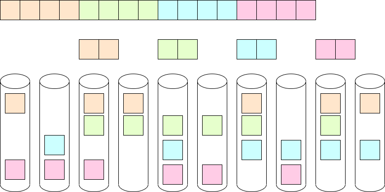

==================================
Parity de-clustering documentation
==================================

:author: Nikita Danilov <nikita.danilov@seagate.com>
:state: INIT
:copyright: Seagate
:distribution: unlimited

:abstract: This document describes how and why state machines are used by motr.

Stakeholders
============

+----------+----------------------+----------------------------+----------------+
| alias    | full name            | email                      | rôle           |
+==========+======================+============================+================+
| nikita   | Nikita Danilov       | nikita.danilov@seagate.com | author,        |
|          |                      |                            | architect      |
+----------+----------------------+----------------------------+----------------+

Introduction
============

*Parity de-clustering* (or pdclust for short) is a type of motr layout, but
let's define what layout is first. In motr every object (where applications
store blocks of data) and index (where applications store key-value records) has
a layout. For an object (indices will be covered later), the layout determines
where in the distributed storage system, object blocks are or should be
stored. The layout is stored as one of the object attributes, together with
other object meta-data. Ignoring, for the time being, the question of how
exactly the location of a block in the storage system is specified, the object
IO operations use layouts. A read operation queries the object layout about the
location of object blocks and then fetches the data from the locations returned
by the layout. A write operation, queries the layout where (overwritten) blocks
are located and (new) blocks should be located and updates the specified
locations with the user-provided data.

In addition to driving IO operations, layout also comes with certain
fault-tolerance characteristics and mechanisms. It might specify that object
data are stored *redundantly*, that is, the original data can still be recovered
is some system component hosting some part of the data fails, and might come
equipped with some fault-tolerance processes.

The layout of a particular object is an instance of come *layout
type*. Currently motr has the only layout type fully implemented: pdclust, other
layout types (compressed, encrypted, de-duplicated, composite, *etc*.) are
planned.

Parity de-clustering
====================

Parity de-clustering comes under many names in motr: "SNS" (server network
striping), network RAID, erasure coding. Network RAID gives probably the most
accessible initial intuition about what parity de-clustering is: it's like a
normal device RAID, but across multiple network nodes.

.. image:: RAID.png

Recall how a typical RAID system works. Given an object to be stored, select a
certain *unit size* and divide the object in data units of this size. Then
aggregate consecutive N data units and calculate for them K units of
parity. Together N data units and K parity units constitute a *parity
group*. The most important property of parity group is that given any N units
(out of N+K) all N+K units can be recovered. This is achieved by carefully
designed parity calculation functions. There are many ways to achieve this, motr
uses the most widely known: Reed-Solomon codes. This ability to recover parity
units is what provides fault-tolerance of pdclust. It is said that a parity
de-clustered layout has *striping pattern* N+K (there are more component to
striping pattern, to be described later), N > 0, K >= 0. Parity blocks are
allocated, filled and managed by the motr IO code and are not visible to the
user.

Some examples of striping patterns:

    - N+0: RAID-0,
    - 1+1: mirroring,
    - 1+K: (K+1)-way replication,
    - N+1: RAID-5. In this case, parity unit is XOR-sum of the data units,
    - N+2: RAID-6.

Once the support for units and parity groups is in place, IO is conceptually
simple: layout knows the location of all units (data and parity). To read a data
unit just read it directly from the location provided by the layout. In case
this read fails, for whatever reason, read the remaining units of the parity
group and reconstruct the lost data unit from them, this is called *degraded
read*. Write is more complex. The simplest case is when the entire parity group
of N data units is overwritten. In this case, write calculates K parity units
and writes all N+K units in their locations (as determined by the layout). When
a write overwrites only a part of the parity group, read-modify-write cycle is
necessary. In case of failure, a *degraded write* is performed: up to K unit
writes can fail, but the write is still successful.

Pools
=====

Consider a very simple storage system. Ignore all the actual complexity of
arranging hardware, cables, attaching devices to servers, racks, *etc*. At the
most basic level, the system consists of a certain number of storage
devices. Units can be read off and written to devices. Devices can fail
(independently).

There is a problem of how units of a parity de-clustered file are
scattered over these devices. There are multiple factors:

    - for a given parity group, it's clearly preferable to store each unit (data
      and parity) on a separate device. This way, if the device fails, at most
      one unit for each group is lost;
    - larger K gives better fault-tolerance,
    - storage overhead is affected by K/N ratio,
    - because full-group overwrites are most efficient, it's better to keep
      unit size small,
    - to utilise as many disc spindles as possible for each operation, it's
      better to keep unit size small,
    - to have efficient network transfers it's better to have large unit size,
    - to have efficient storage transfers it's better to have large unit size,
    - cost of computing parity is O(K^2).

