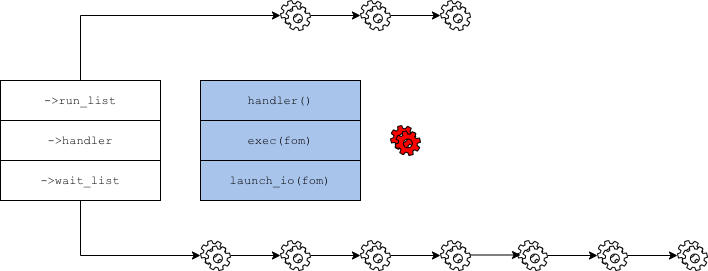

===========================
State machine documentation
===========================

:author: Nikita Danilov <nikita.danilov@seagate.com>
:state: INIT
:copyright: Seagate
:distribution: unlimited

:abstract: This document describes how and why state machines are used by motr.

Stakeholders
============

+----------+----------------------+----------------------------+----------------+
| alias    | full name            | email                      | rôle           |
+==========+======================+============================+================+
| nikita   | Nikita Danilov       | nikita.danilov@seagate.com | author,        |
|          |                      |                            | architect      |
+----------+----------------------+----------------------------+----------------+

Introduction
============

Non-blocking state machines are one of the most unusual parts motr. State
machine based programming model is not as widely known as stack based, this
introduces a barrier to entry and complicates understanding of existing motr
code based.

Let's start with the description of traditional programming model that can be
called *stack* or *thread* based.

Any function call like

.. code-block:: C

    int foo(...) {
            ...
	    bar(...);
	    ...
    }

produces at run-time a new *stack frame*:

.. image:: call-stack.png

A sequence of these stack frames is called *a call stack* or simply a stack. In
a multi-threading environment one tends to identify a thread and a
stack. Technically, a thread is a set of processor registers. When operating
system together with the processor switch from one thread to another, all they
really do is saving of the current state of hardware registers and installing
the registers associated with the target thread. At any moment in time, there
are many threads, some running on available processors, some *blocked* (that is,
not running anywhere). In addition to the usual call stack (which is actually *a
user-space stack*), each thread also has *a kernel stack* that is used whenever
execution enters kernel mode for whatever reason.

Kernel stack is used when the thread enters kernel voluntarily (usually by
invoking a system call) or involuntarily (because of interrupt, signal, page
fault, *etc*.). The kernel stack exists even when the thread is running in user
space, but it is empty in this case.

When a thread is running in kernel mode, the kernel might make a decision to
block the thread. When a thread blocks, it stops running and another thread is
selected to run on the processor. Later, the kernel will *resume* the blocked
thread and select it to run instead of another blocked thread.

Blocking can be voluntary or involuntary. A thread blocks voluntarily when it
cannot proceed further without waiting for some event, for example:

- wait for completion of IO initiated by the thread,

- wait until free memory is available,

- wait until other process terminates (waitpid(2) system call).

Involuntary blocking happens, among other reasons, when:

- there is a higher-priority thread that can be ran on the processor,

- the thread exhausted its processor time quantum.

Thread-per-request
==================

Consider a server process, like motr m0d, that handles incoming requests from
clients across the network. To handle a request, the server, typically, takes
some clocks, initiates and waits for some storage and network IO, *etc*. The
simplest way to implement such a server is to create a dedicated thread for each
incoming request. In such server, under load there will be a large number of
threads (equal to the number of concurrently processed requests), executing
requests. Because memory, storage and network are significantly slower than
processor most of the request processing thread will be blocked waiting for some
form of IO to complete.

.. image:: thread-per-request.png

This model has a number of advantages. The most important is its simplicity:
dedicated per-request threads map well onto standard system abstractions such as
threads, standard synchronisation primitives (mutices, condition variables,
*etc*.) and simple blocking system calls like read and write. It also provides
reasonable performance, while concurrency levels are not too high.

As number of concurrent threads increases, the model starts breaking up. One
reason is immediately obvious from the description above. At high concurrency
levels, the kernel has to schedule a large number of threads (in tens of
thousands) over a much smaller number of processors (less than
hundred). Scheduling decisions impact user-visible performance characteristics,
such as request processing latency. Which data are available for the kernel to
make informed scheduling decisions? The kernel does not know semantics of the
requests, because this semantics is in user-space code, which is opaque to the
kernel. The scheduler uses information about cpu consumption and IO frequency by
the thread, but for the short-living per-request threads this is not a good
predictor of the future thread behaviour.

To understand another class of issues with thread-per-request scalability,
recall that on a multi-processor machine a memory access from one processor to a
word cached on another processor incurs the cost of a memory coherency protocol,
that includes multiple cross-processor bus round-trips. A result of this is that
sub-optimal thread migrations between processors and sub-optimal interleaving
executions of threads accessing shared data can significantly affect system
performance.

Finally, most modern servers are NUMA under the hood: the cost of memory access
depends on which part of the memory is addressed. Each processor has some
*local* memory, which can be accessed much faster than *remote* memory (which is
local to other processors). Again, the kernel scheduler has no information that
would allow it to pair threads and memory areas.

The underlying reason for the problems with thread-per-request is that the
kernel is not aware of the semantics of request processing. While it is possible
to imagine an extended interface that the server can use to affect decisions of
the kernel scheduler, such interface would be prohibitively complex and
non-portable.

Localities
==========

Instead motr chose to implement its own user-space scheduler that would be able
to execute a large number of concurrent requests efficiently. Once this decision
is made, it is easy to realise that there is no need for this scheduler to
schedule threads, it can directly schedule requests.

Enter the *locality architecture*.

*A locality* consists of:

- a thread, called locality *handler thread*,

- a list of requests ready for execution (*run list*),

- a list of requests waiting for some event to happen (*wait list*).

The handler thread executes the following loop (more details will be filled
later):

.. code-block:: C

    int handler(struct locality *loc) {
            lock(&loc->l_lock);
	    while (true) {
	            while (!empty(&loc->run_list)) {
		            fom = head(&loc->run_list);
			    exec(fom);
			    if (blocked(fom))
			            add_tail(&loc->wait_list, fom);
		            else
			            add_tail(&loc->run_list, fom);
		    }
		    wait_not_empty(&loc->run_list);
	    }
            unlock(&loc->l_lock);
    }

Locality handler takes a fom from the ready queue.

.. image:: locality-get.png

It tries to advance the request processing. Let's say this requires reading
something from the storage. Request processing function will initiate
asynchronous storage IO.

Handler places the request on the wait list and takes the next request from the
ready list for execution.

When the event for which a request is waiting occurs (for example, previously
launched IO operation completes), the request is moved from the wait list to the
ready list.

Few immediate comments:

- this loop is (of course) very similar to a prototypical kernel scheduling
  loop: maintain a list of threads ready for execution and a list of blocked
  threads; take a ready thread; execute it until it blocks. But instead of
  threads, locality handler schedules requests;

- all locality data-structures are protected by a single per-locality lock;

- execution of requests within locality is serialised.

motr creates a separate locality for each processor (cpu core) used by the motr
process. Each locality has its own wait and ready lists. An incoming request is
associated with a certain locality. Memory, necessary for request processing, is
allocated locally (NUMA-wise) to the request locality.

.. image:: locality-overall.png

This architecture addresses the issues mentioned above:

- it uses only a small number of operating system threads (1 thread per
  core) and these threads are permanently bound to their cores. This
  minimises the amount of guessing that the kernel scheduler has to do;
  
- locality handler can inspect request objects and schedule them optimally;

- memory can be allocated locally;

- programming model is simplified by avoiding any concurrency within a locality.

It is clear that locality model can be efficient only if handler threads never
block. Indeed, if a handler thread blocks, no request processing will be done by
the locality core, until the handler thread unblocks.

Locality infrastructure takes care to avoid involuntary blocking (due to
preemption, for example). The request processing code should be structured in a
way that avoids voluntary blocking. This is achieved by representing request
execution as *a non-blocking state machine*, called *fom* (which stands for "FOp
Machine"). fom structures request processing as a collection of *phases*,
starting with the initial phase. When a particular phase is reached, some *phase
transition* code, associated with the phase is executed. Phase transition code
is non-blocking, which means it cannot execute potentially blocking system calls
or voluntarily block in any other way. When execution of phase transition code
terminates, the fom transitions to the next phase (as determined by the result
of phase transition). This next phase can be reachable immediately (fom remains
on the ready list), or after some event happens. In the latter case fom is
parked on the wait list and will be moved to the ready list by the specified
wakeup call-back.

Here is a simplified example of a fom phase transition diagram.

.. image:: phase-diagram.png

The blue arrows are blocking phase transitions.

Actual phase transition diagrams are much more complex. Take the diagram of cas
fom as an example.
      

State machine programming
=========================

State machine module (`sm/ directory
<https://github.com/Seagate/cortx-motr/tree/main/sm>`_) and fom (`fop/fom.h
<https://github.com/Seagate/cortx-motr/tree/main/fop/fom.h>`_) provide support
for non-blocking fom implementation. Phase transition code is kept in a *tick
function*. Return value of this function determines whether fom goes to the
ready or wait list.

===
AST
===

The discussion above glossed over fom wakeups. Suppose a fom is parked on the
locality wait list, waiting on some event. This event will typically happen
asynchronously with the handler thread execution:

- if the event is timer expiration, timer call-back will be invoked as a signal
  handler (maybe on the handler thread stack, maybe in some other thread);

- if the event is storage IO completion, completion call-back will be invoked by
  an IO thread;

- if the event is a network message receipts, notification will be invoked on
  the stack of network management thread, and so on.

In any case, the fom has to be moved from the wait list to the ready list. The
problem is that because these lists are protected by the locality lock, which is
always held by the handler thread, it is unsafe to modify these lists outside of
the handler thread loop.

This, again, is a typical problem that must be solved by an operating system
kernel. For example, a file descriptor must somehow be marked readable when data
arrive with an interrupt. motr uses a method called *fork queue* from DEC
operating systems. The idea is that to modify some per-locality data-structure
from outside of the locality lock or, more generally, to execute some code under
the locality lock, a special data-structure called ast (*Asynchronous System
Trap*) is created. An ast contains the pointer to a function to be executed
within locality lock. Asts are placed on a per-locality list (called *fork
queue*) and locality handled thread periodically checks this list and executes
all asts on it. This of course begs the question: how to place an ast on the
fork queue list protected by the locality lock? Fortunately, there are lockless
lists that do not require locking. All together, fom wakeup looks like this:

.. code-block:: C

    void m0_fom_wakeup(struct m0_fom *fom) {
            fom->f_ast.sa_cb = &readyit;
	    /* Magic function that does not require locality lock. */
            m0_sm_ast_post(fom->f_locality, &fom->f_ast);
    }

    static void readyit(...) {
            wait_list_del(fom);
	    run_list_add(fom);
    }

    void handler(struct locality *loc) {
            lock(&loc->l_lock);
	    while (true) {
	            while (!empty(&loc->run_list)) {
		            fom = head(&loc->run_list);
			    fom_exec(fom);
			    if (blocked(fom))
			            add_tail(&loc->wait_list, fom);
		            else
			            add_tail(&loc->run_list, fom);
		    }
		    while (!empty(&loc->l_ast)) {    /* New code... */
		            ast = head(&loc->l_ast); /* Runs all pending ASTs... */
			    ast->sa_cb(...);         /* ... under locality lock. */
		    }
		    wait_not_empty(&loc->run_list);
	    }
            unlock(&loc->l_lock);
    }

    /** Lockless list addition. */
    void m0_sm_ast_post(struct m0_sm_group *grp, struct m0_sm_ast *ast) {
            do {
                    ast->sa_next = grp->s_forkq;
            } while (!compare_and_swap(&grp->s_forkq, ast->sa_next, ast));
            m0_clink_signal(&grp->s_clink);
    }

======================
State machine practice
======================

State machine transition function is called *tick* function. Locality handler
thread calls fom tick function, when the fom is ready.

.. code-block:: C

    void fom_exec(struct m0_fom *fom) {
        ...
        rc = fom->fo_ops->fo_tick(fom);
        ...
    }

Fom tick function typically looks like

.. code-block:: C

    void bar_tick(struct m0_fom *fom) {
        ...
        switch (fom_phase(fom)) {
        case BAR_PHASE_1:
            do_domething(fom);
	    m0_fom_phase_set(fom, BAR_PHASE_2);
            return M0_FSO_AGAIN;
        case BAR_PHASE_2:
            do_domething_else(fom);
	    m0_fom_phase_set(fom, BAR_PHASE_3);
	    m0_fom_wait_on(fom, chan, &fom->fo_cb);
            return M0_FSO_WAIT;
        }
        ...
    }

Interaction between the fom and locality looks like the following:

Next, suppose that bar fom has to interact with some other module, baz, which
performs blocking operations itself (for example, stob or rpc).

.. code-block:: C

    void bar_tick(struct m0_fom *fom) {
        ...
        switch (fom_phase(fom)) {
        ...
        case BAR_PHASE_3:
            f(...);
            baz_something(fom);
            g(...);
            ...
        }
        ...
    }

This won't work if ``baz_something()`` needs to block. All other modules must be
non-blocking too.

.. code-block:: C

    void bar_tick(struct m0_fom *fom) {
        ...
        switch (fom_phase(fom)) {
        ...
        case BAR_PHASE_3:
            f(...);
	    m0_fom_phase_set(fom, BAR_PHASE_4);
            return baz_something(fom);
        case BAR_PHASE_4:
            g(...);
            ...
        }
        ...
    }

    void baz_something(struct m0_fom *fom, int nextstate) {
            ...
	    m0_fom_wait_on(fom, chan, &fom->fo_cb);
	    return M0_FSO_WAIT;
    }

But suppose ``baz_something()`` has to block multiple times. For example, stob
read has to load meta-data (first blocking operation) and then fetch the data
(second blocking operation).

.. code-block:: C

    void bar_tick(struct m0_fom *fom) {
        ...
        switch (fom_phase(fom)) {
        ...
        case BAR_PHASE_3:
            f(...);
	    m0_fom_phase_set(fom, BAR_PHASE_4);
            return baz_something(fom);
        case BAR_PHASE_4:
	    m0_fom_phase_set(fom, BAR_PHASE_5);
            return baz_continue(fom);
        case BAR_PHASE_5:
            g(...);
            ...
        }
        ...
    }

    void baz_something(struct m0_fom *fom) {
            ...
	    m0_fom_wait_on(fom, chan0, &fom->fo_cb);
	    return M0_FSO_WAIT;
    }

    void baz_continue(struct m0_fom *fom) {
            ...
	    m0_fom_wait_on(fom, chan1, &fom->fo_cb);
	    return M0_FSO_WAIT;
    }

Module boundaries are broken. Internal implementation details of baz leak to all
its users. Moreover, the code structure is fragile: a change in baz (addition or
removal of a blocking operation) requires changing all its users. And baz might
use another module, quux, which can have its own blocking points. All possible
blocking points in the entire stack must be explicitly propagated to the top
level. This is very counter-intuitive, complex and difficult to maintain.

Take b-tree module as an example. Its entry points (tree lookup, insert, delete,
*etc*.) have multiple internal blocking points: loading a node, allocating a new
node, taking a lock on a tree, *etc*. These blocking points are implemented by
separate modules (like meta-data back-end page daemon) and can have multiple
internal blocking points. Explicitly exporting the resulting sequence of
blocking points to b-tree users would result in an interface of unmanageable
complexity.

There are a few ways to deal with these issues:

- implement each module as a separate fom. The "parent" fom would create
  "children" foms for sub-operations and wait for their completion. This
  introduces additional overhead of fom allocation, queuing, wakeup and
  termination for each operation;

- implement for each module a "service" fom. For example, create a global
  b-tree fom (or a b-tree fom for each locality). To execute a b-tree
  operation, queue a request to the b-tree service fom;

- implement co-routines to hide all blocking complexity, see
  `lib/coroutine.h
  <https://github.com/Seagate/cortx-motr/blob/main/lib/coroutine.h>`_;

- provide support within state-machine module to eliminate or reduce the
  complexity of nested blocking operations.

State machine operations
========================

State machine operation (sm operation, smop, ``m0_sm_op``) is a sub-type of motr
state machine that has support for nested operations, see `sm/op.h
<https://github.com/Seagate/cortx-motr/blob/smop/sm/op.h>`_. It provides (among
other things) support for nested state machine invocations, hiding blocking
complexity from the upper layers.

Let us look at an example. Suppose there are 3 modules: A, B and C, where A
invokes B and B invokes C. For example, A can be ad-stob, B can be b-tree and C
can be BE page daemon.

Each module has its tick function and a data structure, representing execution
of the module operation.

.. code-block:: C

    int64_t A_tick(struct m0_sm_op *op);
    int64_t B_tick(struct m0_sm_op *op);
    int64_t C_tick(struct m0_sm_op *op);

    struct A_op {
        struct m0_sm_op a_op;
        ...
    };

    struct B_op {
        struct m0_sm_op b_op;
        ...
    };

    struct C_op {
        struct m0_sm_op c_op;
        ...
    };

In our example, ``A_op`` has fields to track execution of ad-stob read-write,
``B_op`` is ``struct m0_btree_op`` (`see
<https://github.com/Seagate/cortx-motr/blob/btree/btree/internal.h>`_) and
``C_op`` tracks execution of page daemon operation. Each ``X_op`` starts with
``struct m0_sm_op`` field.

If A operation executes B operation, ``B_op`` should be added (or allocated
dynamically) to ``A_op``.

.. code-block:: C

    struct A_op {
        struct m0_sm_op a_op;
        struct B_op     a_bop;
        ...
    };

A-tick function should initialise ``B_op``, link it to the parent ``A_op`` and
invoke. All this will be typically done by a helper function, provided by B:

.. code-block:: C

    int64_t A_tick(struct m0_sm_op *op) {
        struct A_op *aop = M0_AMB(aop, struct A_op, a_op);
        switch (op->o_sm.sm_state) {
        ...
        case A_STATE_SOME:
            return b_do_op(op, &aop->a_bop, params..., A_STATE_NEXT);
        case A_STATE_NEXT:
	    /* B-op completed. */
        ...
        }
    }

    int64_t b_do_op(struct m0_sm_op *parent, struct B_op *bop, ..., int nextstate) {
        m0_sm_op_init_sub(&bop->b_op, &B_tick, parent, &B_sm_conf);
	bop->b_params = ...;
        return m0_sm_op_subo(parent, &bop->b_op, nextstate, true);
    }

To execute a C operation from a B operation, do the same:

.. code-block:: C

    struct B_op {
        struct m0_sm_op b_op;
        struct C_op     b_cop;
        ...
    };

    int64_t B_tick(struct m0_sm_op *op) {
        struct B_op *bop = M0_AMB(bop, struct B_op, b_op);
        switch (op->o_sm.sm_state) {
        ...
        case B_STATE_SOME:
            return c_do_op(op, &bop->a_cop, params..., B_STATE_NEXT);
        case B_STATE_NEXT:
	    /* C-op completed. */
        ...
        }
    }

    int64_t c_do_op(struct m0_sm_op *parent, struct C_op *cop, ..., int nextstate) {
    	m0_sm_op_init_sub(&cop->c_op, &C_tick, parent, &C_sm_conf);
        cop->c_params = ...;
        return m0_sm_op_subo(parent, &cop->c_op, nextstate, true);
    }

If ``b_tick()`` or ``c_tick()`` need to block, they call ``m0_sm_op_prep()``
function to specify on which channel the wake-up will be served.

.. code-block:: C

    int64_t C_tick(struct m0_sm_op *op) {
        switch (op->o_sm.sm_state) {
        ...
        case C_STATE_SOME:
            ...
            if (need_block)
	        return m0_sm_op_prep(op, C_STATE_NEXT, chan)
	    else
                return C_STATE_NEXT;
        case C_STATE_NEXT:
        ...
        }
    }

This looks superficially similar to the previous approach, but complexity of
multiple blocking points within B-op and interaction between B-op and C-op are
hidden from A-tick.

How does this work?

..  LocalWords:   waitpid mutices
